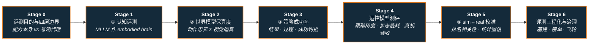

# 路线（纵深）：如果目标是具身模型测评（认知 → 世界模型 → 策略成功率 → 运控指标 → sim↔real 校准）

**摘要**：面向"训完一个具身模型，接下来怎么『测/证明它』"的纵深路线，从评测目的与四层闭环边界，到 ① 具身大脑/MLLM 认知评测、② 世界模型预测保真度评测、③ 策略成功率与过程/判据评测，再到 **运控模型专属指标**（跟踪精度 / 步态与能耗 / 真机验收）、④ sim↔real 评测 gap 校准与评测基建治理，按 Stage 0–6 串通核心基准与指标读法；本路线是 [运动控制主路线](motion-control.md) 的一条分支，是 [BFM](depth-bfm.md) / [VLA](depth-vla.md) / [WAM](depth-wam.md) 三条建模路线的**共用验收环节**。

## 路线一览

## 这条路径怎么用

- 目标读者是**已经能训出（或已选定）一个具身模型**、接下来要给它出具可信结论的人——做技术选型、发版决策、论文实验设计、内部 benchmark 建设都在这条路线上
- 被测对象既包括**任务侧的操作/VLA 策略**（Stage 1–3），也包括**运控侧的 locomotion / whole-body tracking / MPC-WBC 控制器**（Stage 4）——两者指标体系不同，不要互相套用
- 这条路线解决的是 **"分数到底测的是能力本身，还是能力的易测代理"**：它不教你怎么把模型训好（那是 [BFM](depth-bfm.md) / [VLA](depth-vla.md) / [WAM](depth-wam.md) / [模仿学习](depth-imitation-learning.md) 的主题），只教你怎么证明/证伪它真的好
- 每个阶段都有前置知识、核心问题、推荐做什么、推荐读什么、学完输出什么

**和主路线的关系：**
- 本路线是主路线 L5（RL 与模仿学习）之后、L6（sim2real 部署）与 L7（出口）之间的**验收层**：训练路线负责"做出来"，本路线负责"证明它成立"
- 与 [Sim2Real 纵深](depth-sim2real.md) 共享同一物理根因但落点不同——Sim2Real 问"策略在真机上还能不能跑"，本路线 Stage 5 问"仿真给出的**排名**在真机上还成不成立"
- 与 [Real2Sim 纵深](depth-real2sim.md) 在评测资产上衔接：Real2Sim 产出可评测的场景/episode 孪生，本路线负责判断这些孪生上的分数能否外推
- Stage 4 直接服务主路线 L2–L5 与 [RL 运动控制纵深](depth-rl-locomotion.md) / [传统模型控制纵深](depth-classical-control.md) / [BFM 纵深](depth-bfm.md)：它们负责把控制器训出来，Stage 4 负责给它出验收数字

---

## Stage 0 评测目的与四层闭环边界

**先钉死"这一层测的是能力本身还是易测代理"，再挑基准，否则整条评测链会停在某个漂亮的上层分数上。**

### 前置知识
- 至少训过 / 部署过一个具身模型（VLA、BFM、WAM 或纯策略均可）
- 对成功率、QA 正确率、视频质量指标各自的语义有基本直觉

### 核心问题
- 为什么"跑一个成功率"不构成完整评测：认知、世界模型保真、策略成功率、sim↔real 校准各测什么、边界在哪
- 四条跨层误判分别长什么样：认知评分高 ≠ 可下发动作、视频逼真 ≠ 策略收益、仿真成功率 ≠ 真机成功率、基准饱和 ≠ 场景就绪
- 可复现性与真实代表性为何在评测里天然对立，不存在"又干净又代表真机"的免费评测

### 推荐做什么
- 读完 [评测基准选型闭环 Query](../wiki/queries/embodied-eval-benchmark-selection-loop.md) 的 TL;DR 表，把自己当前项目的评测方案逐行对照，标出停在哪一层
- 写一页"我要回答的评测问题"：给谁看（自己迭代 / 对外发版 / 论文投稿）、能承受多少真机 rollout 成本、可接受多大的外推风险

### 推荐读什么
- [具身评测基准选型闭环（知识链汇总）](../wiki/overview/hub-embodied-eval-benchmark.md)（本仓库）— 本路线的枢纽页
- [Query：具身大模型评测基准选型闭环](../wiki/queries/embodied-eval-benchmark-selection-loop.md)（本仓库）— 四层决策树与逐层误判速查
- [仿真评测可复现性 ↔ 真实代表性取舍](../wiki/concepts/sim-vs-real-eval-gap.md)（本仓库）— 这条 gap 的物理根因
- [Query：具身大模型家族分类学闭环](../wiki/queries/embodied-fm-taxonomy-loop.md)（本仓库）— 姊妹链：先选模型家族，再回本路线做验收

### 学完输出什么
- 一张"我的评测链停在第几层、还缺哪一层"的自检表
- 能一句话说清每层指标在什么条件下会骗人

---

## Stage 1 ① 具身大脑 / MLLM 认知评测：先证"大脑"合格

**这是四层里最便宜、最可复现的一层，代价是它测的是认知代理，不是动作能力。**

### 前置知识
- Stage 0 内容
- 了解双系统范式（System 2 高层认知 + System 1 低层执行）与 MLLM 的基本能力边界

### 核心问题
- 高层认知具体拆成哪些维度：意图理解 → 场景感知 → 规划与泛化 → affordance 细化 → 失败诊断
- "被动看图"与"观察者即行动者"的空间智能差在哪：主动感知–行动闭环为什么必须单独考
- 认知分与下游成功率的相关性为什么**需要专门验证**，而不能默认成立

### 推荐做什么
- 在 [RoboBench](../wiki/entities/robo-bench.md) 的五维 14 能力表上，标出自己模型最可能崩的两维，先只跑那两维省算力
- 拿一组 QA 失败样本做归因：是感知没看见、是规划不可行、还是能说对但下发不出可执行动作

### 推荐读什么
- [RoboBench](../wiki/entities/robo-bench.md)（本仓库）— 五维 14 能力 25 任务 6092 QA；规划维用 MLLM-as-world-simulator 检验物理/视觉可行性，并专门验证了认知分与 CALVIN/LIBERO-10 下游 VLA 显著相关
- [ESI-Bench](../wiki/entities/esi-bench.md)（本仓库）— OmniGibson 上 10 类 29 子类 3081 题，要求主动闭合感知–行动环，暴露 MLLM 的行动盲与元认知缺口
- [Daily-Omni](../wiki/entities/paper-daily-omni.md)（本仓库）— 日常音视频跨模态时序对齐（684 视频 / 1197 MCQA），补"环境声与画面是否对齐理解"这一维
- [MMHU](../wiki/entities/paper-mmhu.md)（本仓库）— 驾驶场景人本 Behavior VQA，相邻域对照

### 学完输出什么
- 一份认知维度分解报告：哪一维是瓶颈、哪一维已饱和
- 能说清为什么认知评分只是下游成功率的**必要不充分条件**

---

## Stage 2 ② 世界模型预测保真度评测：视觉逼真 ≠ 动作忠实

**只有当团队真的用世界模型做前瞻或当评估器时才必须走这一层；用不忠实的 WM 去评策略会双重放大误差。**

### 前置知识
- Stage 1 内容
- [WAM 纵深](depth-wam.md) Stage 0–1 水平（知道世界模型在策略栈里扮演什么角色）

### 核心问题
- 保真度到底测几轴：场景守恒 / 末端轨迹一致 / 语义逻辑对齐，与画质指标（PSNR、FVD）的关系
- 为什么"专家回放上好看"不等于"off-expert 动作仍被忠实执行"——策略改进时遇到的正是后者的分布
- 什么时候该换基准：开放域多场景相机可控、交互干预与长程持久，各有专用榜，不要互相代替

### 推荐做什么
- 用 [EWMBench](../wiki/entities/ewmbench.md) 的三轴对自己的 WM 打一次分，再单独看一条**长时序**样本，判断是短时逼真还是长程忠实
- 造一组 off-expert 动作序列喂进 WM，检查视觉是否仍有效、末端是否跟随指令

### 推荐读什么
- [EWMBench](../wiki/entities/ewmbench.md)（本仓库）— Agibot-World 子集统一初始化后三轴打分，数据与评测代码开源
- [GigaWorld-1 策略评估](../wiki/entities/paper-gigaworld-1-policy-evaluation.md)（本仓库）— WMBench + 7 类视频 WM、4 种动作编码、32.4 万+ rollout；核心结论是**长时序动作忠实 rollout 比短时视觉逼真更决定评估质量**
- [WorldEcho / WorldSync](../wiki/entities/paper-worldecho-worldsync.md)（本仓库）— 视觉门控 + \(\mathrm{SE}(3)\) NDTW 专测 off-expert 动作跟随
- [WorldScore](../wiki/entities/paper-worldscore.md)（本仓库）— 开放域 3D/4D/视频多场景世界生成的 Ctrl/Quality/Dynamics 统一榜（相邻轴，**不要**用来代替操纵保真）
- [HarnessEval-W](../wiki/entities/paper-harnesseval-w.md)（本仓库）— 交互式世界模型 agentic 评测：干预/持久证据树，Intentional 排序与人类 ρ=0.93
- [SC3-Eval](../wiki/entities/paper-sc3-eval.md)（本仓库）— 反向用法：把自一致视频生成本身当真机 VLA 策略评估器，闭环 Pearson 0.929
- [如何评测具身世界模型（综述式追问）](../wiki/entities/paper-sa-2606-15032-how-should-world-models-be-evaluated-for-embodie.md)（本仓库）

### 学完输出什么
- 一份"世界侧指标 vs 策略侧指标"双清单，明确哪些指标只是画质代理
- 能判断自己的 WM 该不该被信任成评估器

---

## Stage 3 ③ 策略成功率评测：结果指标、过程指标与成功判据

**这一层最像"最终答案"，也最容易被均值、魔法抓取和跨榜比较骗过去。本阶段说的是任务侧（操作 / VLA / 长时序任务链）；运控模型的指标体系见下面的 Stage 4。**

### 前置知识
- Stage 0 内容（Stage 1–2 可按需跳过）
- 跑过至少一个仿真任务套件的完整 rollout 流程

### 核心问题
- 结果指标（任务成功率）为何掩盖长尾失败模式；过程指标（进度曲线 / 中间状态）补什么、又可能与真实收益脱钩在哪
- **成功判据本身**是不是对的：轨迹相似 vs 目标等价，哪个才是"模仿成功"
- 接触/软体/延迟敏感任务为什么必须额外报安全或时序维度，只报 Goal 会掩盖过压与超时
- 跨基准直接比榜为什么不成立：任务集、观测接口、重置协议、成功判据都不同源

### 推荐做什么
- 先选一个与目标形态匹配的套件跑基线：桌面操作走 [LIBERO](../wiki/entities/libero-benchmark.md) / [CALVIN](../wiki/entities/calvin-benchmark.md)（长时序任务链、错误累积），传统视觉操作走 [RLBench](../wiki/entities/rlbench.md)，四足敏捷走 [Barkour](../wiki/entities/paper-barkour-quadruped-agility-benchmark.md)
- 在已有 rollout 上加挂一次过程评测（不用重跑策略），对比 SR 排名与进度曲线排名是否一致
- 把失败 rollout 按模式聚类（抓取失败 / 子任务切换失败 / 超时 / 过压），而不是只报一个均值

### 推荐读什么
- [RoboDojo](../wiki/entities/robodojo.md)（本仓库）— 统一 sim-and-real 评测：42 仿真五维任务 + 18 真机任务，Isaac 异构并行 + RealEval 云真机；verified 上榜须开源训推与权重
- [PRM-as-a-Judge](../wiki/entities/paper-prm-as-a-judge.md)（本仓库）— 把 rollout 视频打成进度曲线做过程评测（OPD / FNS / DRR / SQS），在 RoboDojo 上**打乱了 SR 排名**
- [Imitator Game](../wiki/entities/paper-imitator-game.md)（本仓库）— L0–L3 意图级模仿基准：成功判据改为**目标等价而非轨迹相似**，L3 功能替代崩溃、未见任务零样本 <13%
- [SoftVTBench](../wiki/entities/paper-softvtbench.md)（本仓库）— 可变形视触觉任务同时报 Goal Success 与 Safety Success，只看 Goal 会掩盖过压
- [ReflexVLA / ReflexBench](../wiki/entities/paper-reflexvla.md)（本仓库）— 延迟感知的动态任务评测
- [DexBench](../wiki/entities/dexbench.md)（本仓库）— 工业灵巧规格（OSC 六轴 / 18 任务），主张 breakdown curve 而非单一 SR；注意其评测仓仍标 coming soon，是**规格页而非可跑仿真榜**
- [ManiSkill-HAB](../wiki/entities/paper-notebook-maniskill-hab-a-benchmark-for-low-level-manipula.md) · [Mimicking-Bench](../wiki/entities/paper-notebook-mimicking-bench-a-benchmark-for-generalizable-hu.md)（本仓库）— 低层操作 / 人形模仿套件
- [VLA SOTA Leaderboard](../wiki/entities/vla-sota-leaderboard.md)（本仓库）— 桌面 VLA 相对位次的外部索引（分数摘自论文，注意协议差异）

### 学完输出什么
- 一份带**失败模式分解**的评测报告，而不是单一成功率
- 一句话说清自己用的成功判据是什么、它会漏掉哪类"其实没做成"

---

## Stage 4 运控模型测评：跟踪精度、步态质量与真机验收

**运控模型不是"任务做没做成"，而是"跟得准不准、走得稳不稳、敢不敢上真机"——指标体系与 Stage 3 完全不同，套用会得出错误结论。**

### 前置知识
- Stage 0 内容（Stage 1–3 可按需跳过）
- [RL 运动控制纵深](depth-rl-locomotion.md) 或 [传统模型控制纵深](depth-classical-control.md) Stage 0–2 水平：能训出/跑起一个 locomotion 或 whole-body tracking 策略

### 核心问题
- **只报 MPJPE 为什么会骗人**：MPJPE 通常只在**已执行片段**上取平均，早早触发终止的 rollout 反而误差更小——必须与 Succ（终止准则下的跑完比例）联报，否则"更准"可能只是"死得更早"
- **比的是 tracker 还是后处理**：不同工作的参考表示、rollout 记账、终止准则、指标实现各不相同，不钉死这四项就没有可比性
- **跟踪类 vs 命令跟随类**：whole-body tracking 看参考误差与人类偏好；velocity-command locomotion 看命令跟踪误差、CoT、地形通过率、摔倒频率
- **model-based 控制器另有评测轴**：求解耗时与实时率、约束违反与可行性、增益/模型误差下的鲁棒裕度——这些在纯 RL 指标表里完全不出现
- **不分难度层就没法"比 SOTA"**：同一均值可能来自完全不同的动作难度分布
- **奖励项 ≠ 评测指标**：能耗惩罚、抖动惩罚是训练信号，直接拿来当验收指标会自证其说

### 推荐做什么
- 跟踪类：先把**参考表示 / rollout 记账 / 终止准则 / 指标实现**四项统一，再横评 tracker；主表按动作族（或难度档）分报，不要只给一个总分
- locomotion 类：照 [locomotion 任务页的评价指标清单](../wiki/tasks/locomotion.md) 出表——速度、CoT、地形适应、摔倒频率、命令跟踪误差、硬件安全裕度（力矩/电流/温升/冲击峰值）
- 按 **仿真 → 半实物 → 真机** 三段分层验收：仿真看成功率与能耗，半实物看延迟与电流，真机看温升、冲击与长时间稳定性
- 把失败 rollout 按机制归档（摔倒、打滑、膝盖反关节、脚底震荡），它们比平均 reward 更能指导下一轮改动

### 推荐读什么
- [运控模型评测指标](../wiki/concepts/motion-control-policy-evaluation-metrics.md)（本仓库）— **本阶段的概念主页**：四组指标（跟踪误差 / 命令跟随 / model-based 求解 / 硬件部署）、可比性四项对齐、难度分层与三段验收的完整定义
- [HumanTracker](../wiki/entities/paper-humantracker.md)（本仓库）— 153 h / 25K 四族光学基准 + 偏好对齐指标 HumanScore；把 GMT / TWIST2 / SONIC / Humanoid-GPT 的参考表示、rollout 记账、终止准则与指标实现钉死后再对照；族均衡对齐率 90.83%，评测代码与 HumanScore 权重已开、数据集待发布
- [Motion Difficulty Score / MD-AMASS](../wiki/entities/paper-notebook-benchmarking-humanoid-imitation-learning-with-mo.md)（本仓库）— 用刚体动力学给出与策略无关的动作难度分，配 MID（最大可模仿难度）与 DSJE（按难度分层的关节误差），把"比 SOTA"变成"每个难度档分别比"
- [HumanoidBench](../wiki/entities/humanoid-bench.md)（本仓库）— 统一 MuJoCo 下 15 项全身操作 + 12 项运动任务，附 Dreamer / SAC / PPO / TD-MPC2 基线，用于检验算法能否同时扛住高维身体控制与任务交互
- [TrackerLab](../wiki/entities/trackerlab.md)（本仓库）— 多本体 / 多动作数据 / 多跟踪配置共享实验接口，把参考表示、奖励与机器人模型的影响**分开**比较；换本体后突然退化时先用它排除环境差异
- [Barkour](../wiki/entities/paper-barkour-quadruped-agility-benchmark.md)（本仓库）— 四足敏捷课把多障碍序列 + 计时扣分压成 0–1 敏捷分，便于对比"专长切换 vs Transformer 通才"与 sim2real 管线
- [Mimicking-Bench](../wiki/entities/paper-notebook-mimicking-bench-a-benchmark-for-generalizable-hu.md)（本仓库）— 人形模仿的泛化性评测套件
- [Locomotion 任务页 · 评价指标与工程落地检查](../wiki/tasks/locomotion.md) · [全身跟踪管线](../wiki/concepts/whole-body-tracking-pipeline.md)（本仓库）
- [人形策略奖励函数](../wiki/concepts/humanoid-policy-reward-functions.md)（本仓库）— 读它是为了**区分**训练奖励项与验收指标，不要互相顶替
- [Query：人形动作跟踪方法选型](../wiki/queries/humanoid-motion-tracking-method-selection.md)（本仓库）— 选型侧的姊妹页

### 学完输出什么
- 一份运控评测表：**Succ + 误差类指标 + 人类偏好/敏捷分**按动作族或难度档分报，而不是单一均值
- 一条写死的"仿真 → 半实物 → 真机"分层验收流程，含硬件安全裕度项与失败模式归档

---

## Stage 5 ④ sim↔real 评测 gap 校准：排名还成不成立

**这一层最贵也最不可省：它决定前面所有层的分数能不能拿来做发版决策。**

### 前置知识
- Stage 3 或 Stage 4 内容（看被测对象是操作策略还是运控模型）
- 有真机（或云真机）可跑，哪怕样本量很小

### 核心问题
- 评测 gap 与策略迁移 gap 的区别：前者只要求 sim↔real **排名相关**，绝对成功率偏高可以接受
- 排名相关性什么时候会悄悄失效：训练管线与评测共享同一仿真分布（评测集泄漏）、基准被刷到饱和、分布漂移
- 真机样本贵到跑不动统计显著时怎么办：用仿真库做先验、换 anytime-valid 区间而不是硬凑 n

### 推荐做什么
- 挑 3–5 个 checkpoint 同时跑仿真与真机，算一次排名相关性（Spearman / Pearson），这比刷绝对分更有信息量
- 审一遍训练数据与评测场景的重叠度，明确列出哪些资产/布局是共享的
- 真机样本不足时，用下注式方法给出区间而不是点估计

### 推荐读什么
- [仿真 vs 真机评测 gap](../wiki/concepts/sim-vs-real-eval-gap.md)（本仓库）— 可复现性 ↔ 代表性代价表与缩小 gap 的三条工程路线
- [仿真评测基础设施](../wiki/concepts/simulation-evaluation-infrastructure.md)（本仓库）— 把评测当可扩展闭环基建，把迭代速度从墙钟瓶颈换成算力瓶颈的前提条件
- [Bet4Sim2Real](../wiki/entities/paper-bet4sim2real.md)（本仓库）— 仿真库逐次下注换 anytime-valid 真机性能证书，平均收窄 51.6%；G1/NIST/Go2 回放已开源
- [RoboDojo](../wiki/entities/robodojo.md) 的 RealEval 云真机（本仓库）— 标准化真机侧的一种现成答案
- [Sim-to-Real 迁移下的策略评测](../wiki/entities/paper-sa-2508-11117-robot-policy-evaluation-for-sim-to-real-transfer.md) · [高斯重建做 real-to-sim 策略评测](../wiki/entities/paper-sa-2511-04665-real-to-sim-robot-policy-evaluation-with-gaussia.md)（本仓库）
- [Sim2Real 纵深](depth-sim2real.md) · [Real2Sim 纵深](depth-real2sim.md) — 迁移侧与资产侧的展开版

### 学完输出什么
- 一条带**排名相关性证据**的结论，而不是"仿真里 92%"
- 一份评测集泄漏自查清单

---

## Stage 6 评测工程化、榜单治理与进阶方向

### 前置知识
- Stage 5 内容

**方向 A：评测基建与集成成本**
- N 个策略 × M 个环境的集成爆炸怎么收敛成 O(N+M)；统一策略–环境契约与依赖隔离 serving 长什么样
- 关键词：[XPolicyLab](../wiki/entities/xpolicylab.md)（同一 adapter 服务 RoboTwin / RoboDojo-sim / RoboDojo-real）、[仿真评测基础设施](../wiki/concepts/simulation-evaluation-infrastructure.md)、[AgiBot 仿真训练与评测分类](../wiki/overview/agibot-release-category-02-sim-training-eval.md)

**方向 B：榜单治理与可复现性**
- verified 上榜要不要强制开源训推与权重、公布评测视频；合成训练 + 仅真实评测的挑战赛协议怎么设计
- 关键词：[RoboDojo](../wiki/entities/robodojo.md) 公益榜规则、[RoboSynChallenge](../wiki/entities/paper-robosynchallenge.md)（合成 state-action 训练 / 仅真机评测）、[VLA SOTA Leaderboard](../wiki/entities/vla-sota-leaderboard.md)

**方向 C：评测即后训练信号（评测–训练飞轮）**
- 把评测结论回灌训练：失败模式 → 数据补采 → 再评测；世界模型评估器与后训练如何耦合
- 关键词：[动作后果分类 04 · 评估与后训练](../wiki/overview/wm-action-consequence-category-04-eval-posttrain.md)、[具身世界模型六路线 · 评估路线](../wiki/overview/embodied-wm-route-evaluation.md)、[WAM 纵深](depth-wam.md) Stage 5 方向 C

**方向 D：专用域评测**
- 跨本体生成评测（[H2R-Bench](../wiki/entities/paper-h2r-bench.md)）、人机协作物理一致性（[Physics-Consistent HRC Benchmark](../wiki/entities/paper-physics-consistent-hrc-benchmark.md)）、双臂遥操作（[TeleopBench](../wiki/entities/paper-notebook-teleopbench-a-simulator-centric-benchmark-for-du.md)）
- 仿真与基准的整体谱系见 [论文笔记分类 11 · 仿真与基准](../wiki/overview/paper-notebook-category-11-simulation-benchmark.md)

---

## 快速入口汇总

| 阶段 | 核心问题 | 本仓库入口 |
|------|---------|-----------|
| Stage 0 | 四层边界与代理指标陷阱 | [具身评测基准选型闭环](../wiki/overview/hub-embodied-eval-benchmark.md) |
| Stage 1 | MLLM 认知评测 | [RoboBench](../wiki/entities/robo-bench.md) |
| Stage 2 | 世界模型保真度 | [EWMBench](../wiki/entities/ewmbench.md) |
| Stage 3 | 任务侧策略成功率与过程判据 | [RoboDojo](../wiki/entities/robodojo.md) |
| Stage 4 | 运控模型跟踪精度与真机验收 | [运控模型评测指标](../wiki/concepts/motion-control-policy-evaluation-metrics.md) |
| Stage 5 | sim↔real 校准 | [仿真 vs 真机评测 gap](../wiki/concepts/sim-vs-real-eval-gap.md) |
| Stage 6 | 评测基建与榜单治理 | [XPolicyLab](../wiki/entities/xpolicylab.md) |

## 和其他页面的关系

- 完整成长路线参考：[主路线：运动控制算法工程师成长路线](motion-control.md)
- 其它纵深路径：
  - [遥操作（人形全身遥操作 + 手指遥操作 → 示范数据/实时接管）](depth-teleoperation.md)
  - [力矩控制电机设计（指标 → 电磁热 → FOC 力矩闭环）](depth-torque-motor-design.md)
  - [传统模型控制（LIP/ZMP → MPC → WBC）](depth-classical-control.md) — Stage 4 的 model-based 评测轴（求解耗时 / 约束违反 / 鲁棒裕度）
  - [人形整机硬件设计（指标预算 → 机械 → 电气 → 通信 → 整机验收）](depth-humanoid-hardware-design.md)
  - [安全控制（CLF/CBF）](depth-safe-control.md)
  - [接触丰富的操作任务](depth-contact-manipulation.md) — Stage 3 接触/软体安全指标的工程侧
  - [导航（SLAM → VLN → 导航 VLA）](depth-navigation.md)
  - [模仿学习与技能迁移](depth-imitation-learning.md) — Stage 3 成功判据（目标等价 vs 轨迹相似）的建模侧
  - [人形 RL 运动控制](depth-rl-locomotion.md) — Stage 4 被测对象之一：locomotion 策略
  - [Loco-Manipulation（移动操作）](depth-loco-manipulation.md)
  - [人形足球（全向行走 → 感知踢球 → 多机战术）](depth-humanoid-soccer.md)
  - [动作重定向（人体动作 → 机器人参考轨迹）](depth-motion-retargeting.md) — Stage 4 参考轨迹质量的上游
  - [人形群控展演（群舞同步 → 编队走位 → 群体特技）](depth-humanoid-swarm-performance.md)
  - [Sim2Real（域差画像 → 执行器对齐 → 鲁棒训练 → 真机部署）](depth-sim2real.md) — Stage 5 的迁移侧姊妹路线
  - [人形拳击（动作跟踪 → 潜空间技能 → 对抗自博弈）](depth-humanoid-boxing.md)
  - [BFM（人形行为基础模型）](depth-bfm.md) — Stage 4 被测对象之一：全身跟踪与协调
  - [感知越障（Perceptive Locomotion）](depth-perceptive-locomotion.md)
  - [动作生成（文本/多模态 → 人形动作）](depth-motion-generation.md)
  - [VLA（视觉-语言-动作模型）](depth-vla.md) — 被测对象之一：语义策略
  - [Real2Sim（真实世界 → 可仿真资产/场景/孪生）](depth-real2sim.md) — Stage 5 评测资产的来源侧
  - [WAM（世界–动作模型）](depth-wam.md) — 被测对象之一，同时也是 Stage 2 评估器的提供方
  - [ICL（具身上下文学习）](depth-icl.md) — 被测对象之一：未见任务 one-shot 评测协议
- 人形控制全景图：[Humanoid Control Roadmap](../wiki/roadmaps/humanoid-control-roadmap.md)
- 技术栈地图：[tech-map/dependency-graph.md](../tech-map/dependency-graph.md)

## 参考来源

本路线基于以下 wiki 编译页与原始资料的归纳：

- [具身评测基准选型闭环（知识链汇总）](../wiki/overview/hub-embodied-eval-benchmark.md)
- [Query：具身大模型评测基准选型闭环](../wiki/queries/embodied-eval-benchmark-selection-loop.md)
- [仿真 vs 真机评测 gap](../wiki/concepts/sim-vs-real-eval-gap.md) · [仿真评测基础设施](../wiki/concepts/simulation-evaluation-infrastructure.md)
- [sources/papers/robo_bench_arxiv_2510_17801.md](../sources/papers/robo_bench_arxiv_2510_17801.md) — RoboBench，arXiv:2510.17801
- [sources/papers/esi_bench_arxiv_2605_18746.md](../sources/papers/esi_bench_arxiv_2605_18746.md) — ESI-Bench，arXiv:2605.18746
- [sources/papers/ewmbench.md](../sources/papers/ewmbench.md) — EWMBench
- [sources/papers/robodojo_arxiv_2607_04434.md](../sources/papers/robodojo_arxiv_2607_04434.md) — RoboDojo，arXiv:2607.04434
- [sources/papers/prm_as_a_judge_arxiv_2608_14284.md](../sources/papers/prm_as_a_judge_arxiv_2608_14284.md) — PRM-as-a-Judge 1.5，arXiv:2608.14284
- [sources/papers/imitator_game_arxiv_2608_22301.md](../sources/papers/imitator_game_arxiv_2608_22301.md) — Imitator Game，arXiv:2608.22301
- [sources/papers/bet4sim2real_arxiv_2608_21572.md](../sources/papers/bet4sim2real_arxiv_2608_21572.md) — Bet4Sim2Real，arXiv:2608.21572
- [sources/papers/sc3_eval_arxiv_2606_18610.md](../sources/papers/sc3_eval_arxiv_2606_18610.md) — SC3-Eval，arXiv:2606.18610
- [运控模型评测指标](../wiki/concepts/motion-control-policy-evaluation-metrics.md) — Stage 4 的概念沉淀页
- [sources/papers/humantracker_arxiv_2608_13555.md](../sources/papers/humantracker_arxiv_2608_13555.md) — HumanTracker，arXiv:2608.13555（Stage 4 跟踪评测协议与 HumanScore）
- [sources/repos/humanoid-bench.md](../sources/repos/humanoid-bench.md) · [sources/repos/trackerlab.md](../sources/repos/trackerlab.md) — Stage 4 运控评测套件与统一跟踪实验接口
- [wiki/tasks/locomotion.md](../wiki/tasks/locomotion.md) 的「评价指标」与「工程落地检查」小节
- [sources/blogs/wechat_embodied_ai_lab_robot_training_stack_layers_2026.md](../sources/blogs/wechat_embodied_ai_lab_robot_training_stack_layers_2026.md) — 机器人训练栈分层
