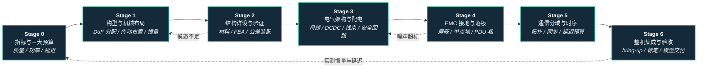

# 路线（纵深）：如果目标是人形整机硬件设计（指标预算 → 机械 → 电气 → 通信 → 整机验收）

**摘要**：面向"想从一张任务需求做到一台能上电、能跑控制、能交付的人形整机"的纵深路线，从整机指标与质量/功率/延迟三大预算，到构型与机械布局、结构详设与验证、电气架构与配电、EMC 接地与板级落地、通信分域与时序预算，最后到整机集成 bring-up 与验收交付，按 Stage 0–6 串通全流程；本路线是 [运动控制主路线](motion-control.md) 的**整机硬件底座**分支——[力矩电机设计纵深](depth-torque-motor-design.md) 交付"一个可信的关节"，本路线交付"一台可信的机器"。

## 路线一览

## 这条路径怎么用

- 目标读者是要**负责一台整机**的硬件负责人 / 系统工程师 / 机器人总体——不是"选一台电机装上"，也不是"把关节做透"，而是让**机械、电气、通信三条链在同一台机器上互不打架**
- 需要基础力学与电路直觉（静力学、材料许用、直流电路、数字通信）；FEA、EDA 与实时系统的工具会随阶段补
- 每个阶段有前置知识、核心问题、推荐读什么、推荐做什么、学完输出什么
- 三条设计链在本站的知识入口分别是 [人形整机机械布局设计](../wiki/concepts/humanoid-mechanical-layout-design.md)、[机器人整机配电架构](../wiki/concepts/robot-power-distribution-architecture.md)、[机器人整机通信架构](../wiki/concepts/robot-onboard-communication-architecture.md)——本路线是这三页的**学习顺序展开版**：它们回答"每条链要设计什么"，本路线回答"按什么顺序把三条链学成能交付一台机器的能力"

**和主路线的关系：**
- 本路线位于主路线 L0–L2 之下的**整机硬件底座层**，任意阶段可切入；建议在主路线 L2（动力学）前后进入，此时"质心高度""摆动惯量""力矩延迟"已经从抽象符号变成硬件指标
- 与 [力矩电机设计纵深](depth-torque-motor-design.md) 是**上下级关系**：那条路线做到"给 1 Nm 就是 1 Nm 的关节模组"，本路线把 N 个模组连成"能站住、能供电、能同步、能维护"的整机；Stage 3 的功率预算与 Stage 5 的延迟预算，正是那条路线 Stage 6 交付物的整机侧约束
- [Sim2Real 纵深](depth-sim2real.md) 消费本路线 Stage 6 的交付物：实测惯量、关节摩擦、总线延迟与执行器模型——硬件交付的不只是机器，还有它可仿真的数字副本

---

## Stage 0 整机指标与三大预算

### 前置知识
- 刚体静力学与功率/能量的基本换算
- 直流电路（电压、电流、功率、压降）
- 会用表格做工程预算（Excel / Python 皆可）

### 核心问题
- 从任务（负载、步速、连续工作时长、工作环境）怎么反推整机身高、质量、关节数与续航
- **质量预算**：整机 60/80/100 kg 各意味着什么，腿部质量占比多少才不会陷入质量惩罚螺旋
- **功率预算**：脉冲负载与平均功率差多少倍，电池 C-rate 与母线跌落如何进入指标
- **延迟预算**：从传感到力矩的总延迟允许多少，才配得上目标力控/接触带宽
- 三大预算之间怎么互相换：减 2 个自由度换到多少质量与多少成本

### 推荐读什么
- [Humanoid Hardware 101：七类子系统技术地图](../wiki/overview/humanoid-hardware-101-technology-map.md) — 先建立部件与成本全景
- [Actuator 102 · 01：负载与质量螺旋](../wiki/overview/humanoid-actuator-102-load-and-mass-spiral.md) — 质量预算为什么是第一约束
- [Query：主流人形机器人硬件对比](../wiki/queries/hardware-comparison.md) 与 [Query：人形硬件选型指南](../wiki/queries/humanoid-hardware-selection.md) — 用真实机型校准自己的指标
- [控制环路延迟建模](../wiki/formalizations/control-loop-latency-modeling.md) — 延迟预算的形式化写法
- [接触力环带宽](../wiki/concepts/contact-force-loop-bandwidth.md) — 延迟预算的下游消费者

### 推荐做什么
- 挑一台公开参数的整机（Unitree G1 / Berkeley Humanoid Lite / ODRI 等，见 [开源人形硬件](../wiki/entities/open-source-humanoid-hardware.md)），反推它的三大预算，并指出它在优化什么
- 给自己的目标机型写三张一页纸预算表：质量分配（按子系统）、功率分配（峰值/连续/同时率）、延迟分配（按链路段）

### 学完输出什么
- 一份**整机指标书**：身高/质量/DoF/负载/续航/动态等级 + 三大预算表
- 能对任何整机参数表说出"这三个预算里它把余量放在了哪儿"

---

## Stage 1 构型与机械布局：把指标翻译成骨架

### 核心问题
- 自由度往哪儿分配：腿 6、腰 1–3、臂 6–7、颈 2、手 6–22，各自换来什么能力、要付多少成本与可靠性
- 执行器往哪儿放：串联直驱简单可标定，近端集中（连杆 / 腱绳 / [行星滚柱丝杠](../wiki/concepts/planetary-roller-screw-humanoid-leg-actuation.md)）低惯量但运动学耦合
- 质心高度、前后偏置与摆动腿惯量怎么定，它们如何进入 LIP/ZMP 与 DCM 的可行域
- 走线通道、拆装顺序、单关节可换性——为什么这些必须在布局阶段就占位

### 推荐读什么
- [人形整机机械布局设计](../wiki/concepts/humanoid-mechanical-layout-design.md) — 本阶段主线知识页
- [人形并联/连杆关节运动学](../wiki/concepts/humanoid-parallel-joint-kinematics.md) 与 [人形腿部行星滚柱丝杠直线驱动](../wiki/concepts/planetary-roller-screw-humanoid-leg-actuation.md)
- [动力学仿真驱动的人形下肢衍生式设计](../wiki/entities/paper-humanoid-leg-generative-design-dynamics.md) — 电液混合 5-DoF + EHA/电机分工的布置实例
- [Actuator 102 · 02：旋转-直线分离架构](../wiki/overview/humanoid-actuator-102-split-architecture.md)
- [人形膝/腿主承力链为何通常避开谐波减速器](../wiki/concepts/humanoid-knee-harmonic-drive-limits.md) — 膝/踝主承力关节优先解决冲击载荷谱、柔轮疲劳寿命、动态刚度与远端惯量，PRS 直线 / 摆线 RV / 低减速比 QDD 三条常见替代路线对照
- [LIP/ZMP](../wiki/concepts/lip-zmp.md) 与 [Capture Point / DCM](../wiki/concepts/capture-point-dcm.md) — 布局参数在控制里以什么形式出现
- [连杆与转子惯量](../wiki/concepts/robot-link-and-rotor-inertia.md) 与 [URDF 机器人描述](../wiki/concepts/urdf-robot-description.md)

### 推荐做什么
- 用任意 CAD（含 [文本生成 CAD](../wiki/concepts/text-to-cad.md) 类工具做草案）画一版单腿布局的两个方案：全旋转关节 vs 近端集中，算出各自摆动腿惯量与腿部质量占比
- 拿一份开源整机 URDF，脚本统计各连杆质量与惯量，画出质量沿链分布图，看它把重量堆在哪
- 把自己的布局导出成 URDF，在 MuJoCo/Isaac 里跑一次被动摆动，检查惯量是否合理

### 学完输出什么
- 一版**整机布局方案**：DoF 表、执行器位置图、质量分布图、摆动腿惯量与质心高度
- 一份与 CAD 版本绑定的 URDF，仿真与实物从一开始就同源

---

## Stage 2 结构详设与验证：强度、刚度、公差

### 核心问题
- 材料怎么选：铝合金骨架、钢耐磨件、镁钛与复材减重各在什么位置划界
- 三张判据表怎么做：静强度（最恶劣工况 + 安全系数）、疲劳（百万级行走循环）、模态（最低阶固有频率 vs 力控目标带宽）
- 公差链怎么收：哪些面影响运动学与轴系对齐必须收紧，哪些可以放开；零位标定基准怎么留
- 跌倒与冲击工况怎么设计：不是"不许倒"，而是"倒了之后哪些件是可消耗件"

### 推荐读什么
- [Hardware 101 · 01：机身与材料](../wiki/overview/humanoid-hardware-101-chassis-materials.md) 与 [Hardware 101 · 03：直线传动与轴承](../wiki/overview/humanoid-hardware-101-linear-transmission-bearings.md)
- [人形整机机械布局设计](../wiki/concepts/humanoid-mechanical-layout-design.md) 的 L4 一节（刚度/强度/公差三张判据表）
- [动力学仿真驱动的人形下肢衍生式设计](../wiki/entities/paper-humanoid-leg-generative-design-dynamics.md) — 跳跃工况 → 衍生式连杆 → FEA/疲劳/模态/重仿真闭环
- [Actuator 102 · 06：工业执行器陷阱](../wiki/overview/humanoid-actuator-102-industrial-actuator-trap.md) — 货架件按平方律失效的机械原因
- ISO 1101 / ASME Y14.5（几何公差）、ISO 286 / ISO 2768（配合与未注公差）— [ISO 检索入口](https://www.iso.org/search.html?q=1101)

### 推荐做什么
- 对一个承力件（大腿骨架或踝部支架）做完整三件套：静强度 FEA、疲劳评估、约束态模态分析，把最低阶频率写在图纸上
- 给一条腿做公差链分析：从髋安装面到足底，累加加工与装配误差，看足端位置误差有多大、需要多少标定来吃掉
- 装配一次并记录工时与拆装难点，反过来改布局

### 学完输出什么
- 一套**可制造的结构图纸包**：材料、关键公差、表面处理、紧固与防松方案
- 一份结构验证报告：安全系数、疲劳结论、最低阶模态频率与它对力控带宽的含义

---

## Stage 3 电气架构与配电：让几十个关节同时爆发而不掉压

### 核心问题
- 能量链怎么排：电芯 → BMS → 预充与主回路 → 高压母线（典型 48/60 V）→ PDU 分路 → 分域 DC/DC → 负载
- 上电与掉电时序怎么定：涌流、使能顺序、掉电时关节如何不失力自由落体
- 保护怎么分级：BMS 级 / 母线级 / 分路级 / 板级，故障如何就地隔离而不拉停整机
- 线束怎么设计：载流与温升、压降预算、屏蔽与双绞、跨关节段的弯折寿命
- 安全回路怎么做：E-Stop 到 STO，IEC 60204-1 停止类别 0/1/2 对双足平台意味着什么

### 推荐读什么
- [机器人整机配电架构](../wiki/concepts/robot-power-distribution-architecture.md) — 本阶段主线知识页
- [Hardware 101 · 05：能源与计算电子](../wiki/overview/humanoid-hardware-101-power-compute-electronics.md)
- [Query：人形机器人电池与热管理指南](../wiki/queries/humanoid-battery-thermal-management.md) — 配电损耗与整机热链路
- [机器人安全状态机](../wiki/concepts/robot-safety-state-machine.md) — 硬件安全回路与软件降级的分工
- IEC 60204-1（停止类别）、ISO 13849-1（PL）、ISO 13482（服务机器人安全）— [IEC 检索](https://webstore.iec.ch/) · [ISO 检索](https://www.iso.org/search.html?q=13849)

### 推荐做什么
- 画一版整机配电原理图与保护选型表，标出每条分路的额定电流、保护阈值与监测点
- 用 Stage 0 的功率预算做母线跌落估算（电池内阻 + 线阻 + 电容），然后在台架上用多关节同步阶跃复测，对账
- 设计并连接一次安全回路：拍下急停，测"力矩到零"的时间与整机行为，确认可复现

### 学完输出什么
- 一套**配电设计包**：原理图、保护选型表、上电时序图、线束线号表
- 一份电气验收数据：峰值母线跌落、线束温升、E-Stop 响应时间

---

## Stage 4 EMC、接地与板级落地：让传感器在关节全速时依然干净

### 核心问题
- 噪声从哪来：逆变器 PWM 开关沿沿电机线与结构传播，共模是主要形式
- 接地怎么规划：功率地/信号地分区与单点汇合，机身结构地与母线负极的关系必须全局统一
- 敏感链路怎么保护：磁编码器、IMU、力/力矩与触觉传感器的屏蔽与单端接地约定
- PDU 与转接板怎么落到自己的板子上：分路开关、电流监测、连接器与散热
- 怎么验证：IEC 61000-4 系列抗扰、CISPR 系列发射预测试，以及最实用的判据——关节全速时传感器噪声底有没有抬起来

### 推荐读什么
- [机器人整机配电架构](../wiki/concepts/robot-power-distribution-architecture.md) 的「EMC 与接地」一节
- [KiCad](../wiki/entities/kicad.md) 与 [Altium Designer](../wiki/entities/altium-designer.md) — 原理图 → layout → 制造输出工具链
- [力矩电机设计纵深 Stage 4](depth-torque-motor-design.md) — 驱动板功率级与采样链路的板级细节（本阶段是它的整机侧对偶）
- [磁场定向控制（FOC）](../wiki/concepts/field-oriented-control.md) — 理解噪声源的机理
- [IPC 标准（IPC-2221 / IPC-2152 载流与温升）](https://www.ipc.org/)

### 推荐做什么
- 画出整机接地拓扑图（含屏蔽层单端接地位置），逐条线束标注"功率/信号/屏蔽"属性
- 自绘一版 PDU 或传感器汇聚板，走完原理图 → layout → 打样 → bring-up
- 做一次噪声底对比实验：静止 vs 关节全速，记录 IMU 噪声密度、编码器抖动、CAN 错误计数

### 学完输出什么
- 一张全局**接地与屏蔽约定图**，团队按它接线而不是各自发挥
- 一份 EMC 现状报告：噪声底对比数据 + 已知敏感链路清单与缓解措施

---

## Stage 5 通信分域与时序预算：把"能通"做成"能按时通"

### 核心问题
- 三层分域怎么切：硬实时关节域 / 高带宽传感器域 / 软实时运维计算域，各自截止时间与失效后果
- 关节域选型与拓扑：多路 [CAN-FD](../wiki/concepts/can-fd.md) 还是单链 [EtherCAT](../wiki/concepts/ethercat-protocol.md)，负载率与拓扑顺序各是什么风险
- 时钟怎么统一：EtherCAT 分布式时钟（亚微秒）/ PTP（微秒）/ 硬件触发 + 时间戳标定，各用在哪一层
- 端到端延迟预算怎么分段、怎么实测：抖动直方图与最坏值比均值重要多少
- 通信异常怎么降级：连续丢帧 N 次之后关节保持、受控下蹲还是 STO

### 推荐读什么
- [机器人整机通信架构](../wiki/concepts/robot-onboard-communication-architecture.md) — 本阶段主线知识页
- [CAN vs EtherCAT 关节总线选型](../wiki/comparisons/can-vs-ethercat-joint-bus.md) 与 [电机驱动器底软通信协议总览](../wiki/overview/motor-drive-firmware-bus-protocols.md)
- [Query：EtherCAT 主站优化指南](../wiki/queries/ethercat-master-optimization.md) 与 [Query：实时运控中间件配置指南](../wiki/queries/real-time-control-middleware-guide.md)
- [时钟同步算法](../wiki/concepts/clock-synchronization-algorithms.md) 与 [DDS 通信机制](../wiki/concepts/dds-communication.md)
- [RTOS 与实时调度](../wiki/concepts/rtos-realtime-scheduling.md) 与 [控制/推理频率解耦](../wiki/concepts/control-inference-frequency-decoupling.md)
- [硬件抽象层 Query](../wiki/queries/hardware-abstraction-layer.md) — 通信细节如何被封装给控制层

### 推荐做什么
- 画一版整机通信分域图与拓扑图，算出关节域带宽占用（双向）与传感器域带宽，标注每段时钟来源
- 搭一条真实链路（≥2 个驱动器 + IMU），用 GPIO 翻转 + 示波器测端到端延迟，采上万周期出抖动直方图与最坏值
- 人为注入故障：拔线、加噪、超载总线，验证降级策略与诊断计数器是否按设计动作

### 学完输出什么
- 一份**通信架构文档**：分域图、拓扑图、带宽表、延迟预算表、降级策略表
- 一组实测数据：端到端延迟均值/P99/最坏值、时间戳对齐误差、总线错误计数基线

---

## Stage 6 整机集成、bring-up 与验收交付

### 核心问题
- 首次上电按什么顺序做：限流上电 → 单关节使能 → 全关节零位标定 → 站立 → 走 —— 每一步的中止判据是什么
- 标定链怎么串：关节零位、连杆参数、IMU 安装偏置、足底力传感器、相机外参
- 整机验收测什么：站立/行走/负载/续航/热/连续运行时长/跌倒后可恢复性
- 交付给控制与 RL 团队的到底是什么：机器 + 数字副本（URDF/MJCF、执行器模型、延迟参数）+ 已知边界清单
- 可靠性与可维护性怎么量化：平均故障间隔、单关节更换工时、易损件清单

### 推荐读什么
- [电机测功机](../wiki/concepts/motor-dynamometer.md) 与 [力矩电机设计纵深 Stage 6](depth-torque-motor-design.md) — 关节级验收如何汇总到整机
- [Query：现场机器人排障](../wiki/queries/field-robotics-troubleshooting.md) — 真机故障的分布决定验收项优先级
- [系统辨识](../wiki/concepts/system-identification.md) 与 [执行器网络](../wiki/methods/actuator-network.md)、[Implicit/Explicit 执行器建模](../wiki/concepts/implicit-explicit-actuator-modeling.md) — 把整机实测变成可仿真模型
- [机器人系统工程纵深](../wiki/overview/hub-systems-engineering.md) — 部署、可观测性与 OTA 的整机侧接口
- GB/T 43200（机器人一体化关节性能与试验方法）— [一手资料索引](../sources/sites/gbt_43200_2023_robot_joint_performance.md)

### 推荐做什么
- 写一份 bring-up 检查单并真的照着走一遍，记录每一步的中止判据与实际中止次数
- 建整机测试矩阵：空载/负载站立、定速行走、上下坡、连续运行 1 h 的温度与母线曲线
- 把实测惯量、关节摩擦、总线延迟写回仿真模型，在 MuJoCo/Isaac 里复现真机的阶跃响应与步态

### 学完输出什么
- 一份**整机验收报告**：三大预算实测值 vs 目标值、测试矩阵结果、已知边界与易损件清单
- 一个与实物对齐的**数字副本**（URDF/MJCF + 执行器与延迟参数），让 sim2real 从同一份真值出发
- 一份 bring-up SOP 与维护手册——第二台机器的装配时间是第一台的几分之一，是硬件团队真正的成熟度指标

---

## 快速入口汇总

| 阶段 | 核心问题 | 本仓库入口 |
|------|---------|-----------|
| Stage 0 | 指标与质量/功率/延迟三大预算 | [Humanoid Hardware 101 技术地图](../wiki/overview/humanoid-hardware-101-technology-map.md) · [控制环路延迟建模](../wiki/formalizations/control-loop-latency-modeling.md) |
| Stage 1 | DoF 分配、执行器布置、惯量分布 | [人形整机机械布局设计](../wiki/concepts/humanoid-mechanical-layout-design.md) |
| Stage 2 | 强度、疲劳、模态与公差链 | [Hardware 101 · 机身与材料](../wiki/overview/humanoid-hardware-101-chassis-materials.md) |
| Stage 3 | 母线、DC/DC、线束、安全回路 | [机器人整机配电架构](../wiki/concepts/robot-power-distribution-architecture.md) |
| Stage 4 | EMC、接地、PDU 落板 | [KiCad](../wiki/entities/kicad.md) · [力矩电机纵深 Stage 4](depth-torque-motor-design.md) |
| Stage 5 | 分域、拓扑、同步、延迟预算 | [机器人整机通信架构](../wiki/concepts/robot-onboard-communication-architecture.md) |
| Stage 6 | bring-up、标定、验收与模型交付 | [电机测功机](../wiki/concepts/motor-dynamometer.md) · [现场排障 Query](../wiki/queries/field-robotics-troubleshooting.md) |

## 和其他页面的关系

- 完整成长路线参考：[主路线：运动控制算法工程师成长路线](motion-control.md)
- 三条设计链的知识主页：[机械布局](../wiki/concepts/humanoid-mechanical-layout-design.md)、[配电架构](../wiki/concepts/robot-power-distribution-architecture.md)、[通信架构](../wiki/concepts/robot-onboard-communication-architecture.md)；本路线是它们的学习顺序展开版
- 其它纵深路径：
  - [遥操作（人形全身遥操作 + 手指遥操作 → 示范数据/实时接管）](depth-teleoperation.md)
  - [力矩控制电机设计（指标 → 电磁热 → FOC 力矩闭环）](depth-torque-motor-design.md) — 关节级底座，本路线的直接上游
  - [传统模型控制（LIP/ZMP → MPC → WBC）](depth-classical-control.md) — 消费本路线交付的质心高度与惯量参数
  - [安全控制（CLF/CBF）](depth-safe-control.md)
  - [接触丰富的操作任务](depth-contact-manipulation.md)
  - [导航（SLAM → VLN → 导航 VLA）](depth-navigation.md)
  - [模仿学习与技能迁移](depth-imitation-learning.md)
  - [人形 RL 运动控制](depth-rl-locomotion.md)
  - [Loco-Manipulation（移动操作）](depth-loco-manipulation.md)
  - [人形足球（全向行走 → 感知踢球 → 多机战术）](depth-humanoid-soccer.md)
  - [动作重定向（人体动作 → 机器人参考轨迹）](depth-motion-retargeting.md)
  - [人形群控展演（群舞同步 → 编队走位 → 群体特技）](depth-humanoid-swarm-performance.md)
  - [Sim2Real（域差画像 → 执行器对齐 → 鲁棒训练 → 真机部署）](depth-sim2real.md) — Stage 6 数字副本的下游消费者
  - [人形拳击（动作跟踪 → 潜空间技能 → 对抗自博弈）](depth-humanoid-boxing.md)
  - [BFM（人形行为基础模型）](depth-bfm.md)
  - [具身模型测评（认知 → 世界模型保真 → 策略成功率 → sim↔real 校准）](depth-embodied-eval.md)
  - [感知越障（Perceptive Locomotion）](depth-perceptive-locomotion.md)
  - [动作生成（文本/多模态 → 人形动作）](depth-motion-generation.md)
  - [VLA（视觉-语言-动作模型）](depth-vla.md)
  - [Real2Sim（真实世界 → 可仿真资产/场景/孪生）](depth-real2sim.md)
  - [WAM（世界–动作模型）](depth-wam.md)
  - [ICL（具身上下文学习）](depth-icl.md)
- 关联知识页：
  - [Humanoid Hardware 101：七类子系统技术地图](../wiki/overview/humanoid-hardware-101-technology-map.md)
  - [Humanoid 执行器 102：八章技术地图](../wiki/overview/humanoid-actuator-102-technology-map.md)
  - [硬件通信与协议纵深](../wiki/overview/hub-communication.md) · [机器人系统工程纵深](../wiki/overview/hub-systems-engineering.md)
  - [Query：人形机器人硬件选型指南](../wiki/queries/humanoid-hardware-selection.md) · [Query：主流人形机器人硬件对比](../wiki/queries/hardware-comparison.md)
  - [开源人形机器人硬件](../wiki/entities/open-source-humanoid-hardware.md)

## 参考来源

本路线基于以下原始资料与 wiki 编译页的归纳：

- [人形整机机械布局设计](../wiki/concepts/humanoid-mechanical-layout-design.md)、[机器人整机配电架构](../wiki/concepts/robot-power-distribution-architecture.md)、[机器人整机通信架构](../wiki/concepts/robot-onboard-communication-architecture.md) 及其 sources
- [Humanoid Hardware 101 系列](../wiki/overview/humanoid-hardware-101-technology-map.md)（sources：Hardware 101 微信长文）与 [Humanoid 执行器 102 系列](../wiki/overview/humanoid-actuator-102-technology-map.md)
- [GB/T 43200-2023 机器人一体化关节性能及试验方法（一手资料）](../sources/sites/gbt_43200_2023_robot_joint_performance.md)
- [电机测功机一手资料索引](../sources/sites/motor_dynamometer_primary_refs.md)
- IEC 60204-1（机械电气设备与停止类别）、ISO 13849-1（安全相关控制部件 PL）、ISO 13482（个人护理机器人安全）、IEC 61000-4 系列（EMC 抗扰）
- ISO 11898 系列（CAN/CAN-FD）、ETG.1000 系列（EtherCAT 与分布式时钟）、IEEE 1588（PTP）
- Kato et al., WABOT-1（早稻田大学，1973）— 首台全尺寸人形整机集成，本方向的起点里程碑
- Wensing et al., *Proprioceptive Actuator Design in the MIT Cheetah*（IEEE T-RO 2017）— 近端集中布局与低惯量腿部设计范式
