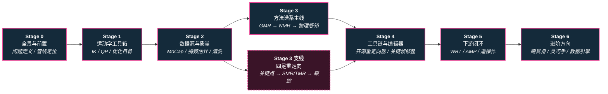

# 路线（纵深）：如果目标是动作重定向（人体动作 → 机器人参考轨迹）

**摘要**：面向"想把人体/动物动捕、视频、生成动作变成机器人可执行参考轨迹"的纵深路线，从重定向的问题定义与数据管线定位、运动学优化工具箱、参考动作数据源与质量控制，到方法谱系主线（运动学优化 GMR → 学习式 NMR → 物理感知 ReActor / SPIDER / DynaRetarget）与**四足支线**（动物/视频关键点 → 空间+时间重定向 STMR → legged_gym 跟踪），再经 **工程工具链与轨迹编辑器**（开源重定向器 + 关键帧/曲线编辑器的人工修整闭环）进入下游跟踪训练闭环与进阶方向，按 Stage 0–6 串通核心方法；本路线是 [运动控制主路线](motion-control.md) 的一条分支，向上承接 [动作生成纵深](depth-motion-generation.md) 的运动学输出，向下供给 [BFM 纵深](depth-bfm.md) 与 [模仿学习纵深](depth-imitation-learning.md) 的训练数据。

## 路线一览

## 这条路径怎么用

- 目标读者是想搭"人体参考动作 → 机器人可执行轨迹"数据管线的人——模仿学习、全身跟踪（WBT）、AMP 风格先验的训练数据几乎都要穿过这道闸
- 动作重定向解决 **跨骨架映射**：源（人/动物）与目标（机器人）的骨架拓扑、肢体比例、关节限位、质量分布都不同，直接复制关节角会产生脚滑、穿模、超限等伪影
- 本路线含两条并行的形态线：**人形主线**（人体 MoCap/视频 → 人形全身参考）与 **四足支线**（动物 MoCap/视频关键点 → 四足参考，见 Stage 3 末尾）。两条线共用 Stage 0–2 的问题定义、优化工具箱与数据质量判据，在 Stage 5 又都汇入"参考轨迹 → RL 跟踪策略"的下游闭环；差别集中在腿部 DoF 更少、基座轨迹常缺失、步态相位与时间轴必须一并重定向
- 每个阶段都有前置知识、核心问题、推荐做什么、推荐读什么、学完输出什么

**和主路线的关系：**
- 本路线是主路线 [L5.4 动作重定向](motion-control.md#l54-动作重定向) 的展开：L2 的 FK/IK 是 Stage 1 的直接前置，L5.3 的模仿学习是下游消费者
- [模仿学习纵深](depth-imitation-learning.md) Stage 2 与 [BFM 纵深](depth-bfm.md) Stage 1 都只给了重定向一个阶段的篇幅；本路线把这一步展开成完整谱系
- 如果关心"参考动作从哪来"的上游问题（文本/多模态生成动作），走 [动作生成纵深](depth-motion-generation.md)

---

## Stage 0 重定向全景与前置

**先分清"动画重定向"与"机器人重定向"的评价标准差异，再看方法，否则会用错误的指标选错误的路线。**

### 前置知识
- Python 熟练，能读懂旋转表示（四元数 / 旋转矩阵 / 6D）
- 理解正运动学（FK）概念（参考主路线 L2）

### 核心问题
- 重定向到底在解什么：保留运动语义与风格的同时满足目标骨架的可执行性
- 动画界（像不像）与机器人界（能不能跟得上）的评价线为什么不同
- 重定向在训练数据管线里的位置：采集 → 清洗 → 重定向 → 跟踪训练
- 目标形态不同，难点也不同：人形是"同构但比例/限位不同"，四足是"异构骨架 + 腿部 DoF 更少"，后者常连源数据的全局基座轨迹都要反推

### 推荐做什么
- 读纵深汇总页，把"概念 / 流水线 / 选型 / 数据 / 下游"五层入口过一遍
- 找一段公开动捕数据，直接把人体关节角复制到人形模型上，观察脚滑与穿模——建立"为什么必须重定向"的第一手直觉

### 推荐读什么
- [Motion Retargeting](../wiki/concepts/motion-retargeting.md)（本仓库）— 概念主入口
- [动作重定向知识链汇总](../wiki/overview/hub-motion-retargeting.md)（本仓库）
- [Character Animation vs Robotics](../wiki/concepts/character-animation-vs-robotics.md)（本仓库）— 两界评价标准差异
- [运动学可行与动力学可行](../wiki/concepts/kinematic-vs-dynamic-feasibility.md)（本仓库）— 「能摆出这个姿势」≠「站得住、跟得上」，与本页动画/机器人评价线差异同源
- [Motion Retargeting Pipeline](../wiki/concepts/motion-retargeting-pipeline.md)（本仓库）— 管线定位
- [四足机器人](../wiki/entities/quadruped-robot.md)（本仓库）— 四足支线的目标平台特征：支撑域、步态、控制频率

### 学完输出什么
- 能一句话说清重定向解决什么、为什么不能跳过
- 能画出"采集 → 重定向 → 训练"数据管线并标出误差来源
- 能判断自己的任务落在人形主线还是四足支线，以及两者共用哪几段

---

## Stage 1 运动学基础与优化工具箱

**重定向的经典形态是一个带约束的优化问题：目标函数、约束、求解器三件套要先备齐。**

### 前置知识
- Stage 0 内容
- 线性代数与最小二乘

### 核心问题
- 重定向优化目标怎么写：末端位置约束、关节限位、平滑项、接触约束各自的数学形式
- IK 的数值解法族：Gauss–Newton / Levenberg–Marquardt / 拟牛顿各自适用什么规模
- 关节空间直接映射（scale + offset）与任务空间 IK 的取舍

### 推荐做什么
- 用 Pinocchio 或 MuJoCo 对一个人形模型手写一个末端约束 IK，验证关节限位处理
- 把同一段动作分别用关节空间映射与任务空间 IK 重定向，对比末端误差

### 推荐读什么
- [Motion Retargeting Objective](../wiki/formalizations/motion-retargeting-objective.md)（本仓库）— 优化目标形式化
- [Gauss–Newton](../wiki/methods/gauss-newton.md)、[Levenberg–Marquardt](../wiki/methods/levenberg-marquardt.md)、[L-BFGS](../wiki/methods/l-bfgs.md)（本仓库）— 求解器族
- [Motion Retargeting](../wiki/concepts/motion-retargeting.md) 的"主要方法"分节（本仓库）

### 学完输出什么
- 一个能跑的末端约束 IK 重定向脚本
- 能为给定任务写出合理的重定向目标函数与约束集

---

## Stage 2 参考动作数据源与质量控制

**垃圾进垃圾出：重定向管线的上限由参考数据的质量与覆盖度决定。**

### 前置知识
- Stage 1 内容

### 核心问题
- 三类数据源的取舍：光学动捕（AMASS / LAFAN1）、视频估计（GVHMR / SAM 3D Body）、低成本方案（FreeMoCap）
- SMPL 系表示为什么成为事实标准，重定向前要做哪些统一化
- 数据质量维度：脚滑、漂移、穿透、抖动怎么量化与过滤
- 数据集的"重定向就绪度"怎么评估
- 四足支线的数据源为什么更"脏"：动物光学动捕稀缺且多为私有，实践中依赖 **视频关键点估计** 与 **动画骨架**（如 LaFAN1 dog set），噪声、缺帧、无全局基座轨迹是常态；也没有 SMPL 那样的统一参数化模型可依赖

### 推荐做什么
- 下载一段 AMASS 数据与一段视频估计（GVHMR）数据，对比两者的脚部接触质量
- 给自己的管线加一个质量过滤器（脚滑速度阈值 + 关节速度上限），统计过滤比例
- 四足方向：取一段动物片段（如 motion_imitation 自带的 `dog_pace` / `dog_trot`），统计足端接触相位与基座速度是否自洽——不自洽的片段正是四足重定向脚滑的源头

### 推荐读什么
- [AMASS](../wiki/entities/amass.md) 与 [LAFAN1](../wiki/entities/lafan1-dataset.md)（本仓库）— 动捕数据基座
- [人形参考动作数据集对比](../wiki/comparisons/humanoid-reference-motion-datasets.md)（本仓库）— 选型主入口
- [GVHMR](../wiki/entities/gvhmr.md)、[SAM 3D Body](../wiki/entities/sam-3d-body.md)、[FreeMoCap](../wiki/entities/freemocap.md)（本仓库）— 视频/低成本采集
- [FMPose3D](../wiki/entities/paper-fmpose3d-monocular-3d-pose-flow-matching.md)（本仓库）— 条件 Flow Matching 单目 2D→3D 姿态提升，3 步 ODE 多假设 + RPEA 聚合，可作视频→稀疏 3D 骨架的轻量上游
- [PEAR](../wiki/entities/paper-pear-pixel-aligned-expressive-hmr.md) 与 [ViDiHand](../wiki/entities/paper-vidihand.md)（本仓库）— 表达级数据源前沿：单图 SMPL-X 身/脸/手 >100 FPS 实时恢复（SIGGRAPH 2026）与 egocentric 双手 4D 视频扩散估计
- [Motion Data Quality](../wiki/concepts/motion-data-quality.md) 与 [LiMMT / GQS 动作数据整编](../wiki/methods/limmt-gqs-motion-curation.md)（本仓库）— 质量量化
- [motion_imitation（四足）](../wiki/entities/motion-imitation-quadruped.md)（本仓库）— `data/motions/` 里的动物片段是四足重定向最容易拿到的起步数据
- [LaFAN1](../wiki/entities/lafan1-dataset.md) 与 [PAN Motion Retargeting](../wiki/entities/pan-motion-retargeting.md)（本仓库）— 动画侧四足骨架数据（dog set）与人↔狗互映射演示

### 学完输出什么
- 一份自己方向的数据源选型表（成本 / 质量 / 覆盖度三列）
- 一个带质量过滤的参考动作预处理脚本

---

## Stage 3 方法谱系主线：从 GMR 到物理感知重定向

**围绕"像不像"与"能不能跟得上"，三类路线泾渭分明：运动学优化、学习式映射、物理感知优化。**

### 前置知识
- Stage 2 内容
- 理解 RL 基本概念（物理感知路线会用到）

### 核心问题
- GMR 的运动学 IK/QP 路线：为什么"先几何对齐、物理留给下游"能覆盖大多数场景
- NMR 的学习式整段映射：仿真锚定的配对数据怎么造、非自回归推理换来什么
- 物理感知路线：ReActor 的双层 RL、SPIDER 的采样式优化、DynaRetarget 的增量 SBTO 各自把物理约束放在哪一层
- OmniRetarget 一系为什么强调"交互保留"（人-物-地形的空间关系）
- 四足支线的三个额外难点：腿部 DoF（多为 3 DoF/腿）远少于动物、源数据常缺全局基座轨迹、步态相位与时间轴本身就是被重定向的量

### 推荐做什么
- 用 GMR 开源实现把一套 AMASS 数据重定向到 Unitree G1 等目标模型，检查关节限位与穿模
- 精读 GMR vs NMR vs ReActor 对比页，为自己的场景（离线数据生产 / 实时遥操 / 高动态技能）选一条主路线并说明理由
- 四足方向：先做空间重定向（足端 + 基座关键点，按腿长比例缩放），检查 trot / pace 的接触相位是否被保留，再用时间缩放把峰值关节速度压回机器人可执行范围——把 STMR 的 SMR/TMR 拆解亲手走一遍

### 推荐读什么
- [GMR](../wiki/methods/motion-retargeting-gmr.md)、[NMR](../wiki/methods/neural-motion-retargeting-nmr.md)、[ReActor](../wiki/methods/reactor-physics-aware-motion-retargeting.md)（本仓库）— 三条代表路线
- [GMR vs NMR vs ReActor 选型对比](../wiki/comparisons/gmr-vs-nmr-vs-reactor.md)（本仓库）— 谱系主入口
- [DynaRetarget / SBTO](../wiki/methods/dynaretarget-sbto-motion-retargeting.md) 与 [SPIDER](../wiki/methods/spider-physics-informed-dexterous-retargeting.md)（本仓库）— 物理感知扩展
- [KDMR](../wiki/entities/paper-kdmr.md)（本仓库）— GRF 锚定多接触全身轨迹优化（CasADi + Pinocchio），把 heel–toe 接触日程与动力学/无滑约束一并写进 NLP；相对 GMR 下游跟踪误差降约 27–47%（Walk/Twister），G1 零样本部署；宣称发表时开源，截至入库日无官方代码
- [SPARK](../wiki/entities/paper-spark-skeleton-aligned-retargeting.md)（本仓库）— 先校准 human URDF 骨架再 IK，再经 KTO→ID→KDTO 渐进轨迹优化补力矩监督；多机型 IK 误差相对 GMR 降 65–83%，G1 side flip 上 KDTO+T 显著加速 BeyondMimic 收敛；未开源
- [Shooting for Contact / DSMS](../wiki/entities/paper-shooting-for-contact.md)（本仓库）— 接触隐式直接仿真多重打靶，无需预设接触时刻表即可把运动学参考精炼为动力学可行轨迹；backflip 落地成功率与 DynaRetarget 同档（98.7%），较 OmniRetarget（9.3%）高一个数量级，G1 零样本爬行/180° 跳转；trajopt/MPC 已开源
- [CoRe](../wiki/entities/paper-core.md) 与 [RMR](../wiki/entities/paper-rmr.md)（本仓库，Humanoids 2025 / IROS 2025）— CoRe 用"几何映射→接触感知精炼→RL 跟踪"三段分工把脚滑/浮空/过加速当参考层问题处理；RMR 提供"先统一源骨架、再映射"的上游两段式，支撑 RGB 视频实时闭环，其实现并入 CoRe v0.1.0 的 DMR 模块；软件 [core-retarget v0.1.0](../wiki/entities/core-retarget.md) 部分开源（Apache-2.0，重定向+精炼可跑，T2M 与 RL 训练未随仓发布）
- [OmniRetarget](../wiki/entities/paper-hrl-stack-03-omniretarget.md) 与 [Retargeting Matters](../wiki/entities/paper-hrl-stack-01-retargeting_matters.md)（本仓库）— 交互保留与重定向质量对下游的影响
- [WARP](../wiki/entities/paper-warp-whole-body-retargeting.md)（本仓库，Georgia Tech）— 闭式 c-SEW + lazy mobile-base，把 Meta Quest 离线人类全身演示转为精确、一致、可开环回放的动作，支撑 RB-Y1 零样本全身移动操作 BC；代码未列
- [STMR 四足时空重定向](../wiki/entities/stmr-quadruped-retargeting.md)（本仓库）— 四足支线主入口，见下节

### 四足支线：动物 / 视频关键点 → 四足参考

人形主线默认"源与目标都是双足人形骨架"；换成四足后，问题的边界条件整体变了：

| 差异点 | 人形主线 | 四足支线 |
|--------|---------|---------|
| 源数据 | 人体 MoCap，SMPL 系是事实标准 | 动物 MoCap / 视频关键点 / 动画骨架，无统一参数化模型 |
| 骨架对应 | 同构，可逐关节对齐后修比例 | 异构：动物腿 vs 机器人 3 DoF 腿，实际只能匹配足端与基座关键点 |
| 基座轨迹 | MoCap 一般自带全局 root | 视频/关键点常缺失，需由"支撑足不打滑"约束反推基座速度 |
| 时间轴 | 通常按原速播放 | 动物速度常超出机器人力矩/带宽，**时间缩放是重定向的一部分** |
| 接触语义 | 双足支撑相/摆动相 | 四足步态相位（trot / pace / bound / gallop）与 duty factor 必须整体保留 |

代表工作构成三级台阶：

1. **[motion_imitation](../wiki/entities/motion-imitation-quadruped.md)（Peng 等，RSS 2020）** — 历史锚点：用 IK 把动物 MoCap 的足端与基座关键点映射到四足，再在 PyBullet 里做 RL 模仿。重定向这一步与环境耦合、没有独立模块，但"异构骨架关键点映射 + 可跟踪性"的问题形态已经完整。
2. **[STMR](../wiki/entities/stmr-quadruped-retargeting.md)（IEEE T-RO 2025）** — 把问题显式拆成两层：**SMR（空间重定向）** 在运动学层由关键点生成全身位形、抑制脚滑与穿地，并能处理没有全局基座轨迹的输入；**TMR（时间重定向）** 在动力学层用模型基控制搜索可行的时序参数，让跳跃、后空翻这类含飞行相的技能在真机上仍可跟踪。下游接 legged_gym 式 RL，论文报告 Go1 / Aliengo / B2 真机实验。
3. **[PAN](../wiki/entities/pan-motion-retargeting.md)（TVCG 2023）与 [ReActor](../wiki/methods/reactor-physics-aware-motion-retargeting.md)** — 跨形态一侧：PAN 用按身体部位的注意力网络做双足↔四足互映射（输出偏动画 BVH，进机器人前仍需物理筛选）；ReActor 用有界参数化 + 双层 RL，在强异构人形与四足上统一生成少伪影的可跟踪参考。

工程落地样本：[Go2 Motion Imitation](../wiki/entities/go2-motion-imitation.md) 的 `retarget_motion.py` 是"源格式 → 具体机型状态"这一步最短的可复现脚本，适合作为自己机型定制管线的模板。

> 选型经验：**离线批量生产四足参考**优先 SMR/TMR 式两层拆解（脚滑与时序不可行分层修）；**只想快速跑通一个技能**用 motion_imitation / Go2 脚本级管线；**要在人形与四足间复用同一套参考**再上 PAN / ReActor 这类跨形态方法（见 Stage 6 方向 A）。

### 学完输出什么
- 一条跑通的"AMASS → 目标人形"重定向管线
- 能说清三类路线"数据来自哪里、误差在哪里修、推理预算多大"的取舍
- 若走四足支线：一条"动物片段 → 四足参考"的最小管线，并能说清脚滑、基座缺失、时间轴不可行三类伪影分别在哪一层修

---

## Stage 4 工程工具链与轨迹编辑器

**方法选定之后，决定迭代速度的是"用哪套开源重定向器跑批"和"用什么编辑器修坏帧"——重定向的长尾伪影通常修一遍比重训一遍便宜。**

### 前置知识
- Stage 3 内容（已经能自己跑通一条重定向管线）
- 能读 URDF / MJCF，清楚自己下游消费的数据格式

### 核心问题
- **开源重定向器分四级形态**，成熟度与可改造性此消彼长：脚本级（改起来快、只服务单一机型）、库级（有 IK/接触/缩放模块，可嵌自己的管线）、工作台级（拖放式、批量、跨机型）、框架内置（与训练代码同仓，省掉格式转换）
- **数据交换格式才是工具链真正的接口**：Unitree / Seed 风格 CSV、MuJoCo `qpos`（joblib + LZ4）、NPZ（`joint_pos` / `base_pos_w` / `base_quat_w`）、BVH / SMPL——**选错格式的代价通常大于选错算法**，因为它决定了哪些工具能串在一起
- **为什么必须留人工修整这一环**：自动重定向的残余伪影（个别帧穿模、脚滑、撞关节限位）是长尾分布，靠调优化权重去压全局代价很高，逐帧改关键帧往往更省
- **编辑器要不要带物理**：只做运动学可视化（CoM + 支撑多边形投影）足以判"姿态可行"，但判不了"跟得住"；带 MuJoCo 步进与 QP IK 的编辑器能在编辑当下就把不可跟踪的帧筛掉，代价是必须先有 MJCF
- **部署形态与数据外发**：纯静态浏览器工具（不上传、可离线）、本地后端服务、pip CLI 三种形态在团队协作与数据合规上的差别

### 工具形态谱系

| 形态 | 代表实现（一手仓库） | 输入 → 输出 | 什么时候选它 |
|------|----------------------|-------------|--------------|
| **脚本级** | [mocap_retarget](../wiki/entities/mocap-retarget.md)、[human2humanoid](../wiki/entities/human2humanoid.md) 的 AMASS→机器人脚本 | 动捕档案 → 单一机型关节轨迹 | 只做一台机器人、想读懂几何重定向每一行 |
| **库级** | [SOMA Retargeter](../wiki/entities/soma-retargeter.md)（GPU IK）、[robot_retargeter](../wiki/entities/robot-retargeter.md)（mink + MuJoCo IK） | BVH / SMPL-X / 源机型 CSV → 多机型轨迹；含连杆缩放、接触检测、足端滑动抑制 | 要嵌进自己的批量管线，并需要接触与限位处理 |
| **工作台级** | [human-humanoid-tools（hhtools）](../wiki/entities/human-humanoid-tools.md) | 主流数据集格式 → 任意标准 URDF；Newton IK / Interaction-Mesh 双后端，支持 R2R | 频繁换数据集或换机型，重定向本身不是研究对象 |
| **框架内置** | [MimicKit](../wiki/entities/mimickit.md) | 参考动作 → 直接进 DeepMimic / AMP 系模仿训练 | 下游就是该框架，想省掉格式转换 |
| **编辑器级** | 见下节三条编辑链路 | 已有轨迹 → 人工修整 → 重新导出 | 自动产物"大体对但有坏帧" |

### 轨迹与关键帧编辑器：三条一手链路

[机器人关键帧与运动编辑工具（选型入口）](../wiki/entities/robot-motion-keyframe-editors.md) 汇总了三个公开仓库，它们解决同一个问题（**已有轨迹 → 人工修正 → 再导出**），但绑定的仿真栈、交换格式与运行形态完全不同：

1. **[cyoahs/robot_motion_editor](https://github.com/cyoahs/robot_motion_editor)（MIT，纯浏览器）** — Three.js + `urdf-loader`，双视口对比原始与编辑结果，残差式关键帧 + 贝塞尔曲线编辑，实时 CoM 与支撑多边形投影（运动学层面，非物理仿真）；导入导出 Unitree / Seed CSV 并按目标 FPS 重采样，README 强调 **解析与编辑全在本地、无服务端上传**。适合已有 Unitree 风格日志、且不希望数据外发的场景。
2. **[Stanford-TML/robot_keyframe_kit](https://github.com/Stanford-TML/robot_keyframe_kit)（MIT，`pip install robot-keyframe-kit` → `keyframe-editor`）** — 面向任意 MJCF：自动机构检测（差速/齿轮/并联）、镜像关节、根体贴地、末端 site 跟踪、**Mink QP IK**，并可 **全 MuJoCo 步进** 当场试跟；运动存为 LZ4 压缩 joblib，含 `qpos`、速度、body/site 位姿与 `timed_sequence`。工作流已锚在 MuJoCo / Menagerie 时的默认选择。
3. **[project-instinct/robot-motion-editor](https://github.com/project-instinct/robot-motion-editor)（Flask + Three.js）** — 加载 URDF 与 `.npz`（`joint_pos` `(T, n_joints)`、`base_pos_w` `(T, 3)`、`base_quat_w` `(T, 4)` **wxyz**），逐通道拖拽关键帧、时间轴 scrub、滑动平均平滑后写回 NPZ；解析与保存依赖本地 Flask 后端。策略/重定向产物本就是 NPZ 时最短路径。

> **踩坑提醒**：跨工具搬运时最常见的静默 bug 是 **四元数顺序**（NPZ 约定 `wxyz`，Unitree CSV 常见 `xyzw`）与 **FPS 重采样**（导出时改 FPS 会插值，速度类监督量随之改变）。接回训练管线前务必用一段已知动作做往返一致性检查。

### 推荐做什么
- 用一套开源重定向器（如 `robot_retargeter` 或 hhtools）把 Stage 2 的同一段数据重定向到目标机型，与 Stage 1 自写 IK 的产物逐帧对比末端误差与限位违规率——判断"自己写"还是"直接用"
- 挑自动产物里最差的 10 帧，用一款编辑器改关键帧后重新导出，量化脚滑速度与限位违规下降了多少；把这条修整回路脚本化
- 做一次 **格式往返测试**：原始 → 编辑器导出 → 重新导入，检查四元数顺序、FPS、关节名顺序是否完全还原

### 推荐读什么
- [机器人关键帧与运动编辑工具（选型入口）](../wiki/entities/robot-motion-keyframe-editors.md)（本仓库）— 三条编辑链路的运行形态 / 描述格式 / 交换格式 / 物理与 IK 对照
- [human-humanoid-tools（hhtools）](../wiki/entities/human-humanoid-tools.md)（本仓库）— 工作台级重定向：双后端、Any Motion / Any URDF、R2R 机器人互转
- [SOMA Retargeter](../wiki/entities/soma-retargeter.md)、[robot_retargeter](../wiki/entities/robot-retargeter.md)、[mocap_retarget](../wiki/entities/mocap-retarget.md)（本仓库）— 库级与脚本级重定向器的一手实现
- [human2humanoid](../wiki/entities/human2humanoid.md) 与 [MimicKit](../wiki/entities/mimickit.md)（本仓库）— 与遥操作栈 / 模仿训练框架同仓的重定向入口
- [fairmotion](../wiki/entities/fairmotion.md)（本仓库）— BVH / AMASS IO 与 FK 的上游数据基础设施（已归档，仍是格式转换的参照实现）
- [Blender](../wiki/entities/blender.md) 与 [Robot Viewer](../wiki/entities/robot-viewer.md)（本仓库）— 通用 DCC 侧骨骼编辑与多格式（URDF/MJCF/USD）快速查看
- [Generative Motion Rig（Disney）](../wiki/entities/generative-motion-rig.md)（本仓库）— 艺术家侧 generative keyframing 的闭源对照，看"编辑器接生成模型"能到什么程度
- [Motion Retargeting Pipeline](../wiki/concepts/motion-retargeting-pipeline.md) 与 [Motion Data Quality](../wiki/concepts/motion-data-quality.md)（本仓库）— 人工修整在管线中的位置与验收指标

### 学完输出什么
- 一张自己的工具链选型表：重定向器形态 / 编辑器 / 交换格式 / 是否带物理 / 是否需要数据外发
- 一条可复现的「自动重定向 → 人工修帧 → 导回训练格式」回路，并有往返一致性检查

---

## Stage 5 下游闭环：重定向产物怎么进入训练与遥操作

**重定向不是终点：产物要经得起全身跟踪训练与实时遥操作的检验。**

### 前置知识
- Stage 3 与 Stage 4 内容（有一条能产出干净轨迹的管线）
- [RL 纵深路线](depth-rl-locomotion.md) Stage 0–2 水平（能在仿真里训练策略）

### 核心问题
- 重定向轨迹进入 WBT 训练的完整链路：参考轨迹 → 模仿 reward → 跟踪策略
- "看起来在学、实际上在追不可行轨迹"：重定向伪影如何拖垮下游训练
- 实时遥操作对重定向的额外要求：延迟预算、滑窗推理、安全限幅
- AMP 风格先验与逐帧跟踪对重定向质量的敏感度差异
- 四足侧的下游同样是"参考 → RL 跟踪"，但生态不同：legged_gym / Genesis + AMP 风格先验比人形 WBT 栈更常见，评价也更偏步态稳定与真机可执行而非全身姿态误差

### 推荐做什么
- 把 Stage 3 的重定向产物喂给一个开源 WBT 训练管线（如 BeyondMimic），观察跟踪误差与失败片段
- 对同一段数据做"有/无质量过滤"两组训练，对比收敛速度——验证 Retargeting Matters 的结论
- 四足方向：在 legged_gym / Genesis 上复现一条"动物片段 → 跟踪策略"，并对比同一段动作在时间缩放前后的跟踪成功率——这是 TMR 有没有用的最直接实验

### 推荐读什么
- [Whole-Body Tracking Pipeline](../wiki/concepts/whole-body-tracking-pipeline.md) 与 [WBT 纵深汇总](../wiki/overview/hub-wbt.md)（本仓库）
- [SONIC](../wiki/methods/sonic-motion-tracking.md) 与 [BeyondMimic](../wiki/methods/beyondmimic.md)（本仓库）— 跟踪侧消费者
- [Query：人形动作跟踪方法选型](../wiki/queries/humanoid-motion-tracking-method-selection.md)（本仓库）
- [Teleoperation](../wiki/tasks/teleoperation.md)（本仓库）— 实时重定向的应用面
- [legged_gym](../wiki/entities/legged-gym.md)、[AMP 奖励设计](../wiki/methods/amp-reward.md) 与 [Locomotion](../wiki/tasks/locomotion.md)（本仓库）— 四足支线的跟踪训练侧与任务层落点

### 学完输出什么
- 一条从参考动作走到可跟踪策略的端到端管线
- 对"重定向质量 ↔ 下游训练效果"的因果链有实验级认识

---

## Stage 6 进阶方向

### 前置知识
- Stage 5 内容

**方向 A：跨具身重定向**
- 把同一套参考动作映射到异构形态（四足、异构人形、机械臂）；Stage 3 支线解决的是"动物动作 → 某一台四足"，本方向进一步解决"一份参考 → 多机型复用"，包括人形↔四足互映射
- 关键词：[STMR 四足重定向](../wiki/entities/stmr-quadruped-retargeting.md)、[PAN Motion Retargeting](../wiki/entities/pan-motion-retargeting.md)、[X-Morph](../wiki/entities/paper-xmorph.md)（人体运动经 G1 中间表示 → 四足/六足/带臂四足跨形态重定向 + 物理感知校正 + 特权跟踪蒸馏，Go2 上脚滑降 27.2%、穿地降 46.9%；未开源）、[Any2Any 跨具身 WBT](../wiki/entities/paper-any2any-cross-embodiment-wbt.md)、[跨具身纵深](../wiki/overview/hub-cross-embodiment.md)、[Query：跨具身迁移策略](../wiki/queries/cross-embodiment-transfer-strategy.md)

**方向 B：灵巧手与交互保留重定向**
- 手-物接触的拓扑保持：从全身骨架级映射细化到接触级映射
- 关键词：[TopoRetarget](../wiki/methods/toporetarget-interaction-preserving-dexterous-retargeting.md)、[SPIDER](../wiki/methods/spider-physics-informed-dexterous-retargeting.md)、[DynaRetarget vs TopoRetarget 对比](../wiki/comparisons/dynaretarget-vs-toporetarget-retargeting.md)

**方向 C：生成动作的重定向**
- 参考动作不再来自动捕，而来自文本/多模态生成模型；重定向成为"生成 → 执行"的中间层
- 关键词：[Gen2Humanoid](../wiki/entities/gen2humanoid.md)、[动作生成纵深路线](depth-motion-generation.md)

**方向 D：重定向即数据引擎**
- 大规模重定向管线为 BFM / 全身跟踪基座批量生产训练数据
- 关键词：[OmniRetarget 数据集](../wiki/entities/omniretarget-dataset.md)、[Query：人形训练数据管线](../wiki/queries/humanoid-training-data-pipeline.md)、[BFM 纵深路线](depth-bfm.md)

---

## 快速入口汇总

| 阶段 | 核心问题 | 本仓库入口 |
|------|---------|-----------|
| Stage 0 | 问题定义与管线定位 | [Motion Retargeting](../wiki/concepts/motion-retargeting.md) |
| Stage 1 | IK / 优化目标 | [Motion Retargeting Objective](../wiki/formalizations/motion-retargeting-objective.md) |
| Stage 2 | 数据源与质量 | [人形参考动作数据集对比](../wiki/comparisons/humanoid-reference-motion-datasets.md) |
| Stage 3 | 方法谱系选型 | [GMR vs NMR vs ReActor](../wiki/comparisons/gmr-vs-nmr-vs-reactor.md) |
| Stage 3 支线 | 动物/关键点 → 四足参考 | [STMR 四足时空重定向](../wiki/entities/stmr-quadruped-retargeting.md) |
| Stage 4 | 工具链与轨迹编辑器 | [机器人关键帧与运动编辑工具](../wiki/entities/robot-motion-keyframe-editors.md) |
| Stage 5 | 下游跟踪闭环 | [Whole-Body Tracking Pipeline](../wiki/concepts/whole-body-tracking-pipeline.md) |
| Stage 6 | 进阶方向 | [动作重定向知识链汇总](../wiki/overview/hub-motion-retargeting.md) |

## 和其他页面的关系

- 完整成长路线参考：[主路线：运动控制算法工程师成长路线](motion-control.md)
- 其它纵深路径：
  - [遥操作（人形全身遥操作 + 手指遥操作 → 示范数据/实时接管）](depth-teleoperation.md)
  - [动作生成（文本/多模态 → 人形动作）](depth-motion-generation.md) — 姊妹路线：生成负责"造动作"，重定向负责"落到机器人"
  - [模仿学习与技能迁移](depth-imitation-learning.md) — 本路线 Stage 5 下游的策略学习侧
  - [BFM（人形行为基础模型）](depth-bfm.md) — Stage 6 方向 D 的主要数据消费者
  - [具身模型测评（认知 → 世界模型保真 → 策略成功率 → sim↔real 校准）](depth-embodied-eval.md)
  - [人形 RL 运动控制](depth-rl-locomotion.md) — 跟踪训练的训练侧前置，也是 Stage 3 四足支线 legged_gym 跟踪的训练侧
  - [接触丰富的操作任务](depth-contact-manipulation.md) — 方向 B 灵巧手接触的邻接路线
  - [力矩控制电机设计（指标 → 电磁热 → FOC 力矩闭环）](depth-torque-motor-design.md)
  - [传统模型控制（LIP/ZMP → MPC → WBC）](depth-classical-control.md)
  - [人形整机硬件设计（指标预算 → 机械 → 电气 → 通信 → 整机验收）](depth-humanoid-hardware-design.md)
  - [安全控制（CLF/CBF）](depth-safe-control.md)
  - [导航（SLAM → VLN → 导航 VLA）](depth-navigation.md)
  - [Loco-Manipulation（移动操作）](depth-loco-manipulation.md)
  - [感知越障（Perceptive Locomotion）](depth-perceptive-locomotion.md)
  - [VLA（视觉-语言-动作模型）](depth-vla.md)
  - [WAM（世界–动作模型）](depth-wam.md)
  - [人形足球（全向行走 → 感知踢球 → 多机战术）](depth-humanoid-soccer.md)
  - [人形群控展演（群舞同步 → 编队走位 → 群体特技）](depth-humanoid-swarm-performance.md)
  - [人形拳击（动作跟踪 → 潜空间技能 → 对抗自博弈）](depth-humanoid-boxing.md)
  - [Sim2Real（域差画像 → 执行器对齐 → 鲁棒训练 → 真机部署）](depth-sim2real.md)
  - [Real2Sim（真实世界 → 可仿真资产/场景/孪生）](depth-real2sim.md)
  - [ICL（具身上下文学习）](depth-icl.md) — 下游：人视频 ICL 的人–机对应依赖这条线
- 人形控制全景图：[Humanoid Control Roadmap](../wiki/roadmaps/humanoid-control-roadmap.md)
- 技术栈地图：[tech-map/dependency-graph.md](../tech-map/dependency-graph.md)

## 参考来源

本路线基于以下原始资料的归纳：

- [Motion Retargeting](../wiki/concepts/motion-retargeting.md) 与 [动作重定向知识链汇总](../wiki/overview/hub-motion-retargeting.md)
- [GMR vs NMR vs ReActor 选型对比](../wiki/comparisons/gmr-vs-nmr-vs-reactor.md)
- [STMR 四足时空重定向](../wiki/entities/stmr-quadruped-retargeting.md)、[motion_imitation（四足）](../wiki/entities/motion-imitation-quadruped.md)、[Go2 Motion Imitation](../wiki/entities/go2-motion-imitation.md)、[PAN Motion Retargeting](../wiki/entities/pan-motion-retargeting.md) — 四足支线来源
- [机器人关键帧与运动编辑工具](../wiki/entities/robot-motion-keyframe-editors.md)、[human-humanoid-tools](../wiki/entities/human-humanoid-tools.md)、[SOMA Retargeter](../wiki/entities/soma-retargeter.md)、[robot_retargeter](../wiki/entities/robot-retargeter.md)、[mocap_retarget](../wiki/entities/mocap-retarget.md) — Stage 4 工具链来源
- 一手仓库 README：[cyoahs/robot_motion_editor](https://github.com/cyoahs/robot_motion_editor)（[归档](../sources/repos/cyoahs-robot-motion-editor.md)）、[Stanford-TML/robot_keyframe_kit](https://github.com/Stanford-TML/robot_keyframe_kit)（[归档](../sources/repos/stanford-tml-robot-keyframe-kit.md)）、[project-instinct/robot-motion-editor](https://github.com/project-instinct/robot-motion-editor)（[归档](../sources/repos/project-instinct-robot-motion-editor.md)）— 轨迹/关键帧编辑器的格式与功能细节
- "Retargetting Motion to New Characters" (Gleicher, SIGGRAPH 1998) — 动作重定向问题的奠基工作
- "Retargeting Matters: General Motion Retargeting for Humanoid Motion Tracking" (GMR, arXiv:2505.02833) — 重定向质量对下游跟踪的影响
- "Spatio-Temporal Motion Retargeting for Quadruped Robots" (STMR, IEEE T-RO 2025, arXiv:2404.11557) — 四足空间/时间重定向的显式拆解
- "Learning Agile Robotic Locomotion Skills by Imitating Animals" (Peng et al., RSS 2020) — 动物 MoCap → 四足参考的历史锚点
- "Pose-aware Attention Network for Flexible Motion Retargeting by Body Part" (PAN, TVCG 2023, arXiv:2306.08006) — 双足↔四足跨结构映射
