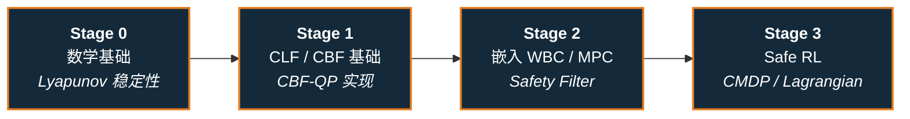

# 路线（纵深）：如果目标是安全控制（CLF / CBF / Safe RL）

**摘要**：面向"在满足安全约束的前提下控制机器人"的纵深路线，从 Lyapunov 稳定性到 CBF-QP、再到 Safe RL，按 Stage 0–3 串通核心方法；本路线是 [运动控制主路线](motion-control.md) 的一条分支。

## 路线一览

## 这条路径怎么用

- 目标读者是有控制理论基础、想加入安全保证的工程师或研究者
- 需要有基础线性代数和微分方程直觉；RL 基础有助于后期阶段
- 每个阶段有前置知识、核心问题、推荐做什么、学完输出什么

**和主路线的关系：**
- 安全控制可以作为 WBC / MPC 的安全约束层，也可以作为 RL 的奖励整形层
- 如果你做主路线 L4 时希望加上安全保证，看本路线
- 如果你做 RL 时希望策略可证明地不越界，看本路线 Stage 3

---

## Stage 0 数学基础

### 前置知识
- 线性代数（矩阵、特征值）
- 微分方程基础（稳定性直觉）
- 一点凸优化基础（QP 是什么）

### 核心问题
- Lyapunov 稳定性是什么意思
- 为什么 Lyapunov 函数能证明系统收敛

### 推荐读什么
- [Lyapunov 稳定性形式化](../wiki/formalizations/lyapunov.md)
- Khalil, *Nonlinear Systems* — Chapter 4（稳定性定义）

### 学完输出什么
- 能手工验证一个简单系统的 Lyapunov 稳定性
- 理解正定函数和负半定导数的含义

---

## Stage 1 CLF / CBF 基础

### 核心问题
- CLF 和 CBF 分别解决什么问题（收敛 vs. 安全边界）
- 两者如何联合放入 QP 优化

### 推荐读什么
- [Control Lyapunov Function](../wiki/formalizations/control-lyapunov-function.md)
- [Control Barrier Function](../wiki/concepts/control-barrier-function.md)
- [CLF vs CBF 对比](../wiki/comparisons/clf-vs-cbf.md)
- Ames et al., *Control Barrier Function based Quadratic Programs* (2017)

### 推荐做什么
- 用 Python + CVXPY 实现一个 CBF-QP，保证 2D 小车不越过边界

### 学完输出什么
- 能解释 CLF 和 CBF 的数学定义和功能区别
- 能写出 CBF-QP 的标准形式

---

## Stage 2 CLF+CBF 在 WBC/MPC 中的应用

### 核心问题
- 如何把 CLF 和 CBF 约束嵌入 WBC 的 QP 层
- Safety filter 和 MPC safety constraint 有什么区别

### 推荐读什么
- [Safety Filter](../wiki/concepts/safety-filter.md)
- [Whole-Body Control](../wiki/concepts/whole-body-control.md)
- [Query：CLF+CBF 在 WBC/MPC 中联合使用](../wiki/queries/clf-cbf-in-wbc.md)
- Zeng et al., *Safety-Critical Model Predictive Control* (2021)

### 推荐做什么
- 在一个简单 locomotion 环境中加入 CBF safety filter，观察对步态的影响

### 学完输出什么
- 能描述 safety filter 的工作方式
- 能识别 WBC 中哪些约束层可以加 CLF/CBF 项

---

## Stage 3 Safe RL

### 核心问题
- Constrained MDP（CMDP）和标准 MDP 的区别
- 如何用 Lagrangian 方法或 barrier 方法训练安全策略

### 推荐读什么
- [Safe RL](../wiki/methods/safe-rl.md)
- [CMDP 形式化](../wiki/formalizations/cmdp.md)
- [安全的真机 RL 微调](../wiki/concepts/safe-real-world-rl-fine-tuning.md)
- Garcia & Fernandez, *A Comprehensive Survey on Safe RL* (2015)
- [Reinforcement Learning](../wiki/methods/reinforcement-learning.md)

### 推荐做什么
- 用 Safety Gym（OpenAI）或 safe-control-gym 跑一个 constrained RL 实验

### 学完输出什么
- 能解释 CMDP 的形式化定义
- 能对比 model-based 安全保证 vs. model-free 安全奖励塑形的优劣

---

## 和其他页面的关系

- 完整成长路线参考：[主路线：运动控制算法工程师成长路线](motion-control.md)
- 其它纵深路径：
  - [遥操作（人形全身遥操作 + 手指遥操作 → 示范数据/实时接管）](depth-teleoperation.md)
  - [人形 RL 运动控制](depth-rl-locomotion.md)
  - [力矩控制电机设计（指标 → 电磁热 → FOC 力矩闭环）](depth-torque-motor-design.md)
  - [传统模型控制（LIP/ZMP → MPC → WBC）](depth-classical-control.md)
  - [人形整机硬件设计（指标预算 → 机械 → 电气 → 通信 → 整机验收）](depth-humanoid-hardware-design.md)
  - [模仿学习与技能迁移](depth-imitation-learning.md)
  - [接触丰富的操作任务](depth-contact-manipulation.md)
  - [感知越障（Perceptive Locomotion）](depth-perceptive-locomotion.md)
  - [导航（SLAM → VLN → 导航 VLA）](depth-navigation.md)
  - [Loco-Manipulation（移动操作）](depth-loco-manipulation.md)
  - [动作重定向（人体动作 → 机器人参考轨迹）](depth-motion-retargeting.md)
  - [动作生成（文本/多模态 → 人形动作）](depth-motion-generation.md)
  - [VLA（视觉-语言-动作模型）](depth-vla.md)
  - [WAM（世界–动作模型）](depth-wam.md)
  - [BFM（人形行为基础模型）](depth-bfm.md)
  - [具身模型测评（认知 → 世界模型保真 → 策略成功率 → sim↔real 校准）](depth-embodied-eval.md)
  - [人形足球（全向行走 → 感知踢球 → 多机战术）](depth-humanoid-soccer.md)
  - [人形群控展演（群舞同步 → 编队走位 → 群体特技）](depth-humanoid-swarm-performance.md)
  - [人形拳击（动作跟踪 → 潜空间技能 → 对抗自博弈）](depth-humanoid-boxing.md)
  - [Sim2Real（域差画像 → 执行器对齐 → 鲁棒训练 → 真机部署）](depth-sim2real.md)
  - [Real2Sim（真实世界 → 可仿真资产/场景/孪生）](depth-real2sim.md)
  - [ICL（具身上下文学习）](depth-icl.md)
- 关联知识页：
  - [Lyapunov 稳定性](../wiki/formalizations/lyapunov.md)
  - [Control Lyapunov Function](../wiki/formalizations/control-lyapunov-function.md)
  - [Control Barrier Function](../wiki/concepts/control-barrier-function.md)
  - [CLF vs CBF 对比](../wiki/comparisons/clf-vs-cbf.md)
  - [Safety Filter](../wiki/concepts/safety-filter.md)
  - [Safe RL](../wiki/methods/safe-rl.md) 与 [CMDP 形式化](../wiki/formalizations/cmdp.md)
  - [Whole-Body Control](../wiki/concepts/whole-body-control.md)
  - [Query：CLF+CBF 在 WBC/MPC 中联合使用](../wiki/queries/clf-cbf-in-wbc.md)

## 参考来源

本路线基于以下原始资料的归纳：

- [Lyapunov 稳定性](../wiki/formalizations/lyapunov.md)
- [Control Lyapunov Function](../wiki/formalizations/control-lyapunov-function.md)
- [Control Barrier Function](../wiki/concepts/control-barrier-function.md)
- [CLF vs CBF 对比](../wiki/comparisons/clf-vs-cbf.md)
- Ames et al., *Control Barrier Function based Quadratic Programs* (2017)
- Khalil, *Nonlinear Systems*
