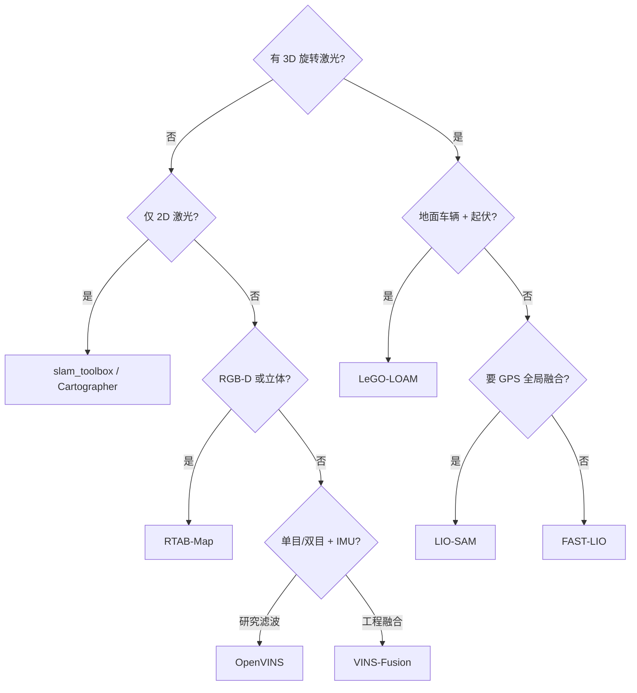

# LiDAR / LIO / VIO 开源选型对比

> **本页回答：** 给定传感器配置（2D 激光、3D 旋转激光、RGB-D、单目+IMU），应优先哪类 **里程计/SLAM** 开源实现？与 [导航栈总览](../overview/navigation-slam-autonomy-stack.md) 中 Nav2 如何衔接？

## 一句话总结

**要快且稳的 3D LIO** 选 **FAST-LIO**；要 **因子图 + GPS/回环** 选 **LIO-SAM**；要 **地面车辆起伏地形** 选 **LeGO-LOAM**；**视觉惯性** 工程常用 **VINS-Fusion**，研究滤波器对比用 **OpenVINS**，多地图视觉 SLAM 用 **ORB-SLAM3**；**RGB-D 一体** 用 **RTAB-Map**。

## 对比表

| 系统 | 主传感器 | 后端 | ROS 2 | 强项 | 弱项/注意 |
|------|----------|------|-------|------|-----------|
| **FAST-LIO** | 3D LiDAR + IMU | 迭代 ESKF + ikd-Tree | 社区移植多 | 低延迟、鲁棒 | 全局一致性依赖外部位姿图 |
| **LIO-SAM** | 3D LiDAR + IMU (+GPS) | GTSAM 因子图 | 有 | 回环、GPS、可解释图优化 | 算力与调参高于 FAST-LIO |
| **LeGO-LOAM** | 3D LiDAR | 地面优化 LOAM 系 | ROS1 为主 | 多变地形、轻量 | 非地面场景假设失效 |
| **hdl_graph_slam** | 3D LiDAR | NDT + g2o | ROS1 | 室外大场景图 SLAM | 维护与 ROS2 迁移成本 |
| **Cartographer** | 2D/3D 激光 | 子图 + PG | cartographer_ros | 2D 工业成熟 | 3D 配置复杂 |
| **slam_toolbox** | 2D 激光 | Karto | 原生 ROS2 | lifelong、大地图 | 非 3D 导航 |
| **ORB-SLAM3** | 单/双目/RGB-D + IMU | 非线性优化 | 需桥接 | 多地图、精度 | 工程集成工作量 |
| **VINS-Fusion** | 单/双目 + IMU (+GPS) | 滑动窗口 BA | ROS 包 | 多传感器融合成熟 | 标定敏感 |
| **OpenVINS** | 单/双目 + IMU | MSCKF 系 | ROS | 研究友好、可配置 | 极端运动需调参 |
| **OpenVSLAM** | 单/双目/RGB-D | 特征 SLAM | 有 | 模块化 | 主线迁移 stella_vslam |
| **Kimera** | 立体 + IMU | VIO + RPGO + 语义 | ROS | 语义度量地图 | 组件多、学习曲线陡 |
| **RTAB-Map** | RGB-D/立体/激光 | 记忆管理 | ROS/ROS2 | 一套 GUI 走通 | 高动态需额外处理 |
| **voxgraph** | 深度/TSDF | 位姿图 + Voxblox | ROS | 多会话子图 | 生态小于 LIO 系 |
| **Isaac cuVSLAM** | 多相机 | GPU | Isaac ROS | Jetson 部署 | 绑定 NVIDIA 栈 |
| **Ultra-Fusion** | CIL + 轮速/GNSS 可选 | 统一滑窗 BA + FRS | 待发布 | **可配置 WIO/VIO/LIO/LVIO**、退化调度、在线时空标定 | 复杂度高；ITS 多平台评测导向 |
| **KILVO** | 关节编码 + IMU + LiDAR + 相机 | 异步–顺序混合 ESIKF | 待开放 | **人形**接触估计、模态失效自适应、**1 kHz** 输出 | 仓仍占位；非通用轮式栈 |

> **退化与标定扰动维度：** [Ultra-Fusion](../entities/paper-ultra-fusion-multi-sensor-slam.md) 在 M3DGR 等基准上对 60+ 系统做 **传感器退化**（弱光、长廊、GNSS 拒止、打滑）与 **时空标定注入** Stress test，适合在固定传感器栈选型之外评估 **鲁棒融合架构**。人形冲击 / 掉传感器场景另见 [KILVO](../entities/paper-kilvo.md)（TMECH；代码待开放）。

## 决策流（简图）

## 与 Nav2 的衔接要点

1. **发布 `map`→`odom`→`base_link` TF** 与 **里程计话题**（`nav_msgs/Odometry`），频率与延迟满足 controller 要求。
2. **2D 导航**：将 3D 点云 **投影为激光扫描** 或直接使用 2D SLAM 产物；勿把未滤波的 3D 障碍直接塞进 2D 层。
3. **3D 避障**：考虑 [nvblox](../entities/isaac-ros-nvblox.md) 等与 Nav2 3D costmap 插件配合。

## 常见误区

- **混淆里程计与 SLAM**：FAST-LIO 等偏 **odometry**；全局一致需回环/图优化模块或上层融合（课程级 odom↔LiDAR 融合原理见 [里程计–激光融合定位](../methods/lidar-odometry-fusion.md)）。
- **忽略 IMU 内参标定**：VIO/LIO 性能上限常由 **时间同步与 IMU 噪声** 决定，而非换算法。
- **在 Lie 群上乱线性化**：位姿估计与优化宜在 **SE(3)** 上处理，参见 [李群刚体运动](../formalizations/lie-group-rigid-body-motions.md)。

## 英文缩写速查

| 缩写 | 英文全称 | 简要说明 |
|------|----------|----------|
| LiDAR | Light Detection and Ranging | 激光雷达，地形感知与建图主传感器 |
| SLAM | Simultaneous Localization and Mapping | 同步定位与建图 |
| LIO | LiDAR-Inertial Odometry | 激光-惯性里程计 |
| VIO | Visual-Inertial Odometry | 视觉-惯性里程计，融合相机与 IMU 估计位姿 |
| RGB | Red-Green-Blue | 彩色图像通道，常与深度 (RGB-D) 配合 |
| IMU | Inertial Measurement Unit | 惯性测量单元，提供加速度与角速度 |
| ROS 2 | Robot Operating System 2 | 机器人系统集成与通信的常用中间件 |
| PG | Policy Gradient | 以回报梯度更新策略参数的基础方法族 |
| GPU | Graphics Processing Unit | 图形处理器，大规模并行仿真训练的算力基础 |

## 参考来源

- [navigation_slam_autonomy_stack_catalog.md](../../sources/repos/navigation_slam_autonomy_stack_catalog.md)
- [ultra_fusion_arxiv_2606_21223.md](../../sources/papers/ultra_fusion_arxiv_2606_21223.md) — 大规模退化/标定扰动基准与 Ultra-Fusion 对照
- [kilvo_arxiv_2608_05647.md](../../sources/papers/kilvo_arxiv_2608_05647.md) — 人形 KILVO 多传感器 ESIKF
- 各对比对象 `sources/repos/*.md`

## 关联页面

- [导航·SLAM·自动驾驶栈总览](../overview/navigation-slam-autonomy-stack.md)
- [Navigation2](../entities/navigation2.md)
- [LingBot-Map](../methods/lingbot-map.md) — 学习型流式建图对照
- [里程计–激光融合定位](../methods/lidar-odometry-fusion.md) — 课程级 odom↔LiDAR 融合概念，本页是其开源实现（FAST-LIO/LIO-SAM 等）选型落地
- [KILVO](../entities/paper-kilvo.md) — 人形运动学–惯性–激光–视觉里程计（代码待开放）
- [SUPER ODOMETRY 2.0](../entities/paper-super-odometry-2.md) — 退化可切换的层级融合；slim 仓 ≠ 论文全文系统
- [Query：具身时代 SLAM 精华与糟粕](../queries/slam-second-spring-embodied.md) — 选型之外：地图可以是 token，不必是人读 Occupancy

## 推荐继续阅读

- [FAST-LIO 论文与仓库](https://github.com/hku-mars/FAST_LIO)
- [LIO-SAM IROS 2020](https://github.com/TixiaoShan/LIO-SAM)
