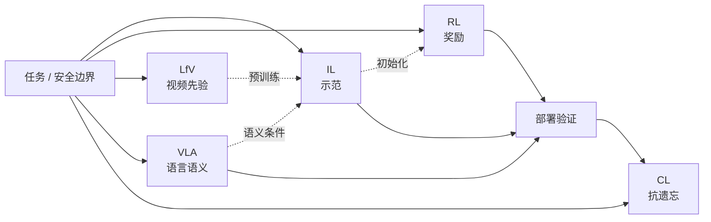

# 机器人学习五大范式：模仿、强化、视频、多模态与持续学习

## 一句话定义

**机器人学习五大范式** 是按 **学习信号来源** 划分的选型框架：示范（IL）、奖励交互（RL）、互联网视频先验（LfV）、视觉–语言–动作统一（VLA）、以及时间维上的能力保持（持续学习）；核心不是「哪条路最强」，而是 **在给定任务、数据与安全边界下选可靠信号并组合验证**。

## 英文缩写速查

| 缩写 | 英文全称 | 简要说明 |
|------|----------|----------|
| IL | Imitation Learning | 从专家示范学习观测→动作映射 |
| RL | Reinforcement Learning | 从环境交互奖励优化长期回报 |
| LfV | Learning from Video | 用人类/互联网视频提取可迁移先验 |
| VLA | Vision-Language-Action | 视觉、语言与动作进入同一策略模型 |
| CL | Continual Learning | 持续学新技能并尽量避免灾难性遗忘 |

## 为什么重要

- **术语混用**：产业叙事常把「端到端大模型」与「会自己学」混为一谈；本框架把能力拆回 **可检验的学习信号**。
- **选型入口**：相对 [RL vs IL](./rl-vs-il.md) 的双主干对照，本页补齐 **视频数据、多模态语义、时间维遗忘** 三条当代主线。
- **与模型族正交**：姊妹页 [五大具身模型分类](./vlm-vln-vla-vlx-world-model-taxonomy.md) 按 **感知→导航→执行→融合→推演** 分模型族；本页按 **如何获得改进信号** 分学习范式——系统拆分时常两套同时用。

## 五类范式与学习信号

| 范式 | 核心信号 | 擅长 | 典型代价 / 风险 | 文内代表 |
|------|----------|------|-----------------|----------|
| **模仿学习** | 专家轨迹 $(o,a)$ | 快速得到可用策略；精细双臂协调 | 分布偏移；单步误差累积 | ALOHA + [ACT](../methods/action-chunking.md)；[DAgger](../methods/dagger.md) |
| **强化学习** | 标量/塑形奖励 | 「好坏可定义、示范难写」的长期行为 | 真机试错不安全；需 Sim2Real | Isaac Gym 并行；[DR](../concepts/domain-randomization.md) |
| **从视频学习** | 无动作标签的人类视频 | 扩展数据规模与任务先验 | 视角差、手–爪形态差；不能直接复制 | VideoDex；LfV survey |
| **多模态 VLA** | 图像 + 语言 + 动作共训 | 指令语义与跨任务泛化 | 长程规划/系统可靠性未自动解决 | [RT-2](../methods/robotics-transformer-rt-series.md)；Open X-Embodiment |
| **持续学习** | 随时间到达的任务流 | 技能叠加与终身适应 | 灾难性遗忘；评测多在仿真/静态集 | 正则化 / 回放 / 架构扩展 |

## 各范式读法（工程要点）

### 1. 模仿学习：示范是起点，不是终点

- **机制**：学 $π(a|o)$；高质量示范可提供可用起点。
- **动作块**：对需持续协调的任务，用 [Action Chunking / ACT](../methods/action-chunking.md) 一次预测短时连续动作，减轻逐步误差。
- **纠偏**：[DAgger](../methods/dagger.md) 把策略真实访问状态纳入标注，缓解分布偏移；专家在环成本与安全仍是硬约束。
- 详见 [Imitation Learning](../methods/imitation-learning.md)。

### 2. 强化学习：用反馈代替逐步示范

- **机制**：最大化累计回报；适合奖励可定义、示范难穷尽的行为。
- **仿真优先**：GPU 并行仿真（如 Isaac Gym / Isaac Lab 系）降低采样墙；真机大量试错通常不可接受。
- **迁移**：配合 [Sim2Real](../concepts/sim2real.md) 与 [Domain Randomization](../concepts/domain-randomization.md)；仿真成功 ≠ 真机可用。
- 详见 [Reinforcement Learning](../methods/reinforcement-learning.md)。

### 3. Learning from Video：先验补充，不是替代真机数据

- **关键区分**：人类视频通常 **没有** 可执行的机器人动作标签。
- **价值**：任务时序、物体交互与物理行为先验；经检测/重定向后预训练策略，再少量真机示范收尾（VideoDex 范式）。
- **对照本库**：人类视频语料与操作先验见 [HumanNet](../entities/humannet.md)、[Mimic-Video](../methods/mimic-video.md)、[video-as-simulation](../concepts/video-as-simulation.md)。

### 4. 多模态 VLA：把语义接到可执行动作

- **定位**：相对纯视觉策略补 **任务语义**；相对纯 VLM 补 **控制输出**。
- **统一表示**：如 RT-2 将动作文本 token 化，使互联网 VL 数据与机器人轨迹共训。
- **跨具身**：Open X-Embodiment 类工作验证跨平台正迁移，但硬件、动作空间与传感差异仍限制「一张表训天下」。
- 详见 [VLA](../methods/vla.md)；模型族边界见 [五大具身模型分类](./vlm-vln-vla-vlx-world-model-taxonomy.md)。

### 5. 持续学习：时间维上的能力会计

- **核心难题**：只对新任务更新参数 → **灾难性遗忘**。
- **常见策略族**：重要参数正则化、动态扩容、经验回放、生成式回放（可组合）。
- **部署读法**：多数方法仍主要在仿真或静态数据集上评测；上真机还需存储、在线采样与安全预算——更宜当作 **评估框架与研究目标**，而非开箱通用能力。
- **本库实例**：[ASPIRE](../methods/aspire.md)（技能库式持续学习）、[Extreme-RGMT](../entities/paper-extreme-rgmt.md)（高动态技能两阶段 continual learning）。

## 组合选型（而非单选）

文内与工程共识一致：五类常 **串联/并联**，例如：

1. **IL 初始化** → **RL 局部精炼**（示范给起点，奖励抠极限）。
2. **LfV / 互联网先验预训练** → **少样本真机 IL / VLA 微调**。
3. **VLA 语义层** + **低层 WBC/PD**（语言条件高层，执行层保稳定）。
4. 部署后用 **CL / 数据飞轮** 叠新技能，并显式测旧任务回归。

决策问题应落到：

| 问题 | 优先考虑 |
|------|----------|
| 能否便宜拿到高质量示范？ | IL / ACT / 遥操作采集 |
| 「怎样做」难写、但「好坏」可测？ | RL + 仿真 + Sim2Real |
| 真机数据极少、网上视频很多？ | LfV 作先验，勿指望零真机 |
| 需要自然语言任务条件？ | VLA / 指令增强 |
| 技能会随时间叠加？ | 持续学习评测 + 回放/技能库 |

## 常见误区或局限

1. **「有了 VLA 就不需要 IL/RL。」** VLA 训练本身多为大规模 IL；RL 微调与低层控制仍常决定真机上限。
2. **「看视频就能学会操作。」** LfV 缺动作标签与形态对齐；通常是先验而非端到端替代。
3. **「仿真 RL 训完就能上真机。」** 忽略 Sim2Real gap 与安全验证会系统性翻车。
4. **「持续学习 = 不断 fine-tune。」** 无抗遗忘机制的连续微调往往是遗忘加速器。
5. **把科普代表作当 SOTA 榜。** ACT / RT-2 / VideoDex 是 **范式锚点**，选型仍需对照任务协议与本库更新实体页。

## 关联页面

- [RL vs IL](./rl-vs-il.md) — 双主干监督信号对照
- [五大具身模型分类](./vlm-vln-vla-vlx-world-model-taxonomy.md) — 模型族 I/O 边界（正交 taxonomy）
- [具身大模型分类学选型闭环（知识链枢纽）](../overview/hub-embodied-foundation-model.md) — 选模型族时的姊妹入口；本页回答「用什么学习信号」
- [Query：具身大模型分类学选型闭环](../queries/embodied-fm-taxonomy-loop.md) — VLM→VLN→VLA→VLX→WM 决策链
- [六条路线的窟窿](../queries/embodied-six-routes-holes.md) — 产业叙事并置的六条 + 各路卡点（与本页学习信号轴正交）
- [Robot Learning Overview](../overview/robot-learning-overview.md) — 学习方法层总入口
- [Imitation Learning](../methods/imitation-learning.md) / [Reinforcement Learning](../methods/reinforcement-learning.md) / [VLA](../methods/vla.md)
- [Sim2Real](../concepts/sim2real.md) / [Domain Randomization](../concepts/domain-randomization.md)
- [机器人控制八范式](./robot-control-eight-paradigms-taxonomy.md) — 控制侧分类（与学习信号侧互补）
- [路径规划五大范式](./robot-path-planning-five-paradigms-taxonomy.md) — 规划侧分类（与学习信号侧互补）

## 推荐继续阅读

- 深蓝具身智能原文：<https://mp.weixin.qq.com/s/r2zUtQfwH_r0WHrnY4CHuA>
- Lesort et al., *Continual Learning for Robotics*, Information Fusion, 2020
- McCarthy et al., *Towards Generalist Robot Learning from Internet Video: A Survey*, JAIR, 2025
- [VLA 开源复现景观 2025](../overview/vla-open-source-repro-landscape-2025.md)

## 参考来源

- [wechat_shenlan_robot_learning_five_paradigms.md](../../sources/blogs/wechat_shenlan_robot_learning_five_paradigms.md) — 深蓝具身智能《机器人学习算法五大体系详解》（<https://mp.weixin.qq.com/s/r2zUtQfwH_r0WHrnY4CHuA>）
