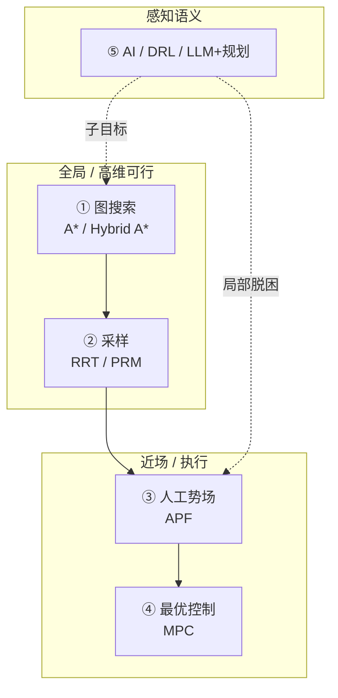

# 机器人路径规划五大范式：图搜索、采样、势场、最优控制与 AI

## 一句话定义

**路径规划五大范式** 是按 **环境信息形态与决策层次** 划分的选型框架：在完整地图上搜路（图搜索）、在高维空间采样可行轨迹（采样）、用势场做近场反应（APF）、用滚动优化保证动力学可行（最优控制/MPC）、以及用学习/大模型补感知与语义（DRL/AI）；核心不是「哪条路最强」，而是 **在给定任务、算力与安全边界下组合各层**。

## 英文缩写速查

| 缩写 | 英文全称 | 简要说明 |
|------|----------|----------|
| A\* | A-star | 带启发式的最优图搜索，全局连通基线 |
| RRT | Rapidly-exploring Random Tree | 采样式运动规划，高维构型空间常用 |
| PRM | Probabilistic Roadmap | 预采样建图再查询，与 RRT 同属采样族 |
| APF | Artificial Potential Field | 目标引力 + 障碍斥场的反应式局部法 |
| MPC | Model Predictive Control | 滚动时域约束优化，动力学可行执行 |
| DRL | Deep Reinforcement Learning | 深度强化学习，观测→动作端到端策略 |
| VLN | Vision-Language Navigation | 视觉–语言导航，语义子目标与地图锚定 |

## 为什么重要

- **术语混用**：「路径规划」常被用来指全局搜索、局部避障、轨迹优化或 RL 策略；本框架把职责拆回 **可定位的五条路线**。
- **与三层导航栈互补**：姊妹页 [移动机器人导航规划方法对比](./mobile-robot-navigation-planning-methods.md) 聚焦 **A\* + DWA + 平滑** 的工程流水线；本页补齐 **采样、势场、MPC、学习型** 等常被并列讨论但层次不同的范式。
- **与控制/学习 taxonomy 正交**：[控制八范式](./robot-control-eight-paradigms-taxonomy.md) 回答「怎么稳定执行」；[学习五范式](./robot-learning-five-paradigms-taxonomy.md) 回答「用什么信号改进」；本页回答 **「怎么在空间里决定往哪走」**。

## 五类范式与职责分工

| 范式 | 核心输入 | 擅长 | 典型失败 / 边界 | 文内代表 |
|------|----------|------|-----------------|----------|
| **图搜索** | 静态占据栅格/拓扑图 + 起终点 | 全局连通、代价明确时最优折线 | 地图脏/未建模障碍；高维栅格爆炸；折线动力学不可行 | Dijkstra、[A\*](../methods/a-star.md)、Hybrid A\* |
| **采样** | 构型空间 + 碰撞检测器 | 高维机械臂/移动操作可行轨迹 | 狭窄通道采样命中低；路径锯齿需平滑；动态障碍重规划慢 | RRT、PRM、RRT\* |
| **人工势场** | 目标位姿 + 障碍距离/速度 | 近场快速反应、低算力高频更新 | 局部极小值；目标贴墙斥力抵消 | APF |
| **最优控制** | 动力学模型 + 状态估计 + 约束 | 扭矩/摩擦/接触约束下的可执行轨迹 | 模型误差；求解时延；未建模接触 | [MPC](../methods/model-predictive-control.md) |
| **强化学习与 AI** | 传感观测 +（可选）语言任务 | 非结构化局部策略；语义子目标拆解 | Sim2Real；可解释性；不宜单独承担长程安全 | DRL；LLM+[VLN](../tasks/vision-language-navigation.md)+传统规划 |

## 各范式读法（工程要点）

### 1. 图搜索：有图时先确认「能不能到」

- **机制**：环境离散为格点/节点，用累计代价 +（可选）启发式搜索连通路径。
- **Dijkstra vs A\***：前者均匀扩张；后者用可采纳 \(h\) 优先探索更有希望区域（见 [A\*](../methods/a-star.md)）。
- **Hybrid A\***：把朝向、最大转角等 **运动学** 纳入状态——自主泊车等 Ackermann 场景常用；输出粗路径再交平滑/跟踪。
- **局限**：执行期突发障碍需重规划；7-DoF 级三维栅格易维度灾难。

### 2. 采样：高维空间里「钻」可行通道

- **机制**：随机/准随机采样安全构型，碰撞检测后连边成路径；RRT 从起点向外扩张直至触达终点。
- **典型场景**：移动底盘 + 7-DoF 臂在桌面抓杯——关节空间维度高，栅格搜索失效。
- **工程补丁**：目标偏置、受限空间采样、后接 [平滑路径生成](../methods/smooth-navigation-path-generation.md)。
- **狭窄通道**：随机命中概率极低，是采样法经典失效模式（文内「5 cm 门缝」对照）。

### 3. 人工势场：近场「本能」避障

- **机制**：目标产生引力，障碍产生斥力，沿合力（势能下降）运动。
- **适用**：服务机器人行人突然闯入——全局规划来不及重算时，APF 可作 **底层反应式** 修正（与 [DWA](../methods/dwa.md) 同属局部层思想，实现形式不同）。
- **局限**：U 形陷阱等 **局部极小**；目标紧靠障碍时斥力阻止抵达——实际常跟在全局路径之后，不作唯一导航器。

### 4. 最优控制 / MPC：在物理极限内踩稳每一步

- **机制**：有限时域内预测状态、解带约束优化，只执行首步再滚动（见 [MPC](../methods/model-predictive-control.md)）。
- **价值**：电机扭矩、摩擦、接触等约束可显式写入；四足/人形高动态常见。
- **代价**：模型质量与求解器速度；未建模接触或传感误差时性能骤降。

### 5. 强化学习与 AI：补语义与难建模局部，而非替代全套规划器

- **DRL**：激光/相机 → 速度/转向，适合拥挤室内 **局部脱困** 等难手写规则场景（见 [Reinforcement Learning](../methods/reinforcement-learning.md)）。
- **分层 AI**：LLM/VLM 理解「去书房拿杯子」，感知在地图上锚定家具语义，再调用 **传统搜索+控制** 完成几何避障——文内强调的稳妥工程路线。
- **落地门槛**：Sim2Real、安全验证与决策可解释性。

## 「狭窄通道」组合示例（文内收束）

五类在真实系统中常 **串联**：

1. **低分辨率 [A\*](../methods/a-star.md)**：确认门的大致位置与全局连通性。
2. **门附近 RRT / RRT\***：在高维或精细区域补可行采样。
3. **底层 APF 或 [DWA](../methods/dwa.md)**：全程近场防撞与动态障碍反应。
4. **[MPC](../methods/model-predictive-control.md)**：把几何路径落成动力学可执行轨迹。

决策问题应落到：**任务尺度、地图质量、自由度、算力预算与安全认证**——而非「哪一种算法通吃」。

## 与移动机器人三层栈的关系

| 本页范式 | [移动机器人导航三层栈](./mobile-robot-navigation-planning-methods.md) |
|----------|----------------------------------------------------------------------|
| 图搜索 | 对应 **全局 A\*** 层 |
| 采样 | 高维/无栅格时 **替代或增强** 全局层 |
| APF / DWA | 同属 **局部反应** 层（DWA 为速度空间采样实现） |
| 平滑优化 | 三层栈的 **后处理**（本页未单列第五类，常接在搜索/采样之后） |
| MPC | 可作 **跟踪/执行** 层，替代纯几何跟踪 |
| DRL/AI | 多增强 **局部或语义高层**，长程仍常外挂 A\* / 拓扑 |

## 常见误区或局限

1. **「A\* 规划好就能直接开。」** 折线忽略动力学；需 Hybrid A\*、平滑或 MPC 跟踪。
2. **「RRT 能替代建图。」** 采样解决 **可行轨迹**，不负责语义地图与长程目标分解。
3. **「APF 可当全局规划。」** 局部极小与目标不可达是结构性问题。
4. **「MPC 也是路径规划。」** MPC 更贴近 **约束轨迹生成/跟踪**；全局拓扑仍常由搜索/采样给出。
5. **「端到端 RL 导航可以不要地图。」** 长程安全与可认证性仍推动 **分层 + 传统规划** 组合。
6. **把科普对照实验当 SOTA 榜。** 文内狭窄门缝是 **范式边界锚点**，工程选型需对照本机传感器、算力与认证要求。

## 关联页面

- [移动机器人导航规划方法对比](./mobile-robot-navigation-planning-methods.md) — A\* + DWA + 平滑工程三层栈
- [A\* 全局路径规划](../methods/a-star.md) / [DWA 局部路径规划](../methods/dwa.md)
- [平滑路径生成](../methods/smooth-navigation-path-generation.md) — 搜索/采样后的曲率连续化
- [MPC](../methods/model-predictive-control.md) — 最优控制代表
- [Reinforcement Learning](../methods/reinforcement-learning.md) — DRL 局部策略
- [Vision-Language Navigation](../tasks/vision-language-navigation.md) — 语义导航与 LLM 分层
- [Navigation2](../entities/navigation2.md) / [PythonRobotics](../entities/python-robotics.md) — 图搜索 + 局部层工程/教学入口
- [机器人控制八范式](./robot-control-eight-paradigms-taxonomy.md) / [机器人学习五范式](./robot-learning-five-paradigms-taxonomy.md) — 姊妹 taxonomy

## 推荐继续阅读

- 深蓝具身智能原文：<https://mp.weixin.qq.com/s/buw_88K8DlR9Tw70NDTzkw>
- LaValle, *Planning Algorithms* — 图搜索与采样经典教材
- [PythonRobotics Path Planning](https://github.com/AtsushiSakai/PythonRobotics/tree/master/PathPlanning) — A\* / RRT / APF 动画对照
- 高飞团队《移动机器人运动规划》课程（文内推荐；搜索、采样、动力学规划与 MPC）

## 参考来源

- [wechat_shenlan_robot_path_planning_five_paradigms.md](../../sources/blogs/wechat_shenlan_robot_path_planning_five_paradigms.md) — 深蓝具身智能《机器人路径规划5大主流算法详解》（<https://mp.weixin.qq.com/s/buw_88K8DlR9Tw70NDTzkw>）
