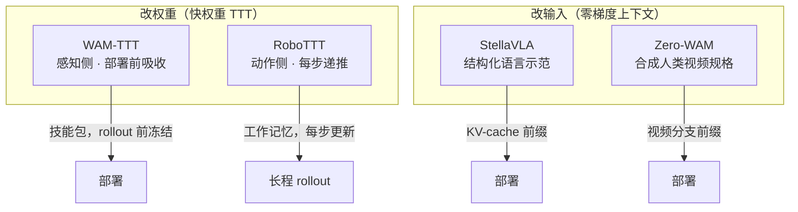

# WAM-TTT × RoboTTT × StellaVLA × Zero-WAM：具身 ICL 四路线对比

## 一句话定义

**截至 2026-08 学术侧最接近产业「演示当提示」叙事的四条可核对路线**：两条 **快权重 TTT**（感知侧技能记忆 vs 动作侧工作记忆）与两条 **零梯度上下文**（结构化语言示范 vs 合成人类视频任务规格）；**横向表只做定性定位，不做性能排序**。

## 英文缩写速查

| 缩写 | 英文全称 | 简要说明 |
|------|----------|----------|
| ICL | In-Context Learning | 部署期适应；本页四路线中仅 StellaVLA/Zero-WAM 为完全零梯度 |
| TTT | Test-Time Training | 测试时对快权重做梯度更新 |
| KVM | Key-Value Memory | WAM-TTT 记忆重建损失；附录等价线性注意力 |
| IFP | In-context Future chunk Prediction | Zero-WAM 反捷径训练目标 |
| ICIL | In-Context Imitation Learning | 检索示范作前缀的模仿学习框架 |

## 为什么重要

- **名词过载：** 2026 年「上下文」同时指 π0.7 metadata、[RoboTTT](../entities/paper-robottt-test-time-training-vla-context.md) 8K fast weights、[StellaVLA](../entities/paper-stellavla-structured-icl-vla.md) 结构化前缀与 [Zero-WAM](../entities/paper-zero-wam.md) 人视频规格——混用会误判机制与代价。
- **产业空白：** [GEN-1.5](../entities/generalist-gen15-one-shot.md) / [S1](../entities/skild-s1.md) 宣称涌现式 one-shot（闭源）；四篇论文反证在可负担规模上 **需要显式机制**。
- **零直接对比：** 四篇互知却 **无同 backbone 并排实验**；本页收拢策展坐标系，供选型而非刷榜。

## 坐标系：演示改什么 × 何时适应

| 论文 | 演示落点 | 适应时机 | 梯度？ | 实体页 |
|------|----------|----------|--------|--------|
| [WAM-TTT](../entities/paper-wam-ttt-human-video-test-time-steering.md) | 冻结 WAM **video 专家** fast weights | 部署前批次 TTT（默认 1 步 SGD） | 零**主干**梯度 | arXiv:2607.06988 |
| [RoboTTT](../entities/paper-robottt-test-time-training-vla-context.md) | **DiT 动作头** fast weights | 每步 visuomotor 递推 | 零**主干**梯度 | arXiv:2607.15275 |
| [StellaVLA](../entities/paper-stellavla-structured-icl-vla.md) | 检索 **结构化语言** 示范前缀 | 无 | **完全零梯度** | arXiv:2608.11671 |
| [Zero-WAM](../entities/paper-zero-wam.md) | **人类视频** 作视频分支上下文 | 无 | **完全零梯度** | arXiv:2608.26103 |
| [HOST](../entities/paper-host-one-shot-human-video.md) | **真人视频** + 进度流形 / 自接地未来观测 | 无 | **完全零梯度** | arXiv:2607.20033 |

## 十二维对照（定性，非排名）

| 维度 | WAM-TTT | RoboTTT | StellaVLA | Zero-WAM |
|------|---------|---------|-----------|----------|
| **ICL 口径** | 测试时训练；反对纯上下文堆叠 | 上下文长度 scaling；ICL 为长上下文副产品 | 标准 ICIL；创新在示范**表示** | 零样本跨任务 = 任务规格问题 |
| **上下文模态** | 真实 GoPro 人视频（无姿态） | 人视频 / 自身 rollout / DAgger 失败（掩码统一） | 子目标 + 2D/3D 运动文本 + 关键帧 | **合成**人类操作视频 |
| **泛化主轴** | **未见场景**（家庭/厨房/办公室） | **时长/阶段**（~5 min 十阶段） | **扰动轴**（LIBERO-Plus、VLA-Arena L1/L2） | **未见任务**（RoboTwin 留出） |
| **代表数字** | New 9 任务 progress **46.2%** | 长程装配完成分 **~79 vs ~42** | LIBERO **98.8%**；VLA-Arena **0.63** | 未见 7 任务 **46.95%** |
| **指标注意** | **progress 部分给分** | rubric 完成分 + 部分二元 SR | 饱和仿真 SR | 3 种子 × 100 rollout SR |
| **开源** | 差（无代码/页） | 中低（项目页 + arXiv） | 差（无官方代码） | 待发布（HumanGen 流水线依赖闭源 API） |

> **读表规则：** 46.2、79、98.8、46.95 **不可并排排名**——分别对应未见场景 progress、固定场景 rubric、饱和仿真 SR、未见任务 SR。

## 漂移轴地图（互补失败）

四篇各守一条漂移轴，**无一篇同时覆盖两条**：

| 漂移轴 | 强项 | 典型盲区 |
|--------|------|----------|
| **场景/视觉** | WAM-TTT（真实野外人视频） | RoboTTT 固定场景相机 |
| **时长/阶段** | RoboTTT（8K 预训练上下文） | StellaVLA Long Horizon L1/L2 ≈ 0 |
| **扰动/规格** | StellaVLA（LIBERO-Plus + 三向干预） | 物体布局增益仅 +0.1 |
| **未见任务** | Zero-WAM（任务级切分） | 未见环境未测 |
| **秒级单视频 + 不遗忘** | [HOST](../entities/paper-host-one-shot-human-video.md)（开源管线） | 单平台 ARX；不按 L0–L3 报 |

**结构性事实：** 四篇里 **仅 WAM-TTT** 用真实、跨域人类视频；StellaVLA 与 Zero-WAM 均用 VLM **把机器人轨迹重渲染** 成另一模态（文本 vs 合成视频）。

## 跨篇可带走的三条经验

1. **人类信息只改感知/生成侧** — WAM-TTT（video 专家）、Zero-WAM（视频分支）；RoboTTT 的 TTT 在动作头但上下文是**机器人自身**历史，不违反此条。
2. **训练期挂辅助、推理期剥离** — StellaVLA spatial-language expert（剥离后 88 ms vs 3177 ms）；Zero-WAM IFP；辅助目标须逼主分支学 in-context 信号。
3. **上下文会走捷径** — RoboTTT +1 历史帧反而更差；Zero-WAM 无 IFP 时人视频为净负；StellaVLA Image-only 分内好但 OOD 差。

## 选型读法（工程）

| 你的瓶颈 | 优先看 | 原因 |
|----------|--------|------|
| 新家庭/厨房 OOD，有真实 egocentric 人视频 | WAM-TTT | 唯一直面真实跨域人视频；需 meta-training 配对 |
| 5 min 级多阶段装配，需部署后自纠偏 | RoboTTT | 8K 预训练上下文 scaling；DAgger Distillation 可拆用 |
| 桌面 OOD 扰动，可检索同任务示范 | StellaVLA | 三向干预证明真用上下文；试 λ=0 若重 OOD |
| 仿真/真机 **未见任务**，可造 HumanGen 式配对 | Zero-WAM | 任务级泛化；**IFP 不可省** |
| 要开源单视频、不改权重、可下权重 | [HOST](../entities/paper-host-one-shot-human-video.md) | 真机包未随仓；开环 ≠ 62% 真机表 |

## 局限与风险

- **四篇均无公开完整复现栈**（权重/数据/训练脚本）；数字仅采信论文自报。
- **零并排实验：** 文内「未走之路」第 1 条——同 backbone 并排三种上下文接口——边际信息量高于再发新机制。
- **产业规模未覆盖：** 四篇证明的是「可负担规模需显式机制」，不能否定 GEN-1.5/S1 级预训练下是否涌现。

## 关联页面

- [ICL 纵深路线](../../roadmap/depth-icl.md) — 本页坐标系对应 Stage 4「零梯度上下文 vs 快权重 TTT vs 记忆增强」的选型环节

- [Query：具身大模型分类学选型闭环](../queries/embodied-fm-taxonomy-loop.md) — 本页四路线都落在闭环的「执行（VLA）× 推演（WM）」两层；先在那里定家族，再回本页按漂移轴挑适应机制
- [机器人 In-Context Learning](../concepts/robot-in-context-learning.md) — 真 ICL vs TTT vs 映射选择 taxonomy
- [VLA](../methods/vla.md) — 长程记忆与部署期适应
- [Manipulation](../tasks/manipulation.md) — 四实体索引入口
- [GEN-1.5](../entities/generalist-gen15-one-shot.md) / [S1](../entities/skild-s1.md) — 产业闭源对照
- [HOST](../entities/paper-host-one-shot-human-video.md) — 开源零梯度单视频；进度对齐 + 自接地
- [The Imitator Game](../entities/paper-imitator-game.md) — 意图级模仿基准，不是方法路线

## 参考来源

- [每日智能四篇 ICL 纵横向解读（2026-08-31）](../../sources/blogs/wechat_meiri_zhineng_embodied_icl_four_papers_2026-08-31.md)
- [具身智能之心 ICL 综述（2026-08-25）](../../sources/blogs/wechat_embodied_heart_robot_icl_gen15_survey_2026-08-25.md)

## 推荐继续阅读

- 原文（微信公众号）：<https://mp.weixin.qq.com/s/vIUalf3vZI3AV-HWSVruew>
- 四篇 arXiv：[2607.06988](https://arxiv.org/abs/2607.06988) · [2607.15275](https://arxiv.org/abs/2607.15275) · [2608.11671](https://arxiv.org/abs/2608.11671) · [2608.26103](https://arxiv.org/abs/2608.26103)
