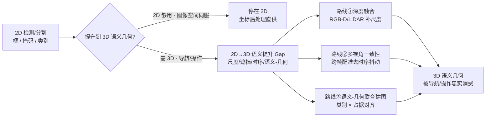

# 2D→3D 语义提升 Gap（2D 检测/分割 ↔ 3D 语义几何）

机器人感知里几乎都默认一个隐含抽象：**2D 检测/分割结果可以干净地提升到 3D**——一个准的 2D 框或掩码，配上深度，就能得到策略可直接消费的「这个类别的对象在世界坐标里哪个位置、什么几何」。这条抽象让感知只需在「图像空间」把检测/分割做好，不必操心提升到 3D 时会丢什么。**2D→3D 语义提升 Gap** 指的就是这条理想假设与真实提升行为之间的系统性偏差——它是[机器人视觉感知栈选型闭环](../queries/robot-perception-stack-selection-loop.md)第③层「2D 框够用还是必须 3D 语义几何」这个问题的物理根因页。

## 一句话定义

> **2D→3D 语义提升 Gap**：把 2D 框/掩码提升到「可供策略消费的 3D 语义几何」时不可避免的信息损失与歧义——由尺度不确定、遮挡、时序不一致、类别语义与几何占据的分离，以及「2D 粒度 / 绝对尺度 ≠ 语义层级」叠加而成，本质是「感知输出能否被下游导航/操作忠实消费」。

## 英文缩写速查

| 缩写 | 英文全称 | 简要说明 |
|------|----------|----------|
| SAM | Segment Anything Model | 输出无类别语义的可提示掩码，提升需另配类别 |
| OV | Open-Vocabulary | 开放词汇，可标注训练集外类别但语义置信不均 |
| TSDF | Truncated Signed Distance Function | 稠密体素融合表示，几何占据的常用载体 |
| RGB-D | RGB-Depth | 带深度的彩色相机，提升的常用输入 |
| ICP | Iterative Closest Point | 多视角点云配准，缓解时序不一致 |

## 信息损失与歧义

把 2D 结果提升到 3D 语义几何时，Gap 主要来自下列方向，任意一个被忽略都会让提升出的 3D 语义系统性偏：

| 损失/歧义 | 物理含义 | 一旦忽略会怎样 |
|-----------|----------|----------------|
| 尺度不确定 | 单目无绝对尺度、深度在远处/反光/低纹理不可信 | 提升出的对象位置/大小系统性偏，远处尤甚 |
| 遮挡 | 2D 掩码只覆盖可见面，被遮挡部分无观测 | 3D 几何缺面、占据不完整，抓取/避障判错 |
| 时序不一致 | 逐帧检测/分割 ID 与边界跳变 | 同一对象在地图里分裂/漂移，语义闪烁 |
| 语义 vs 几何分离 | 类别语义（是什么）与几何占据（在哪、什么形状）来自不同来源 | [SAM](../entities/paper-segment-anything.md) 掩码有几何无类别，闭集检测有类别但边界糙 |
| 层级错位 | SAM 的 2D 粒度随视距变；绝对物理尺度因类内尺寸差与语义层级脱钩 | 近景切成花瓣、远景只出花蕾；大实例被切碎、小实例保持完整 |

**总原则**：提升成不成立取决于**「这些损失相对当前下游任务容差的量级」**，而不是 2D 检测/分割「准不准」。同一套 2D 结果，做粗粒度导航避障时提升够用，做精细抓取或零件级 grounding 时就必须先把尺度/遮挡/时序/层级对齐。

## 提升成立的条件

理想的干净提升不是永远错——在特定条件下它是够用的近似。判断它何时成立、何时破，比无脑上稠密语义建图更重要：

| 提升成立条件 | 物理含义 | 一旦不满足会怎样 |
|--------------|----------|------------------|
| 深度在对象距离可信 | 结构光/双目/LiDAR 在该距离精度足够 | 远距/反光/低纹理深度失效，位置乱跳 |
| 对象基本无遮挡 | 目标可见面覆盖足够几何 | 被遮挡部分几何缺失，占据判错 |
| 多视角/多帧一致 | 同一对象跨帧可稳定关联 | ID 跳变，地图里对象分裂或漂移 |
| 类别语义可得 | 有检测器/文本提示补上类别 | 只有几何没有类别，策略不知道那是什么 |
| 下游容差 ≥ 提升误差 | 任务对 3D 精度要求不苛刻 | 精细抓取/穿越窄缝时误差被放大成失败 |

## 为什么它是感知栈的核心根因

2D→3D 语义提升 Gap 是感知输出「能不能被策略忠实消费」最常见、也最隐蔽的一层。感知栈若停在 2D（图像空间视觉伺服），等于**默认了不需要提升**；一旦下游是导航/操作要在 3D 里决策，同一套准的 2D 结果提升到 3D 后就可能尺度偏、缺面、语义闪烁，策略随即抓偏或撞上。这正是[感知栈选型闭环](../queries/robot-perception-stack-selection-loop.md)里③层的具体开关：

先量化**这些损失在当前下游任务里的占比**，再决定是否值得往上建更贵的稠密语义地图——损失占比小就别过度建图（对象级子地图够用），占比大才投入多视角/联合建图成本。

## 收窄提升 Gap 的三条工程路线

Gap 被定位后，收窄它有三条互补路线，成本与保真度递增：

### 路线①：深度融合（补尺度）

- **做什么**：用 RGB-D / 双目 / LiDAR 给 2D 掩码补上可信深度，把像素反投影到 3D，对不可信深度（远距/反光/低纹理）设门限剔除。只有 RGB 时，也可用单目点图模型（如 [PointDiT](../entities/paper-pointdit.md)）直接出相机系 XYZ，再与掩码相交。
- **取舍**：主动深度直接消掉单目尺度歧义、成本中等；单目点图省传感器，但 PointDiT 一类输出是 **仿射不变**，抓取/碰撞仍要另做尺度标定。深度传感自身有失效区，融合前要先判深度可信度。
- **关键坑**：无条件相信深度图——远处/反光处的错误深度会被提升放大成大位置误差。也勿把仿射点图的 Rel 当成毫米误差。

### 路线②：多视角一致性（去时序抖动）

- **做什么**：跨帧用配准（ICP / 特征匹配）与对象关联把同一对象稳定绑定，抑制逐帧掩码边界与 ID 跳变，[SAM2](../entities/paper-sam2.md) 的视频级掩码传播即属此类。离线多视角辐射场上，[LEGO](../entities/paper-lego-leveled-language-gaussian-splatting.md) 进一步用共视 + 3D 尺度把 SAM 粒度 **重分级** 成结构层级，避免把 2D 粒度或绝对尺寸当成 3D 语义级。
- **取舍**：显著缓解语义闪烁与对象分裂；但要维护跨帧关联状态，机载有内存/算力开销。LEGO 是按场景优化（约 20–60 min），不是机载在线。
- **关键坑**：只做单帧提升就写进地图，同一对象在地图里分裂成多个或来回漂移；或用全局物理尺度切层级，类内尺寸差会拆错家族。

### 路线③：语义-几何联合建图（类别 × 占据对齐）

- **做什么**：把类别语义（检测器/文本提示/开放词汇）与几何占据（体素/点云/TSDF）在同一地图里对齐，[FindAnything](../entities/findanything.md)（对象级开放词汇子地图）、[OV-SAM3D](../entities/ov-sam3d.md)（开放词汇 3D 分割）、[CMU MSCV Semantic 3D Mapping](../entities/cmu-mscv-semantic-3d-mapping.md) 是代表路线。
- **取舍**：一步得到「是什么 + 在哪 + 什么形状」的可消费语义地图；但稠密联合建图吃内存/时延，机载常要退化成对象级子地图。
- **关键坑**：无脑上稠密稠密语义建图——机载 OOM/掉帧，对象级子地图往往才是实时正解。

三条路线常组合使用：**先深度融合补尺度（①），再多视角一致性去抖（②），最后语义-几何联合建图对齐类别与占据（③）**。选哪条取决于损失占比、下游任务容差与机载预算——详见[感知栈选型闭环](../queries/robot-perception-stack-selection-loop.md)第③层的决策树。

## 常见误判速查

| 误判 | 真相 | 第一优先排查 |
|------|------|-------------|
| 2D 检测很准，提升到 3D 就该准 | 尺度/遮挡/时序/语义分离/层级错位各自引入偏差 | 先判哪类损失占主导 |
| 有深度图就能干净提升 | 远距/反光/低纹理深度不可信 | 对不可信深度设门限剔除 |
| SAM 掩码精细就有语义 | SAM 输出无类别语义 | 配检测器/文本提示补类别 |
| SAM 三档粒度能直接当 3D 层级 | 2D 粒度随视距变，绝对尺度与语义脱钩 | 按共视重分级，见 [LEGO](../entities/paper-lego-leveled-language-gaussian-splatting.md) |
| 逐帧提升就能建稳定地图 | 时序不一致致对象分裂/漂移 | 加跨帧配准与对象关联 |
| 稠密语义地图总是更好 | 机载内存/时延撑不住 | 按下游需求换对象级子地图 |

## 常见误区

1. **≠「2D 分割做好就等于有 3D 语义」** — 2D 只在图像平面，提升到 3D 要额外补深度、几何与跨帧一致性。
2. **≠「上了语义建图就没 Gap」** — 联合建图只是把 Gap 从「未处理」变成「分布内已处理、遮挡/远距/新类别仍偏」，不消灭 Gap。
3. **Gap 不是恒定的** — 同一套 2D 结果在不同距离/遮挡/任务容差下 Gap 量级差很多，评估要覆盖部署工况，而非单帧单场景。

## 关联页面

- [具身感知六种空间表征](./embodied-perception-six-spatial-representations.md) — 2D/深度/点云/占据/语义/隐式的层级边界；本页聚焦其中「2D→可消费 3D 语义几何」的信息损失
- [机器人视觉感知栈选型闭环知识链](../queries/robot-perception-stack-selection-loop.md) — 本页是其③「2D→3D 提升与语义建图」层「2D 框够用还是必须 3D 语义几何」的物理根因专页
- [感知坐标后处理](./perception-coordinate-postprocessing.md) — 提升后像素/3D 坐标转到策略坐标系的后处理
- [目标检测模型选型 Query](../queries/object-detection-model-selection.md) — 2D 检测层选型，提升的上游输入
- [GO2 三维语义建图 SAM 流水线](../queries/go2-3d-semantic-mapping-sam-pipeline.md) — 2D→3D 语义建图端到端案例
- [Segment Anything](../entities/paper-segment-anything.md) · [SAM2](../entities/paper-sam2.md) — 提供无类别语义掩码，语义-几何分离的一端
- [FindAnything](../entities/findanything.md) · [OV-SAM3D](../entities/ov-sam3d.md) · [CMU MSCV Semantic 3D Mapping](../entities/cmu-mscv-semantic-3d-mapping.md) — 路线③语义-几何联合建图代表
- [OccAnyScene](../entities/paper-occanyscene.md) — 跨室内外度量 lifting：像素视锥约束高斯，而不是绝对米制偏移
- [LEGO](../entities/paper-lego-leveled-language-gaussian-splatting.md) — 离线 3DGS：把多视角 SAM 重分级成结构层级，再接 CLIP / 场景图
- [PointDiT](../entities/paper-pointdit.md) — 路线①的 RGB-only 点图：像素空间扩散，细结构强，尺度仿射不变
- [LUNA](../entities/paper-luna-universal-3d-human-animation.md) — 2D 驱动直接抬 3D 高斯形变：无结构蒸馏会扁平塌缩，是本页「深度歧义」在数字人动画上的对照
- [视觉骨干（概念）](./vision-backbones.md) — 2D 特征提取背景
- [目标检测（方法）](../methods/object-detection.md) — 2D 检测方法总览

## 参考来源

- [Segment Anything（可提示分割）](../../sources/papers/segment_anything_arxiv_2304_02643.md) — 语义-几何分离一端（掩码无类别）的一手资料
- [SAM2（图像+视频可提示分割）](../../sources/papers/sam2_arxiv_2408_00714.md) — 路线②多视角/视频一致性的一手资料
- [OV-SAM3D（开放词汇 3D 分割）](../../sources/repos/ov-sam3d.md) — 路线③语义-几何联合建图一手资料
- [OccAnyScene 论文摘录](../../sources/papers/occanyscene_arxiv_2608_08696.md) — 跨相机/跨尺度 image-to-3D lifting 的视锥高斯路线
- [LEGO 论文摘录](../../sources/papers/lego_leveled_language_gs_arxiv_2608_10057.md) — 多视角 SAM 重分级：结构层级 vs 2D 粒度 / 绝对尺度
- [PointDiT 论文摘录](../../sources/papers/pointdit_arxiv_2607_02515.md) — 路线① RGB-only 仿射点图（像素空间扩散）
- [LUNA 论文摘录](../../sources/papers/luna_arxiv_2606_31981.md) — 2D→3D 形变无 LBS 蒸馏会深度塌缩
