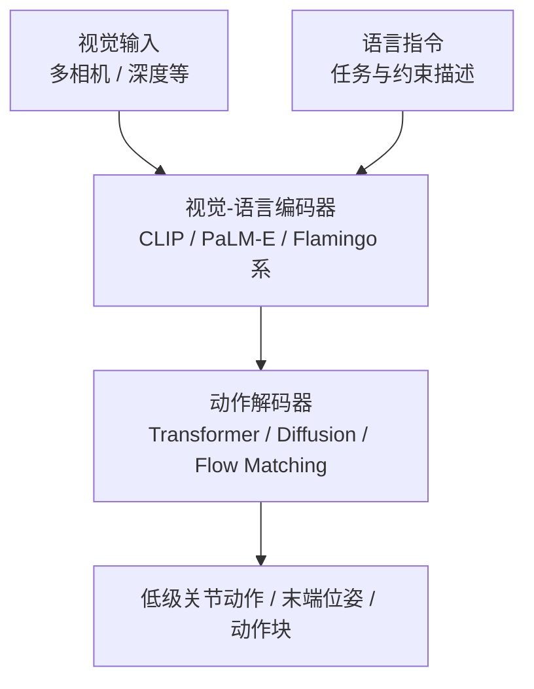

# Foundation Policy（基础策略模型）

## 一句话定义

**Foundation Policy（基础策略模型）**：在大规模多任务、多机器人形态演示数据上预训练的通用机器人策略，通过"规模化预训练 + 任务微调"范式，将跨任务泛化能力迁移到新场景——是 NLP 基础模型范式向物理控制的延伸。

## 英文缩写速查

| 缩写 | 英文全称 | 简要说明 |
|------|----------|----------|
| FP | Foundation Policy | 跨任务/跨场景可复用的通用策略抽象 |
| VLA | Vision-Language-Action | 操作域最典型的 foundation policy 实例 |
| IL | Imitation Learning | 大规模演示预训练的主要路线之一 |
| RL | Reinforcement Learning | 与 IL 组合或后训练提升鲁棒性 |
| BC | Behavior Cloning | 监督式模仿的基础范式 |

## 为什么重要

> "规模化数据 + Transformer 架构 → 跨任务泛化" — RT-1 的核心命题，开创了机器人基础模型方向。

传统机器人策略学习每个任务独立训练，无法复用跨任务知识。基础策略模型试图从根本上解决这一问题：训练一次，泛化到数百乃至数千个任务。

跨任务泛化仍受 **本体动作空间、传感闭环与安全边界** 约束——「通用策略」不等于脱离硬件；见 [具身大模型与本体协同设计](./embodied-foundation-model-hardware-codesign.md)。

---

## 代表模型

### RT-1（Brohan et al., 2022）
- **数据**：130k+ 真实机器人操作演示，覆盖 700+ 技能
- **架构**：Transformer + EfficientNet 视觉编码器，直接输出 token 化动作
- **意义**：首个在大规模真实数据上证明泛化能力的机器人 Transformer 模型

### RT-2（Brohan et al., 2023）
- **架构**：VLA（Vision-Language-Action）模型；基于 PaLM-E 视觉-语言大模型微调
- **创新**：Web 知识（语言常识、视觉语义）直接迁移到物理控制
- **结果**：泛化能力显著超过 RT-1；可通过自然语言指令驱动低级动作

### π₀（Black et al., 2024）
- **架构**：VLA + Flow Matching 连续动作生成
- **意义**：Physical Intelligence 核心模型；统一了 IL、RL 和 VLA 三类方法
- **优势**：Flow Matching 生成连续动作分布，质量优于 Transformer 直接回归；适合人形操作任务

### π₀.₇（Physical Intelligence, 2026）
- **架构**：在 **π₀.₆-MEM** 一脉上保留历史视觉与 flow 动作头，引入**子任务语言、片段元数据、控制模态标签与视觉子目标**等到提示中；训练时随机 dropout 各条件，推理可接世界模型子目标与 **CFG** 偏好高质量/高速度模式
- **数据**：跨形态真机演示、人视频、网络辅助任务、开源机器人数据，以及大量自主评测与 **RL 专精（π*₀.₆）** rollout；用元数据吸收次优轨迹而非被其主导
- **意义**：把「通才 VLA」与「专精 RL 策略」用**条件蒸馏**接到同一 checkpoint，并在官方实验中强调**组合任务指令**与**跨本体零样本**等泛化轴；详情见 [π₀.₇ 方法页](../methods/pi07-policy.md)

### Perceptron Isaac 0.5（Perceptron, 2026-08）
- **架构**：**36B** Qwen-family 稀疏骨干 + **null-expert** 路由（期望 **2.5B** 激活）；**FAST** 离散与 **Flow/DiT** 连续双动作头读同一表示；专有未来 percept 自监督把无动作视频接到控制
- **数据**：**1M h** 通用视频 + ego/UMI + **100k h** 机器人（**35+** 本体）；报告视频小时把 τ=2.50 所需 teleop 从约 **5.9k h → 28 h**（**210×**）
- **开放边界：** 代码 Apache 2.0 + LeRobot `perceptron_isaac`；Hub 权重入库日 **COMING SOON**；**不是** NVIDIA Isaac 平台。详见 [Perceptron Isaac 0.5](../entities/perceptron-isaac-05.md)

### StarVLA（Ye et al., 2026）
- **架构**：Qwen3-VL 底座 + 极简 MLP 动作头
- **意义**：证明强 VLM 能力足以支撑高性能控制，打破了对复杂生成式动作头的依赖，成功率在 LIBERO 基准达到 98.8%

### GR00T（NVIDIA, 2024-2026）
- **架构**：VLA 基础策略 + [MotionBricks](../methods/motionbricks.md) 生成式 WBC；公开演示亦将 VLA（如 **GR00T N1.5**）与规模化 **motion tracking** 执行器 [SONIC](../methods/sonic-motion-tracking.md) 经 **统一控制 / token 接口** 串联，形成「高层推理 + 低层全身跟踪」栈（以 NVIDIA 项目页与论文为准）。工程入口与训练/部署文档集中在 [GR00T-WholeBodyControl](../entities/gr00t-wholebodycontrol.md) 官方仓库。
- **意义**：实现人形机器人的通用技能习得与高动态执行，打通了从语言指令到物理关节力矩的完整闭环

### Octo（2023）
- **数据**：Open X-Embodiment 800k 演示，跨 22 种机器人形态
- **意义**：第一个开源通用机器人策略；多形态预训练 + fine-tune 范式被广泛采用

### Generalist GEN 系列（商业对照，闭源）
- **叙事：** GEN-0 主张机器人 scaling laws；GEN-1 强调 mastery 与半百万小时级交互数据；2026-07「千手」把多样性轴推到 **~9k 末端/工具变体**；2026-08 **GEN-1.5** 宣称 **physical prompting** one-shot（~59%）与 **1–10 步** 微调 few-shot（~83%，10 任务自报）（见 [Generalist AI](../entities/generalist-ai-robotics.md)、[GEN-1 千手](../entities/generalist-gen1-thousand-hands.md)、[GEN-1.5](../entities/generalist-gen15-one-shot.md)）
- **定位：** 与 Octo / OXE **开源可复现** 路线对照的产业样本；**确认未开源**，不可替代开源基线做实验

### Skild S1（商业对照，闭源 ICL）
- **叙事：** 预训练目的是 **in-context learning**：任务用 **视频示范** 指定，同一权重无后训练执行 **未见、最长约 10 分钟** 操作；内部对照 100k 小时档未见任务 ICL **66%** vs 语言 VLA **9%**（见 [S1](../entities/skild-s1.md)、[Skild AI](../entities/skild-ai.md)）
- **定位：** 与 GEN-1.5「规模涌现、短程 physical prompt」对照的 **显式 ICL 预训练** 样本；同样 **确认未开源**
- **开源短程对照：** [HOST](../entities/paper-host-one-shot-human-video.md) 把 one-shot 做成进度对齐 + 自接地级联（八任务 62%），不是百千小时涌现叙事

### HOST（学术对照，已开源 one-shot）
- **叙事：** 单条人视频、不改权重、平均 29 秒；技能停在外部视频以免覆盖已掌握技能（见 [HOST](../entities/paper-host-one-shot-human-video.md)）
- **开放边界：** GitHub + HF 权重；论文规模真机数据未发布

### Gemini Robotics 2（Google DeepMind，闭源 VLA + 可调用 ER）
- **叙事：** 2026-07 发布 **VLA 2 / ER 2 / On-Device 2**：全身人形控制、多指/夹爪灵巧、多机协作、端侧数小时跨本体适配（见 [Gemini Robotics](../entities/gemini-robotics.md)）
- **开放边界：** ER 2 为 API public preview + [`robotics-samples`](https://github.com/google-gemini/robotics-samples)；**VLA/On-Device 权重未开源**——对照实验仍应优先 Octo / OpenVLA / π 等可复现栈

### TD-MPC2（Hansen et al., 2024）
- **架构**：隐空间世界模型 + Temporal Difference Learning
- **创新**：单一模型在 80+ 任务上统一训练；model-based RL 在样本效率上的突破

### Behavior Foundation Model（BFM，概念与综述）

- **概念页**：[Behavior Foundation Model](./behavior-foundation-model.md) — Yuan 等 TPAMI 2025 综述的三线预训练（goal-conditioned / intrinsic / forward-backward）与两线适应（微调 / 层次化）；配套 [awesome-bfm-papers](https://github.com/friedrichyuan/awesome-bfm-papers) 活索引
- **与下文「BFM 单篇」关系**：本节下列 **Zeng et al. 2025** 是 goal-conditioned + 生成式路线的一条 **代表实现**；同名族另有 BFM-Zero（FB 表示）等，见概念页 taxonomy

### BFM（Behavior Foundation Model for Humanoid Robots，Zeng et al., 2025）
- **架构**：**CVAE 生成式策略** + **位级二值掩码** 统一根/关节/关键点等控制接口；**掩码在线蒸馏** 从特权 PPO proxy agent 学习；推理时支持 **潜空间线性插值** 与 **classifier-free 风格调制**
- **定位**：与 VLA 操作向路线互补的 **humanoid 低层全身控制基础模型**——一个 checkpoint 覆盖 motion tracking / VR 遥操作 / locomotion 等多接口，无需为每种 mode 重写 reward
- **意义**：把 [Whole-Body Control](./whole-body-control.md) 重新表述为「**生成把机器人引向目标状态的合适行为**」；新技能（如 Side Salto）通过 **冻结主干 + 残差解码器** 少样本获取——详见 [BFM 论文实体](../entities/paper-behavior-foundation-model-humanoid.md)

### HoloMotion-1（Horizon Robotics, 2026）
- **架构**：**稀疏 MoE Transformer** 跟踪策略 + **KV-cache** 推理；**序列级 PPO** 训练长运动片段；观测含 **短 horizon 参考前瞻**
- **数据**：**混合大规模运动语料**——**野外视频重建运动**主导 **行为多样性**，**MoCap + 室内自采** 补 **高保真与部署覆盖**（与纯 MoCap scaling 路线对照阅读）
- **定位**：面向 **零样本全身运动跟踪** 的 **运动基础模型** 工程栈；与 [SONIC](../methods/sonic-motion-tracking.md)（MoCap-centric scaling）、[BFM](../entities/paper-behavior-foundation-model-humanoid.md)（生成式多接口 WBC）形成 **数据—结构—接口** 三角对照
- **入口**：[HoloMotion 实体页](../entities/holomotion.md)（代码 / HF / Docker / arXiv:2605.15336 一手索引）

---

## 核心架构范式

**VLA（Vision-Language-Action）** 是当前主流架构：语言作为任务规范，视觉作为状态输入，输出低级机器人控制指令。

---

## 与传统方法的对比

| 维度 | 传统 BC / RL | Foundation Policy |
|------|------------|-------------------|
| 训练数据 | 单任务演示（百~千条） | 多任务大规模（10万~百万条） |
| 泛化方式 | 任务特定 | 零样本 / 少样本迁移 |
| 新任务适应 | 重新训练 | Fine-tune 或 Prompt |
| 计算成本 | 低 | 极高（预训练阶段） |
| 控制精度 | 高（专用策略） | 中（通用策略代价） |

---

## 当前局限

1. **数据规模是瓶颈**：RT-1 需要 130k+ 真实演示；数据采集成本极高，异构性大
2. **Locomotion 基础模型仍在成形**：操作侧 VLA/通才策略更成熟；腿足侧已有 URMA 等多具身 locomotion 与 [Shape Your Body](../entities/paper-shape-your-body-value-gradient-design.md) 式「价值函数作设计 surrogate」，但跨地形真机通才仍弱于专用策略
3. **低级控制精度不足**：通用模型在精细操作（螺丝拧紧、接线）上仍弱于专用策略
4. **实时性**：大模型推理延迟与机器人控制高频需求（100Hz+）之间仍有矛盾

---

## 关联页面
- [Query：接触力旋量闭环知识链](../queries/contact-wrench-closed-loop.md) — 通用策略下游的接触丰富操作，依赖本链的力旋量闭环执行保证
- [机器人 In-Context Learning](./robot-in-context-learning.md) — 部署期示范归纳 vs 记忆 vs metadata 的 taxonomy
- [模仿学习（Imitation Learning）](../methods/imitation-learning.md)
- [Diffusion Policy](../methods/diffusion-policy.md)
- [VLA](../methods/vla.md)
- [RynnBrain 1.1](../entities/paper-rynnbrain-1-1.md) — 具身预训练脑作 VLA 初始化；跨本体统一动作空间案例
- [ACE-Brain-0.5](../entities/paper-ace-brain-0-5.md) — 五功能统一具身脑（感知–规划–交互–监控–自改进）+ SSR+
- [π₀.₇（Pi-zero 0.7）通才 VLA](../methods/pi07-policy.md)
- [Perceptron Isaac 0.5](../entities/perceptron-isaac-05.md) — 36B 稀疏开源通才；视频置换 teleop
- [GR00T-WholeBodyControl（实体）](../entities/gr00t-wholebodycontrol.md)
- [Foundation Policy for Humanoids（Query 实践指南）](../queries/foundation-policy-for-humanoids.md)
- [机器人学习「三个时代」叙事与一手文献（Query）](../queries/robot-learning-three-eras-narrative.md)
- [Policy Optimization](../methods/policy-optimization.md)
- [Model-Based RL](../methods/model-based-rl.md)
- [Loco-Manipulation](../tasks/loco-manipulation.md)
- [Locomotion 任务](../tasks/locomotion.md)
- [操作任务（Manipulation）](../tasks/manipulation.md)
- [Behavior Foundation Model（BFM 概念）](./behavior-foundation-model.md) — 人形 WBC 行为基础模型 taxonomy 与 VLA 分工
- [BFM（Behavior Foundation Model 论文实体）](../entities/paper-behavior-foundation-model-humanoid.md) — humanoid WBC 系基础策略（CVAE + 掩码控制接口）
- [具身大模型分类学选型闭环（知识链枢纽）](../overview/hub-embodied-foundation-model.md) — 基础策略是五层闭环的 VLA 动作执行层基座
- [Generalist AI / GEN-1 千手](../entities/generalist-gen1-thousand-hands.md) — 闭源通才策略的多末端扩展叙事
- [S1 / Skild AI](../entities/skild-s1.md) — 闭源通才策略的显式视频 ICL 叙事
- [HOST](../entities/paper-host-one-shot-human-video.md) — 开源单视频 one-shot；不是百千小时涌现叙事
- [Gemini Robotics](../entities/gemini-robotics.md) — DeepMind 闭源全身 VLA + 可调用 ER 2

## 参考来源
- [rl_foundation_models.md](../../sources/papers/rl_foundation_models.md)
- [generalist_thousand_hands.md](../../sources/blogs/generalist_thousand_hands.md) — GEN-1 跨末端「千手」博客归档
- [gemini_robotics_2_whole_body.md](../../sources/blogs/gemini_robotics_2_whole_body.md) — Gemini Robotics 2 全身智能发布归档
- [sources/papers/bfm_survey_arxiv_2506_20487.md](../../sources/papers/bfm_survey_arxiv_2506_20487.md) — BFM 综述 taxonomy（arXiv:2506.20487）
- [sources/repos/awesome_bfm_papers.md](../../sources/repos/awesome_bfm_papers.md) — awesome-bfm-papers 精选列表
- [sources/papers/bfm_humanoid_arxiv_2509_13780.md](../../sources/papers/bfm_humanoid_arxiv_2509_13780.md) — BFM (arXiv:2509.13780) ingest 摘要
- [sources/papers/pi07.md](../../sources/papers/pi07.md) — π₀.₇ 论文与博客归档（2026）
- [imitation_learning.md](../../sources/papers/imitation_learning.md)
- [sources/papers/star_vla.md](../../sources/papers/star_vla.md)
- [sources/repos/gr00t_wholebodycontrol.md](../../sources/repos/gr00t_wholebodycontrol.md) — GR00T WBC 官方单仓（解耦 WBC、GEAR-SONIC、MotionBricks 与 VLA 教程文档）
- [wechat_embodied_heart_robot_icl_gen15_survey_2026-08-25.md](../../sources/blogs/wechat_embodied_heart_robot_icl_gen15_survey_2026-08-25.md) — 机器人 ICL taxonomy 综述
- [skild_s1_in_context_learning.md](../../sources/blogs/skild_s1_in_context_learning.md) — S1 视频 ICL 产业样本
- [机器人论文阅读笔记：GR00T N1](https://imchong.github.io/Robot_Learning_Paper_Notebooks/papers/03_High_Impact_Selection/GR00T_N1_Humanoid_Foundation_Model/GR00T_N1_Humanoid_Foundation_Model.html)
