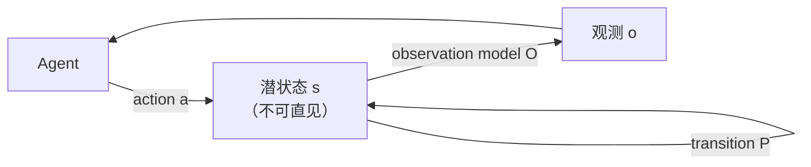

# 世界模型功能分类（Renderer / Simulator / Planner）

**世界模型功能分类** 是 Fei-Fei Li 与 World Labs（2026-06）提出的消歧：不按架构家族点名，而按系统在 **agent–环境环** 里 **输出哪一段**——像素观测、可计算状态，还是动作。

## 一句话定义

> **Renderer 给人看世界，Simulator 给人与程序算世界，Planner 让 agent 在世界里做事；三者是同一条 POMDP 环的投影，不是三种互斥产品。**

## 英文缩写速查

| 缩写 | 英文全称 | 简要说明 |
|------|----------|----------|
| POMDP | Partially Observable Markov Decision Process | 分类所依附的闭环：动作改状态，agent 只见观测 |
| WM | World Model | 过载词；本页按输出功能拆，不按品牌拆 |
| WAM | World Action Model | Planner 侧、且通常横跨 Simulator 的联合建模范式 |
| VLA | Vision-Language-Action | 文内归入 Planner 尝试；多数实现不显式滚状态 |
| 3DGS | 3D Gaussian Splatting | Marble 一类 Renderer↔Simulator 交界的外观表征 |

## 为什么重要

- **词已被用坏。** 文生视频、可玩语言模型、燃烧物理引擎都自称 world model；选型时若不问「输出是像素、状态还是动作」，会把创作者产品和闭环策略评到同一轴上。
- **仿真是枢纽，却最少被讨论。** Renderer 商业最成熟，Planner demo 最吸睛；缺几何/物性/动力学，前两者都不可信。
- **和本库已有 taxonomy 正交。** [五大具身模型](../comparisons/vlm-vln-vla-vlx-world-model-taxonomy.md) 按 VL* 的 I/O 家族分；[训练闭环三线](../overview/robot-world-models-training-loop-taxonomy.md) 按机器人学习接口分。本页问的是 **POMDP 环上吐出什么**。
- **后续定义文补了一刀。** [上海人工智能实验室 2607.06401](../entities/paper-sa-2607-06401-a-definition-and-roadmap-for-world-models.md) 承认功能分类有用，但指出它分类的是 **解码**，不是内部压缩表征。

## 核心原理

### POMDP 环：分类之前先画图

- **State** 是物理/机器人意义上的完整瞬时描述（物体、位姿、速度、属性），不是化学相态。
- Agent 永远只拿到观测：光子、传感器读数、视频帧。
- 词源：Craik 1943 的 small-scale models；现代技术含义来自这条环，而不是来自某家视频产品。

### 三类功能

| 功能 | 输出 | 合同 | 反面/对偶 | 文内例子 |
|------|------|------|-----------|----------|
| **Renderer** | 观测（多为像素） | 视觉保真；不必显式 3D | 俯视城市很美，开进去建筑散架 | 文生视频；Genie 3；World Labs RTFM |
| **Simulator** | 状态 | 几何站得住、物理守牛顿、动力学可计算 | 好看但自交/错尺度的生成网格 | 解析引擎；可交互训练场 |
| **Planner** | 动作 | 观测 + 目标 → 下一步 | 实验室短时域 demo ≠ 厨房级部署 | VLA、MBRL、[WAM](./world-action-models.md) |

Renderer 吃动作吐观测；Planner 吃观测吐动作。中间缺 **状态**，两边都无法互相推导。

### 仿真为什么是枢纽

语言是世界的抽象，像素是世界的投影，几何/物理/动力学才是世界本身。掌握仿真，才能向下投影成给人看的像素、向上投影成给 agent 的动作后果。只掌握渲染或只掌握规划，做不到另一侧。

开放问题也集中在这里：带物性标注的 3D 远少于互联网视频；[Sim2Real](./sim2real.md) 仍在；生成几何可以「看起来对」却让物理无意义；刚体/软体/流体/布料耦合仍然极贵。

### 边界正在塌缩

同一套「杯子怎么搁在桌上」的知识，原则上应能从任意角度渲染、推一把看结果、规划手去拿。当前塌缩已经发生：

- 预训练视频 Renderer 被当成 **joint world-and-action** 骨干（Renderer → Planner）。
- [Marble](../entities/marble-world-model.md) 同一模型出 splat 与 collider（Renderer → Simulator）；collider 仍不是完整学习动力学。
- 逻辑终点：一个基础模型按下游消费者切换输出模态。张力是数据不均（视频多、可执行 3D 与机器人轨迹少）以及「好看」与「可规划」互相牺牲。

### 第二轴：功能 × 架构（定义文补充）

功能分类不回答「内部状态存在哪种底物上」。[定义与路线图](../entities/paper-sa-2607-06401-a-definition-and-roadmap-for-world-models.md) 加了表征轴：observation-level / latent-space / 3D-structured。同一产品可占多个格子——[Cosmos 3](../entities/cosmos-3.md) 是共享骨干上的多种 I/O 配置；WAM 是横跨 Planner+Simulator 的功能范式，**不是第四实现列**。

## 工程实践

| 你在选什么 | 先问 | 本页读法 |
|------------|------|----------|
| 文生视频 / 漫游 3D | 输出给谁看？要不要被物理引擎消费？ | 默认 **Renderer**；有 collider / 占用 / 可查询几何才跨到 Simulator |
| 解析或学习仿真 | 状态能否被策略或规划器计算？ | **Simulator**；视觉只是一种解码 |
| VLA / WAM / MBRL | 动作是否由未来状态预测约束？ | **Planner**；WAM 还要求预测与动作耦合，见 [WAM](./world-action-models.md) |
| 「统一世界模型」宣传 | 三种输出是否来自 **同一内部状态**？ | 否则只是三个头绑在一个品牌上 |
| 评测 | 看保真、物理精度，还是闭环成功率？ | 三套合同不要混读；见定义文评测节 |

调试指标按合同选：Renderer 用感知/时序一致性；Simulator 用约束满足、接触、尺度、可查询性；Planner 用任务成功、长程稳定、干预是否被执行。

## 局限与风险

- **功能标签 ≠ 内部模型。** 把 Sora 叫 Renderer 只说明它对外吐像素，不说明它有没有可用的隐状态。
- **Marble 不是具身仿真器。** World Labs 自己把它写成仿真方向的第一章；[产品页](../entities/marble-world-model.md) 仍强调 collider ≠ sim-ready。
- **Planner demo 的诚实缺口。** 窄物体集、短时域、实验室布置，不能外推到厨房/仓/手术室。
- **生成式仿真的静默失败。** 自交、错尺度、错质量会在物理求解里爆掉，像素指标发现不了。
- **不要把本页当成第五套「具身模型缩写」。** 它不替代 VLM/VLA，也不替代训练闭环三线。

## 关联页面

- [世界模型定义与路线图（上海人工智能实验室）](../entities/paper-sa-2607-06401-a-definition-and-roadmap-for-world-models.md) — 压缩定义、二维 taxonomy、倒金字塔与三阶段路线
- [Generative World Models](../methods/generative-world-models.md) — 像素/视频生成式仿真工具箱；多数条目落在 Renderer 或 observation-level
- [World Action Models（WAM）](./world-action-models.md) — Planner 侧联合建模；定义文不把它列为第四架构
- [机器人世界模型：训练闭环与三线 taxonomy](../overview/robot-world-models-training-loop-taxonomy.md) — 按「预测能否进入学习/评估/决策」分线
- [五大具身模型：VLM / VLN / VLA / VLX / WM](../comparisons/vlm-vln-vla-vlx-world-model-taxonomy.md) — 按 VL* I/O 家族分；与本页正交
- [World Labs](../entities/world-labs.md) / [Marble](../entities/marble-world-model.md) — 功能分类的提出方与 Renderer↔Simulator 产品样本
- [Video-as-Simulation](./video-as-simulation.md) — 把视频预测器当引擎；功能轴上偏 Renderer，动作条件后才靠近 Simulator
- [VLA](../methods/vla.md) / [Model-Based RL](../methods/model-based-rl.md) — Planner 的两条实现传统
- [Cosmos 3](../entities/cosmos-3.md) — 同骨干切换 Renderer / Simulator / Policy 配置

## 参考来源

- [World Labs / Fei-Fei：功能分类博客归档](../../sources/blogs/worldlabs_functional_taxonomy_world_models.md)
- [A Definition and Roadmap for World Models 归档](../../sources/papers/world_model_definition_roadmap_arxiv_2607_06401.md)
- [Marble GA 博客归档](../../sources/blogs/worldlabs_marble_world_model.md)

## 推荐继续阅读

- Fei-Fei Li, *A Functional Taxonomy of World Models* — [World Labs 博客](https://www.worldlabs.ai/blog/taxonomy-of-world-models) · [Substack](https://drfeifei.substack.com/p/a-functional-taxonomy-of-world-models)
- Physical Intelligence Team, Shanghai AI Lab, *A Definition and Roadmap for World Models* — [arXiv:2607.06401](https://arxiv.org/abs/2607.06401)
