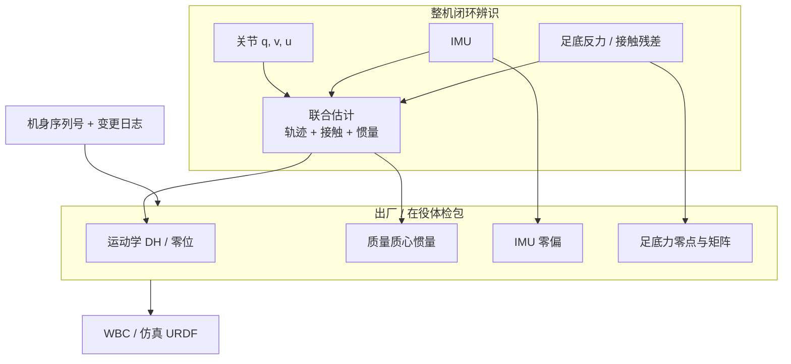

# 人形整机闭环惯量标定（出厂体检）

量产人形从「能演示」到「能稳定干活」，先要一份与身体一致的参数报告：运动学、惯量、IMU 零偏、足底力。工业臂那套**拆关节上台架**覆盖不了分布式质量与终身漂移；足式闭环会把上游误差放大进 [WBC](./whole-body-control.md)。

## 一句话定义

> **用整机行为（关节力矩 + IMU + 足底反力）倒推身体参数，并在换电池 / 加负载 / 维修后重跑**——标定误差是站稳走稳的地板，大模型只在上限附近发力。

## 英文缩写速查

| 缩写 | 英文全称 | 简要说明 |
|------|----------|----------|
| SysID | System Identification | 用实验数据估计动力学 / 传感器参数 |
| WBC | Whole-Body Control | 全身任务约束下求关节力矩；惯量错则力算错 |
| IMU | Inertial Measurement Unit | 陀螺 / 加速度计；零偏会漂，不能当出厂常数 |
| GRF | Ground Reaction Force | 足底反力；零点与标定矩阵错则接触误判 |
| MAP | Maximum A Posteriori | PRIME 把轨迹、接触力、惯量写成联合后验 |
| CAD | Computer-Aided Design | 给出连杆惯量初值，不是装机后的真值 |

## 为什么重要

发布会盯自由度、算力、峰值扭矩，很少问机器是否知道自己的质量、质心和腿转动惯量。控制侧「以为迈了 30 cm / 重心在左脚」必须和物理世界一致；错位后上层策略建在流沙上。

几何/URDF 层如何被放大，见 [物理保真度分层](./physics-fidelity-sim2real-gap.md)。

雅可比与惯量如何把力映错方向，见 [接触力旋量闭环](../queries/contact-wrench-closed-loop.md)。

量产还多两道约束：**每台可追踪（机身序列号）**、**终身可更新**。标定一次用到底，等于带着过期体检报告上岗。

## 核心原理

### 四张出厂单子

| 参数 | 回答 | 不准的后果 | 本库落点 |
|------|------|------------|----------|
| 运动学 | 关节角 → 足端位置 | 落脚点偏差、步态失稳 | [浮动基运动学 / FK](./floating-base-dynamics.md) |
| 惯量 | 腿/整机质量、质心、转动惯量 | WBC 力算错、能耗暴增 | [连杆 vs 转子惯量](./robot-link-and-rotor-inertia.md)、[SysID](./system-identification.md) |
| IMU 零偏 | 静止时读数是否为 0 | 姿态漂移 | [状态估计](./state-estimation.md)、[KILVO](../entities/paper-kilvo.md) |
| 足底力 | 传感器零点与标定矩阵 | 接触力误判 | [接触估计](./contact-estimation.md) |

四类参数不在同一辨识实验里一次求完，但量产验收要把它们当成**同一份体检包**：缺一张，闭环就会在另一张上「补偿」出假象。

### 为何单关节台架不够

工业臂：固定底座、负载恒定、工况单一，台架回归可行。人形三条「拆不动」：

1. **质量分布式** — 电池、外壳、线缆、工具随型号与负载变；空关节台架惯量 ≠ 整机真实惯量。关节层 \(I_a\) 仍要按 [关节执行器参数辨识](../methods/joint-actuator-parameter-identification.md) 做，但不能替代整机刚体 10 参数。
2. **惯量会漂移** — 换电池、加夹具、维修拆装都会改质量分布。
3. **误差被闭环放大** — 足端力、IMU、关节力矩互相喂；上游小偏差经 WBC 迭代放大。站立辨识时地面力矩还会吞掉惯性，见 [实验设计](../methods/sim2real-joint-sysid-experiment-design.md) 的接触污染条。

### 闭环辨识：用行为倒推身体

学术侧可运行实例是 [PRIME](../entities/prime-system-id.md)（RSS 2026）：MAP 联合估摩擦接触力与物理一致惯量，可微接触当硬约束，G1 / Go2 已验证，**已开源**。传感器零偏在线则落在滤波状态里，[KILVO](../entities/paper-kilvo.md) 把 IMU 零偏当 ESIKF 状态而非常数——主贡献仍是人形多传感器里程计，不是惯量辨识替代方案。

### 不要把「免标定」论文误读成惯量闭环

公众号把 Calib3R、CAL²M 并置为「免标定才是最高门槛」。二者问题轴不同，**本库不升格为惯量节点**：

| 工作 | 实际问题 | 与本页关系 |
|------|----------|------------|
| Calib3R（arXiv:2509.08813） | 无标定板的相机–机器人外参 + 度量重建 | 外参 / 场景尺度；**不估** 连杆惯量 |
| CAL²M（arXiv:2604.14795） | 免预标定的公里级视觉几何 SLAM | 内参 / 尺度；**不估** 全身质量分布 |

「算法自己完成标定」成立，但不能跳过本页的四张单子。

## 工程实践

| 步骤 | 做什么 | 不要 |
|------|--------|------|
| 1. 分清参数层 | 连杆 10 参数、转子 \(I_a\)、摩擦、IMU 零偏、力传感矩阵分开记账 | 把台架空关节惯量写进 URDF 质量 |
| 2. 关节层先可辨识 | 悬空 / 低增益激励，按 [实验设计](../methods/sim2real-joint-sysid-experiment-design.md) 拆延迟↔惯量 | 站在地上一次 OLS 估全参数 |
| 3. 整机接触段用联合估计 | PRIME 一类：运动学 + 执行器命令 → 轨迹 / 接触 / 惯量 | 先 EKF 出运动学再假装接触力已知 |
| 4. 绑定机身 | 序列号 + 配置变更（电池、夹具、维修）触发重辨识 | 产线一份 URDF 烧进全部机 |
| 5. 写回控制与仿真 | 惯量进 \(M(q)\)、零偏进估计器、力矩阵进接触 | 只把数字留在标定报告里 |

调试信号：重力项抽检（改 \(I_a\) 不应大改 \(g(q)\)）；无外载静立时 IMU 零偏应接近 0；足底力在腾空相应接近 0；WBC 跟踪误差与能耗在负载变更后应能被一次重辨识拉回。

## 局限与风险

- **公众号不是标准条文。** 文内把 ISO 13482 读成「强制关注 IMU / 编码器 / 重量分布」；该标准是个人护理机器人安全，本库不把它写成已核实的出厂惯量强制项。
- **闭环辨识不是免激励。** PRIME 仍要足够丰富的接触运动学日志；舞蹈 / 步行序列不是任意静止姿态。
- **测力台不是产线标配。** PRIME 强调可在无力传感时重建接触力，但产线仍可能用简易力板做抽检；二者不要混成「已经免传感器」。
- **Calib3R / CAL²M 不能替代本页。** 相机外参准了，质量分布仍可能是错的。

## 关联页面

- [System Identification](./system-identification.md) — 更宽的 SysID 层级；本页是人形量产整机这一刀
- [关节执行器参数辨识](../methods/joint-actuator-parameter-identification.md) — 台架 / 悬空估 \(I_a\) 与摩擦，覆盖不了分布式整机质量
- [连杆惯量与转子惯量](./robot-link-and-rotor-inertia.md) — URDF 连杆 vs armature，写错位置会污染重力项
- [PRIME](../entities/prime-system-id.md) — 接触隐式 MAP 惯量辨识（RSS 2026，已开源）
- [KILVO](../entities/paper-kilvo.md) — 人形 ESIKF；零偏在线是状态而非出厂常数
- [Sim2Real 闭环误差分层](../queries/sim2real-closed-loop-engineering.md) — 辨识发生在训练前也发生在部署后
- [接触力旋量闭环](../queries/contact-wrench-closed-loop.md) — 惯量 / 雅可比不准则力方向算错
- [物理保真度 ↔ Sim2Real Gap](./physics-fidelity-sim2real-gap.md) — 几何/惯量层误差被上层放大

## 参考来源

- [人形智研院公众号：出厂体检 / 惯量必须闭环](../../sources/blogs/wechat_humanoid_zhiyan_inertia_closedloop_calib_2026-08-26.md)（<https://mp.weixin.qq.com/s/sl06FnCPmUh6GilJuK-xEQ>）
- [PRIME 论文摘录](../../sources/papers/prime_arxiv_2605_17681.md)（arXiv:2605.17681）
- [KILVO 论文摘录](../../sources/papers/kilvo_arxiv_2608_05647.md)（arXiv:2608.05647）

## 推荐继续阅读

- PRIME 项目页：<https://jkangkjr.github.io/PRIME-project/>
- well-robotics/PRIME：<https://github.com/well-robotics/PRIME>
- 原始公众号：<https://mp.weixin.qq.com/s/sl06FnCPmUh6GilJuK-xEQ>
