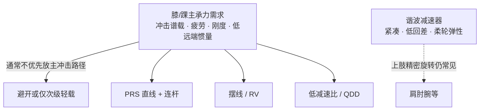

# 人形膝/腿主承力链为何通常避开谐波减速器

## 一句话定义

**谐波减速器**擅长高精度、小体积、低回差的旋转传动，但人形**膝、踝等反复落地冲击的主承力关节**优先要解决冲击载荷谱、高周疲劳、动态刚度、反驱与低远端惯量——两套需求并不完全同向，因此工程上通常**不愿把谐波放在主冲击力流上**，而非「腿部绝对不能用谐波」。

## 英文缩写速查

| 缩写 | 英文全称 | 简要说明 |
|------|----------|----------|
| HD | Harmonic Drive（strain-wave gear） | 谐波/应变波减速器：柔轮–刚轮–波发生器 |
| PRS | Planetary Roller Screw | 行星滚柱丝杠，膝/踝直线执行器常见传动 |
| RV | Rotary Vector / cycloidal reducer | 摆线/RV 类高刚度旋转减速，抗冲击强于谐波 |
| QDD | Quasi-Direct Drive | 低减速比准直驱，偏反驱透明度与力控手感 |
| GRF | Ground Reaction Force | 地面反作用力，腿部冲击谱载的主来源 |

## 为什么重要

- **选型误区高频**：把「上肢成熟谐波方案」直接搬到膝，会在寿命、脚感与惯量上踩坑；先分清臂（精密定位）与腿（冲击动力结构）的服役工况。
- **解释公开架构趋同**：重载通用人形常见「肩腕/部分髋旋转用谐波 + 膝踝直线滚柱」——见 [Actuator 102 · 旋转-直线分离](../overview/humanoid-actuator-102-split-architecture.md)；本页补「膝侧为何避开谐波」的判据层。
- **给控制与 Sim2Real 留接口意识**：传动链等效刚度、反驱与远端惯量直接进入 [Locomotion](../tasks/locomotion.md) 落地手感与仿真可信度。

## 核心原理

### 结论边界

不是「绝对不能用」，而是：**主承力、高循环冲击路径上谐波通常不是优先解**；次级、轻载、非主冲击位置，或上肢精密关节，谐波仍很常见。

### 主承力链为何不友好

1. **面对的是冲击载荷谱**：步态、地面硬度、失衡与绊碰产生扭矩尖峰 + 反向 + 高频循环；伤害寿命的往往是谱载放大后的等效工况，而非样本额定扭矩。柔轮薄壁区交变应力与疲劳裂纹扩展常比齿面/轴承更早成边界。
2. **强项即弱点来源**：应变波依赖柔轮持续弹性变形；柔性轴承与局部啮合更怕冲击尖峰；腿部更依赖动态等效刚度与冲击后角位移恢复，谐波在此不占优。
3. **回差不是第一指标**：更致命的是远端堆重抬高摆腿惯量，以及让冲击主力直接穿过精密减速器——健康力流应让结构、连杆、丝杠副、足底顺应等分担冲击。
4. **腿 ≠ 臂**：臂偏路径跟随与定位；腿偏落地、承载、恢复、寿命与热平衡。

### 三条常见替代路线

| 路线 | 主要解决什么 | 典型代价 |
|------|--------------|----------|
| [PRS 直线 + 连杆](./planetary-roller-screw-humanoid-leg-actuation.md) | 高轴向承载、刚度、冲击分散、近端布置减惯量 | 传动链变长；极限跑跳未必占优 |
| 摆线 / RV 旋转 | 高刚度、抗冲击、耐过载 | 体积、重量、成本与制造复杂度 |
| 低减速比 / [QDD](../overview/humanoid-actuator-102-gear-reflected-inertia.md) | 反驱性与力控透明度 | 电机扭矩密度、热管理与控制带宽要求更高 |

### 膝关节需求优先级（实用排序）

1. 真实步态冲击载荷谱耐受  
2. 高周疲劳寿命  
3. 动态刚度与稳定性  
4. 末端惯量尽量小  
5. 反驱、柔顺与热稳定可控  
6. 然后才是体积、回差、装配紧凑度  

## 工程实践

若仍要评估「谐波能否上膝」，至少先做实（而非只看样本扭矩）：

| 检查项 | 做什么 | 读法 |
|--------|--------|------|
| 载荷谱 | 步行、下楼梯、绊碰、紧急制动、单脚支撑等 | 峰值、峰谷反转次数与持续时间 |
| 柔轮疲劳 | 薄壁筒体、齿根过渡区交变应力 | 静强度不够，要寿命裕量 |
| 刚度–控制联调 | 扭转刚度与闭环带宽 | 怕的是发飘/抖，不只是「会不会断」 |
| 热衰减 | 连续步行 0.5–2 h | 温升后输出与效率是否掉崖 |
| 异常过载 | 踩空、脚尖挂碰、落地偏斜 | 高杀伤低概率事件 |

布置层建议与 [机械布局设计](./humanoid-mechanical-layout-design.md) 对齐：电机与重件尽量上移（近髋），再经丝杠/连杆把力送到膝——减惯量、理顺冲击路径、便于过载保护与维护。

公开产品量级示意（第三方文）：约 2 kg 级线性膝模组给出约 8 kN 推力、100 mm 级行程、数百 mm/s 速度——选型仍以厂商曲线与台架为准。

## 局限与风险

- **第三方解读边界**：本文编译自公众号工程叙事，非厂商冻结 BOM；量产方案可能混合谐波次级自由度与直线主承力。
- **勿绝对化「腿禁用谐波」**：轻载旋转轴、非主冲击路径仍可能合理；判据是**是否在主冲击力流上**。
- **寿命公式勿机械套用**：ISO 281 / 6336 等可作为轴承/齿轮类比框架，谐波柔轮疲劳另有专用边界。
- **路线无唯一解**：PRS / RV / QDD 各解不同约束；任务动态等级与供应链成熟度会改排序。

## 关联页面

- [人形腿部行星滚柱丝杠直线驱动（PRS）](./planetary-roller-screw-humanoid-leg-actuation.md) — 膝侧最常见替代路线的机制与权衡
- [Actuator 102 · 旋转-直线分离架构](../overview/humanoid-actuator-102-split-architecture.md) — 上肢谐波 + 膝踝滚柱的产业趋同
- [Hardware 101 · 传动与感知链](../overview/humanoid-hardware-101-actuation-sensing-chain.md) — 谐波 / RV / 行星部件层对照
- [减速与反射惯量](../overview/humanoid-actuator-102-gear-reflected-inertia.md) — 高减速 vs QDD 透明度光谱
- [人形整机机械布局设计](./humanoid-mechanical-layout-design.md) — 近端布置与摆动惯量
- [Locomotion](../tasks/locomotion.md) — 行走冲击与关节接口语境
- [Query：人形硬件怎么选](../queries/humanoid-hardware-selection.md) — 多路线决策入口
- [执行器驱动链选型闭环](../overview/hub-actuator-drive-chain.md) — 传动机构选型落在驱动链①层之上的整链入口
- [人形量产工程能力](./humanoid-mass-production-engineering.md) — 谐波柔轮量产良率、CPK 与工艺定型

## 参考来源

- [人形机器人的腿部和膝关节，为什么通常不用谐波减速器？（微信原文）](https://mp.weixin.qq.com/s/GowJUzbDjWQMcujtUezLGA)
- [wechat_zanehub_humanoid_leg_knee_why_not_harmonic.md（仓库内归档）](../../sources/blogs/wechat_zanehub_humanoid_leg_knee_why_not_harmonic.md)
- [wechat_zanehub_humanoid_mass_production_experience.md（仓库内归档）](../../sources/blogs/wechat_zanehub_humanoid_mass_production_experience.md) — 谐波柔轮量产良率与三大核心件工艺

## 推荐继续阅读

- [Harmonic Drive 应变波传动原理（厂商技术概述）](https://www.harmonicdrive.net/) — 对齐柔轮 / 刚轮 / 波发生器术语（英文）
- 姊妹解读：[特斯拉人形机器人腿部关节为什么选择行星滚柱丝杠？](https://mp.weixin.qq.com/s/webqJRQJREZdABw8bdl68w)
