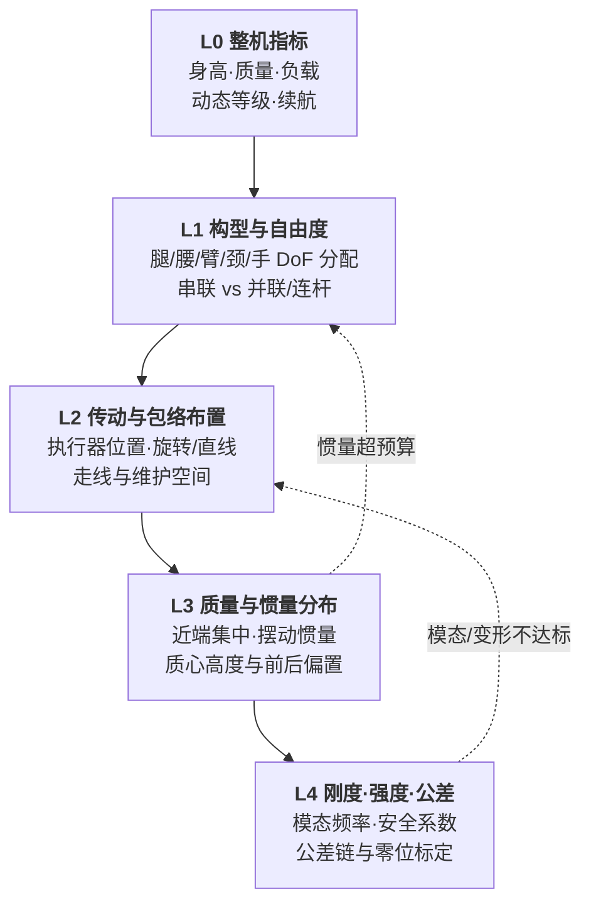

# 人形整机机械布局设计（构型 → 传动布置 → 质量分布 → 刚度与公差）

## 一句话定义

**人形整机机械布局设计**回答：给定任务指标（身高、负载、续航、动态等级），**关节自由度怎么分配、执行器往哪儿放、质量与惯量怎么分布、结构刚度与公差链留多少余量**——它决定了后续控制与 RL 能达到的上限，而不只是「零件会不会断」。

## 英文缩写速查

| 缩写 | 英文全称 | 简要说明 |
|------|----------|----------|
| DoF | Degree of Freedom | 自由度，整机可独立驱动的关节数 |
| CoM | Center of Mass | 质心，本页里主要指整机与摆动腿质心位置 |
| MoI | Moment of Inertia | 转动惯量，摆动腿绕髋轴的惯量是布局核心指标 |
| FEA | Finite Element Analysis | 有限元分析，做静强度/疲劳/模态验证 |
| GD&T | Geometric Dimensioning and Tolerancing | 几何尺寸与公差，控制装配一致性 |
| URDF | Unified Robot Description Format | 机器人模型描述格式，仿真与控制共享的机械真值 |
| CAD | Computer-Aided Design | 三维设计模型，惯量参数的来源 |

## 为什么重要

- **布局是控制难度的上游**：摆动腿惯量、质心高度与踝部质量直接进入 [LIP/ZMP](./lip-zmp.md) 与 [DCM](./capture-point-dcm.md) 的可行域；同一套控制器换个布局，稳定裕度可以差一个量级。
- **质量惩罚螺旋在这里被放大或掐死**：腿远端每加 100 g，都要摆动关节多出力、执行器变重、电池变大——见 [Actuator 102 · 负载与质量螺旋](../overview/humanoid-actuator-102-load-and-mass-spiral.md)。
- **力控带宽被结构模态卡死**：驱动器把力矩环做到 100 Hz 没用，如果连杆最低阶模态就在 80 Hz——[接触力环带宽](./contact-force-loop-bandwidth.md) 的上限常常是机械的，不是控制的。
- **仿真可信度依赖机械真值**：[URDF](./urdf-robot-description.md) 的连杆惯量、[电枢/转子惯量](./robot-link-and-rotor-inertia.md) 若与实物不符，sim2real 会把机械误差当成策略问题反复调。

## 核心原理

布局设计是**自上而下四层决策 + 自下而上两条回馈**：

### L1 自由度分配：先分配能力，再分配零件

主流全尺寸人形落在 **约 25–45 DoF**（不含手指）：单腿 6（髋 3 + 膝 1 + 踝 2）是行走与踝部力矩调节的下限；腰 1–3 决定上体能否解耦朝向；单臂 6–7 决定末端能否绕过奇异位形；颈 2 服务感知视场；手部 6–22 是成本与可靠性的最大变量。**减自由度是最有效的降本杠杆**，但每减一个都要说清放弃了什么动作。

串联关节直观、标定简单；[并联/连杆关节](./humanoid-parallel-joint-kinematics.md) 与 [行星滚柱丝杠直线驱动](./planetary-roller-screw-humanoid-leg-actuation.md) 把执行器移到近端换取低摆动惯量，代价是运动学耦合、雅可比随位形变化、力控路径变长。膝/踝主冲击路径上通常还需避开把谐波放在正面承力链——见 [膝侧避开谐波判据](./humanoid-knee-harmonic-drive-limits.md)。

### L2–L3 布置与质量分布：把重量往「根」上搬

- **近端集中（proximal mass concentration）**：把踝/膝的执行器上移到髋或大腿，用连杆、腱绳或丝杠传力，摆动腿绕髋的惯量可显著下降；这是四足与人形腿部设计的共同取向。
- **质心高度与偏置**：质心越高，倒立摆时间常数越长（对控制更"慢"更好调），但抗扰动位移更大；前后偏置要抵消电池与上体的实际重量，而不是靠控制器长期偏置补偿。
- **质量预算表**是这一层的交付物：按子系统（腿/臂/躯干/电池/计算/外壳/线束）列目标值与实测值，任何超重都要指出从哪个指标扣。

### L4 刚度、强度与公差：三张判据表

| 判据 | 典型做法 | 不达标的表现 |
|------|----------|--------------|
| **静强度** | 最恶劣工况（落地冲击、单腿支撑、跌倒撞击）下 FEA 应力 vs 材料许用，留安全系数 | 连杆屈服、螺栓孔挤压变形 |
| **疲劳** | 行走循环按百万级次数评估交变应力与应力集中 | 数万步后支架裂纹、焊缝开裂 |
| **模态刚度** | 约束状态下求最低阶固有频率，与力矩环/接触环带宽比对 | 力控啸叫、脚底"打颤"、编码器读数含结构振铃 |

公差链决定**装配一致性与标定成本**：连杆长度、关节轴线平行度、零位安装误差会直接进入运动学，一台机器人标好的参数换到下一台就不适用。工程上用 [GD&T](https://www.iso.org/search.html?q=1101)（ISO 1101 / ASME Y14.5）约束关键面，用 ISO 286 / ISO 2768 给配合与未注公差定级，并预留**零位标定基准面或工装孔**，而不是靠"装完再拧"。

## 工程实践

1. **从指标反推布局**：先写出行走速度、单腿峰值力矩、负载与续航，再回推腿部 DoF 与执行器物种（见 [硬件选型 Query](../queries/humanoid-hardware-selection.md)）。
2. **同一份 CAD 出两份产物**：制造图纸 + 导出惯量参数的 [URDF](./urdf-robot-description.md)；两者版本号必须绑定，避免仿真与实物长期不同步。
3. **惯量对账**：整机装配后用摆动实验或 [系统辨识](./system-identification.md) 校核连杆惯量与关节摩擦，把偏差写回模型，而不是塞进控制器增益。
4. **模态实测**：装配态敲击测试（锤击 + 加速度计）取最低阶频率，与 FEA 对账；这一步是决定力控目标带宽的现实依据——方法学与 MAC/阻尼识别见 [机器人结构模态分析](./robot-structural-modal-analysis.md)。
5. **可维护性硬约束**：走线通道、拆装顺序、单关节可换性要在 L2 就画进包络——很多整机是因为"换一个膝关节要拆半边身子"而丧失迭代速度。

关键参数速查：摆动腿惯量、整机质量与质量分配比、质心高度、最低阶模态频率、关键配合公差等级、单关节拆装工时。

## 局限与风险

- **只做静强度不做模态**：最常见的失误；零件不断但力控做不上去。
- **CAD 惯量当真值**：线束、胶、紧固件与实际材料密度偏差会让惯量误差达到 10% 量级，务必实测对账。
- **先选电机再定构型**：容易把货架执行器的形状约束变成整机构型，掉进 [工业执行器陷阱](../overview/humanoid-actuator-102-industrial-actuator-trap.md)。
- **忽略电气与通信的空间需求**：线束弯折半径、屏蔽层走向、总线拓扑顺序都需要机械预留，见 [整机配电架构](./robot-power-distribution-architecture.md) 与 [整机通信架构](./robot-onboard-communication-architecture.md)。
- **公差留得过紧**：加工与装配成本非线性上升，应只在影响运动学与轴系对齐的关键面收紧。

## 关联页面

- [人形整机硬件设计纵深路线](../../roadmap/depth-humanoid-hardware-design.md) — 本页在 Stage 1–2 展开为学习顺序
- [人形并联/连杆关节运动学](./humanoid-parallel-joint-kinematics.md)
- [连杆与转子惯量](./robot-link-and-rotor-inertia.md)
- [URDF 机器人描述](./urdf-robot-description.md)
- [Hardware 101 · 机身与材料](../overview/humanoid-hardware-101-chassis-materials.md)
- [Actuator 102 · 负载与质量螺旋](../overview/humanoid-actuator-102-load-and-mass-spiral.md)
- [整机配电架构](./robot-power-distribution-architecture.md) · [整机通信架构](./robot-onboard-communication-architecture.md)
- [接触力环带宽](./contact-force-loop-bandwidth.md)
- [动力学仿真驱动的人形下肢衍生式设计](../entities/paper-humanoid-leg-generative-design-dynamics.md) — 电液混合 5-DoF 腿 + 仿真工况驱动衍生式减重案例
- [膝/腿主承力链为何通常避开谐波](./humanoid-knee-harmonic-drive-limits.md) — 近端布置与主冲击力流判据
- [机器人结构模态分析](./robot-structural-modal-analysis.md) — 固有频率、振型、阻尼比与试验–仿真对账

## 参考来源

- [Humanoid Hardware 101 微信长文编译](../../sources/blogs/wechat_human_five_humanoid_hardware_101.md) — 机身材料、传动链与部件级 BOM 视角
- [Humanoid 执行器 102 微信长文编译](../../sources/blogs/wechat_human_five_humanoid_actuator_102.md) — 质量惩罚螺旋、旋转-直线分离架构
- [开源人形硬件对比](../entities/open-source-humanoid-hardware.md) — 可查阅真实图纸/BOM 的整机布局样本
- [人形下肢衍生式设计论文归档](../../sources/papers/humanoid_leg_generative_design_hust_j_260645.md) — 跳跃仿真提载荷 → 衍生式连杆轻量化
- [膝侧避开谐波工程解读归档](../../sources/blogs/wechat_zanehub_humanoid_leg_knee_why_not_harmonic.md)
- [结构模态工程解读归档](../../sources/blogs/wechat_zanehub_robot_structural_modal_analysis.md)
- ISO 1101（几何公差）、ISO 286 / ISO 2768（配合与未注公差）— [ISO 标准检索入口](https://www.iso.org/search.html?q=1101)

## 推荐继续阅读

- Wensing et al., *Proprioceptive Actuator Design in the MIT Cheetah*（IEEE T-RO 2017）— 近端集中与低惯量腿部布局的经典论证
- [Humanoid Robots: Modeling and Control 综述](https://arxiv.org/abs/2309.04329) — 从整机机械参数到控制模型的衔接
- [学报原文：动力学仿真驱动的人形下肢衍生式设计](http://xb.hust.edu.cn/thesisDetails#10.13245/j.hust.260645&lang=zh)
