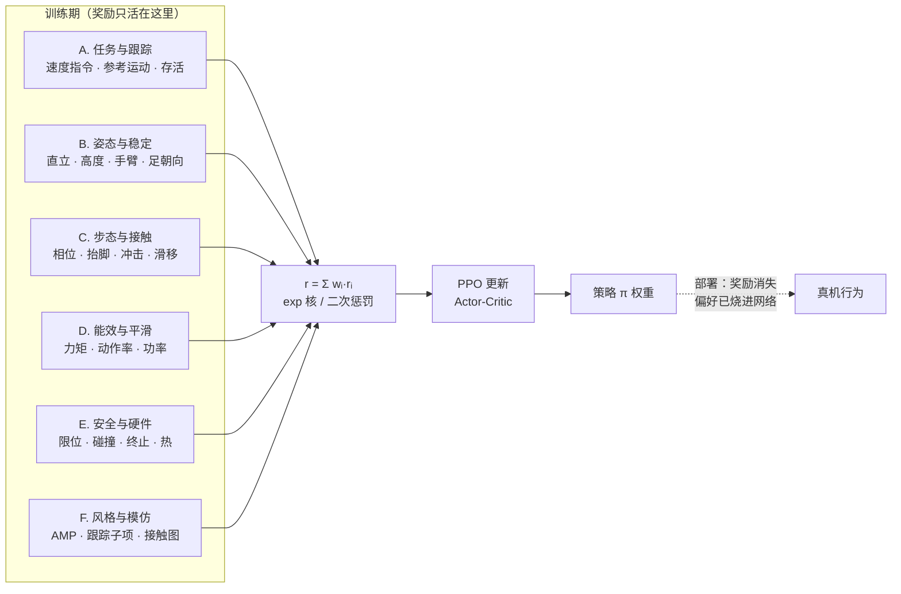

# 人形机器人运控常见奖励函数分类（Humanoid Policy Reward Functions）

**人形机器人运控常见奖励函数**：训练人形/腿式运动控制策略时写进环境的全部奖励项的总称；按「这个项在替谁说话」可切成六类——任务与跟踪、姿态与稳定、步态与接触、能效与平滑、安全与硬件、风格与模仿，总奖励是它们的加权和 $r=\sum_i w_i r_i(s,a,s')$。

## 一句话定义

奖励函数是「告诉机器人什么算好行为」的唯一语言，但它只在训练期活着：部署时环境不再给分，策略已经把六类奖励的偏好「烧进」了网络权重——所以奖励设计决定的不是训练曲线，而是真机行为的全部上限。

## 英文缩写速查

| 缩写 | 英文全称 | 简要说明 |
|------|----------|----------|
| RL | Reinforcement Learning | 奖励函数是其优化目标的训练范式 |
| PPO | Proximal Policy Optimization | 人形运控主流训练算法，对奖励尺度敏感 |
| AMP | Adversarial Motion Prior | 用判别器打分替代手工风格项的奖励机制 |
| GRF | Ground Reaction Force | 地面反作用力，接触冲击惩罚的对象 |
| CBF | Control Barrier Function | 把安全边界写成可微惩罚的约束工具 |
| PD | Proportional–Derivative | 策略输出经 PD 变关节力矩，平滑惩罚作用于其 setpoint |
| IMU | Inertial Measurement Unit | 直立奖励所需重力投影的传感器来源 |
| DoF | Degree of Freedom | 关节自由度数，决定正则项向量维度 |
| MoCap | Motion Capture | 风格与模仿类奖励的参考运动主要来源 |
| LLM | Large Language Model | EUREKA 式自动奖励设计的生成器 |

## 为什么重要

- **复现论文的第二张表**：Method 节的 reward 表（各项公式与权重）决定策略最终学成什么样；观测表决定输入，奖励表决定行为（输入侧见 [人形机器人运控策略的观测输入](./humanoid-policy-observation-inputs.md)）。
- **人形比四足更敏感**：双足支撑多边形小、质心高，直立/高度/手臂等姿态项几乎是人形专属必选项，权重差一点就会出现爬行、半蹲、原地转圈等经典失败模式。
- **奖励与观测互为对偶**：观测受「部署可得性」约束——真机拿不到的量不能进网络；奖励**不受此约束**——它只在仿真训练期计算，可以放心使用接触力真值、基座线速度真值、地形真值等特权信息。这个自由度是奖励设计最大的杠杆，也是被浪费最多的地方。
- **reward hacking 的重灾区**：策略总能找到满足字面积分、违背真实意图的捷径；六类划分的作用之一就是让「谁约束谁」一目了然，便于排查钻空子的通道。

## 核心原理：六大类总览

按「替谁说话」这一刀切下去，主流人形运控策略的奖励空间可分成六类：



| 类别 | 替谁说话 | 典型奖励项 | 典型量级 | 方向 |
|------|----------|-----------|----------|------|
| A. 任务与跟踪 | 任务目标 | 速度跟踪、参考运动跟踪、目标到达、存活 | 1.0（基准） | 正向（exp 核） |
| B. 姿态与稳定 | 平衡与直立 | 重力投影、基座高度、手臂正则、足端朝向 | 0.1–0.5 | 正/负混合 |
| C. 步态与接触 | 节律与落地 | 相位时钟、抬脚高度、冲击、滑移 | 0.05–1.0 | 混合 |
| D. 能效与平滑 | 省力与平滑 | 力矩、关节速度/加速度、动作率、功率 | 1e-4–1e-2 | 负向（二次惩罚） |
| E. 安全与硬件 | 硬件极限 | 关节限位、自碰撞、摔倒终止、热/CBF | 5–100（大惩罚） | 负向 |
| F. 风格与模仿 | 像不像参考 | AMP 判别器、DeepMimic 子项、接触图 | 0.1–1.0 | 正向 |

关键一刀：**A 是目的，B–E 是约束，F 是品味**。纯 A 能走出「能走但难看」的步态；B–E 把步态拉回物理与人形结构的安全区；F 决定最终观感。跟踪系策略（DeepMimic / [BeyondMimic](../methods/beyondmimic.md) 系）里 F 与 A 合流——参考运动跟踪本身就是任务奖励。

## A. 任务与跟踪（Task / Tracking）

| 奖励项 | 常见形式 | 典型权重 | 备注 |
|--------|---------|---------|------|
| 线速度跟踪 | $\exp(-\lVert v_{xy}-v_{cmd}\rVert^2/\sigma)$，$\sigma\approx0.25$ | 1.0 | legged_gym / Isaac Lab 系默认主项 |
| 角速度跟踪（yaw） | $\exp(-(\omega_z-\omega_{cmd})^2/\sigma)$ | 0.5 | 权重不足的典型症状是原地转圈 |
| 参考运动任务空间跟踪 | 关键点位置/朝向误差 + 根线/角速度误差，exp 核加权 | 合计 ≈1.0 | [BeyondMimic](../methods/beyondmimic.md) 的统一任务空间奖励：避免关节空间手工拼凑 |
| 步态参数条件化跟踪 | 步频、步幅、接触时序作为显式跟踪目标 | 0.5–1.0 | Walk These Ways：把「走成什么样」写进奖励而非靠调参碰运气 |
| 目标点 / 航向 | $v\cdot\hat{d}$ 或到达 bonus | 1.0 | 导航 / waypoint 任务 |
| 存活奖励 | 每步 $+c$ | 0.1–0.5 | 防「早死早超生」；过大会赖在原地不动 |

形式要点：跟踪项统一用 `exp(-x²/σ)` 而非线性 `-|x|`——前者在目标附近梯度平滑趋零，后者在零点梯度恒定，容易在最优点附近来回抖动。

## B. 姿态与稳定（Posture / Stability）

人形相对四足多出来的一类重头项，缺失时的失败模式极具辨识度：

| 奖励项 | 常见形式 | 典型权重 | 缺失 / 过强症状 |
|--------|---------|---------|----------------|
| 直立（重力投影） | $\exp(-k\lVert g_{xy}\rVert^2)$ 或 $-(\phi^2+\theta^2)$ | 0.2–0.5 | 缺失：躯干前倾碎步；用重力投影而非欧拉角（同观测侧 yaw 不可全局观测，见 [观测输入页](./humanoid-policy-observation-inputs.md)） |
| 基座高度 | $-(h-h_{ref})^2$ 或 exp 核 | 0.2 | 缺失：爬行；过强：半蹲僵直不敢迈步 |
| 基座垂向速度 | $-v_z^2$ | 0.1 | 缺失：上下窜、弹跳感 |
| 基座横滚/俯仰角速度 | $-\lVert\omega_{xy}\rVert^2$ | 0.05–0.1 | 缺失：上身摇晃 |
| 手臂默认位姿 | $-\lVert q_{arm}-q_{arm,0}\rVert^2$ | 0.05–0.1 | 人形特有；纯步行任务可先固定手臂省 DoF |
| 足端朝向 | $\exp(-k\cdot e_{foot,orient})$ | 0.1 | 缺失：脚尖拖地、用踝边缘走路 |

## C. 步态与接触（Gait / Contact）

| 奖励项 | 常见形式 | 典型权重 | 备注 |
|--------|---------|---------|------|
| 步态相位 / 时钟 | 期望接触序列与 $\sin/\cos$ 时钟对齐 | 0.5–1.0 | 周期奖励系核心；完全不加约束容易学成跑跳而非行走（见 [Gait Generation](./gait-generation.md)） |
| 摆动相抬脚高度 | 摆动期 $\max z_{foot}$ 达标奖励 | 0.1–0.5 | 防拖脚；过强会高抬腿正步 |
| feet air time | 单足悬空时长首次达标 $+c$ | 0.5–1.0 | legged_gym 默认项，诱导清晰迈步节律 |
| 左右对称 / 双支撑 | 双足相位差 $\approx0.5$；双支撑占比窗口 | 0.05–0.1 | 双足步态质量项 |
| 接触冲击 | $-(f_z)^2$ 或接触力变化率 | 0.1（宜课程渐增） | [人形 QuietWalk](../entities/paper-quietwalk-humanoid-locomotion.md) 用冻结 PINN 估计 GRF；运动学代理轴见 [aibo QuietWalk](../entities/paper-learning-quiet-walking-aibo.md) 的 $-\|\boldsymbol{v}_f\|^2$ |
| 足端滑移 | $-\lVert v_{foot}\rVert^2\cdot\mathbb{1}_{contact}$ | 0.1–1.0 | 防滑脚；真机接触标志噪声大，权重宜保守 |

## D. 能效与平滑（Energy / Smoothness）

| 奖励项 | 常见形式 | 典型权重 | 备注 |
|--------|---------|---------|------|
| 关节力矩 | $-\lVert\tau\rVert^2$ | 1e-4–2e-4 | 过强 → 步幅细碎、不敢发力 |
| 关节速度 / 加速度 | $-\lVert\dot q\rVert^2$、$-\lVert\ddot q\rVert^2$ | 1e-4 / 2.5e-7 | 抑制高频抖动 |
| 动作变化率 | $-\lVert a_t-a_{t-1}\rVert^2$ | 0.005–0.01 | 真机平滑性的第一杠杆；过强动作发软、响应变慢 |
| 电功率 / 能耗 | $-\lvert\tau\cdot\dot q\rvert$ | 1e-4 | 长续航任务才需要 |
| 速度自适应平滑 | 平滑惩罚 $\times\, f(v_{ref})$ | 框架相关 | OmniTrack：高动态放松爆发、稳态收紧防抖 |

## E. 安全与硬件（Safety / Hardware）

| 奖励项 | 常见形式 | 典型权重 | 备注 |
|--------|---------|---------|------|
| 关节位置限位 | $-\mathrm{clip}(q-q_{lim},0,\infty)^2$ | 5–10 | 量级必须大到让策略「害怕」 |
| 自碰撞 / 非得接触 | 每次 $-1$ 或直接终止 | 1.0–终止 | 仿真里常直接 early termination |
| 摔倒终止 | $-100$ 且 episode 结束 | 100 | 与存活奖励互为正反两面 |
| 热安全 / 关节边界 CBF | 可微障碍惩罚 | 任务相关 | [Disney Olaf](../methods/disney-olaf-character-robot.md)：极限附近主动「让开」 |
| 负功率（再生制动） | $-\max(0,P_{brake}-P_{deadband})^2$ | 任务相关 | OmniXtreme：防剧烈制动反拖产生的高电压损坏驱动器 |

这类项的权重逻辑与其他类相反：**宁可过大不可过小**——它们在数学上是软约束，在工程上扮演硬约束；更系统的约束形式化见 [Safe RL](../methods/safe-rl.md)。

## F. 风格与模仿（Style / Imitation）

| 奖励项 | 常见形式 | 典型权重 | 备注 |
|--------|---------|---------|------|
| AMP 判别器奖励 | $\log(1-D(s,s'))$ 或 $1-D$ | 0.5–1.0 | 免手工风格项，行为自然；判别器过强会压制任务项，见 [AMP Reward](../methods/amp-reward.md) |
| DeepMimic 跟踪子项 | 位姿 / 速度 / 关键点 / 质心四个 exp 子项加权 | 合计 ≈1.0 | 经典配方；BeyondMimic 将其简化为统一任务空间 |
| 接触图模仿 | $\lVert c_{sim}-c_{ref}\rVert_1$ | 0.1–0.5 | HumanX：接触密集任务（搬运、攀爬）的交互逻辑监督 |
| 可复用动作先验 | score-matching 分布匹配 | 框架相关 | SMP 等先验路线，详见 [Reward Design](./reward-design.md) 趋势节 |

## 工程实践

**权重量级排序口诀**（以任务项 1.0 为基准，单步总奖励控制在 0–5 区间）：

```
任务跟踪 1.0  ≫  姿态/步态 0.1–0.5  ≫  平滑 1e-3–1e-2  ≫  能效 1e-4
安全/终止 5–100（反向大惩罚，要让策略「害怕」）
```

**最小可用奖励集（legged_gym 系入门基线）：**

| 项 | 权重 | 类别 |
|----|------|------|
| tracking_lin_vel / tracking_ang_vel | 1.0 / 0.5 | A |
| lin_vel_z / ang_vel_xy | -2.0 / -0.05 | B |
| feet_air_time | 1.0 | C |
| torques / dof_acc / action_rate | -2e-4 / -2.5e-7 / -0.01 | D |
| dof_pos_limits / collision | -10 / -1 | E |

设计 checklist：

1. **分阶段开启**：先只留 A（速度跟踪 + 存活）确认能站能走 → 加 C 诱导步态节律 → 加 B 改善姿态 → 最后加 D 压能耗与抖动；全流程见 [人形机器人 RL 策略训练 Checklist](../queries/humanoid-rl-cookbook.md) Stage 3。
2. **跟踪项用 exp 核**：`torch.exp(-(err**2).sum(-1)/0.25)`，不要用线性范数。
3. **一次只动一个权重**：改多个权重后 return 曲线不可横比；调参记录权重 diff 比记录 return 更有信息量。
4. **权重与课程联动**：课程升级（地形变难、速度变大）时检查奖励 scale 是否漂移，必要时 normalize；冲击类惩罚（如 QuietWalk 的 $\alpha$）宜随课程渐增而非一步到位。
5. **用足特权自由度**：奖励只在训练期计算，接触力真值、基座速度真值、未来地形都可以直接进奖励——不必像观测那样受真机可得性约束；但对应通道真机无法监控，需配合 [状态估计](./state-estimation.md) 或学习估计器在部署侧观测行为结果。
6. **人形必查三项**：直立（重力投影）、基座高度、足端朝向——四足配置迁移过来时这三个项通常缺失或权重过低。

## 局限与风险（常见误区）

- **reward hacking 是常态而非例外**：能效惩罚太重 → 策略站着不动（$\tau=0$ 奖励最高）；高度奖励太强 → 全程半蹲；速度奖励不看方向 → 倒走刷分。每个新权重组合都应人工抽查 rollout 视频，通用反模式见 [Reward Design](./reward-design.md)。
- **项间冲突靠量级而非个数解决**：快走 vs 平稳接触、大步幅 vs 力矩限制的梯度方向相反，加新项不如先把既有项量级拉开 1–2 个数量级再微调。
- **安全项过大的隐性代价**：限位/碰撞惩罚过重会让策略全程保守、跟踪误差高居不下——表现为「没摔倒但也没走路」，排查时不要只盯着 termination 率。
- **风格项压过任务项**：AMP 权重过高会出现「像参考但不听指令」，任务跟踪项与判别器项的量级比需要单独消融。
- **仿真特权奖励的真机盲区**：用接触力真值塑形出的轻柔落地，在无力传感器的真机上无法直接验证；要么部署侧用估计器近似监控（QuietWalk 的 PINN 思路），要么接受该通道的真机不可观测性。
- **课程漂移**：训练中后期改地形/速度课程会改变各奖励项的自然尺度，静态权重可能隐性失衡，表现为「越训越差」。

## 关联页面

- [运控模型评测指标](./motion-control-policy-evaluation-metrics.md) — 奖励项与验收指标的边界：能耗/抖动惩罚是训练信号，不能直接当评测指标

- [Reward Design](./reward-design.md) — 奖励设计的通用原则：hacking、稀疏/稠密、potential-based shaping 与自动化方向
- [人形机器人运控策略的观测输入](./humanoid-policy-observation-inputs.md) — 对偶页：输入侧按「部署可得性」的五类划分
- [Locomotion 奖励函数设计指南](../queries/locomotion-reward-design-guide.md) — 本页分类的操作版：公式、权重与失败模式速查
- [人形机器人 RL 策略训练 Checklist](../queries/humanoid-rl-cookbook.md) — Stage 3 的分阶段奖励开启顺序
- [AMP Reward](../methods/amp-reward.md) — F 类判别器风格奖励的机制细节
- [BeyondMimic](../methods/beyondmimic.md) — 统一任务空间跟踪奖励的代表实现
- [Gait Generation](./gait-generation.md) — C 类步态目标的传统控制对照
- [Curriculum Learning](./curriculum-learning.md) — 奖励权重/尺度与课程联动
- [Safe RL](../methods/safe-rl.md) — E 类安全约束的形式化（CMDP 视角）
- [Humanoid Locomotion](../tasks/humanoid-locomotion.md) — 任务层入口

## 参考来源

- [人形运控常见奖励函数分类 FAQ 摘录（维护者整理）](../../sources/personal/humanoid-loco-policy-reward-functions-faq.md)
- [sources/papers/reward_design.md](../../sources/papers/reward_design.md) — Rudin legged_gym 奖励实践 / Walk These Ways 步态条件化 / EUREKA 自动奖励设计
- [sources/papers/locomotion_rl.md](../../sources/papers/locomotion_rl.md) — locomotion RL 奖励与训练一手摘录
- [sources/papers/privileged_training.md](../../sources/papers/privileged_training.md) — 特权信息与步态条件化奖励（Walk These Ways）

## 推荐继续阅读

- [legged_gym（ETH RSL）](https://github.com/leggedrobotics/legged_gym) — `cfg.rewards.scales` 最小奖励集的开源基准实现
- [Isaac Lab 文档](https://isaac-sim.github.io/IsaacLab/) — reward terms 配置化管理的工程范式
- [Walk These Ways（Margolis et al., CoRL 2022）](https://arxiv.org/abs/2212.03238) — 把步态参数显式写进奖励的参数化奖励代表作
- [EUREKA（Ma et al., ICLR 2024）](https://arxiv.org/abs/2310.12931) — LLM 自动生成与进化奖励函数
