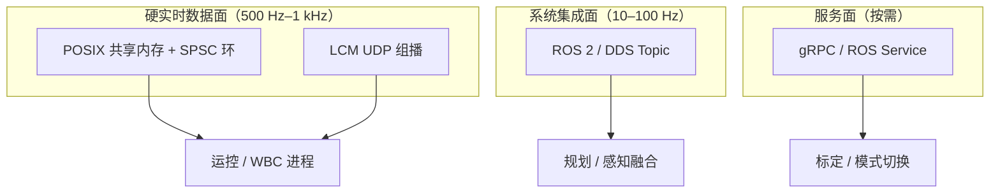

# 进程间通信（Inter-Process Communication, IPC）

## 一句话定义

**IPC** 是操作系统提供的、让 **隔离进程** 交换数据与同步的原语集合——从 **管道、POSIX 共享内存、消息队列** 到 **Unix/Internet 套接字**；机器人栈在其之上再叠 **LCM、DDS、自研零拷贝中间件**。

## 英文缩写速查

| 缩写 | 英文全称 | 简要说明 |
|------|----------|----------|
| IPC | Inter-Process Communication | 进程间通信（本页） |
| POSIX | Portable Operating System Interface | 可移植 OS 接口标准；含 mq/shm/sem 等 IPC API |
| FIFO | First In First Out | 命名管道；文件系统路径可寻址 |
| SHM | Shared Memory | 多进程映射同一块物理页，零拷贝 |
| UDS | Unix Domain Socket | 本机套接字；可传文件描述符 |
| DDS | Data Distribution Service | ROS 2 默认底层 pub/sub 标准 |
| SPSC | Single-Producer Single-Consumer | 单生产者单消费者无锁环，运控常用 |

> **缩写冲突：** 本库物理仿真语境另有 **Incremental Potential Contact（IPC）**（接触求解）。本页专指 **Inter-Process Communication**。

## 为什么重要

- 人形/足式主控几乎总是 **多进程**：感知、WBC/RL、日志、诊断各一进程；**选错 IPC** 会在示波器里表现为力矩指令 **成簇到达、空窗数毫秒**。
- [操作系统基础](./operating-system-basics.md) 讲进程隔离；本页补齐 **「隔离之后怎么传数据」** 的一手机制对照。
- 与 [实时运控中间件配置指南](../queries/real-time-control-middleware-guide.md) 衔接：**进程已是实时的，IPC 仍可能拖后腿**。

## 核心原理

### 机制谱系（POSIX / Linux 一手语义）

| 机制 | 数据形态 | 拷贝 | 典型阻塞点 | 机器人适用层 |
|------|----------|------|------------|--------------|
| **匿名管道 `pipe`** | 单向字节流，无消息边界 | 内核缓冲拷贝 | 满/空时 `read`/`write` | 启动脚本、子进程日志，**非**关节环 |
| **命名管道 FIFO** | 同管道，文件路径命名 | 同上 | 同上 | 简单本机事件，少见运控 |
| **POSIX 共享内存** | 任意结构体/环缓冲 | **零拷贝**（映射后） | 同步不当 → 数据竞争 | **本机高频状态**（关节、IMU、图像槽位） |
| **POSIX 消息队列** | 有边界消息 + 优先级 | 内核拷贝 | `mq_send`/`mq_receive` | 模式切换、告警、低频命令 |
| **信号量** | 仅同步，不传载荷 | — | `sem_wait` | 配共享内存 / 多读者环 |
| **Unix 域套接字** | 流或数据报；可 **SCM_RIGHTS 传 FD** | 视模式 | `connect`/`accept`、缓冲满 | 本地 ROS 2/DDS、gRPC |
| **Internet 套接字** | TCP/UDP | 协议栈拷贝 | 握手、重传、缓冲 | **LCM 组播**、跨板 DDS、遥操作 |

一手依据：[pipe(7)](https://man7.org/linux/man-pages/man7/pipe.7.html)、[shm_overview(7)](https://man7.org/linux/man-pages/man7/shm_overview.7.html)、[mq_overview(7)](https://man7.org/linux/man-pages/man7/mq_overview.7.html)、[unix(7)](https://man7.org/linux/man-pages/man7/unix.7.html) — 归档见 [ipc_primary_refs](../../sources/sites/ipc_primary_refs.md)。

### 分层：内核原语 → 机器人中间件

- **共享内存**：`shm_open` + `mmap` 后多进程同址读写；man-pages 明确要求 **另行同步**（信号量或无锁结构）。
- **LCM**：在 UDP 组播之上提供 **类型安全 pub/sub**；见 [LCM 基础](./lcm-basics.md)。
- **DDS**：丰富 QoS，适合生态集成；**不宜承载 1 kHz 全关节流** — 见 [ROS 2 vs LCM](../comparisons/ros2-vs-lcm.md)。
- **RPC**：请求–响应语义；见 [远程过程调用](./remote-procedure-call.md)。

### 选型三问（APUE / OSTEP 式）

1. **要最新还是必达？** 控制环通常 **要最新样本**（丢旧帧可接受）→ 组播/共享内存；配置下发要 **必达** → 消息队列或可靠 DDS/RPC。
2. **本机还是跨板？** 本机优先 **共享内存**；跨板用 **LCM/UDP** 或 DDS，避免 TCP 重传进环。
3. **消息有没有边界？** 管道是字节流；关节向量、图像帧需要 **定长记录或序列化层**（LCM type、ROS message、自研 header）。

## 工程实践

1. **运控 ↔ 感知（同机）**：预分配共享内存环 + SPSC；启动时 `mlock`；禁止环内 `malloc` — 与 [控制环路延迟建模](../formalizations/control-loop-latency-modeling.md) 对齐。
2. **运控 ↔ 上层（同机）**：关节/IMU 走 LCM 或共享内存；规划目标 10–30 Hz 走 ROS 2。
3. **日志进程**：管道或异步队列 **单向泄洪**；勿与运控争同一实时核。
4. **诊断**：`strace` 看意外 `read`/`write` 阻塞；`perf` 看拷贝与锁；对比 **有/无 DDS** 的周期直方图。
5. **容器**：IPC 命名空间隔离 — 宿主机与容器内 **默认不共享** POSIX shm/mqueue；编排时显式挂载或改用网络套接字。

## 局限与风险

- **共享内存最快也最难**：无锁环写错顺序 → 偶发野值，比「慢但可靠」的 DDS 更难查。
- **管道字节流**：无消息边界，不适合直接传变长多话题。
- **把 DDS 当唯一总线**：动态分配与 QoS 协商会引入 **毫秒级尾延迟**。
- **与物理仿真 IPC 混淆**：论文里的 Incremental Potential Contact 与本文 IPC **无关**。

## 关联页面

- [操作系统基础](./operating-system-basics.md)
- [LCM 基础](./lcm-basics.md) · [DDS 通信机制](./dds-communication.md)
- [ROS 2 vs LCM](../comparisons/ros2-vs-lcm.md)
- [实时运控中间件配置指南](../queries/real-time-control-middleware-guide.md)
- [系统工程知识链](../overview/hub-systems-engineering.md) · [通信协议知识链](../overview/hub-communication.md)

## 参考来源

- [IPC 一手资料索引](../../sources/sites/ipc_primary_refs.md)
- [OS 与网络一手资料](../../sources/sites/systems_engineering_os_network_primary_refs.md)

## 推荐继续阅读

- Beej's Guide to Unix IPC：<https://beej.us/guide/bgipc/>
- OSTEP 免费教材：<https://ostep.org/>
- Linux `pipe(7)` / `shm_overview(7)` / `mq_overview(7)` / `unix(7)`（man7.org）
