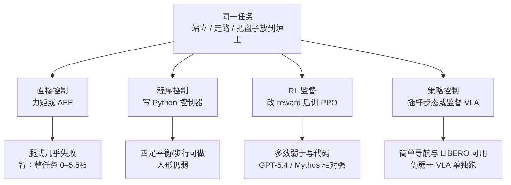

# LLM 机器人控制接口

## 一句话定义

**LLM 机器人控制接口**指把通用语言模型接到机器人时，模型完成同一任务的方式：从逐步输出力矩，到写 Python 控制器、训 RL 策略，再到向预训练步态/VLA 发高层命令——**接口抽象层级与模型代际同等重要**。

## 英文缩写速查

| 缩写 | 英文全称 | 简要说明 |
|------|----------|----------|
| LLM | Large Language Model | 无机器人预训练的通用语言模型，本页评测对象 |
| VLA | Vision-Language-Action | 预训练视觉–语言–动作策略；高层操作接口的执行器 |
| DoF | Degrees of Freedom | 自由度；Go2 约 12、G1 约 29，直接控制难度随 DoF 升 |
| PPO | Proximal Policy Optimization | Embody RL 接口默认的 batched 训练算法 |
| ICL | In-Context Learning | 本页语境：失败重试与短窗口适应，而非权重更新 |

## 为什么重要

1. **能力评估会被接口骗：** 测「模型能不能控机器人」却只给力矩环，会系统性低估部署形态——真实系统几乎总会提供步态或 VLA。[Embody](../entities/anthropic-embody.md) 显示同一 Claude 在直接控制与高层监督上可差一个数量级。
2. **安全边界在访问级别，不在聊天分数：** 换工具（罗盘、夹爪 cursor）或允许监督预训练策略，物理影响力可跳变。见 [Safety Filter](./safety-filter.md) 与 Anthropic 原文的 safety 结论。
3. **解释本库分层栈：** [VLA + 底层控制器](../queries/vla-with-low-level-controller.md)、[频率解耦](./control-inference-frequency-decoupling.md)、[ASPIRE code-as-policy](../methods/aspire.md) 不是三种时尚，而是同一抽象阶梯上的不同台阶。
4. **人形低层仍未破：** 无预训练策略时，今日 frontier 模型 **不能** 把 G1 从倒塌姿态站起来；「聊天模型直接力矩控人形」不是当前工程选项。

## 核心原理

### 四条接口（同一任务，四种完成方式）

| 接口 | 模型输出 | 谁闭环物理 | 典型失败 |
|------|----------|------------|----------|
| **直接控制** | 逐步力矩 / 7 维末端增量 | 模型每步 | 延迟、接触协调、人形平衡 |
| **程序控制** | `controller(obs) -> action` 的 Python | 编译后的脚本 | 奖励/目标难写时不如 RL；仍受感知限制 |
| **RL 监督** | reward、网络、训练日程 | 学到的 PPO 策略 | 设环境+奖励本身是复杂搜索；多数模型弱于写代码 |
| **策略控制** | 速度/偏航/自然语言，或对 VLA 提案的接受/修改 | 预训练步态或 MolmoAct | 过信或过改策略；空间记忆仍差 |

### 瓶颈不在「再想一会儿」

Embody 里额外推理预算对多数 Claude 代际几乎不抬低层机器人分数。代际跃迁来自更好的视觉读数、数值一致性与 3D 理解。感知消融更尖锐：**告诉模型朝哪比给另一张图更有用**——操作 cursor、导航罗盘全面抬分；深度热图/分割 overlay 近似中性。

### 短时程学习 ≠ 长程空间记忆

经典控制的代际优势来自 **重试**，不是首试更强。截掉操作上下文的远期轮次，多数模型不掉分。高层 `oneshot_course` 有练习会涨，难课练 20 次仍 0——学的是特定命令序列。这与 [机器人 ICL](./robot-in-context-learning.md) 的「短窗口归纳」一致，不要读成可积累的 episode 策略。

### 延迟把直接控制锁死

腿式实时约需 **83 Hz**；当前非推理 API 约 **0.2–0.4 Hz**。Embody 在直接/程序仿真里 **暂停物理** 等 LLM，测的是推理变快后的上界。固定基座臂没有平衡约束，未暂停——所以「实验室臂 + LLM」已经是 credible 部署，即使成功率仍低。对照 [控制/推理频率解耦](./control-inference-frequency-decoupling.md)：工程解仍是慢模型 + 快控制器，而不是把 LLM 塞进力矩环。

## 工程实践

| 步骤 | 建议 |
|------|------|
| 先选接口再选模型 | 有可用步态/VLA 时，默认高层监督；不要用「聊天模型输出 τ」当第一刀 |
| 监督 VLA 时测 follow 率 | 统计有多少步原样转发 7 维动作；过改会低于 VLA 单独跑，过信则修不了策略失败 |
| 感知先给朝向 | 导航加世界系朝向角；操作给可查询的夹爪指向，再考虑深度/分割 |
| 真机当定性 | Embody 真机 Go2 N 很小：反射当目标、准星误判障碍、走廊回路全失败——与仿真同族 |
| 读评测时看暂停与否 | 直接控制分数若来自暂停仿真，不能当实时力矩环证据 |
| 代码复现 | 仓公开前以研究文附录为准；见 [Embody 实体](../entities/anthropic-embody.md) 开源状态 |

## 局限与风险

- **暂停仿真上界 ≠ 真机实时。** 把 0.3 Hz 的模型接到 83 Hz 腿上会因延迟单独失败。
- **VLA 监督有控制税。** 所有测试模型在 LIBERO-40 上弱于 MolmoAct 单独跑；Mythos 因过度覆盖更伤。新任务上最强模型才有净增益。
- **空间账本未解。** 高层套件里需要持续自定位、开环长计划、遮挡重规划的任务仍然系统性失败。
- **无预训练策略则无人形低层。** G1 倒塌站起 0 成功；「通用 LLM 直接控人形」会高估威胁与能力。
- **评测代码入库日未公开。** 分数不可本地重跑；以研究文与日后 `safety-research/embody` 为准。

## 关联页面

- [Embody 评测套件](../entities/anthropic-embody.md) — 本页所编译的评测床与开源状态
- [Model Hardware Standard](./model-hardware-standard.md) — 把 agent 接到真实仪器的驱动标准（研究预览）
- [VLA](../methods/vla.md) — 高层操作接口里被监督的预训练策略
- [Foundation Policy](./foundation-policy.md) — 为何部署系统会提供预训练控制器
- [ASPIRE](../methods/aspire.md) — code-as-policy 持续学习；与 Embody「写控制器」接口同族、多技能复利
- [VLA 与底层控制器融合](../queries/vla-with-low-level-controller.md) — 工程上的慢 VLA + 快 PD/阻抗/WBC
- [控制频率与推理频率解耦](./control-inference-frequency-decoupling.md) — 83 Hz vs 0.3 Hz 的系统解
- [Safety Filter](./safety-filter.md) — 访问级别变化时的最后一层约束
- [Locomotion](../tasks/locomotion.md) · [Manipulation](../tasks/manipulation.md) · [LIBERO](../entities/libero-benchmark.md)
- [接触力旋量闭环](../queries/contact-wrench-closed-loop.md) — 直接力矩失败时，接触力信息本就不在 LLM 逐步输出里
- [具身大模型分类学选型闭环](../queries/embodied-fm-taxonomy-loop.md) — VLM 当监督者 vs VLA 当执行器的分层选型

## 参考来源

- [Claude plays robotics（Anthropic 研究文归档）](../../sources/sites/anthropic-claude-plays-robotics.md)
- [safety-research/embody 仓占位](../../sources/repos/safety-research-embody.md)

## 推荐继续阅读

- Anthropic, *Claude plays robotics*, 2026-07-09. <https://www.anthropic.com/research/claude-plays-robotics>
- [ASPIRE](https://research.nvidia.com/labs/gear/aspire/) — 可调试程序技能 vs 逐步 LLM 力矩
- LIBERO 基准：<https://github.com/Lifelong-Robot-Learning/LIBERO>
