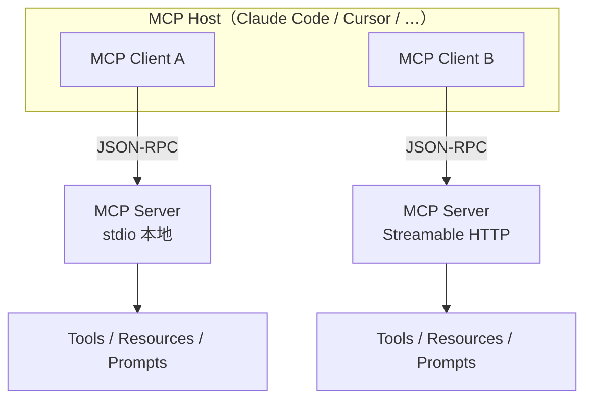

# Model Context Protocol（MCP）

## 一句话定义

**Model Context Protocol（MCP）** 是连接 **AI 应用（Host）** 与 **外部系统** 的开源标准：Host 为每个 Server 创建 **MCP Client**，经 **JSON-RPC 2.0** 交换上下文与能力；Server 以 **Tools / Resources / Prompts** 暴露可调用函数、只读数据与提示模板——官方比喻为「AI 应用的 USB-C」。

## 英文缩写速查

| 缩写 | 英文全称 | 简要说明 |
|------|----------|----------|
| MCP | Model Context Protocol | 本页协议；AI 应用 ↔ 外部工具/数据的开放互操作标准 |
| JSON-RPC | JSON Remote Procedure Call | 数据层消息编码（JSON-RPC 2.0） |
| SSE | Server-Sent Events | Streamable HTTP 传输中可选的服务端推流 |
| STDIO | Standard Input/Output | 本机进程传输；换行分隔 JSON-RPC |
| SDK | Software Development Kit | 官方多语言实现（Python / TS / Go 等） |
| SEP | Specification Enhancement Proposal | MCP 规范变更提案流程 |

## 为什么重要

1. **机器人维护与工程代理的公共接口：** 本库多条「代理驱动专业软件」链路——[FreeCAD MCP](../entities/freecad-mcp.md)、[Draw.io Scientific Illustrator](../entities/drawio-scientific-illustrator.md)、[DimOS](../entities/dimensionalos-dimos.md)、[3D Gen Studio](../entities/3dgenstudio.md)、[Graphify](../entities/graphify.md)——都建立在 MCP Tools 之上；协议层不清会导致传输/安全误判。
2. **仿真与编辑器宿主正在原生接入：** [Unreal MCP](../entities/unreal-mcp.md)（UE 5.8 Experimental）、[Unity](../entities/unity-engine.md) AI/MCP 方向，把「场景搭建 / 资产巡检」交给同一套 Host（Claude Code、Cursor 等）。
3. **一次实现、多 Host 复用：** Intro 明确 Claude、ChatGPT、VS Code、Cursor 等广泛支持——机器人工具桥不必为每个 IDE 重写私有插件协议。
4. **与 RPC 概念衔接：** MCP 数据层就是 JSON-RPC；但产品语义是 **LLM 工具上下文**，不是运控周期的实时 RPC。对照见 [远程过程调用](./remote-procedure-call.md)。
5. **安全默认值会变：** 本地 stdio / loopback HTTP 常见于桌面 CAD 与编辑器桥；远程 Streamable HTTP 走 OAuth 等——部署前必须分清传输与信任边界。

## 核心原理

### 参与者（Host / Client / Server）

| 角色 | 职责 |
|------|------|
| **Host** | 用户面对的 AI 应用；管理多个 Client |
| **Client** | 协议组件；**一对一**连接某个 Server |
| **Server** | 暴露 Tools / Resources / Prompts 的程序 |

### 两层架构

| 层 | 内容 |
|----|------|
| **Data layer** | JSON-RPC 消息、版本/能力发现、Primitives、通知/进度等 |
| **Transport layer** | 连接、成帧、认证；与数据层解耦 |

### 官方标准传输

| 传输 | 适用 | 要点 |
|------|------|------|
| **stdio** | 本机 | stdin/stdout；通常一对一；无网络开销 |
| **Streamable HTTP** | 本机或远程 | HTTP POST + 可选 SSE；可用 bearer/API key；推荐 OAuth |

自定义传输允许，但须保留 JSON-RPC 与 per-request metadata；官方 Roadmap 称本周期 **不新增** 其他标准传输。

### Server Primitives

| Primitive | 控制方 | 作用 |
|-----------|--------|------|
| **Tools** | Model | 可写操作：改文件、调 API、驱动 CAD/编辑器 |
| **Resources** | Application | 只读上下文：文件、schema、知识库 |
| **Prompts** | User | 可复用交互模板 |

### 版本与兼容（截至文档树 `2026-07-28`）

- Schema / 规范按日期目录版本化（如 `2025-11-25`、`2026-07-28`），真源为 TypeScript `schema.ts`。
- **`2026-07-28` 文档主线：** 无状态核心——请求在 `_meta` 携带 `io.modelcontextprotocol/protocolVersion` 等；用 **`server/discover`** 发现能力；旧版 `initialize` 握手进入兼容路径。
- 实现与 Host 可能仍停留在旧修订；联调时以双方协商的 **protocolVersion** 为准，勿假设「文档最新 = 本机 Host 已支持」。

## 工程实践

| 步骤 | 建议 |
|------|------|
| 读一手源 | 公告定边界 → [官方 Intro / Architecture](../../sources/sites/modelcontextprotocol-io.md) → 对上你的 Host 实际 protocolVersion |
| 本地工具桥 | 优先 **stdio** 或 loopback HTTP；对照 [FreeCAD MCP](../entities/freecad-mcp.md)（Addon RPC + PyPI MCP） |
| 远程服务 | Streamable HTTP + OAuth；勿把无认证 loopback server 暴露出本机 |
| 调试 | 官方 [MCP Inspector](https://github.com/modelcontextprotocol/inspector)（`npx @modelcontextprotocol/inspector`）；可绕过 LLM 直接调 Tool |
| 实现 | 官方 SDK（Python / TypeScript 等）与 [servers](https://github.com/modelcontextprotocol/servers) 参考实现 |
| 发布发现 | [MCP Registry](https://modelcontextprotocol.io/registry/about)（生态索引，非协议强制） |

### 本库 MCP 应用样本（协议之上）

| 样本 | 宿主软件 | 传输/桥 |
|------|----------|---------|
| [FreeCAD MCP](../entities/freecad-mcp.md) | FreeCAD | PyPI MCP server ↔ Addon RPC |
| [Draw.io Scientific Illustrator](../entities/drawio-scientific-illustrator.md) | draw.io desktop | Codex Skill + MCP |
| [DimOS](../entities/dimensionalos-dimos.md) | 机器人 OS | skills 暴露为 MCP tools |
| [3D Gen Studio](../entities/3dgenstudio.md) | 网格生产台 | HTTP `/mcp` + stdio 桥 |
| [Unreal MCP](../entities/unreal-mcp.md) | Unreal Editor | 编辑器内嵌 HTTP MCP（Experimental） |
| [OmniSim](../entities/omnisim.md) | 机器人仿真器 | 一等 stdio MCP（官方 18 tools）+ HTTP `omnisim_wire` |

## 局限与风险

- **协议 ≠ 产品安全：** MCP 标准化连接，不自动保证 Tool 无害；本地 server 常等价于「助手可执行本机任意操作」。
- **版本碎片：** Host / SDK / 自定义 server 可能停在不同 schema 日期；`2026-07-28` 无状态与旧 `initialize` 会话模型并存于生态。
- **传输能力差：** 仅官方 stdio + Streamable HTTP；不支持的传输（如部分编辑器曾只用 HTTP、无 WebSocket）需查具体产品文档。
- **Primitives 可选实现：** 许多 shipping server **只实现 Tools**，Resources/Prompts 为空——客户端不应假设三者齐全。
- **不是实时控制总线：** 不适合 1 kHz 力矩环或确定性运控；那是 [LCM](./lcm-basics.md) / DDS / 现场总线的领域。物理设备编排走互补的 [Model Hardware Standard](./model-hardware-standard.md)（2026-08 研究预览，驱动级 `read`/`write` + 安全限；**尚未开源**），不要把 MCP Tool 直接当成实验室仪器协议。
- **许可过渡：** 规范仓正从 MIT 过渡到 Apache-2.0；再分发时核对当前 LICENSE 文本。

## 关联页面

- [Model Hardware Standard](./model-hardware-standard.md) — 物理设备驱动标准；可经 MCP 访问，但不等于 MCP
- [远程过程调用（RPC）](./remote-procedure-call.md) — JSON-RPC / gRPC 概念下层
- [FreeCAD MCP](../entities/freecad-mcp.md) — 桌面 CAD MCP 桥
- [Draw.io Scientific Illustrator](../entities/drawio-scientific-illustrator.md) — 科研插图 MCP
- [DimOS](../entities/dimensionalos-dimos.md) — 机器人 skills 的 MCP 暴露
- [3D Gen Studio](../entities/3dgenstudio.md) · [Graphify](../entities/graphify.md) · [Hermes Agent](../entities/hermes-agent.md)
- [ScienceDiscovery](../entities/sciencediscovery.md) — 科学 MCP：Node 治理 broker + 延迟披露工具 + CAS 审计
- [Unreal MCP](../entities/unreal-mcp.md) — UE 编辑器内嵌官方 MCP server
- [OmniSim](../entities/omnisim.md) — 仿真器一等 MCP + HTTP 机器人桥
- [Unreal Engine 5](../entities/unreal-engine-5.md) · [Unity Engine](../entities/unity-engine.md) — 引擎侧 MCP/AI 方向
- [LLM Wiki（Karpathy）](../references/llm-wiki-karpathy.md) — 本库维护模式；检索侧亦可挂 MCP

## 参考来源

- [Introducing the Model Context Protocol（Anthropic 公告归档）](../../sources/sites/anthropic-model-context-protocol.md)
- [modelcontextprotocol.io 官方文档归档](../../sources/sites/modelcontextprotocol-io.md)
- [modelcontextprotocol/modelcontextprotocol 仓库归档](../../sources/repos/modelcontextprotocol.md)
- [Previewing the Model Hardware Standard（对照：硬件侧标准）](../../sources/sites/anthropic-model-hardware-standard.md)

## 推荐继续阅读

- [What is MCP?](https://modelcontextprotocol.io/docs/2026-07-28/getting-started/intro) — 官方一页入门
- [Architecture overview](https://modelcontextprotocol.io/docs/2026-07-28/learn/architecture) — Host/Client/Server 与传输
- [Specification 2026-07-28](https://modelcontextprotocol.io/specification/2026-07-28) — 规范条款
- [Anthropic：Introducing MCP](https://www.anthropic.com/news/model-context-protocol) — 2024-11-25 一手公告
- [modelcontextprotocol/inspector](https://github.com/modelcontextprotocol/inspector) — 官方调试器
