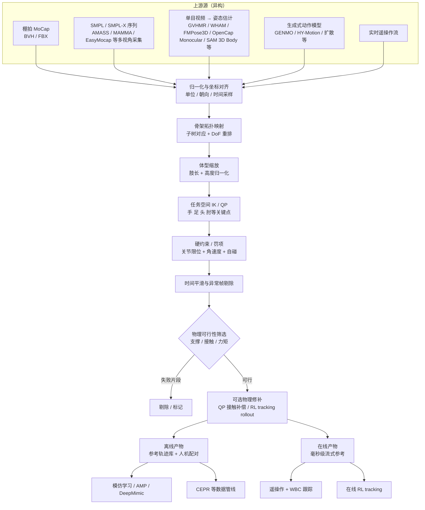

# Motion Retargeting Pipeline（动作重定向流水线）

**Motion Retargeting Pipeline** 关注的不是「某一个重定向算法」，而是把**异构来源的人体动作**（MoCap、单目视频估计、生成模型、遥操作流）落到**机器人可执行参考**的**端到端工程链路**。它把 [Motion Retargeting](./motion-retargeting.md) 概念页里的「单次映射」展开为可工程化的多阶段流水线。

## 一句话定义

把"人怎么动"翻译成"机器人能怎么动"的全过程管线：源数据归一 → 骨架与坐标对齐 → IK/约束求解 → 物理可行性筛选 → 下游可用的参考轨迹/配对数据。

## 英文缩写速查

| 缩写 | 英文全称 | 简要说明 |
|------|----------|----------|
| Retargeting | Motion Retargeting | 人体参考→机器人可执行动作 |
| GMR | General Motion Retargeting | 本库常用重定向工具链节点 |
| WBT | Whole-Body Tracking | 重定向后仿真跟踪训练段 |
| MoCap | Motion Capture | 流水线输入的动捕/视频数据 |
| Sim2Real | Simulation to Real | 跟踪策略上真机的最后一段 |

## 为什么单独立一页

单点的方法页（[GMR](../methods/motion-retargeting-gmr.md) / [NMR](../methods/neural-motion-retargeting-nmr.md) / [ReActor](../methods/reactor-physics-aware-motion-retargeting.md)）解决「映射怎么算」；本页关注**工程链路**：
- 上游数据从哪来（MoCap 干净源 vs 视频估计噪声源 vs 生成式新分布）
- 中间每一段的**职责边界**与**失败模式**
- 哪些阶段可以跳过（例如 ExoActor 的「直接 tracking」反例）
- 重定向产物如何接入下游模仿学习 / 跟踪 / 遥操作的 **接口形态**

> 这是一条 [Sim2Real](./sim2real.md) 上游链路：重定向阶段引入的伪影会在下游 RL/IL 训练里被放大，所以工程上需要把"哪一段在解决什么"分清。

## 端到端流水线总览（Mermaid）

## 阶段拆解

### 1. 源数据归一化（Source Normalization）
- **单位与坐标**：统一为 SI 单位、Z-up 或 Y-up、根坐标朝向对齐。
- **时间采样**：重采样到目标控制频率（常见 30/50/60 Hz），处理可变帧率与丢帧。
- **格式归并**：BVH / FBX / SMPL（含 SMPL-H / SMPL-X）/ 自定义 JSON 等统一到内部表示。
- **多视角 SMPL / SMPL-X 采集**：棚拍可用 **[MAMMA](../entities/paper-mamma-markerless-motion-capture.md)** 或 **[EasyMocap](../entities/easymocap.md)** 等 markerless 多相机管线直接产出 **[SMPL-X](./smpl-x.md) / SMPL 时序**（双人近距离交互优先 MAMMA；标定消费级相机 / 镜面 / ZJU-MoCap 生态优先 EasyMocap），与 AMASS 离线库互补。接 EasyMocap JSON 时注意其 **`Rh` 与官方 `global_orient` 不等价**。
- **双人→双机 kinematic conflict**：异构人体 MoCap 映射到 **同构双 humanoid** 时，**个体缩放流形** 与 **统一交互流形** 不可兼得；[Rhythm](../entities/paper-rhythm-dual-humanoid-interaction.md) 的 **IAMR** 通过 $\mathcal{E}_{self}$ / $\mathcal{E}_{inter}$ 解耦能量并导出交互图，是 MAGIC 数据集与下游 IGRL 的上游环节。
- **视频 HMR 可选精炼**：对 GVHMR / TRAM 等输出的 world-space SMPL，可在进入拓扑映射前接入 **[HTD-Refine](../entities/paper-htd-refine-monocular-hmr.md)** 类 **速度–加速度对齐后处理**，减轻 jitter 与脚滑（不改变 HMR 骨干本身）。
- **2D→3D 关键点提升（非 SMPL）：** **[FMPose3D](../entities/paper-fmpose3d-monocular-3d-pose-flow-matching.md)** 用 **Flow Matching** 从 2D 关节生成 **3D 关键点多假设** 再 RPEA 聚合；**已集成 DeepLabCut** 动物管线，适合「DLC 2D → 稀疏 3D 骨架 → IK/重定向」链路，推理比扩散 lifter 快一个数量级，但需自行映射到机器人骨架拓扑。
- **生物力学单目源（非默认）：** [OpenCap Monocular](../entities/paper-opencap-monocular.md) 输出 OpenSim `.trc`/`.mot` 与关节力矩/GRF，面向临床动力学；接入机器人栈前需骨架映射与坐标对齐，通常不如 GVHMR→GMR 直接。
- **风险**：朝向定义不一致是最常见的「整段漂移」根源，比关节角错误更难调试。

### 2. 骨架拓扑与 DoF 映射（Skeleton Mapping）
- **子树对齐**：源骨架的链（脊柱、四肢、手部）映射到目标机器人对应链。
- **DoF 取舍**：人类 ~23 主关节 vs 机器人常见 30–70 DoF（如 G1 = 43 DoF 无手指）；多余的手指 / 颈部细节做聚合或丢弃。
- **手部特殊处理**：灵巧手另起一条子管线，避免与全身重定向同优化。

### 3. 体型与比例缩放（Geometric Scaling）
- **整体缩放**：$p_{\mathrm{robot}} \approx (L_{\mathrm{robot}} / L_{\mathrm{human}}) \cdot p_{\mathrm{human}}$，按肢长比对末端轨迹缩放。
- **高度归一化**：脚到地面距离对齐，避免穿地与凌空起点。
- **不可避免的失真**：人机比例越悬殊，步长与触地相位的累积偏差越大；这是物理筛选阶段的主要"客户"。

### 4. IK / QP 求解（Inverse Kinematics）
- **目标**：让末端（手、脚、骨盆、头）跟随源轨迹关键点。
- **形式**：$\min \| \theta - \theta_{\mathrm{ref}} \|^2 \ \text{s.t.}\ \mathrm{FK}(\theta)=p_{\mathrm{target}},\ \theta_{\min} \le \theta \le \theta_{\max}$，接触约束。
- **工具**：[Pinocchio](../entities/pinocchio.md) + TSID / [Crocoddyl](../entities/crocoddyl.md) / [cuRobo](../entities/curobo.md) / 各家自研 QP 求解器。
- **代表实现**：[GMR](../methods/motion-retargeting-gmr.md) 等以此为核心；[robot_retargeter](../entities/robot-retargeter.md) 用 **mink + MuJoCo** 实现同类多目标任务 IK，并内置足端接触锁定 FrameTask。[RMR](../entities/paper-rmr.md) / [CoRe](../entities/core-retarget.md) 的 **DMR** 用方向向量 + MuJoCo IK，输入是已归一的 SOMA77。

### 5. 硬约束与平滑（Constraints & Smoothing）
- **关节限位 / 角速度上限 / 加加速度（jerk）罚项**：防止「几何可行但电机跟不上」。
- **自碰检测**：粗糙球体或胶囊近似 + 罚项。
- **时间平滑**：滑窗滤波、Savitzky-Golay、最小 jerk 重投影；异常帧剔除并打标。

### 6. 物理可行性筛选（Physics Feasibility Gate）
- **筛选准则**：质心是否在支撑多边形内、接触相位是否一致、所需力矩是否在执行器边界内、是否出现脚滑。
- **典型门控**：脚 z 速度阈值、自碰占比阈值、根速度峰值阈值（[NMR](../methods/neural-motion-retargeting-nmr.md) 中 CEPR 管线的硬阈值即在此环节）。
- **失败处理**：可丢弃、可切片保留可行段、可送入下一阶段做物理修补。

### 7. 物理修补（可选；Physics Refinement）
两条主流：
- **QP 接触补偿（如 HALO 风格）**：在重定向轨迹基础上，叠加最小修正使脚位置/接触约束严格满足。
- **仿真内 RL tracking rollout**：用跟踪策略在仿真里复现参考动作，记录的真实仿真状态作为「物理一致版本」，即 [NMR](../methods/neural-motion-retargeting-nmr.md) 中 CEPR、[ReActor](../methods/reactor-physics-aware-motion-retargeting.md) 中下层策略所做的事。
- **并行仿真采样优化（SPIDER）**：在可并行的接触动力学仿真里，对**整条控制序列**做带退火噪声的采样更新，并可用**虚拟接触力**做课程式引导；输出可直接作为机器人 rollout 数据或经域随机化后用于 RL（见 [SPIDER](../methods/spider-physics-informed-dexterous-retargeting.md)）。
- **增量时域 SBTO（DynaRetarget）**：在 MuJoCo 中对 **PD 目标 knot** 做 **CEM 采样优化**，**外环增量扩展优化时域**以克服 SBMPC 短视距；把 [OmniRetarget](../entities/paper-hrl-stack-03-omniretarget.md) 等 **kinematic 参考** refinement 为长时域动力学可行轨迹，再供 PPO tracking（见 [DynaRetarget / SBTO](../methods/dynaretarget-sbto-motion-retargeting.md)）。
- **GRF 多接触 NLP（KDMR）**：同步 GRF→heel–toe 日程 + CasADi 全身动力学 TO，再接 BeyondMimic（见 [KDMR](../entities/paper-kdmr.md)）。
- **URDF 校准 + 渐进 KDTO（SPARK）**：骨架参数对齐降 IK 误差，再 KTO→ID→KDTO（可选力矩监督）服务高动态跟踪（见 [SPARK](../entities/paper-spark-skeleton-aligned-retargeting.md)）。
- **接触感知运动学精炼（CoRe）**：趾轨迹接触段 + 落脚 IK / 接地 + 手臂自碰，**不做**动力学级 TO；开源九段制品见 [CoRe v0.1.0](../entities/core-retarget.md)，论文主张其后接接触奖励 RL（[CoRe](../entities/paper-core.md)）。
- **交互 mesh + 残差 RL（REGRIND）**：单次 MoCap 人手–物体演示 → **Laplacian interaction mesh 重定向**（OmniRetarget 同族）→ **物体关键点跟踪 + RSI + 训练时 SE(3) 增广** 的残差 RL，面向剪刀/螺丝刀等 contact-rich 工具操作真机部署（见 [REGRIND](../methods/regrind-retargeting-guided-rl.md)）。

### 8. 产物落地（Outputs）
- **离线参考轨迹库**：`.pkl` / `.csv` / 自定义二进制，供 [BeyondMimic](../methods/beyondmimic.md) / [DeepMimic](../methods/deepmimic.md) 等模仿学习直接使用。
- **人机配对数据集**：`(人体序列, 机器人物理一致序列)` 对，用于训练前向重定向网络（如 [NMR](../methods/neural-motion-retargeting-nmr.md)）。
- **在线参考流**：低延迟（< 20 ms）参考轨迹流，对接遥操作 + WBC 跟踪或在线 RL tracking。

## 三种工程化形态对比

| 形态 | 上游源 | 中间是否走重定向 | 物理修补在哪 | 代表 |
|------|--------|------------------|-------------|------|
| **干净 MoCap + 几何重定向** | 棚拍 BVH/SMPL / [MAMMA](../entities/paper-mamma-markerless-motion-capture.md) SMPL-X | 是（IK 主导） | 下游 QP/WBC 或单独 RL | [GMR](../methods/motion-retargeting-gmr.md) 主流用法 |
| **重定向 + 仿真 RL 配对** | SMPL 大库 | 是（GMR 当作前端） | CEPR 仿真 rollout | [NMR](../methods/neural-motion-retargeting-nmr.md) |
| **双层联合优化** | SMPL / 跨形态 | 是（参考可学习） | 下层 RL 在同一环 | [ReActor](../methods/reactor-physics-aware-motion-retargeting.md) |
| **并行仿真 + 采样轨迹优化** | 人体+物体运动学 + mesh | 是（IK 初参考） | 采样型 MPC/CEM 式更新 + 课程式虚拟接触 | [SPIDER](../methods/spider-physics-informed-dexterous-retargeting.md) |
| **增量 SBTO 全轨迹精炼** | OmniRetarget 等 kinematic 参考 | 是（IK 前端） | CEM + 增量 horizon MuJoCo rollout | [DynaRetarget / SBTO](../methods/dynaretarget-sbto-motion-retargeting.md) |
| **GRF 锚定多接触 TO** | 测力同步生物力学 MoCap | 是（IK 初值） | CasADi+Pinocchio 动力学 NLP | [KDMR](../entities/paper-kdmr.md) |
| **URDF 校准 + 渐进 KDTO** | 任务空间人体 / AMASS | 是（校准后 IK） | KTO→ID→KDTO（可选 \(\tau\) 奖励） | [SPARK](../entities/paper-spark-skeleton-aligned-retargeting.md) |
| **跳过中间重定向** | 视频生成噪声源 | 否（直送 tracking） | 下游通用跟踪器 | [SONIC](../methods/sonic-motion-tracking.md) / [ExoActor](../methods/exoactor.md) 反例 |

> 选型直觉：**源数据越干净，重定向收益越高**；**源数据已是上游估计/生成结果**时，中间几何重定向可能放大全局漂移与脚滑，需要做"跳过重定向"的消融。

## 常见失败模式

| 失败模式 | 触发阶段 | 典型表现 | 工程对策 |
|----------|----------|----------|----------|
| 整段空间漂移 | 归一化 / 缩放 | 全身偏离地面 / 走出场景 | 朝向与高度严格对齐；估计源加全局位置滤波 |
| 脚滑与穿地 | IK / 物理筛选 | 触地脚 z 速度非零 | 接触相位锁定 + z 速度阈值过滤 |
| 关节震荡 | IK / 平滑 | 单关节高频抖动 | jerk 罚项 + Savitzky-Golay |
| 自碰穿模 | 缩放 / IK | 手穿过躯干 | 胶囊自碰罚项 + 关节限位收紧 |
| 力矩超限 | 物理筛选 | 仿真 PD 跟不上 | 角速度上限 + 仿真 RL tracking 反馈 |
| 重定向"修正"反放大噪声 | 视频估计源 | 全局位置误差比原始更大 | 做"跳过重定向"消融；切到 [SONIC](../methods/sonic-motion-tracking.md) 风格 tracking |

## 接口形态（与下游的契约）

- **模仿学习侧**：参考轨迹 $= \{q_t,\, \dot{q}_t,\, \mathrm{contact\_phase}_t\}$，常见频率 30–60 Hz。
- **WBC 侧**：参考 = 末端任务（手/脚 SE(3)）+ 质心轨迹 + 接触切换序列。
- **RL tracking 侧**：参考 = 全身关节角 + 关键点位姿，奖励通常对齐 [DeepMimic](../methods/deepmimic.md) 风格分项。
- **遥操作侧**：实时输入流 + 重定向延迟预算（< 20 ms 才能闭环操作）。
- **示教后处理（离线）**：对 CSV、NPZ 或 MuJoCo keyframe 包做关键帧修正、平滑与重采样时，工具链选型见 [机器人关键帧与运动编辑工具](../entities/robot-motion-keyframe-editors.md)。

## 评测视角

- **几何指标**：MPJPE（关键点误差）、末端速度差、关节角差。
- **物理指标**：仿真内跟踪成功率、脚滑距离、自碰帧占比、所需根残差力。
- **下游指标**：用这批参考训练出来的策略在真机/仿真的成功率与样本效率（最贴近最终目标）。

## 参考来源

- [sources/papers/motion_control_projects.md](../../sources/papers/motion_control_projects.md) — 飞书《开源运动控制项目》对运动学重定向 → 动力学一致化分层的总结
- [sources/papers/neural_motion_retargeting_nmr.md](../../sources/papers/neural_motion_retargeting_nmr.md) — NMR/CEPR：以 GMR 为前端 + 分簇 RL 专家做配对数据
- [sources/papers/reactor_rl_physics_aware_motion_retargeting.md](../../sources/papers/reactor_rl_physics_aware_motion_retargeting.md) — ReActor：双层联合优化参考与跟踪策略
- [sources/papers/spider_scalable_physics_informed_dexterous_retargeting.md](../../sources/papers/spider_scalable_physics_informed_dexterous_retargeting.md) — SPIDER：并行仿真采样优化 + 虚拟接触引导
- [sources/papers/dynaretarget_arxiv_2602_06827.md](../../sources/papers/dynaretarget_arxiv_2602_06827.md) — DynaRetarget：增量 SBTO + 下游 RL tracking
- [sources/papers/kdmr_arxiv_2603_09956.md](../../sources/papers/kdmr_arxiv_2603_09956.md) — KDMR：GRF 多接触动力学重定向
- [sources/papers/spark_skeleton_aligned_retargeting_arxiv_2603_11480.md](../../sources/papers/spark_skeleton_aligned_retargeting_arxiv_2603_11480.md) — SPARK：URDF 校准 + 渐进 KDTO
- [sources/repos/core_retarget.md](../../sources/repos/core_retarget.md) — CoRe v0.1.0 九段接触精炼；论文 [core_humanoids_2025.md](../../sources/papers/core_humanoids_2025.md)、[rmr_iros_2025.md](../../sources/papers/rmr_iros_2025.md)
- [sources/papers/exoactor.md](../../sources/papers/exoactor.md) — ExoActor：视频生成源下"跳过中间重定向"的反例消融
- Ze Y. et al., *GMR: General Motion Retargeting* — [arXiv:2505.02833](https://arxiv.org/abs/2505.02833)
- Peng et al., *AMP: Adversarial Motion Priors* (SIGGRAPH 2021) — 重定向产物在 RL 风格先验中的下游用途

## 关联页面

- [Motion Retargeting（动作重定向）](./motion-retargeting.md) — 概念页：单次映射的定义与分类
- [Whole-Body Tracking Pipeline（全身运动跟踪流水线）](./whole-body-tracking-pipeline.md) — **下游消费方**：把本流水线的参考产物训成可在真机上执行的全身跟踪策略
- [Motion Retargeting Objective（重定向目标函数形式化）](../formalizations/motion-retargeting-objective.md) — 流水线第 4–6 阶段共用的目标函数数学骨架
- [GMR（通用动作重定向）](../methods/motion-retargeting-gmr.md) — 流水线中 IK 主导阶段的代表实现
- [NMR（神经运动重定向）](../methods/neural-motion-retargeting-nmr.md) — 流水线中"前端 + 配对数据 + 神经推断"的实例
- [ReActor（物理感知 RL 运动重定向）](../methods/reactor-physics-aware-motion-retargeting.md) — 把参考形变与跟踪策略联合训练的流水线变体
- [SPIDER（物理感知采样式灵巧重定向）](../methods/spider-physics-informed-dexterous-retargeting.md) — 运动学参考后在并行仿真里做采样轨迹优化与接触课程
- [DynaRetarget / SBTO（增量采样式动力学重定向）](../methods/dynaretarget-sbto-motion-retargeting.md) — kinematic 参考经增量时域 SBTO refinement 后接 PPO tracking
- [KDMR](../entities/paper-kdmr.md) — GRF 锚定多接触全身 TO → BeyondMimic
- [SPARK（骨架对齐重定向）](../entities/paper-spark-skeleton-aligned-retargeting.md) — URDF 校准 + KTO/ID/KDTO
- [CoRe v0.1.0](../entities/core-retarget.md) — SOMA → 11 机 DMR + 接触精炼；论文 [CoRe](../entities/paper-core.md) / [RMR](../entities/paper-rmr.md)
- [GMR vs NMR vs ReActor（重定向方法谱系对比）](../comparisons/gmr-vs-nmr-vs-reactor.md) — 三条主流路线如何在同一条流水线上占据不同位置的选型视角
- [SONIC（规模化运动跟踪）](../methods/sonic-motion-tracking.md) — "跳过中间重定向"流水线的下游通用 tracker
- [Whole-Body Control](./whole-body-control.md) — 下游消费参考的控制器接口
- [Imitation Learning](../methods/imitation-learning.md) — 离线产物的主要下游消费方
- [Teleoperation](../tasks/teleoperation.md) — 在线产物的实时消费场景
- [Sim2Real](./sim2real.md) — 重定向伪影会被下游 RL/IL 训练放大，是 sim2real 链路的上游
- [机器人关键帧与运动编辑工具](../entities/robot-motion-keyframe-editors.md) — CSV / NPZ / MuJoCo 关键帧的手工修整入口
- [Gen2Humanoid](../entities/gen2humanoid.md) — 文本→HY-Motion→GMR 的端到端集成示例（运动学参考，无物理后处理）
- [4DAnyone](../entities/paper-4danyone.md) — 单目→多视角外观 / 4DGS；与本流水线共享 GVHMR 上游，**不输出** 可重定向关节
- [EasyMocap](../entities/easymocap.md) — 标定多视角 / 镜面视频 → SMPL 系参数的上游工具箱
- [MILO](../entities/paper-milo.md) — 单图 LRM→SMPL-H + 物体网格的上游 HOI 几何；不是关节指令，进本管线前还要做坐标系/尺度对齐

## 推荐继续阅读

- [GMR 源码仓库](https://github.com/YanjieZe/GMR) — 多机型 / 多源格式的工程参考
- [Karpathy LLM Wiki 方法论](../references/llm-wiki-karpathy.md) — "compilation beats retrieval" 的内在动机
