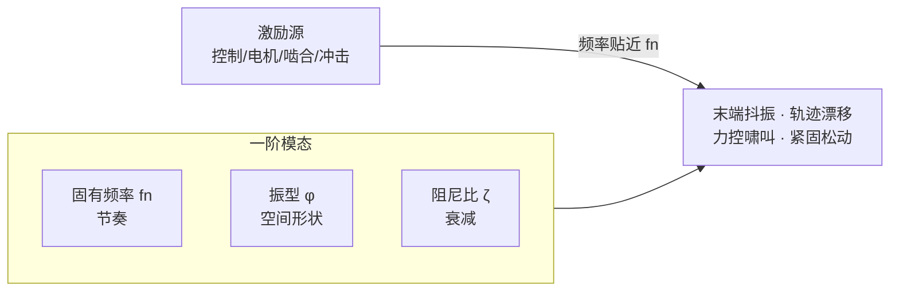
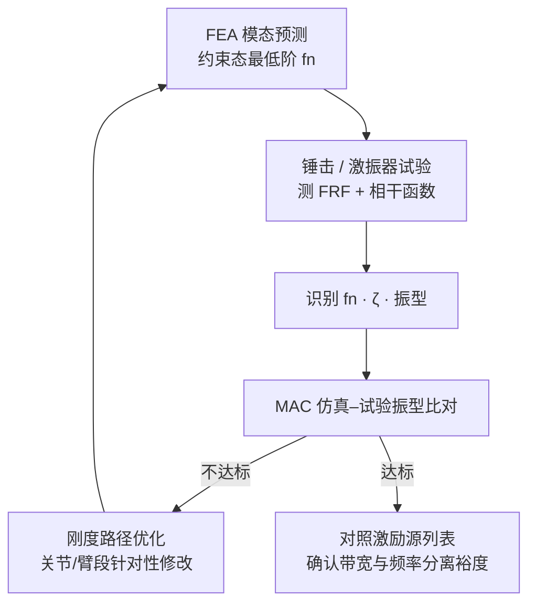

# Robot Structural Modal Analysis（机器人结构模态分析）

## 一句话定义

**结构模态**是线性多自由度结构振动的「基本形态」：每一阶模态由 **固有频率**（按什么节奏振）、**振型**（哪里怎样动）和 **阻尼比**（衰减多快）唯一描述；对机器人而言，低阶模态往往比静强度更早卡死 **轨迹精度、力控带宽与长期紧固可靠性**。

## 英文缩写速查

| 缩写 | 英文全称 | 简要说明 |
|------|----------|----------|
| FRF | Frequency Response Function | 频响函数，响应与激励的复比，模态识别主输入 |
| MAC | Modal Assurance Criterion | 模态置信准则，定量比对两组振型向量相似度 |
| FEM / FEA | Finite Element Method / Analysis | 有限元法/分析，仿真求模态与应力 |
| Hz | Hertz | 频率单位，每秒周期数 |
| ISO 7626 | Mechanical vibration and shock — Experimental determination of mechanical mobility | 机械导纳/频响试验国际标准系列 |
| Q | Quality factor | 品质因数，$Q=f_n/\Delta f=1/(2\zeta)$，共振峰尖锐度指标 |

## 为什么重要

- **动态表现决定「好不好用」**：末端抖动、轨迹漂移、加工振纹、噪音超标，根子常在结构动力学而非静强度余量。
- **机器人天生比机床「软」**：串联、悬臂、多关节拓扑使低阶固有频率常落在 **10 Hz 量级**（轻量长臂可至 3 Hz+），不能照搬机床「加厚床身」思路——见 [整机机械布局设计](./humanoid-mechanical-layout-design.md) L4 模态刚度判据。
- **模态是控制带宽的上游约束**：驱动器把力矩环做到 100 Hz 仍可能无用，若连杆最低阶模态就在 80 Hz——与 [接触力环带宽](./contact-force-loop-bandwidth.md) 的「短板约束」同一逻辑链。
- **姿态相关**：臂展、关节角与重力方向改变等效刚度与质量分布，**某一姿态合格 ≠ 全工作空间合格**；模态验收须覆盖典型与极端姿态。

## 核心原理

### 模态三要素

| 参数 | 物理含义 | 工程读法 |
|------|----------|----------|
| **固有频率** $f_n$ | 结构最愿意响应的振荡频率；SDOF：$f_n=\frac{1}{2\pi}\sqrt{k/m}$ | 低阶 $f_n$ 暴露最弱刚度–质量组合；设计审查先看一阶及头几阶落在哪个频段 |
| **振型** | 该 $f_n$ 下各点位移相对幅值与方向 | 回答「哪里在动」：大臂弯曲、小臂扭转、底座摇摆或关节扭转——比单一频率更能定位改哪里 |
| **阻尼比** $\zeta$ | 无量纲衰减快慢；决定共振峰尖锐度 | 金属本征阻尼低；整机阻尼多来自连接界面、摩擦、密封——见下文设计避让 |

### 机器人 vs 机床：为何更「软」

- 公开研究中，用于加工的六轴臂 **一阶固有频率约 10 Hz**；姿态切换可使前四阶频率整体漂移（例：11.1/19.4/29.3/38.1 Hz ↔ 10.3/18.0/42.8/50.6 Hz）。
- 机床床身/立柱低阶频率常为机器人数倍到数十倍。
- **关节柔性 vs 连杆柔性**：低阶模态可能由减速器扭转刚度、轴承跨距、谐波/摆线弹性主导（见 [膝侧谐波判据](./humanoid-knee-harmonic-drive-limits.md)）。振型里 **关节转角占比大 → 治关节**；**臂中段位移占比大 → 治臂段**。

### 结构频率与伺服带宽

经验检查（非标准条文）：结构主共振频率宜 **高于速度环带宽约 3 倍**，并须结合具体工况验证。

激励源不止控制指令，还包括：

- 电机转频与谐波
- 齿轮 / 减速器啮合频率
- 传动误差与加减速冲击

频率分离检查须 **逐一对照** 结构低阶模态，并计入 **姿态漂移带来的 $f_n$ 变化量**。案例：25 Hz 指令贴近 24 Hz 固有频率 → 振动放大，短期内连接螺栓松动。

## 流程总览：从仿真到试验再到设计

## 模态试验

本质：在已知激励下测 **FRF**，从幅值峰（$f_n$）、峰宽（$\zeta$）与相位识别模态参数。

| 方法 | 优点 | 局限 | 典型对象 |
|------|------|------|----------|
| **锤击法** | 布置快、不改结构、现场友好；游走锤 + 固定响应点 | 能量有限；忌双击（FRF 周期性凹陷） | 样机、臂段、末端支架筛查 |
| **激振器法** | 能量可控、低频充分、可重复 | 安装复杂、准备时间长 | 实验室整机精细测量 |

工程要点：

- 锤尖材质：硬锤尖宽带，软锤尖偏低频。
- 测点覆盖长臂端部、关节附近、底座连接区，否则振型重建失真。
- 同步检查 **相干函数**：接近 1 表示响应主要由激励引起。

标准对照（第三方检测/验收时写明分册）：

- 冲击激励：**ISO 7626-5:2019**（国标 **GB/T 11349.3**）
- 单点平动导纳：**ISO 7626-2:2015**（**GB/T 11349.2-2025** 等同采用）

> GB/T 11349.3 对应 ISO 7626-5（冲击法），**不是** ISO 7626-3；勿按编号望文生义。

## 阻尼比识别

| 方法 | 公式 | 适用 | 局限 |
|------|------|------|------|
| **半功率带宽法** | $\zeta=\Delta f/(2f_n)$，$Q=f_n/\Delta f$ | 模态分离良好时的初值 | 密集模态、峰重叠、分辨率不足时误差大 |
| **对数衰减法** | $\delta=\ln(A_1/A_2)$，$\zeta=\delta/\sqrt{4\pi^2+\delta^2}$ | 轻阻尼、衰减清晰的自由振动 | 大阻尼时周波数少，反而不准 |

高置信度仿真修正或输入整形应优先 **多点曲线拟合的模态识别**，而非只报一个带宽值。辨识结果可汇入 [系统辨识](./system-identification.md) 的模型修正链路。

## 仿真–试验振型比对：MAC

对振型向量 $\phi_a$、$\phi_b$：

$$\text{MAC}=\frac{|\phi_a^T\phi_b|^2}{(\phi_a^T\phi_a)(\phi_b^T\phi_b)}$$

- 取值 0–1；工程经验 **MAC > 0.9** 视为高度相关，**< 0.7** 相关性差（非标准强制条款）。
- 须与 **频率误差** 一并判断：频率接近且 MAC 高，配对才可靠。

## 设计阶段避让共振

1. **先列激励源，再查频率分离**：电机转频、啮合频率、控制带宽、加减速等效频率与低阶 $f_n$ 对照，余量计入姿态漂移。
2. **刚度加在主载荷路径最弱环节**：底座 → 大臂 → 前臂；用模态参与因子判断哪阶由哪部件主导，避免平均加厚所有板件。
3. **阻尼是补充，不是主力**：粘滞/约束阻尼层可压低共振幅值，但机器人有效阻尼多在连接与装配；优先级通常低于刚度路径与关节侧刚度治理（与 [RL PD 增益](./../queries/legged-humanoid-rl-pd-gain-setting.md) 中「过大 Kp 激发高频模态」形成对照）。

## 工程实践

| 阶段 | 做什么 | 交付物 / 判据 |
|------|--------|----------------|
| 设计 | FEA 约束态求最低阶 $f_n$，与目标速度环带宽比 3× 经验 | 模态报告 + 激励源频率表 |
| 样机 | 锤击试验取装配态最低阶频率，与 FEA 对账 | FRF 曲线、MAC 表 |
| 联调 | 力控/轨迹环扫频或阶跃，观察是否激发结构振铃 | 可用带宽实测上限 |
| 维护 | 螺栓预紧、垫片老化会改变界面阻尼与刚度 | 大修后复测低阶 $f_n$ |

与 [整机机械布局设计](./humanoid-mechanical-layout-design.md) 第 4 步「模态实测」对齐：这一步往往决定力控目标带宽能否落地。

## 局限与风险

- **线性模态假设**：大变形、间隙、摩擦非线性会使 FRF 峰位漂移；锤击轻载与满载工况可能不一致。
- **仅静强度不做模态**：常见失误；零件不断但力控做不上去。
- **单姿态验收**：全空间 $f_n$ 漂移未覆盖时，现场「偶发抖振」难复现。
- **MAC/3× 经验非标准**：项目合同须单独约定验收门槛与激励工况。

## 关联页面

- [人形整机机械布局设计](./humanoid-mechanical-layout-design.md) — L4 模态刚度与公差链
- [接触力环带宽](./contact-force-loop-bandwidth.md) — 感知–控制层带宽短板
- [系统辨识](./system-identification.md) — 试验数据修正仿真模型
- [膝/腿主承力链为何通常避开谐波](./humanoid-knee-harmonic-drive-limits.md) — 关节侧柔性来源
- [连杆与转子惯量](./robot-link-and-rotor-inertia.md) — 质量分布与反射惯量
- [Query：接触力旋量闭环知识链](../queries/contact-wrench-closed-loop.md) — 低阶模态是③控制层力控带宽的机械上界，调不上去先查结构而非增益
- [Query：腿式/人形 RL 的 PD 增益怎么设](../queries/legged-humanoid-rl-pd-gain-setting.md)
- [Query：人形硬件怎么选](../queries/humanoid-hardware-selection.md)
- [Hardware 101 · 机身与材料](../overview/humanoid-hardware-101-chassis-materials.md)
- [控制环路延迟建模](../formalizations/control-loop-latency-modeling.md) — 延迟与可用带宽的定量关系

## 参考来源

- [机器人设计中的模态是什么：固有频率、振型和阻尼比（微信原文）](https://mp.weixin.qq.com/s/LHqqgTFUfgDSqdgJd0EfGw)
- [wechat_zanehub_robot_structural_modal_analysis.md（仓库内归档）](../../sources/blogs/wechat_zanehub_robot_structural_modal_analysis.md)
- [wechat_human_five_humanoid_hardware_101.md（仓库内归档）](../../sources/blogs/wechat_human_five_humanoid_hardware_101.md) — 整机布局与刚度语境

## 推荐继续阅读

- [ISO 7626-5:2019 — 冲击激励法测定机械导纳](https://www.iso.org/standard/70416.html) — 锤击试验标准框架（英文）
- Ewins, *Modal Testing: Theory, Practice and Application* — 实验模态分析经典教材
- [人形机器人的腿部和膝关节，为什么通常不用谐波减速器？](https://mp.weixin.qq.com/s/GowJUzbDjWQMcujtUezLGA) — 同作者线：关节柔性如何进入低阶模态
