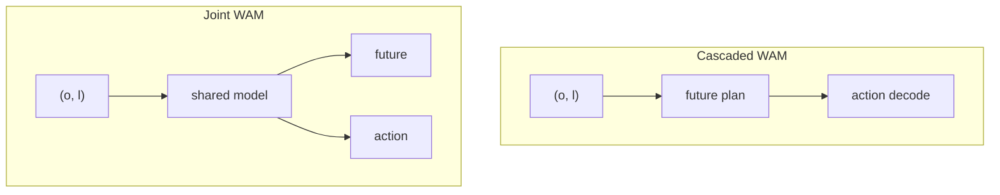

# World Action Models（WAM，世界–动作模型）

**World Action Models（WAM）**：具身基础模型中，把 **环境在干预下的前向演化（未来观测/状态）** 与 **可执行控制动作** 放在 **同一策略框架** 里联合建模的一类方法；其对象可概括为 **未来与动作的联合分布** \(p(o', a \mid o, l)\)，而不是只对动作边缘化建模。

## 一句话定义

让模型在生成动作时 **必须依托对未来世界的显式前向预测**，且该预测与动作在结构与训练目标上 **耦合**，而不是事后外挂仿真或辅助分支。

## 英文缩写速查

| 缩写 | 英文全称 | 简要说明 |
|------|----------|----------|
| WAM | World Action Model | 联合预测世界动态与动作的多模态模型 |
| VLA | Vision-Language-Action | 传统分模块的级联对照基线 |
| WM | World Model | 侧重环境预测、动作后解码的架构 |
| IDM | Inverse Dynamics Model | 由未来潜变量反推动作的常见头 |
| RL | Reinforcement Learning | 可用 WAM 想象 rollout 微调策略 |

## 为什么重要

- **VLA** 在多任务语义与语言条件上很强，但常见形态仍是 **当前观测 → 动作** 的反应式映射，对 **长程物理后果** 与 **反事实 rollout** 的显式表达有限。
- **世界模型** 擅长 \(p(o' \mid o, a)\)，却 **不单独构成** 可部署策略：还需要 planner、策略头或二阶段系统。
- **WAM** 试图把两条线收束到一个范式里：既是 **预测器** 又是 **控制器**，便于讨论 **耦合方式、数据混合、评测协议** 与 **安全部署** 上的共同问题。
- 在 [Fei-Fei 功能分类](./functional-taxonomy-world-models.md) 里，WAM 落在 **Planner**，并通常横跨 Simulator。[上海人工智能实验室 2607.06401](../entities/paper-sa-2607-06401-a-definition-and-roadmap-for-world-models.md) 据此强调：WAM **不是** 与 observation / latent / 3D 并列的第四实现列，只是「预测状态 ↔ 生成动作」的跨架构功能范式。

## 核心结构：与相邻概念的分界

| 范式 | 典型对象 | 角色 |
|------|-----------|------|
| **VLA** | \(p(a \mid o, l)\) | 语义接地强；多数实现不显式滚未来世界 |
| **World model** | \(p(o' \mid o, a)\) | 预测下一观测/潜状态；策略可外接 |
| **WAM** | \(p(o', a \mid o, l)\)（或等价分解） | **未来预测参与动作条件化**，且为 **端到端策略的一部分** |

仓库内已有 **潜空间世界–动作** 先验的实例讨论，可与本概念对照阅读：[Being-H0.7](../methods/being-h07.md)。

## 架构族谱（综述taxonomy）

综述将实现路线粗分为 **Cascaded** 与 **Joint** 两族；二者差别在于 **世界预测与动作解码的模块边界** 与 **训练时的监督如何共享**。

### Cascaded WAM

`future plan → action`：先由世界路径产生 **未来表征**（像素/视频、流、深度、潜向量、token 等），再由动作模块 **以该未来为条件** 解码控制。

- **工程直觉**：模块清晰，便于分别迭代世界模型与策略头。
- **主要张力**：两阶段 **信息瓶颈与对齐**——未来计划是否保留 **动作可恢复** 的足够信息。

**文献实例（Cascaded + 显式解耦预训练）**：[DeFI](../methods/defi-decoupled-dynamics-vla.md) 将 **GFDM（视频生成式前向动力学）** 与 **GIDM（自监督逆动力学潜动作）** 在 **不同数据源与目标** 上独立预训练，再在下游用扩散适配器耦合；论文强调弱化逆向模块（如 VPP）会成为整条链路的瓶颈（arXiv:2604.16391）。

**文献实例（Cascaded + 驾驶测试时自适应想象）**：[RISE（酷哇）](../entities/paper-rise-adaptive-imagination-wam.md) 在 Encoder–Predictor–Planner 上插 **Roll/Stop Scheduler**：用 Future Planning Gain 对代价逐步决定是否再滚 latent，而不是全局固定 \(H\)；NAVSIM v1 PDMS **91.5** / v2 EPDMS **90.8**，平均 2.40 步。配套 CounterDrive 反事实集。**不是** OpenDriveLab 同名操作 RISE（arXiv:2602.11075）。

### Joint WAM

`future + action`：在 **共享骨干** 下联合预测未来与动作（自回归统一词表、扩散/流匹配单引擎或多引擎等）。

- **工程直觉**：耦合更紧，可能更利于 **一致性** 目标。
- **主要张力**：**推理延迟**、训练目标设计、以及在多模态物理量（力触觉、形变）上的扩展。

**文献实例（Joint 族 + 显式推理枢纽）**：[Pelican-Unified 1.0](../methods/pelican-unified-1.md) 用 VLM 产生可监督 CoT 并把末态投影为稠密 **\(z\)**，再以 **同一扩散去噪** 联合解码未来视频与动作，使语言 / 视频 / 动作损失回传至共享表示——可视作在 Joint WAM 思路上显式插入 **语言推理状态** 的工程化版本（细节与数字以 arXiv:2605.15153 为准）。

**文献实例（Joint 族 + 潜自回归闭环 · 空中 VLN）**：[WorldVLN](../entities/paper-worldvln-aerial-vln-wam.md) 在 **无人机 VLN** 上将 **预训练视频潜自回归骨干** 用于 **短视界世界转移预测**，经解码器输出 **waypoint 段**，执行后把新观测写回上下文；Stage 2 使用作者所称首个面向 **自回归 WAM** 的 **Action-aware GRPO**（arXiv:2605.15964）。与 Pelican 的扩散联合去噪不同，WorldVLN 强调 **因果 observe–act–update** 与 **导航后果优化**，而非整段双向 clip 生成。

**文献实例（Joint 族 + 操纵测试时仿真 · Agibot）**：[τ₀-World Model（τ0-WM）](../entities/tau0-world-model.md) 在 **Wan-2.2 级视频扩散骨干** 上 **联合** 预测未来多视角 latent 与 **action chunk**，并用 **动作条件 rollout + 任务进度轨迹** 在执行前做 **propose–evaluate–revise**；异构 **~2.73 万小时** 数据通过 **模态掩码** 分监督（人视频不伪标机器人动作）。

**开源实例（Joint 族 + Wan MoT 三专家 · Dexmal）**：[Dexmal DW05（OpenDW）](../entities/dexmal-dw05.md) 在 **Wan 骨干 + MoT** 上分出 **video / action / value** 专家，联合 **未来视频、32D 动作与状态–价值**；发布 **DW05-Base** 与 **RoboTwin 2.0 SFT** 权重及 **RobotWin-style JSONL** 训练/推理栈（2026-07 GitHub + Hugging Face）。

**平台实例（Joint 族 + 全模态单栈 · NVIDIA）**：[Cosmos 3](../entities/cosmos-3.md) 在 **MoT** 内用 **Generator** 同时暴露 **policy、forward dynamics、inverse dynamics**，用 **Reasoner** 做具身 CoT 与 2D 轨迹规划，并支持 **Reasoning + Generation**（先文本轨迹再视频再生）；与 Cascaded「先完整视频计划再解码动作」相比，更强调 **同一 checkpoint 多任务 I/O 配置** 与 **开源 serving 栈**（arXiv:2606.02800）。代际与和 [Newton](../entities/newton-physics.md) 的分工见 [NVIDIA Cosmos](../entities/nvidia-cosmos.md)。

**相邻（世界模型优先 + 共训动作专家 · 自变量）**：[WALL-SS](../entities/paper-wall-ss.md) 主对象是 \(p(o'\mid o,a)\) 的 **next-scale AR 世界模型**，再在已提交因果状态上共训 flow-matching 动作专家；真机 Task Progress **69.1**。它更接近 Cascaded「先世界后动作」，但共享同一因果状态，而不是先滚完整视频再 IDM。**训练推理代码待发布**。

**文献实例（Joint 族 + 运动对齐潜动力学 · 人视频）**：[LD4WAM](../entities/paper-ld4wam.md) 在冻结 DINOv3 空间用 **语义重建 + Delta EE** 学跨本体 \(z\)，再以 Wan2.2 MoT 的 learnable queries 从生成未来蒸馏该码并条件动作专家；RoboTwin **93.4%**、夹爪+灵巧手真机均 **70.5%**；**确认未开源**（arXiv:2608.22403）。与 EgoWAM「换世界目标」不同，这里要求表征能回归真实末端增量。

**文献实例（Joint 族 + 双 DiT 联合训练 · VAM）**：[DiT4DiT](../entities/paper-dit4dit-video-action-model.md) 以 **Cosmos-Predict2.5 Video DiT** 与 **Action DiT** **端到端 dual flow-matching** 联合优化，用 **固定 flow 步隐状态** 条件动作；§3 验证视频生成相对 Grounding/FLARE 的 **~10× 样本效率**；LIBERO **98.6%**、G1 真机桌面与全身 loco-manip（arXiv:2603.10448，Mondo Robotics / HKUST，[开源](https://github.com/Mondo-Robotics/DiT4DiT)）。

**文献实例（Joint 族 + 双 DiT 实时闭环 · 人形 loco-manip）**：[MotionWAM](../entities/paper-motionwam-humanoid-loco-manipulation-wam.md) 以 **Cosmos-Predict2.5 系 Video DiT** 在 **固定 flow 步单次前向** 的隐状态条件 **Motion DiT**，在 **SONIC 统一全身 motion token** 上联合预测行走、躯干、身高、足端交互与双手操作；三阶段 **egocentric 视频 → 跨具身动作 → 全身遥操作** 微调，在 **宇树 G1** 九项真机任务上相对同演示微调的 VLA 基线 **整体成功率 +32% 绝对值**，并报告 **任务驱动足部行为**（arXiv:2606.09215，Mondo Robotics / HKUST）。

**文献实例（Joint 族 + 潜空间 foresight · 人形并发家务 loco-manip）**：[ω-0](../entities/paper-omega-0.md) 用 **紧凑未来观测 embedding**（非像素视频重建）耦合 **扩散全身动作 latent**，经 **SONIC** 在 G1 上执行擦桌/拖地/洗衣等 **manipulate-while-moving**；配套 **ω-HOME**（40h+）；11 任务 Omni **SR 81.8% / Progress 90.3%**，显著高于 ψ-0 / DiT4DiT / Fast-WAM 等同协议基线（arXiv:2608.06375，NTU / PKU / BAAI / HKUST-GZ；代码与数据 WIP）。

**文献实例（Cascaded 族 + latent video-motion 先验 · 人形 loco-manip）**：[Being-M0.7](../entities/paper-being-m07-humanoid-latent-wam.md) 在 **>1 万小时** 人中心混合模态（配对 video–motion / 仅视频 / 仅动作）上预训练 **DINO 视觉 latent + head-root 紧凑 motion** 的 **video-motion MoT** 先验，再以 **future-conditioned action expert** 在 **G1 VR 全身遥操作** 轨迹上接地；推理 **低频刷新 prior 计划、高频复用 KV cache** 输出 action chunk，真机四任务定量 **7/15** vs GR00T-N1.6 **2/15**、Ψ0 **3/15**（BeingBeyond Technical Report，2026-07-14）。与 [Being-H0.7](../methods/being-h07.md) 同族「潜空间 WAM」，M0.7 显式面向 **全身 loco-manipulation** 与 **SONIC** 栈。

**文献实例（Joint 族 + 移动操作三层对齐 · latent action + Dream Forcing）**：[ABot-M0.5](../entities/paper-abot-m05-mobile-manipulation-wam.md) 以 **Wan2.2** 视频骨干建立 **Video → 帧级 latent action → 可执行动作** 级联，用 **双层 D-MoT** 解耦 **移动/操作** 子空间，并以 **Dream Forcing** 在 **自生成视频 latent** 上训练逆动力学以对齐自回归 rollout；在 **RoboCasa365**（+Condensed Memory **46.6%**）、**RoboTwin 2.0**（**94.1%**）、**LIBERO-Plus 零样本 WAM 对照**（**83.4%**）与真机长程任务上报告领先表现（arXiv:2607.00678，AMAP CV Lab / 阿里巴巴）。

**文献实例（Joint 族 + 语义/像素分层记忆 · 多模态可控接口）**：[WorldScape Policy 2.0](../entities/paper-worldscape-policy-2.md) 把「历史」拆成两条互不混用的通路——**VLM 分支** 维护 **长短期事件记忆**（global-history / local-active / event-boundary 三视图 + 紧凑全历史 bank，按 \(1-\cos\) 语义变化自动选边界，无需在线标注），检索后经**逐 token 门控**融合进 4 个隐式规划 token；**causal DiT 分支** 只留近 **4 个 chunk** 干净 VAE latent 作视觉 prefill，目标图/演示视频则作 **rollout 全程持久前缀**。训练用 **semantic forcing**（T5 事件字幕做 stop-grad 语义靶，\(\lambda_s=0.001\)）把 `fine` 模式的显式语义搬进 `auto` 模式隐通路。配套 **ManipEvent-5M**（4.89M 事件段 / 744K episode / 512M 帧）做事件级预训练。RoboTwin 2.0 标准榜 **94.3%**（已饱和，对同档仅 +0.2~+0.7），但 **C2R OOD 协议 47.9%**（Fast-WAM 39.1）与真机视觉提示任务（叠积木目标图/演示视频 **60%/70%** vs \(\pi_{0.5}\) 10%/20%）差距显著；消融显示记忆三件套的增益主要落在 randomized（**+8.81**）而非 clean（+5.14）。代码与权重截至 2026-08 未发布（arXiv:2607.18840，Manifold AI / 清华 / 上交）。

**文献实例（Joint 族 + 语义 foresight / 轨迹场 alignment）**：[SG-WAM（语义引导）](../entities/paper-sg-wam-semantic-guidance.md) 用 VLM 出 text-grounded 与 spatial-aware 前瞻注入视频专家（LIBERO 98.7%，项目页 404）；[4D-WAM](../entities/paper-4d-wam.md) 用轨迹场 motion/destination alignment 后训练 FastWAM / Lingbot-VA（LIBERO-Plus +8.8 pp，仓已开源）。二者都把「好看的未来」改成「对动作有用的未来」。**SG-WAM 与 Self-Guided SG-WAM（arXiv:2608.01397）不是同一篇。**

**2026-07 动作后果横切面（策展）**：[动作后果技术地图](../overview/robot-world-models-action-consequence-technology-map.md) 将近期 WAM 按 **执行 / 修正 / 筛选** 三类接口归纳——[DSWAM](../entities/paper-dswam-dual-system-wam.md)（双系统直出动作块）、[DynaWM](../entities/paper-dynawm-vla-online-correction.md)（冻结 VLA + 在线流匹配修正）、[DreamSteer](../entities/paper-dreamsteer-vla-deployment-steering.md)（潜变量 WM 部署筛选）；接触与几何支路见 [VT-WAM](../entities/paper-vt-wam-visuotactile-contact-rich.md)、[𝒩₀-TWAM](../entities/paper-n0-twam.md)（触觉原生 Joint WAM，NeoData 规模化）、[MECo-WAM](../entities/paper-meco-wam-4d-geometry-cotraining.md)、[RynnWorld-4D](../entities/paper-rynnworld-4d-rgb-depth-flow.md)、[4D-WAM](../entities/paper-4d-wam.md)。

**文献实例（Joint 族 + 目标条件视觉导航 · Cosmos latent canvas）**：[NavWAM](../entities/paper-navwam-goal-conditioned-visual-navigation-wam.md) 在 **Cosmos Predict 2（2B）** 上构建 **九帧共享 latent 序列**（条件：state / goal image / 当前 egocentric；预测：action chunk / future state / 两帧未来观测 / goal-progress value），以 **policy / world-model / value 三模式** 联合训练；推理 **policy 模式单次扩散** 直接输出 action chunk，**无需 CEM**，在 **go stanford image-goal** 与 **Diablo 真机 24 episode** 上优于 **NWM+CEM** 与 **OmniVLA**（arXiv:2606.13494，东京大学 / NII / ATR）。

**文献实例（Joint 族 + 野外 egocentric 人数据协同训练 · 可替换世界目标）**：[EgoWAM](../entities/paper-egowam-egocentric-human-wam-co-training.md) 在 **HPT** 上 **固定骨干、flow-matching 动作头与三源数据混合**（机器人遥操作 + 域内人 + [EgoVerse](../entities/paper-egoverse.md) 野外人），**仅替换世界预测目标**（Pixel / DINO / 3D motion flow），系统检验 **WAM 动力学监督** 能否把 **具身差距** 下常失效的 **BC 人–机共训** 转为可扩展增益：**DINO** 在 OOD 物体/场景上最高约 **4×** 泛化，**3D flow** 域内 **+20–30%**；未对齐人数据时 **BC 可跌至 robot-only 以下** 而 **3D Flow** 仍鲁棒（Georgia Tech RL²，[项目页](https://gatech-rl2.github.io/egowam.github.io/)）。

**文献实例（Joint 族 + 部署期人视频 TTT steering · LDA 底座）**：[WAM-TTT](../entities/paper-wam-ttt-human-video-test-time-steering.md) 在 **冻结 LDA-1B WAM** 的 **video expert** 外挂 **Spatial-TTT fast-weight 分支**：**meta-training** 用 **2286 对** 相位同步人–机示教 + **KV 记忆重建** 对齐人 Key/Value 与机器人 Query；**部署** 仅用 **无标注 egocentric 人视频** 做 **自监督视频预测 TTT** 写入记忆即可 **steer** 新任务，无需机器人动作或全模型微调。在 **G1 + Galbot 双臂** **9 项真机** **New 家庭 OOD** 上平均 **46.2%** progress，显著优于同人视频的 **WAM-ICL（7.1%）** 与同骨干 **LDA（32.5%）**（PKU / Galbot 等，arXiv:2607.06988）。

**文献实例（Joint 族 + regret-aware 原生 CEDC · 4B 部署导向）**：[Kairos](../entities/paper-kairos-native-world-model-stack.md) 以 **Video DiT + Action DiT（MoT）** 联合 flow matching，**Stage I–II 仅训 VideoDiT、Stage III 联合 ActionDiT**；推理支持 **action-only**（不滚未来视频）与 **Kairos-joint**（联合去噪，LIBERO-Plus **89.0→90.8**）。v3 用 **control-sufficient state / \(\operatorname{Reg}_H\)** 框定目标；原生 **CEDC** 与 **仅训 ActionDiT** 消融（**−23.2** LIBERO-Plus）强调世界生成监督是控制相关表征的必要来源；代码/权重见 [kairos-agi/kairos](https://github.com/kairos-agi/kairos) 与 HF **Kairos3.1**（arXiv:2606.16533，Kairos Team / Ace Robotics）。

**文献实例（Joint 族 + beyond-RGB 结构化未来 · FastWAM 系）**：[DreamWAM](../entities/paper-dreamwam.md) 在 **VideoDiT–ActionDiT** 上把未来从「仅 RGB」扩成 **appearance / motion / geometry / semantics**：RGB+RAFT flow **联合 latent 去噪**，DA3 depth 与 DINOv2 经 **gated residual** 注入；**推理关闭 beyond-RGB 分支**，部署仍 RGB-only。相对 matched Fast-WAM-Joint：LIBERO **98.00→98.90**、LIBERO-Plus **69.16→75.47**、真机视觉扰动 **55.6→74.4**；代码与 HF 权重已开源（arXiv:2608.04996，HUST / 地瓜 / 武大 / 地平线）。

**文献实例（Joint 族 + 腿足移动操作因子分解 · FastWAM 系）**：[DECOWAM](../entities/paper-decowam.md) 在冻结适配 **FastWAM** 后仅训 **25.95M** 参数，用 **base/arm GRL 分离**、**future bottleneck** 与 **base-velocity ego-motion 条件** 联合预测未来 RGB 与 **48×14** 全身 chunk；配套 **ARMDOG** 四足+臂真机数据，79 次闭环 **全身协调** 领先（arXiv:2608.20114，清华 / 上海 AI Lab / 哈工大 / 云深处；**未开源**）。

**文献实例（Joint 族 + 分层触觉候选预报 · 接触丰富操作）**：[HiTac-WAM](../entities/paper-hitac-wam.md) 对每个候选 action chunk 预报 **contact→deformation→slip** 层次触觉未来，**排序选优 + 执行期预报验证重规划**；三任务真机 **31.1%→72.2%**（arXiv:2608.19574，中科院自动化所 / ImprintX；**未开源**）。与 [VT-WAM](../entities/paper-vt-wam-visuotactile-contact-rich.md) 联合出动作路线对照。

**文献实例（Joint 族 + 免视频 rollout 的未来 cache · FastWAM 系）**：[Rift](../entities/paper-rift-wam.md) 用闭环干预证明动作专家读的是 **位置绑定的未来 K/V**，一份 final-clean cache 几乎等于迭代去噪轨迹（Joint ADE **1.9 cm**）。再用 **anticipation token 一次 prefill** 写出该 cache，测试期不滚视频、不跑 VAE。LIBERO **98.8% / 247.9 ms**（约 **1.1×** current-only）；RoboTwin **92.9/92.6**。截至 2026-08-14 **未开源**（arXiv:2608.11521，ANU）。

**文献实例（潜动作作测试时未来意图 · Fast vs Joint 对照）**：[LAWA](../entities/paper-lawa.md) 把未来想象从像素搬进 **时序 latent action**：训练三联视频/潜动作/动作专家，推理丢掉未来视频分支。matched Fast-WAM 少样本明显更弱；LAWA 在 RoboCasa few-shot **65.6%** / full **80.8%**，相对 Joint 延迟 **−42.9%**（338 vs 593 ms），但 **没有 ego 预训练时仍落后 Joint**。项目页 Code coming soon（arXiv:2608.24882）。与 Rift「一次写未来 K/V」、Being-H0.7「训练-only 后验」对照：LAWA 在测试时仍显式去噪一条紧凑意图序列。

**文献实例（Joint 族 + 失败感知因果训练 · act-then-imagine）**：[FACT](../entities/paper-fact.md) 用共享因果扩散 Transformer **先去噪动作、再以干净动作条件化** 未来视频与任务进度；失败 rollout **掩码动作模仿、保留后果与下调进度**，降低 success-biased future hallucination，并可选 value best-of-N。RoboTwin 含失败共训 **87.5%**；真机 seen **89%**（+scoring **92%**）；代码与 HF 权重已开源（arXiv:2608.10232，UCSD）。

**文献实例（Joint 族 + 多流算力柔性 · RGB/DINO/pointmap）**：[Flex-π](../entities/paper-flex-pi.md) 以冻结 Wan VAE **共享编码 RGB 与 3D pointmap**（重建 PSNR 31.1 dB），并联合 DINOv3 语义流；MoT + 流 dropout / cross-modality forcing 使 **单 checkpoint** 覆盖 **56** 种流组合（action-only ~60 ms → full joint ~193 ms）。真机双臂 YAM 相对最强基线最高约 **2–7×**；LIBERO-Plus 80.9% 仍落后强 VLM 骨干；**代码待发布**（arXiv:2608.10860，UW / AI2）。

**文献实例（Joint 族 · 生数产品线 · GWM 自进化）**：[Motus2](../entities/paper-motus2.md) 在 Motus 共享 video–action 上暴露 **policy / simulator / evaluator** 三接口，以 **~130K h ego 人数据金字塔**、机端 mid-training 与 **DiffusionNFT MBRL + Best-of-N** 闭环灵巧双手真机（五任务宏平均 **84%**，MBRL+Planning **75%**）；轻量 tactile expert 与 global AR 记忆在同页验证。截至 2026-09-01 **未开源**。

**文献实例（Joint 族 · 生数产品线）**：[Motubrain](../entities/paper-motubrain.md) 在 Motus 的 UniDiffuser video–action 上做三流 MoT 与真机工程，RoboTwin 2.0 报 **95.8 / 96.1**；异步 chunk 怎么切见同团队 [WAM 实时异步部署](../entities/paper-wam-realtime-async.md)（仓均为占位）。

**产业实例（Joint 族 + 百万小时人视频跨具身缩放 · 闭源）**：[Dyna-2](../entities/dyna-2.md)（Dyna Robotics，2026-08）在 **≥1M h** egocentric 人视频上预训练 MoT–DiT WAM（预训练 **零** 机器人数据），报告人 held-out 与 **人→机零样本** 离线幂律，并消融主张 **video co-training** 是跨具身缩放必要条件；推理可保持 reactive（动作塔不吃预测未来视频）。后训练少量机端数据上双臂 / 灵巧手 / 半人形；**未开源**——作缩放律与目标设计参照，不作可复现基线。

**产业实例（Joint 族 + 动作优先全因果 AR · 闭源）**：[Riemann-1.0](../entities/paper-riemann-1.md)（黎曼动力 / 昆仑万维，2026-07）把交互写成 \(p(a_t\mid z_{<t},s_{<t},a_{<t})\,p(z_t\mid z_{<t},s_{<t},a_{\le t})\)：先出 action chunk 再条件化未来视觉 latent，同一 DiT 兼任策略与世界仿真。三阶段课程（LAM 伪动作 λ=0.1 → 3D 手/UMI/机 λ=0.5 → 机器人-only λ=0.9）吃 **232K+ h** 异构数据；RoboCasa365 **62.6%**（相对 [ABot-M0.5](../entities/paper-abot-m05-mobile-manipulation-wam.md) +8.4）、天机 Marvin 真机均 **85.0% SR**；**确认未开源**。与 Dyna-2 对照：人视频在这里是 **对齐原料**，不是「预训练零机器人」缩放律。

**文献实例（Joint 族 + latent foresight 查询冻结生成器 · 部署纯 VLA）**：[InternVLA-A1.5](../entities/paper-internvla-a15-unified-vla.md) 在 **Qwen3.5-2B MoT** 上持续 **VQA/子任务** 共训，用 **50 个 foresight token** 读出紧凑潜码条件化 **冻结 WAN2.2-5B**，以 video flow loss **蒸馏动力学先验** 至 unified expert，再以 **flow matching** 输出连续 action chunk；**推理丢弃视频分支**（~0.1s/步），在 LIBERO-Plus / DOMINO 零样本与真机 **组合指令 OOD** 上报告最强组合泛化（arXiv:2607.04988，上海 AI Lab Physical Intelligence Team）。

**文献实例（VLWA · 双动作对齐 · 人视频主缩放轴）**：[JoyAI-RA 0.5](../entities/paper-joyai-ra-05.md) 以 **VLM ∥ LAC-WM late-fuse → Flow Action Expert** 构成 VLWA：多视角 **LAM** 推断 latent action 条件化世界模型（隐式对齐），可靠人/机轨迹映射进 **130-D** 规范槽与相机系 chunk-relative EE（显式对齐）；部署时 LAC-WM **只抽第一帧特征、不滚像素**。在 AgiBot G1 真机上 seen **92.0** / unseen **75.5**，且人视频缩放未见饱和（京东 Joy Future Academy，arXiv:2608.05674；**未开源**）。

**文献实例（Joint 族 + 三阶段动作–动力学–语言预对齐 · Astribot S1 22 任务）**：[Lumo-2](../entities/lumo-2.md) 以 **Qwen3.5-4B** 联合建模 **潜空间世界动力学 φ** 与 **VQ 动作 chunk**，经 **Stage1 动力学↔动作、Stage2 视觉–语言语义、Stage3 VLWA 共训** 缓解「重建好但不好控」；推理用 **BAR 块解码 2.71×** 加速与历史动作记忆；在 **22 项** 真机挑战任务上全面超 **π₀.₅/Fast-WAM**，并展示 VisionPro / egocentric 人视频 **无专用迁移** 的共训增益（arXiv:2607.11270）。系统部署语境见同团队 [Philia](../entities/philia.md) agent 运行时。

## 数据与评测（概念层归纳）

- **数据**：高对齐机器人轨迹、便携人类示教、仿真特权信号、互联网/自我中心视频——关键是 **混合比例与监督对齐**，而非单一来源堆量。类目级的五层数据生态与「WAM 如何消费 action-free / action-labeled 两层数据」的横切分析见 [具身数据金字塔综述](../entities/paper-data-pyramid-embodied-manipulation.md)。
- **评测**：需同时看 **世界侧**（保真、物理常识、动作可推断性）与 **策略侧**（任务成功率、长程、sim2real、形态相关基准）；避免只用视觉逼真度或只用任务成功率 **单侧代理** 评价 WAM。

## 常见误区

- **误区 1：带 world-model loss 的 VLA 就等于 WAM。** 若未来分支仅作辅助表示、推理路径不依赖前向预测，则更宜归类为 **VLA + 辅助目标**，而非 WAM。
- **误区 2：两阶段 pipeline（先仿真再 RL）就是 Cascaded WAM。** 若世界模块是 **外部** 可微仿真/引擎而非学习策略的一部分，边界上更接近 **经典 model-based RL / planning**，与综述定义的 WAM 不完全同构。
- **误区 3：把视频生成当世界模型就自动解决控制。** 视频级预测与 **可执行、可闭环** 的控制仍隔着 **动作可识别性、因果一致性与延迟** 等工程约束。
- **边界样本：World Action Planner。** [WAP](../entities/paper-world-action-planner.md)（arXiv:2607.27599）用 **动作条件 WM 想象 + VLM 外环优化/搜索**，并把 DP/VLA/WAM 当可选工具——更接近 **级联模型基规划**，不宜直接算作 Joint WAM 策略本体。

## 与其他页面的关系

- [WAM 纵深路线](../../roadmap/depth-wam.md) — Stage 0–5 学习路径（边界族谱 → Cascaded / Joint → 部署职责三分）
- [VLA](../methods/vla.md) — 语言条件视觉策略的主线；WAM 可视为在目标分布与训练接口上的延伸讨论。
- [Generative World Models](../methods/generative-world-models.md) — 像素/潜空间动态预测工具箱；WAM 强调 **与控制头的耦合位置**。
- [世界模型功能分类](./functional-taxonomy-world-models.md) — Renderer / Simulator / Planner；WAM 是 Planner 侧、常横跨 Simulator
- [世界模型定义与路线图](../entities/paper-sa-2607-06401-a-definition-and-roadmap-for-world-models.md) — 把 WAM 写成跨架构功能范式，不新开第四列
- [Model-Based RL](../methods/model-based-rl.md) — 经典 **模型 + 规划/策略** 分解；对照理解 Cascaded WAM 的历史渊源。
- [World Action Planner](../entities/paper-world-action-planner.md) — pose-image WM + VLM 规划；相对 E2E WAM/VLA 的模型基对照。
- [Loco-Manipulation](../tasks/loco-manipulation.md) — 高 DoF 任务上 **长程协调** 与 **sim2real** 压力最集中，是 WAM 论文重点引用的评测语境之一。
- [视觉–语言导航（VLN）](../tasks/vision-language-navigation.md) — 语言条件空间决策；[WorldVLN](../entities/paper-worldvln-aerial-vln-wam.md) 提供 **UAV / 自回归 WAM** 实例。
- [AI Auto-Research（学术研究自动化）](./ai-auto-research.md) — 另一篇 **领域综述 + Awesome 列表** 维护范式（学术全生命周期 vs 具身 WAM）。

## 参考来源

- [sources/papers/world_action_models_survey_2605.md](../../sources/papers/world_action_models_survey_2605.md)
- [sources/papers/world_model_definition_roadmap_arxiv_2607_06401.md](../../sources/papers/world_model_definition_roadmap_arxiv_2607_06401.md) — WAM 不是第四架构列
- [sources/blogs/worldlabs_functional_taxonomy_world_models.md](../../sources/blogs/worldlabs_functional_taxonomy_world_models.md) — Planner 功能格
- [sources/papers/world_action_planner_arxiv_2607_27599.md](../../sources/papers/world_action_planner_arxiv_2607_27599.md)
- [sources/papers/rise_adaptive_imagination_arxiv_2608_20430.md](../../sources/papers/rise_adaptive_imagination_arxiv_2608_20430.md) — 驾驶 WAM 自适应 Roll/Stop（酷哇 RISE；非 OpenDriveLab）
- [sources/papers/dit4dit_arxiv_2603_10448.md](../../sources/papers/dit4dit_arxiv_2603_10448.md)
- [sources/papers/motionwam_arxiv_2606_09215.md](../../sources/papers/motionwam_arxiv_2606_09215.md)
- [sources/papers/abot_m05_arxiv_2607_00678.md](../../sources/papers/abot_m05_arxiv_2607_00678.md)
- [sources/papers/navwam_arxiv_2606_13494.md](../../sources/papers/navwam_arxiv_2606_13494.md)
- [sources/papers/egowam.md](../../sources/papers/egowam.md)
- [sources/papers/ld4wam_arxiv_2608_22403.md](../../sources/papers/ld4wam_arxiv_2608_22403.md) — 跨本体运动对齐潜动力学 WAM
- [sources/papers/dreammimic_arxiv_2608_22278.md](../../sources/papers/dreammimic_arxiv_2608_22278.md) — RSSM 辅助视觉全身蒸馏（对照：WM≠WAM）
- [sources/papers/glancewam_arxiv_2608_23927.md](../../sources/papers/glancewam_arxiv_2608_23927.md) — 异步稀疏前瞻 WAM（48 ms）
- [sources/papers/being_m07.md](../../sources/papers/being_m07.md)
- [sources/papers/worldvln_arxiv_2605_15964.md](../../sources/papers/worldvln_arxiv_2605_15964.md)
- [sources/papers/pelican_unified_uei_arxiv_2605_15153.md](../../sources/papers/pelican_unified_uei_arxiv_2605_15153.md)
- [sources/blogs/dyna_2_million_hour_wam.md](../../sources/blogs/dyna_2_million_hour_wam.md) — Dyna-2 百万小时跨具身缩放（闭源产业）
- [sources/papers/riemann_1_0.md](../../sources/papers/riemann_1_0.md) — Riemann-1.0 全因果动作优先 WAM（闭源）
- [sources/repos/awesome-wam-openmoss.md](../../sources/repos/awesome-wam-openmoss.md)
- [sources/sites/awesome-wam-openmoss.md](../../sources/sites/awesome-wam-openmoss.md)
- [sources/repos/awesome-world-models.md](../../sources/repos/awesome-world-models.md) — Awesome World Models 全谱策展（含 WAM/VLA 分册）
- [sources/sites/rekacs2-10k.md](../../sources/sites/rekacs2-10k.md)

## 关联页面

- [世界模型功能分类（Renderer / Simulator / Planner）](./functional-taxonomy-world-models.md)
- [世界模型定义与路线图（上海人工智能实验室）](../entities/paper-sa-2607-06401-a-definition-and-roadmap-for-world-models.md)
- [Visual General Intelligence 白皮书](../entities/paper-vgi-white-paper.md) — 具身闭环 + 生成世界模型作视觉计划；与 WAM「联合建模」同构的议程层坐标
- [Awesome World Models（精选集）](../entities/awesome-world-models.md) — WM/WAM/MBRL/应用域全谱索引
- [Dyna-2](../entities/dyna-2.md) — 百万小时人视频 Joint WAM 跨具身缩放（闭源）
- [Riemann-1.0](../entities/paper-riemann-1.md) — 全因果动作优先 AR WAM；RoboCasa365 62.6%、真机 85% SR（闭源）
- [SLIM-0.5B](../entities/paper-slim-05b.md) — 动作接地预测 latent + 紧凑 MoT flow 策略（非像素 rollout）
- [WAM 纵深路线](../../roadmap/depth-wam.md)
- [RekaCS2-10k](../entities/rekacs2-10k-dataset.md) — 职业 CS2 ego 视频 + 逐帧键鼠/轨迹，动作条件世界模型预训练语料
- [VLA](../methods/vla.md)
- [统一机器人学习综述](../entities/paper-unified-robot-learning-survey.md) — WAM 是其世界模型轴下的联合建模行
- [Generative World Models](../methods/generative-world-models.md)
- [WALL-SS](../entities/paper-wall-ss.md) — next-scale AR WM + 共训动作专家（自变量；训练代码待发布）
- [Being-H0.7](../methods/being-h07.md)
- [Being-M0.7（人形潜空间 WAM）](../entities/paper-being-m07-humanoid-latent-wam.md)
- [Pelican-Unified 1.0（UEI）](../methods/pelican-unified-1.md)
- [DiT4DiT（双 DiT 联合 VAM）](../entities/paper-dit4dit-video-action-model.md)
- [MotionWAM（人形 loco-manip · 实时 WAM）](../entities/paper-motionwam-humanoid-loco-manipulation-wam.md)
- [ω-0（潜空间 foresight · 并发家务 loco-manip）](../entities/paper-omega-0.md)
- [ABot-M0.5（移动操作 · latent action + Dream Forcing）](../entities/paper-abot-m05-mobile-manipulation-wam.md)
- [动作后果技术地图（2026-07 策展）](../overview/robot-world-models-action-consequence-technology-map.md)
- [DSWAM（双系统 WAM 执行）](../entities/paper-dswam-dual-system-wam.md)
- [ActEffect / Phi-WM 1.0](../entities/paper-phi-wm-acteffect.md) — 训练时受控 WM 反馈，部署一次前向（LIBERO 98.8%；确认未开源）
- [Motubrain](../entities/paper-motubrain.md) — 生数 Joint WAM（RoboTwin 95.8/96.1；仓占位）
- [WAM 实时异步部署](../entities/paper-wam-realtime-async.md) — Motubrain 平台六策略实证
- [Rift（免视频 rollout 的未来 cache）](../entities/paper-rift-wam.md) — anticipation token 一次写 K/V；LIBERO 98.8% / 1.1× 延迟（未开源）
- [LAWA（潜动作作未来意图）](../entities/paper-lawa.md) — 测试时去噪 latent 意图而非像素；RoboCasa 65.6/80.8%；代码待发布（arXiv:2608.24882）
- [Zero-WAM](../entities/paper-zero-wam.md) — 人类视频 in-context 任务规格；RoboTwin 未见 46.95%；真机放置/长程/插入 53.3/33.3/16.7%；代码待发布
- [HOST](../entities/paper-host-one-shot-human-video.md) — 自接地：先预测机器人未来观测再出动作；单视频 one-shot；代码+权重已开（arXiv:2607.20033）
- [WAM / VLA / 跨本体 9 篇技术地图](../overview/wam-vla-cross-embodiment-9-papers-technology-map.md)
- [DynaWM（VLA 在线修正）](../entities/paper-dynawm-vla-online-correction.md)
- [DreamSteer（部署时 VLA steering）](../entities/paper-dreamsteer-vla-deployment-steering.md)
- [4D-WAM（轨迹场 alignment）](../entities/paper-4d-wam.md) — motion + destination；LIBERO-Plus +8.8
- [SG-WAM（语义引导）](../entities/paper-sg-wam-semantic-guidance.md) — VLM foresight 注入；勿与 Self-Guided 同缩写篇合并
- [VT-WAM（视觉-触觉接触丰富 WAM）](../entities/paper-vt-wam-visuotactile-contact-rich.md)
- [𝒩₀-TWAM（NeoteAI 触觉原生 WAM）](../entities/paper-n0-twam.md)
- [WorldVLN（空中 VLN · WAM）](../entities/paper-worldvln-aerial-vln-wam.md)
- [NavWAM（image-goal 视觉导航 · WAM）](../entities/paper-navwam-goal-conditioned-visual-navigation-wam.md)
- [EgoWAM（野外 egocentric 人数据 · WAM 协同训练）](../entities/paper-egowam-egocentric-human-wam-co-training.md)
- [LD4WAM（运动对齐潜动力学 · 人视频 WAM）](../entities/paper-ld4wam.md) — DINOv3 语义码 + Delta EE；RoboTwin 93.4%、真机 70.5%；未开源（arXiv:2608.22403）
- [DreamMimic（RSSM 辅助视觉全身蒸馏）](../entities/paper-dreammimic.md) — 世界模型作蒸馏稳定器而非 Joint WAM；代码 Coming soon（arXiv:2608.22278）
- [GlanceWAM](../entities/paper-glancewam.md) — 异步单帧前瞻，动作头 48 ms；RoboCasa 72.2% / LIBERO 99.0%；已开源（arXiv:2608.23927）
- [JoyAI-RA 0.5（双动作对齐 VLWA）](../entities/paper-joyai-ra-05.md) — LAC-WM + 130-D 显式对齐；人视频缩放未见饱和（未开源）
- [WAM-TTT（人视频 · 测试时训练 steering）](../entities/paper-wam-ttt-human-video-test-time-steering.md)
- [World Action Planner（VLM + pose-image WM 规划）](../entities/paper-world-action-planner.md)
- [RISE（酷哇 · 驾驶 WAM 自适应想象）](../entities/paper-rise-adaptive-imagination-wam.md) — 测试时 Roll/Stop；勿与 OpenDriveLab 同名 RISE 混淆
- [τ₀-World Model（τ0-WM）](../entities/tau0-world-model.md)
- [HiFi-UMI](../entities/paper-hifi-umi.md) — UMI-only 后训练覆盖 VLA/WAM（LingBot-VA）骨干；2000 h 公开数据
- [INTACT](../entities/paper-intact.md) — 意图→动作无搜索 JEPA（相对 CEM 搜索的延迟对照）
- [Dexmal DW05（OpenDW）](../entities/dexmal-dw05.md)
- [X-Foresight](../entities/paper-x-foresight.md) — 驾驶域 Joint：chunk-wise 世界因果 + 动作同训（小鹏；未开源）
- [X-Mind](../entities/paper-x-mind.md) — 驾驶域 Visual CoT：PWM 内化为压缩 sketch（小鹏；未开源）
- [视觉–语言导航（VLN）](../tasks/vision-language-navigation.md)
- [Loco-Manipulation](../tasks/loco-manipulation.md)
- [Model-Based RL](../methods/model-based-rl.md)
- [具身大模型分类学选型闭环（知识链枢纽）](../overview/hub-embodied-foundation-model.md) — WAM 对应五层闭环的世界模型推演层
- [Query：具身大模型分类学选型闭环知识链](../queries/embodied-fm-taxonomy-loop.md) — WAM 是五层选型闭环 **⑤ 世界模型推演层** 的 **联合建模** 范式（`p(o',a|o,l)` 前向预测与动作生成耦合），与生成式世界模型的「级联预演」范式并列
- [EmbodiedVAE](../entities/paper-embodiedvae.md) — 操作世界模型的解耦 video VAE tokenizer（arXiv:2608.02990）
- [GIFT](../entities/paper-gift-intermediate-feature-training.md) — 把几何/可供性/目标区域监督接到 VLA 与 WAM-Fast/IDM（arXiv:2609.04193；待发布）
- [开源可复现性 9 篇技术地图](../overview/open-source-reproducibility-9-papers-technology-map.md)

## 推荐继续阅读

- Wang et al., *World Action Models: The Next Frontier in Embodied AI* — [arXiv:2605.12090](https://arxiv.org/abs/2605.12090)
- OpenMOSS **Awesome-WAM** 论文库与导航 — [GitHub 仓库](https://github.com/OpenMOSS/Awesome-WAM) · [静态站点](https://openmoss.github.io/Awesome-WAM)
- [Awesome World Models（sun254667）](https://github.com/sun254667/awesome-world-models) — 更广的 WM 全谱策展对照
