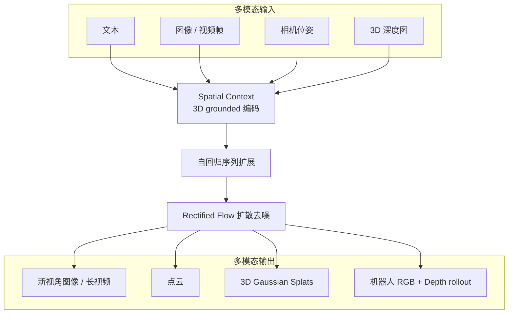

---

type: entity
tags: [world-models, spatial-intelligence, generative-ai, 3dgs, 3d-reconstruction, real-to-sim, diffusion, transformer]
status: complete
updated: 2026-09-05
related:
  - ./world-labs.md
  - ./marble-world-model.md
  - ./spark-3dgs-renderer.md
  - ../methods/generative-world-models.md
  - ../concepts/video-as-simulation.md
  - ./gs-playground.md
  - ./paper-phi-wm-acteffect.md
  - ./paper-lpwm.md
sources:
  - ../../sources/blogs/worldlabs_atlas_omni_world_model.md
  - ../../sources/sites/worldlabs-ai.md
  - ../../sources/blogs/wechat_tencent_world_model_questions_2026-09-05.md
summary: "Atlas 是 World Labs 2026 年发布的 omni 世界模型：多模态自回归扩散 Transformer，以 3D spatial context 统一相机可控生成、稀疏视角重建、时空仿真与文生图；将驱动 Marble 等产品，截至入库日为合作伙伴早期访问、未公开权重。"
---

# Atlas（World Labs omni 世界模型）

**Atlas** 是 [World Labs](./world-labs.md) 在 2026-09 公开的 **下一代世界模型**：从零预训练、原生融合 **文本、图像、视频与 3D**，用 **共享 spatial context**（每张观测锚定在 3D 位姿）条件生成后续多模态输出。架构上为 **多模态自回归扩散 Transformer**（rectified flow + Transformer），官方将其定位为可 **生成、重建与仿真** 任意世界的 **omni** 基座，并明确指向 **机器人 Real-to-Sim**（导航与操作）与创意管线中的 **相机可控长视频**、**稀疏视角 3D 重建**。

## 一句话定义

以 **3D grounded spatial context** 为核心的 **omni 世界模型**，在同一套自回归扩散 Transformer 里统一 **新视角合成、显式 3D 输出、时空 reframing 与机器人传感器仿真**。

## 英文缩写速查

| 缩写 | 英文全称 | 简要说明 |
|------|----------|----------|
| RGB | Red Green Blue | 三通道彩色图像，机器人视觉与生成模型常用观测 |
| 3DGS | 3D Gaussian Splatting | 用各向异性高斯点云表示场景并可实时光栅化渲染的 3D 表征 |
| Real-to-Sim | Real to Simulation | 从真实采集数据构建可交互仿真环境的工作流 |

## 为什么重要

- **「世界模型」的 3D omni 样本**：与仓库内大量 **像素视频 rollout** 或 **状态动力学 RWM** 不同，Atlas 把 **相机几何、深度图与 splat 点云** 放进同一序列生成框架，是观察 **空间智能 + 生成式重建/仿真合一** 的产业参照。腾讯科技 2026-09-05 访谈把它与 [LpWM](./paper-lpwm.md) / [ActEffect](./paper-phi-wm-acteffect.md) 并列，说明同一词下产品、稀疏 JEPA 与训练反馈器并不互替。
- **机器人 Real-to-Sim 叙事**：博客展示用手机短视频重建大场景，再沿规划路径生成 **机载 RGB+depth**；与 [Video-as-Simulation](../concepts/video-as-simulation.md) 共享「用生成模型补观测」动机，但强调 **显式 3D 与传感器一致 rollout**。
- **与 Marble / Spark 产品链闭合**：重建输出为 **3D Gaussian splats**，与 [Spark](./spark-3dgs-renderer.md) 渲染栈及 Marble 资产格式对齐；Atlas 定位为 **未来 Marble 等产品的模型底座**（早期访问阶段）。

## 流程总览

## 核心能力（归纳）

| 能力 | 机制要点 | 机器人 / 仿真读法 |
|------|----------|-------------------|
| **相机可控生成** | **原生相机几何** 输入（优于纯文本运镜描述）；1–6 参考图；最长约 **1 min @ 1440p** | 可用作 **虚拟多机位 / 轨迹可控** 的场景扩展与数据增广 |
| **空间重建** | 1–百余视角；少视角 **想象**、多视角 **忠实**；输出 2D、点云、splat | **Real-to-Sim 几何底座**；与专用重建模型对比博客称 SOTA 级误差 |
| **时空仿真** | 多机位视频 → **子弹时间 reframing**；同一模型生成机器人所见 RGB+depth | **导航 / 操作** 的传感器一致 rollout；可改物体、光照、背景做变体 |
| **图像生成** | 文生图、360 全景（非主任务） | 与创意管线相邻，非控制回路主路径 |

**Spatial context 编辑**：可将多张无关参考图放入 3D 空间并插值生成过渡场景（门廊、走廊等），体现 **世界知识 + 几何缝合** 而非单图外推。

## 模型架构（公开表述）

- **Multimodal**：文本、图像、位姿、深度；视频为图像序列。
- **Autoregressive**：序列逐元素生成；任务差异体现为输入/输出序列模式。
- **Diffusion**：rectified flow；推理步数可调。
- **Transformer**：可复用 LLM 侧 **KV-cache、disaggregated serving** 与扩散侧 **蒸馏、CFG、VAE** 等工程经验。

## 工程实践

| 项目 | 状态（截至 2026-09-02） |
|------|-------------------------|
| **公开 API / 权重** | 博客 **early access**，需向 World Labs 申请；**无** GitHub / HF 链接 |
| **输出格式** | 2D 帧/视频；**点云**；**3D Gaussian splats**（与 Marble 一致） |
| **重建输入** | 普通手机视频即可（博客示例 24 帧重建大场景）；多机位 reframing 约 3–5 相机 |
| **评测** | 相机跟随：第三方人工偏好；重建：多 benchmark 对专用开源模型 **更低误差**（见博客图表） |
| **Scaling** | 官方称随预训练算力提升持续改进 |

## 局限与风险

- **未开源**：截至入库日无法复现训练或本地推理；商业与学术对比只能依赖博客披露与后续发布。
- **想象 vs 忠实**：少视角时模型用世界知识 **补全不可见区域**，不适合需要 **毫米级测绘** 的工业场景而不加足够观测。
- **物理与接触**：生成式 RGB/depth/splat **不保证** 可执行动力学、接触约束或可证明安全；机器人训练仍须与解析仿真或真机闭环校验。
- **与 Boston Dynamics Atlas 机器人无关**：本页指 World Labs **世界模型** 产品名，勿与 [人形硬件选型](../queries/humanoid-hardware-selection.md) 中的 Atlas 平台混淆。

## 关联页面

- [World Labs（空间智能与世界生成）](./world-labs.md)
- [Marble（当前可注册的多模态世界产品）](./marble-world-model.md)
- [Spark（Web 3DGS 渲染器）](./spark-3dgs-renderer.md)
- [生成式世界模型](../methods/generative-world-models.md)
- [Video-as-Simulation](../concepts/video-as-simulation.md)
- [GS-Playground（3DGS × 并行仿真）](./gs-playground.md)

## 参考来源

- [Atlas 技术博客归档](../../sources/blogs/worldlabs_atlas_omni_world_model.md)
- [World Labs 官方站点归档](../../sources/sites/worldlabs-ai.md)

## 推荐继续阅读

- [Atlas: A World Model for Spatial Intelligence（官方博客）](https://www.worldlabs.ai/blog/atlas)
- [World Labs 首页](https://www.worldlabs.ai/)
- [Streaming 3DGS worlds on the web（Spark 2.0）](https://www.worldlabs.ai/blog/spark-2.0)
