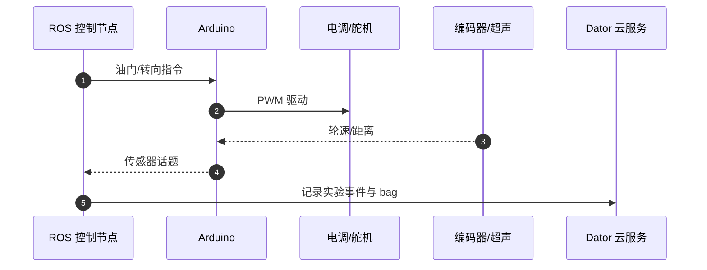

# Berkeley Autonomous Race Car（BARC）

**BARC**（Berkeley Autonomous Race Car）是 **UC Berkeley** 的 **1/10 尺度自主赛车** 开源研究与教学平台，涵盖机械/电气 CAD、ROS 控制、Arduino 执行层与 **Dator** 云数据记录。

## 一句话定义

> BARC 的价值不在单一 SOTA 漂移算法，而在 **可复制的极限驾驶实验台**：从 BOM 焊接到 ROS bag 上云，把车辆动力学与控制理论课程接到真实 RC 车上。

## 英文缩写速查

| 缩写 | 英文全称 | 简要说明 |
|------|----------|----------|
| BARC | Berkeley Autonomous Race Car | 伯克利自主赛车项目 |
| ROS | Robot Operating System | 机器人中间件；BARC 控制栈核心 |
| ESC | Electronic Speed Controller | 电调；Arduino 下发油门 |
| MPC | Model Predictive Control | 伯克利 MPC 实验室相关控制研究 |

## 为什么重要

1. **全栈开源**：`workspace/` ROS 包 + `arduino/` 固件 + `CAD/` 加工文件 + `docs/` 车辆模型说明。
2. **极限机动目标**：官方定位包含 **漂移、换道、避障**，区别于仅循迹的入门小车。
3. **云数据维度**：Dator 服务标准化实验记录，利于班课与可重复研究。

## 核心结构/机制

| 子系统 | 路径 | 作用 |
|--------|------|------|
| ROS 控制 | `workspace/` | 感知、规划、控制节点 |
| 嵌入式 | `arduino/` | ESC/舵机 + 编码器/超声 |
| 机械 | `CAD/` | 底盘与传感器支架 |
| 数据 | `Dator/` | 云端实验记录 |
| 后处理 | `MATLAB/` | ROS bag 分析脚本 |

**开源状态（2026-08-23 项目页核查）：** [barc-project.com](http://www.barc-project.com/) 指向 GitHub；仓库 **MIT 已开源**，硬件按 BOM 自建。

## 源码运行时序图

onboard 启动见仓内 `scripts/`；算法开发从 `workspace/` catkin 包入手。

## 常见误区或局限

- **误区：BARC = 纯仿真** — 核心是 **真机**；仿真竞速见 [F1TENTH Gym](./f1tenth-gym.md)。
- **局限：** ROS1 世代栈，与 ROS 2 Humble 的 [autonomous_f1tenth](https://github.com/UoA-CARES/autonomous_f1tenth) 不直接互通。

## 关联页面

- [赛车漂移 RL 开源景观](../overview/racing-drift-rl-open-source-landscape.md)
- [F1TENTH Gym](./f1tenth-gym.md)
- [MPC](../methods/model-predictive-control.md)

## 参考来源

- [sources/repos/barc.md](../../sources/repos/barc.md)
- [sources/sites/barc_project_com.md](../../sources/sites/barc_project_com.md)

## 推荐继续阅读

- [BARC GitHub Wiki](https://github.com/MPC-Berkeley/barc/wiki)
- [A Gentle Introduction to ROS](https://cse.sc.edu/~jokane/agitr/)
