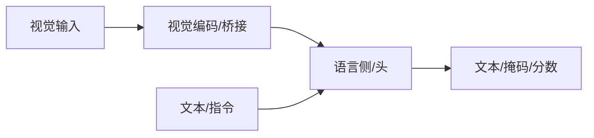

# CLIP

## 一句话定义

CLIP 用图文对比学习在超大规模配对数据上对齐双编码器，实现强零样本分类与开放词汇检索，是现代 VLM/VLA 视觉塔的重要源头。

## 英文缩写速查

| 缩写 | 英文全称 | 简要说明 |
|------|----------|----------|
| CLIP | Contrastive Language-Image Pre-Training | 对比图文预训练 |
| InfoNCE | InfoNCE Loss | 对比损失形式 |
| ZS | Zero-Shot | 零样本迁移 |
| ViT | Vision Transformer | 常用视觉塔 |
| Text Enc | Text Transformer | 文本编码器 |

## 为什么重要

- 课程第 5–6 章多模态主线节点；与机器人 VLM/VLA 选型直接相关。
- 理解其输入输出接口，才能正确接到检测、分割或策略模块。

## 核心原理

双塔分别编码图像与文本，同一配对拉近、非配对推远；推理时用文本提示当分类器权重。

## 工程实践

| 项 | 建议 |
|----|------|
| 权重 | 优先官方或 Hugging Face 发布 |
| 微调 | 指令数据质量优先；可用 LoRA |
| 机器人 | 明确延迟预算；重模型可云端核验 |

## 局限与风险

幻觉、错误 grounding、许可与安全过滤必须单独评估；开源状态以项目页为准，部署前核查权重协议。

## 关联页面

- [CLIP 论文实体](./paper-clip.md)
- [VLA / 世界模型 14 篇阅读路线](../overview/vla-wm-reading-roadmap-14-papers-technology-map.md)
- [多模态基础](../concepts/multimodality-basics.md)
- [多模态 LLM 路线](../overview/multimodal-llm-development.md)
- [BLIP-2](./paper-blip2.md)
- [Transformer CV 课程策展](../entities/transformer-cv-curriculum.md)

## 参考来源

- [Transformer 视觉应用课程大纲](../../sources/courses/transformer_cv_applications_syllabus.md)

## 推荐继续阅读

- [论文 / 项目](https://arxiv.org/abs/2103.00020)
