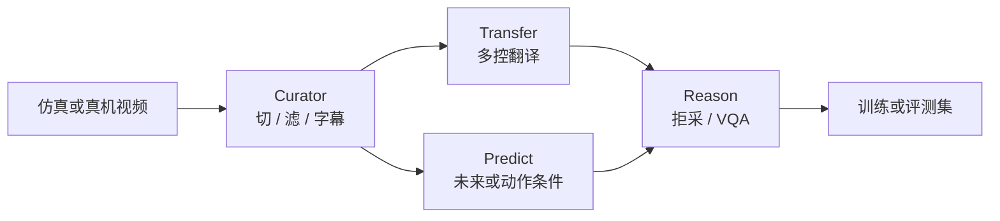

# Cosmos Cookbook（WFM 配方站）

**Cosmos Cookbook**（[文档站](https://nvidia-cosmos.github.io/cosmos-cookbook/index.html)，[GitHub](https://github.com/nvidia-cosmos/cosmos-cookbook)）是 [NVIDIA Cosmos](./nvidia-cosmos.md) **2.x 代** 的实践入口：把 Predict / Transfer / Reason / Curator / RL 拆成可复现配方，而不是再写一份模型卡摘要。

## 一句话定义

**按任务抄作业的 Cosmos 开源手册：推理、后训练、策展与端到端合成数据都有脚本；当前主线已交给 Cosmos 3，这里服务 2.x 复现。**

## 英文缩写速查

| 缩写 | 英文全称 | 简要说明 |
|------|----------|----------|
| WFM | World Foundation Model | Cookbook 覆盖的模型族总称 |
| SDG | Synthetic Data Generation | CARLA→Transfer→Reason 等全链路 |
| SFT | Supervised Fine-Tuning | Predict / Reason / Transfer 后训练主路径 |
| CABR | Content-Adaptive Bitrate | Curator 配方里替代固定码率编码 |
| VQA | Visual Question Answering | Reason 在 AV / ITS 上的后训练任务 |

## 为什么重要

- **平台页告诉你有哪些模型，Cookbook 告诉你怎么跑通一条域。** 机器人侧现成路径包括导航 Sim2Real、人形运动合成、农机感知、手术模拟器、GR00T-Dreams 拒采。
- **把 Transfer 的控制模态写成可操作指南**（Edge/Depth/Seg/Vis），避免只读论文公式。
- **交接信号清楚：** 2026-06 README 写停更；[Cosmos 3](./cosmos-3.md) 的 cookbook 改挂在 `NVIDIA/cosmos` 与 cosmos-framework。混用两套入口会装错依赖。

## 核心原理

Cookbook 按 **推理 / 训练 / 策展 / 端到端** 组织，而不是按论文章节。站内把生态收成五仓：

| 仓 | Cookbook 里做什么 |
|----|-------------------|
| **Predict** | T2I / V2W、领域 LoRA、动作条件模拟器、[Cosmos Policy](./paper-shenlan-wm-11-cosmos-policy.md) |
| **Transfer** | 多控视频翻译与 Sim2Real 增广，见 [Cosmos Transfer](./cosmos-transfer.md) |
| **Reason** | Prompt 指南、仓库安全、3D grounding、物理合理性 critic |
| **Curator** | 切镜、字幕、去重、embedding 轨迹聚类 / 离群 |
| **RL** | 大规模 SFT / RL 滚动（与 cosmos-framework 分工：后者服务 Cosmos 3） |

### 流程总览（合成数据主路径）

**读法：** Transfer 改外观、Predict 造未来、Reason 当质检。三条可以单用；GR00T-Dreams 与 Smart City SDG 是官方端到端拼法。

## 工程实践

### 上手

- **文档 / 贡献：** 任意桌面；`just install` + `just serve-external`。必须 Git LFS。
- **跑 GPU 配方：** Ubuntu 20.04–24.04，Python 3.10+，CUDA 12.4+，Ampere+。推理 ≥1 卡，训练 ≥4 卡（推荐 8）。
- **云：** Brev 上有 Transfer2.5 + Predict2.5、Reason1 现成实例。

### 机器人优先抄哪几份

| 需求 | 配方 | 模型 |
|------|------|------|
| 先搞懂控制图 | Control Modalities Guide | Transfer 2.5 |
| 驾驶仿真增广 | CARLA Sim2Real / Smart City SDG | Transfer 2.5 + Reason |
| 导航 Sim2Real | X-Mobility | Transfer 1 |
| 人形运动合成 | GR00T-Mimic | Transfer |
| 合成轨迹 + 拒采 | GR00T-Dreams | Predict 2.5 + Reason 2 |
| 视觉运动策略 | Cosmos Policy（已升 2.5） | Predict 2.5；LIBERO 98.33%、RoboCasa 71.1% |
| 稀缺域后训练 | 农机深度条件 | Transfer 2.5（2026-04-21） |

开源结论（2026-09-05）：**配方仓已开源**（Apache-2.0，~471★）；权重仍走各 HF 卡。仓 **有限维护**。

## 局限与风险

- **不要当 Cosmos 3 文档：** 3.0 的 Diffusers / vLLM-Omni / framework SFT 不在本站。
- **配方钉死 1.x/2.x checkpoint：** 复制 JSON 到 Cosmos 3 会接口对不上。
- **算力与门控：** 多数 Transfer/Predict 配方要多卡 + HF 访问申请。
- **拒采不是物理证明：** Reason 当 critic 只能滤「看起来不合理」，不能代替真机。

## 关联页面

- [NVIDIA Cosmos 平台](./nvidia-cosmos.md)
- [Cosmos Transfer](./cosmos-transfer.md)
- [Transfer1 论文](./paper-cosmos-transfer1.md)
- [Predict2.5 / Transfer2.5](./paper-sa-2511-00062-world-simulation-with-video-foundation-models-fo.md)
- [Cosmos 3](./cosmos-3.md)
- [Cosmos Policy](./paper-shenlan-wm-11-cosmos-policy.md)
- [NVIDIA SO-101 Sim2Real](./nvidia-so101-sim2real-lab-workflow.md)
- [Generative World Models](../methods/generative-world-models.md)
- [Sim2Real](../concepts/sim2real.md)
- [mimic-video](../methods/mimic-video.md)

## 参考来源

- [Cookbook 站点摘录](../../sources/sites/cosmos-cookbook.md)
- [cosmos-cookbook 仓库](../../sources/repos/nvidia_cosmos_cookbook.md)
- [NVIDIA/cosmos 仓库](../../sources/repos/nvidia_cosmos.md)
- [cosmos-transfer2.5 仓库](../../sources/repos/nvidia_cosmos_transfer25.md)

## 推荐继续阅读

- [Cosmos Cookbook 首页](https://nvidia-cosmos.github.io/cosmos-cookbook/index.html)
- [Getting Started](https://nvidia-cosmos.github.io/cosmos-cookbook/getting_started/setup.html)
- [GitHub: cosmos-cookbook](https://github.com/nvidia-cosmos/cosmos-cookbook)
- [GitHub: NVIDIA/cosmos](https://github.com/NVIDIA/cosmos) — 继任 cookbook / 模型卡
