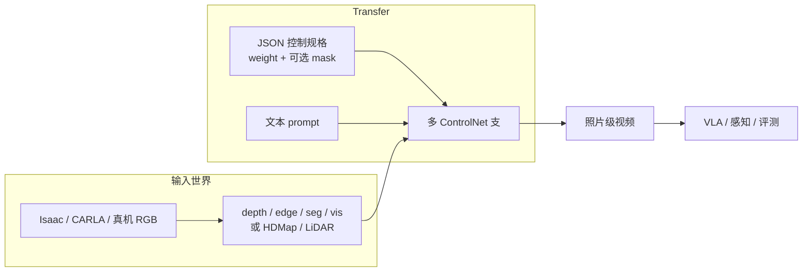
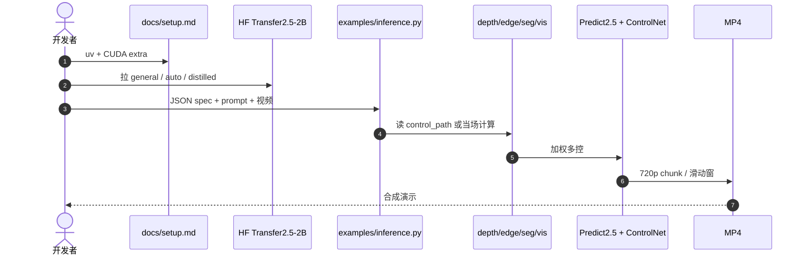

# Cosmos Transfer（条件世界翻译）

**Cosmos Transfer** 是 [NVIDIA Cosmos](./nvidia-cosmos.md) 里专门做 **world-to-world** 的一支：输入不是「从零生成世界」，而是 **已有视频 + 空间控制图 + 文本**，输出结构对齐、外观可改的照片级世界。产品文档把它写成两条增广：**仿真→照片级**（不必把 3D 场景做到像素保真）和 **缩放世界状态多样性**（同一几何换天气、材质、时段）。

## 一句话定义

**用多 ControlNet 把仿真或真机视频译成可控照片级观测：几何/语义跟控制图走，外观跟 prompt 走——用来补 Sim2Real 合成数据，而不是当物理引擎。**

## 英文缩写速查

| 缩写 | 英文全称 | 简要说明 |
|------|----------|----------|
| W2W | World-to-World | 视频条件翻译，区别于 Predict 的 T2W/I2W/V2W |
| ControlNet | Control Network | 冻结基座、另训控制支再加回主去噪 |
| Vis | Visual blur control | 双边模糊支：保颜色与粗构图 |
| HDMap | High-Definition Map | AV 支：车道、标线、3D box |
| SDG | Synthetic Data Generation | Transfer 的主工程用法 |
| PAI-Bench | Physical AI Bench | 2.5 代 Transfer 控制遵循 / 画质榜 |

## 为什么重要

- **解析仿真解决不了「看起来假」：** [Newton](./newton-physics.md) / [Omniverse](./nvidia-omniverse.md) 给几何与接触；Transfer 吃仿真 RGB + depth/seg，吐策略能吃的照片级视频。产品 FAQ 把这条写成官方分工。
- **控制可分区：** Transfer1 的时空权重图让前景跟 Edge/Vis（保机器人外形），背景跟 Depth/Seg（换厨房材质）。这是比「整段 style transfer」更接近机器人数据增广的接口。
- **体积在缩小：** [Predict2.5 论文](./paper-sa-2511-00062-world-simulation-with-video-foundation-models-fo.md) 报 Transfer2.5-2B 比 Transfer1-7B **小 3.5×** 仍提高控制遵循与画质。
- **配方已经按任务拆好：** [Cookbook](./cosmos-cookbook.md) 有 CARLA、X-Mobility、农机、仓库、GR00T-Mimic；不要从零猜 JSON。

## 核心原理

### 两代对照

| 代 | 基座 | 规模 | 控制接口 | 工程入口 |
|----|------|------|----------|----------|
| **Transfer1（2025-03）** | Predict1 Video2World DiT | 7B；AV Sample；4K Upscaler | 分模态支 + \(\mathbf{w}\in\mathbb{R}^{N\times X\times Y\times T}\) | [cosmos-transfer1](https://github.com/nvidia-cosmos/cosmos-transfer1) |
| **Transfer2.5（2025-10）** | Predict2.5 flow | **2B**；auto 多视角；robot-multiview | JSON `controlnet_specs`；可当场算 depth/seg | [cosmos-transfer2.5](https://github.com/nvidia-cosmos/cosmos-transfer2.5) |
| **Cosmos 3（2026-06）** | 全模态 MoT | 4B / 16B / 64B | 统一 Generator；Edge **不支持** V2V transfer | [NVIDIA/cosmos](https://github.com/NVIDIA/cosmos) |

机制细节与 TransferBench 数字见 [Transfer1 论文](./paper-cosmos-transfer1.md)；2.5 代 PAI-Bench 见 [Predict2.5 / Transfer2.5](./paper-sa-2511-00062-world-simulation-with-video-foundation-models-fo.md)。

### 流程总览

**读法：** 控制图钉住「什么在哪、怎么动」；prompt 改「像什么时候、什么材质」。把输出当守恒律仿真会误判。

### 控制模态怎么选

| 模态 | 保住什么 | 放开什么 | 典型用法 |
|------|----------|----------|----------|
| **Vis（模糊）** | 颜色、粗构图 | 纹理锐度 | CG→真、保机器人涂装 |
| **Edge** | 轮廓 | 颜色与材质 | 换外观、保外形 |
| **Depth** | 3D 几何 | 语义与纹理 | 保桌面/车道布局 |
| **Seg** | 物体布局 | 实例外观 | 换背景、加杂物 |
| **HDMap / LiDAR** | 路网与 3D 障碍 | 天气与光照 | AV Sample |

密结构（Vis/Edge）对齐高、多样性低；疏结构（Depth/Seg）相反。多控均匀加权在 Transfer1 TransferBench 上 Quality Score **8.54**，高于任一单模态。

## 工程实践

| 目标 | 从哪进 | 备注 |
|------|--------|------|
| 新产品 / 全模态 | [Cosmos 3](./cosmos-3.md) | 官方 2026-06 起停更 Transfer 仓；Edge 不做 V2V |
| 复现 2.5 / 旧配方 | `cosmos-transfer2.5` + [Cookbook](./cosmos-cookbook.md) | `examples/inference.py -i spec.json`；多卡 `torchrun` |
| 复现 1.0 论文 / 4K / AV Sample | `cosmos-transfer1` | 7B；Edge Distilled 1 步；Llama Guard 3 过滤 |
| 仿真→照片级 | Cookbook：CARLA、Warehouse、X-Mobility、农机 | 先保证仿真 depth/seg 对齐，再调 weight |
| 真机多样性 | Cookbook：Weather、Real-World Manipulation | 同一段 RGB 换 prompt，勿改控制图 |

开源结论（2026-09-05 项目页核查）：**Transfer1 / Transfer2.5 代码与权重已开源**（Apache-2.0 + NVIDIA Open Model License）。两仓 README 均写 **有限维护**。HF 仓多为门控。

### Transfer2.5 可跑入口

官方推理在 `docs/inference.md`。单卡 2B 约 **65.4 GB**；720p / 16 fps / 93 帧 segmentation：B200 扩散约 92 s。蒸馏 Edge 4 step，单卡相对 base 约 **7.4–7.8×**。

后训练：`docs/post-training_singleview.md`（edge/depth/seg/blur）与 `post-training_auto_multiview.md`。农机深度条件后训练见 Cookbook 2026-04-21 配方。

## 局限与风险

- **像素世界 ≠ 物理引擎：** 控制图对齐高也不保证接触力、摩擦、关节限位正确。策略仍要真机或解析仿真验收。
- **仓已停更：** 从 Transfer2.5 起步会接到「请迁 Cosmos 3」。Cosmos 3 Edge **明确不支持** video-to-video transfer——需要 V2V 时仍只能停在 2.5 或等 3.x 补口。
- **算力：** Transfer1-7B 单卡生成 5 s 720p 约 142 s；实时要 64×B200。Transfer2.5-2B 单卡仍要 65 GB 级。
- **安全过滤：** Transfer1 用 Llama Guard 3（独立许可）；关掉 guardrail 只为测速，不能当产品默认。

## 关联页面

- [Cosmos-Transfer1 论文](./paper-cosmos-transfer1.md) — 自适应多控与 TransferBench
- [Predict2.5 / Transfer2.5 论文](./paper-sa-2511-00062-world-simulation-with-video-foundation-models-fo.md)
- [Cosmos Cookbook](./cosmos-cookbook.md) — 可运行配方
- [NVIDIA Cosmos 平台](./nvidia-cosmos.md)
- [Cosmos 3](./cosmos-3.md) — 当前母栈
- [Newton Physics](./newton-physics.md)
- [NVIDIA Omniverse](./nvidia-omniverse.md)
- [NVIDIA SO-101 Sim2Real 动手课](./nvidia-so101-sim2real-lab-workflow.md) — Strategy 3 增广
- [Generative World Models](../methods/generative-world-models.md)
- [Sim2Real](../concepts/sim2real.md)
- [Video-as-Simulation](../concepts/video-as-simulation.md)
- [Manipulation](../tasks/manipulation.md)

## 参考来源

- [Transfer1 项目页](../../sources/sites/cosmos-transfer1-project.md)
- [cosmos-transfer1 仓库](../../sources/repos/nvidia_cosmos_transfer1.md)
- [Transfer1 论文摘录](../../sources/papers/cosmos_transfer1_arxiv_2503_14492.md)
- [Transfer2.5 官方文档](../../sources/sites/cosmos-transfer25-docs.md)
- [cosmos-transfer2.5 仓库](../../sources/repos/nvidia_cosmos_transfer25.md)
- [Cosmos Cookbook 站点](../../sources/sites/cosmos-cookbook.md)
- [Predict2.5 论文摘录](../../sources/papers/cosmos_predict25_arxiv_2511_00062.md)

## 推荐继续阅读

- [Cosmos Cookbook · Control Modalities](https://nvidia-cosmos.github.io/cosmos-cookbook/core_concepts/control_modalities/overview.html)
- [GitHub: cosmos-transfer2.5](https://github.com/nvidia-cosmos/cosmos-transfer2.5)
- [GitHub: cosmos-transfer1](https://github.com/nvidia-cosmos/cosmos-transfer1)
- [arXiv:2503.14492](https://arxiv.org/abs/2503.14492)
- [NVIDIA Docs: Transfer2.5](https://docs.nvidia.com/cosmos/latest/transfer2.5/index.html)
