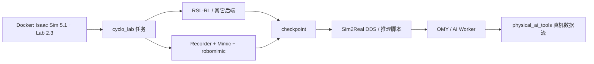

# cyclo_lab

**cyclo_lab** 是 [ROBOTIS](./robotis.md) 在 [Isaac Lab](./isaac-lab.md) 上的官方强化学习 / 模仿学习扩展（[`ROBOTIS-GIT/cyclo_lab`](https://github.com/ROBOTIS-GIT/cyclo_lab)，~144★，Apache-2.0）。**K1 人形**若走 MuJoCo/mjlab 而非 Isaac，见姊妹仓 [cyclo_mjlab](./robotis-cyclo-mjlab.md)。定位与 [unitree_rl_lab](./unitree-rl-mjlab.md)、[Deep Robotics rl_training](./deeprobotics-rl-training.md)、[DDT_Lab](./ddt-lab.md) 同属 **厂商官方 Lab**，侧重 **操作臂 / AI Worker** 而非四足 locomotion。

## 一句话定义

在 Isaac Lab 中注册 ROBOTIS **OMY / FFW-BG2** 等 RL 与 IL（含 Mimic）任务，提供 Docker 训练环境与 **DDS Sim2Real** 脚本，真机 bringup 交给 `open_manipulator` / `ai_worker`，数据集训练界面指向 `physical_ai_tools`。

## 英文缩写速查

| 缩写 | 英文全称 | 简要说明 |
|------|----------|----------|
| Isaac Lab | NVIDIA Isaac Lab | 本仓依赖的仿真训练框架 |
| RSL-RL | Robotic Systems Lab RL | README 示例默认 RL 后端之一 |
| IL | Imitation Learning | 录制 → Mimic → robomimic BC |
| BC | Behaviour Cloning | robomimic 训练算法示例 |
| DDS | Data Distribution Service | Sim2Real bringup / SDK 桥 |
| OMY | OpenMANIPULATOR-Y | 主要桌面臂任务机型 |
| FFW | Freedom From Work | AI Worker 任务前缀 |

## 为什么重要

- **ROBOTIS 官方 Isaac Lab 入口**：做 OMY / AI Worker 策略时，比在社区多厂商库里「碰巧有模型」更贴近官方任务名与 Sim2Real 说明。
- **RL + IL + Mimic 同仓**：Reach/Lift/Drawer 与 Stack/PickPlace Mimic 管线并列，适合对照操作学习范式。
- **厂商 Lab 对照表补位**：站内已有宇树 / 云深处 / 直驱 Lab；本页补上 ROBOTIS。

## 核心原理

| 步骤 | 说明 |
|------|------|
| 扩展安装 | `source/cyclo_lab`；推荐 `./docker/container.sh start` |
| RL 示例 | `Cyclo-Reach-OMY-v0`、`Cyclo-Lift-Cube-OMY-v0`、`Cyclo-Open-Drawer-OMY-v0`、`Cyclo-Reach-FFW-BG2-v0` |
| IL 示例 | `Cyclo-Stack-Cube-OMY-IK-Rel-v0`、`Cyclo-PickPlace-FFW-BG2-IK-Rel-v0`（+ Mimic 变体） |
| 训练后端 | `scripts/reinforcement_learning/{rsl_rl,rl_games,sb3,skrl}/` |
| Sim2Real | `scripts/sim2real/`：`sh5_dds_bringup.py`、OMY reach 推理、`isaaclab2lerobot` 转换 |

## 工程实践

1. 对齐徽章：**Isaac Sim 5.1.0 · Isaac Lab ≥2.2（镜像 2.3）· Python 3.11**；需 NVIDIA Container Toolkit。
2. `git clone --recurse-submodules https://github.com/ROBOTIS-GIT/cyclo_lab.git` → `./docker/container.sh start` → `enter`。
3. RL：`python scripts/reinforcement_learning/rsl_rl/train.py --task Cyclo-Reach-OMY-v0 --num_envs=512 --headless`。
4. IL：按 README 走 `record_demos` → `annotate_demos` → `generate_dataset` → `robomimic/train.py`；单机键盘遥操作可加 `--keyboard`。
5. 真机：OMY 用 [open_manipulator](https://github.com/ROBOTIS-GIT/open_manipulator)；AI Worker 用 [ai_worker](./robotis-ai-worker.md)；采集训练界面用 [physical_ai_tools](./robotis-physical-ai-tools.md)。
6. 社区多厂商速度跟踪对照：[robot_lab](./robot-lab.md)（本仓偏操作，不是四足 loco 替代）。

## 局限与风险

- **开源状态：已开源**（Apache-2.0）；可运行脚本齐全。
- **版本矩阵硬**：与其它厂商 Lab 的 Isaac / RSL 版本钉法不同，环境勿混用。
- **真机栈分仓**：本仓不替代 `ai_worker` bringup；README 明确 Sim2Real 依赖外部硬件仓。
- **任务覆盖**：当前公开示例以臂式操作与 FFW reach/pick-place 为主，不是全身人形 locomotion Lab。

## 关联页面

- [ROBOTIS hub](./robotis.md) · [AI Worker](./robotis-ai-worker.md)
- [Physical AI Tools](./robotis-physical-ai-tools.md) · [MuJoCo Menagerie](./robotis-mujoco-menagerie.md)
- [unitree_rl_lab](./unitree-rl-lab.md) · [Deep Robotics rl_training](./deeprobotics-rl-training.md) · [DDT_Lab](./ddt-lab.md) · [robot_lab](./robot-lab.md)
- [Isaac Lab](./isaac-lab.md) · [Sim2Real](../concepts/sim2real.md)

## 参考来源

- [sources/repos/cyclo_lab.md](../../sources/repos/cyclo_lab.md)
- 上游：<https://github.com/ROBOTIS-GIT/cyclo_lab>

## 推荐继续阅读

- Isaac Lab 文档：<https://isaac-sim.github.io/IsaacLab/>
- [ai.robotis.com](https://ai.robotis.com/)
