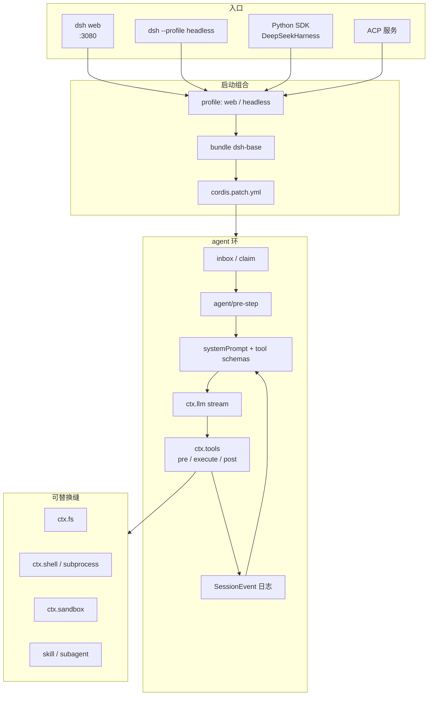
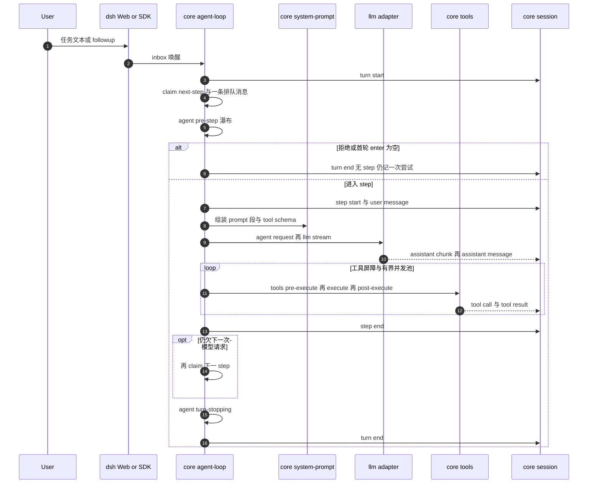

# DeepSeek Harness

**DeepSeek Harness**（`dsh`，[deepseek-ai/deepseek-harness](https://github.com/deepseek-ai/deepseek-harness)）是 [深度求索（DeepSeek）](https://deepseek.com) 发布的开源 **agent harness**：把模型适配、工具注册、会话日志与 agent 环本身都做成可替换插件，内核为仓内 vendored 的 [Cordis](https://github.com/cordiverse/cordis)。根包版本 **0.1.0-rc.5**，许可 **MIT**。截至入库日处于 **开发者预览**，README 明确将出现破坏兼容变更。

## 一句话定义

用 **Cordis 插件树** 组装一条可替换的「模型请求 → 工具执行 → 可回放 session log」环，经 **Web UI / headless / Python SDK / ACP** 跑编码与仓库级任务；默认接 DeepSeek API，也可挂目录或自定义 OpenAI-compatible 端点。

## 英文缩写速查

| 缩写 | 英文全称 | 简要说明 |
|------|----------|----------|
| dsh | DeepSeek Harness | 本页运行时与 CLI 名（`npx @deepseek-ai/dsh web`） |
| Cordis | Cordis plugin runtime | 时空可组合的插件内核；注册是可卸载的 effect |
| ACP | Agent Client Protocol | 自动化-only 服务，对接 IDE / 外部编排 |
| SDK | Software Development Kit | `deepseek-harness-sdk`：Python 里启动捆绑运行时 |
| LLM | Large Language Model | 经 `ctx.llm` 适配缝接入；默认 DeepSeek 路由 |
| API | Application Programming Interface | DeepSeek / 目录 provider / 自定义网关的请求面 |
| PTY | Pseudo-Terminal | 持久 bash 后端依赖 POSIX 终端；最小 Python 示例不支持 Windows |

## 核心信息

| 字段 | 内容 |
|------|------|
| 机构 | 深度求索（DeepSeek） |
| 类型 | 插件化 LLM agent 运行时（Web + headless + SDK） |
| 版本 | 0.1.0-rc.5（2026-08-13 根 `package.json`） |
| 代码 | <https://github.com/deepseek-ai/deepseek-harness> |
| 许可 | MIT |
| 开源结论 | **已开源**（完整可运行 monorepo + 已发布 Python SDK）；模型权重不随仓分发 |
| 项目页 | 无独立站点；Issues / PRs 关闭，反馈走 Discussions |

## 为什么重要

- **官方 DeepSeek 宿主：** 本库已有 [Hermes Agent](./hermes-agent.md)、[OpenClaw](./openclaw.md)、[Kimi Code / K3](./kimi-k3.md) 等 coding agent 选项；`dsh` 是 DeepSeek 自己的 **可组合运行时**，而不是又一个聊天壳。
- **一切皆插件：** 模型适配、工具、session log、agent loop 都在 Cordis 树上，没有「只能改核心才能加能力」的特权核。换沙箱 / 文件系统 / 子代理 provider 走 **capability seam**，而不是 fork 循环。
- **可编程入口齐：** `npx` Web UI、`--profile headless` 一次性任务、`DeepSeekHarness` Python SDK（安装后不需本机 Node）适合接到 [autoresearch 闭环](../queries/real-robot-policy-autoresearch-harness.md) 的「读日志 → 改代码 → 再跑」一侧。
- **同名必须拆开：** [Harness VLA](./paper-harness-vla.md) 与 [RoboHarness](./paper-robo-harness.md) 是 **冻结 VLA + planner** 的具身编排；本页是 **通用 LLM agent OS**。不要按「Harness」三字合并选型。

## 核心原理

### 组合：profile → bundle → patch

一次运行是按层叠起来的插件树，而不是单进程硬编码：

| 层 | 职责 |
|----|------|
| **profile** | 命名组合（模板：`web`、`headless`）；列出 bundle，可挂树外插件与 `cordis.patch.yml` |
| **bundle** | 可分发的 Cordis 配置行 + 代码；`dsh-base` 是每条 profile 的第一层（模型、工具、持久化、沙箱、审批、凭据） |
| **patch** | 按 id 整行替换或插入；顺序：各 bundle → profile patch → home patch → `--patch` |

`dsh --profile web --dump-config` 打印本机实际启动树；打印出的每一行都可被上层 patch 换掉。

### 不变量：模型可见 ⟺ 已入日志

`deriveMessages()` 从 **append-only session log** 投影模型历史。任何进入模型请求的内容必须能从日志重建；新的模型可见输入要新增 `SessionEvent`。UI / fork / resume / telemetry 都派生自同一条流。

### 能力缝（capability seam）

一条可替换能力必须凑齐三角：**Service Definition**（接口）、**Service Provider**（实现）、**Consumer**（常用是面向模型的 tool）。只加其中一个不算缝。文件系统与 subprocess 共享执行世界，把它们指到远程沙箱时，Bash / PTY / LSP 一起走，无需各写一份 provider。

### 流程总览

### 源码运行时序图

对齐官方 [agent-lifecycle](https://github.com/deepseek-ai/deepseek-harness/blob/master/docs/agent-lifecycle.md)：一个 **turn** 含零个或多个 **step**（一次模型请求 + 其工具调用）。`turn/*`、`step/*`、`user/message`、`assistant/*`、`tool/*` 是可回放的 session 事件；`agent/*` 与 `tools/*` 是运行中扩展点。

`Driver` 对应仓内 `core/agent-loop`（避免 Mermaid 把参与者名 `Loop` 解析成保留字 `loop`）。复现路径：先 `npx @deepseek-ai/dsh web` 配 API key 与 workspace；无头/评测走 Python `examples/jsonrpc-agent/minimal.py` 或 `pnpm dsh --profile headless`。

## 工程实践

| 场景 | 做法 |
|------|------|
| 最快看见 UI | 安装 Node 后 `npx @deepseek-ai/dsh web`；浏览器开 `http://127.0.0.1:3080`；Settings → Models 写入 DeepSeek key（存 `$DSH_HOME/.credentials.yaml`，页面只回红acted 描述） |
| 选工作区 | Web UI 必须先 **Choose workspace**，否则 composer 不可用；进程以启动目录为默认文件系统根 |
| 源码开发 | `git clone` → `pnpm install` → `pnpm run build` → `pnpm dsh web`；改 `packages/` 前读仓内 `docs/architecture.md` |
| 一次性任务 | `pnpm dsh --profile headless "task"`；需 `DEEPSEEK_API_KEY`，可选 `DEEPSEEK_BASE_URL` / `DSH_MODEL` |
| Python 编排 | `pip install deepseek-harness-sdk`；`DeepSeekHarness(..., cordis=minimal.cordis.yml)` 懒启动捆绑运行时；**复用 session id 会保留持久 bash 状态** |
| 其它模型 | Settings 加目录 provider（Anthropic / OpenAI 等）或自定义 OpenAI-compatible 网关；手填模型默认 **仅文本**，要图需在 `settings.yaml` 写 `input: [text, image]` |
| 扩能力 | 新模型挂 `ctx.llm`；新工具挂 `ctx.tools`；新行为优先走文档化事件，而不是改 `agent-loop` |
| 社区插件 | 仓库加 GitHub topic `dsh-plugin`；Issues/PRs 关闭，反馈走 Discussions |

最小 Python 组合（官方示例）只暴露持久 `bash` 与 `str_replace_editor`，**`danger-full-access`**：只应在一次性 checkout 或容器里跑。

## 局限与风险

- **开发者预览：** 无外部消费者承诺；磁盘格式、SQLite `SCHEMA_VERSION`、session format 都可能不向后兼容。不要把本页命令行当长期 API 合同。
- **不是机器人栈：** 不替代仿真、WBC、VLA 或 Robot Gateway。把它当「改训练脚本 / 读日志 / 写评测」的宿主，而不是下发 `cmd_vel` 的控制平面。
- **DeepSeek 官方 chat-completions 路由是纯文本：** 文档写明不能配成多模态；要图必须走声明了 `image` 的自定义/目录模型。
- **权限面大：** 最小 SDK 示例可改运行时进程可见的任意路径；生产前换沙箱 / 审批策略，不要把 `danger-full-access` 对着真机工控机。
- **Windows：** 持久 PTY 组合需要 POSIX 终端；官方最小 Python 示例不支持 Windows agent。
- **治理面：** 公开 Issues/PRs 关闭，贡献路径以仓内 `CONTRIBUTING.md` 与 Discussions 为准；第三方插件质量不由本页背书。

## 关联页面

- [Hermes Agent](./hermes-agent.md) — 常驻 agent OS（网关 / 记忆 / cron）；对照「插件树 vs 单体 AIAgent」
- [OpenClaw](./openclaw.md) — 个人助手 + 技能目录；具身课里作语音控制平面
- [ScienceDiscovery](./sciencediscovery.md) — 本地科研工作台（MCP 文献 + bwrap）；对照「科学 Connector vs 通用 coding 环」
- [openJiuwen](./openjiuwen.md) — ScienceDiscovery 所属开源 Agent 平台
- [Kimi K3](./kimi-k3.md) — 开放权重长程编码后端；可与 dsh 的自定义 OpenAI-compatible 路由对照
- [CLI-Anything](./cli-anything.md) — 生成 agent-native CLI / SKILL；宿主层与 dsh 的 `packages/skill` 互补
- [HarnessBank](./paper-harnessbank.md) — 冻结模型下进化 **宿主** harness（概念相邻、实现不同）
- [Harness VLA](./paper-harness-vla.md) — **同名不同物**：冻结 VLA + LLM planner（RPent）
- [RoboHarness](./paper-robo-harness.md) — 具身策略族编排，勿与本页合并
- [真机策略 autoresearch 闭环](../queries/real-robot-policy-autoresearch-harness.md) — coding agent 后端选型
- [AI Auto-Research](../concepts/ai-auto-research.md) — 研究自动化阶段论
- [LLM Wiki（Karpathy 模式）](../references/llm-wiki-karpathy.md) — 知识编译 vs 可执行 agent 运行时

## 参考来源

- [DeepSeek Harness 仓库归档（本站）](../../sources/repos/deepseek-harness.md)
- [deepseek-ai/deepseek-harness（GitHub）](https://github.com/deepseek-ai/deepseek-harness)
- [docs/architecture.md](https://github.com/deepseek-ai/deepseek-harness/blob/master/docs/architecture.md)
- [docs/agent-lifecycle.md](https://github.com/deepseek-ai/deepseek-harness/blob/master/docs/agent-lifecycle.md)
- [docs/user/guide/index.md](https://github.com/deepseek-ai/deepseek-harness/blob/master/docs/user/guide/index.md)
- [docs/user/guide/python-sdk.md](https://github.com/deepseek-ai/deepseek-harness/blob/master/docs/user/guide/python-sdk.md)
- [Cordis](https://github.com/cordiverse/cordis)

## 推荐继续阅读

- [Web UI 指南](https://github.com/deepseek-ai/deepseek-harness/blob/master/docs/user/guide/index.md) — 配模型、选 workspace、审批策略
- [模型 / provider 配置](https://github.com/deepseek-ai/deepseek-harness/blob/master/docs/user/guide/providers.md) — DeepSeek key、目录 provider、自定义网关与图像模态
- [Python SDK 指南](https://github.com/deepseek-ai/deepseek-harness/blob/master/docs/user/guide/python-sdk.md) — `DeepSeekHarness` 生命周期与 `danger-full-access` 边界
- [Cordis 设计论文](https://github.com/cordiverse/paper) — *A Programming Paradigm for Spatiotemporal Composability*
