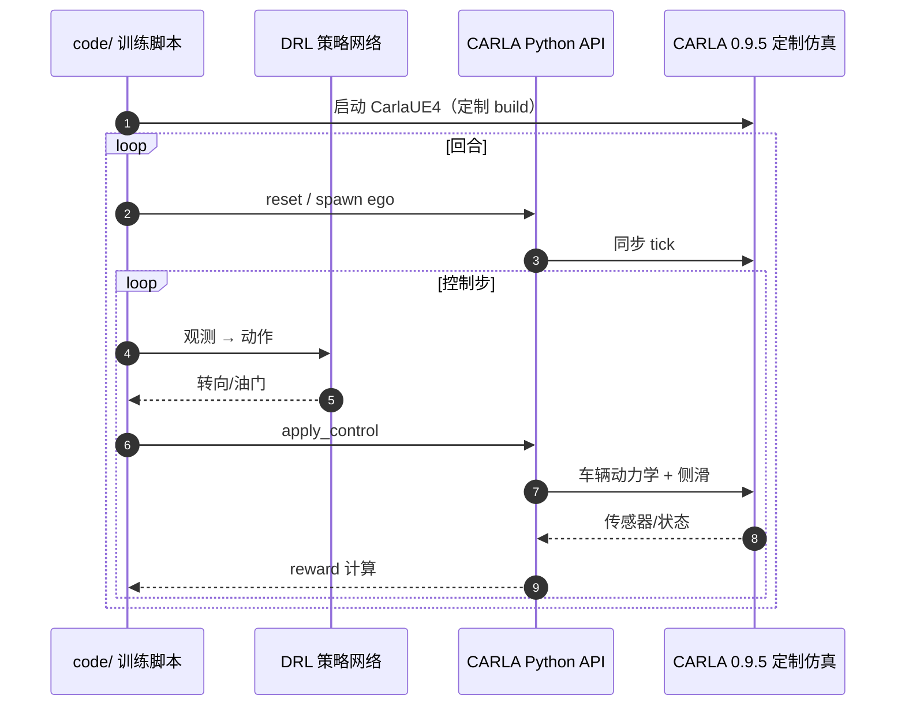

# drift_drl（High-speed Autonomous Drifting with DRL）

**drift_drl** 是 Cai 等提出的 **高速自主漂移深度强化学习** 方法与官方实现（*IEEE RA-L & ICRA 2020*），在 **CARLA 0.9.5 定制仿真** 上训练侧滑稳定的高速过弯策略。

## 一句话定义

> 在 RL 漂移文献里，drift_drl 是 **CARLA 系早期标杆**：用分阶段参考轨迹与定制低层车辆模型，把「高速漂移过弯」做成可复现的 DRL 基准——但复现门槛在 **非主线 CARLA 版本**。

## 英文缩写速查

| 缩写 | 英文全称 | 简要说明 |
|------|----------|----------|
| DRL | Deep Reinforcement Learning | 深度强化学习 |
| CARLA | Car Learning to Act | 仿真宿主 |
| ICRA | IEEE International Conference on Robotics and Automation | 2020 发表会议 |
| RA-L | IEEE Robotics and Automation Letters | 同期期刊 |

## 为什么重要

1. **问题定义清晰**：七张地图 + 公开参考轨迹 `code/ref_trajectory`，便于对照后续工作（如 [DOA](https://github.com/ustcly/DOA)）。
2. **CARLA 漂移范式先驱**：影响后续 CARLA 0.9.14 障碍漂移等研究。
3. **项目页与代码齐全**：[Google Sites](https://sites.google.com/view/autonomous-drifting-with-drl) 链到 GitHub（**已开源 MIT**）。

## 核心结构/机制

- **环境：** `conda env create -f environment_drift.yaml` → `drift`
- **仿真：** 作者 Google Drive 提供的 **CARLA 0.9.5 build**（非 `pip install carla` 主线）
- **训练阶段：** traj_0 对应 map(a) 一阶段；traj_1–5 对应 map(b–f) 二阶段；traj_6 评测 map(g)
- **论文：** https://arxiv.org/abs/2001.01377

## 源码运行时序图

复现关键：先按 README 配置定制 CARLA 路径环境变量，再进入 `code/` 训练。

## 工程实践

| 项 | 说明 |
|----|------|
| 开源状态 | **已开源**（GitHub + 项目页）；仿真包单独下载 |
| GPU | README 测试 GTX 1080Ti |
| OS | Ubuntu 16.04 / 20.04 |

## 常见误区或局限

- **误区：任意 CARLA 版本可跑** — 需作者 **0.9.5 定制 build**；与 [DOA](https://github.com/ustcly/DOA) 的 0.9.14 **不通用**。
- **局限：** 仓库 2021 年后较少更新；新项目更常看 f1tenth_gym 或 xcar-rlgpu 轻量栈。

## 关联页面

- [CARLA](./carla.md)
- [赛车漂移 RL 开源景观](../overview/racing-drift-rl-open-source-landscape.md)
- [强化学习](../methods/reinforcement-learning.md)

## 参考来源

- [sources/repos/drift_drl.md](../../sources/repos/drift_drl.md)
- [sources/sites/drift_drl_google_sites.md](../../sources/sites/drift_drl_google_sites.md)

## 推荐继续阅读

- [论文 PDF](https://arxiv.org/abs/2001.01377)
- [DOA 仓库](https://github.com/ustcly/DOA) — CARLA 0.9.14 障碍漂移后继
