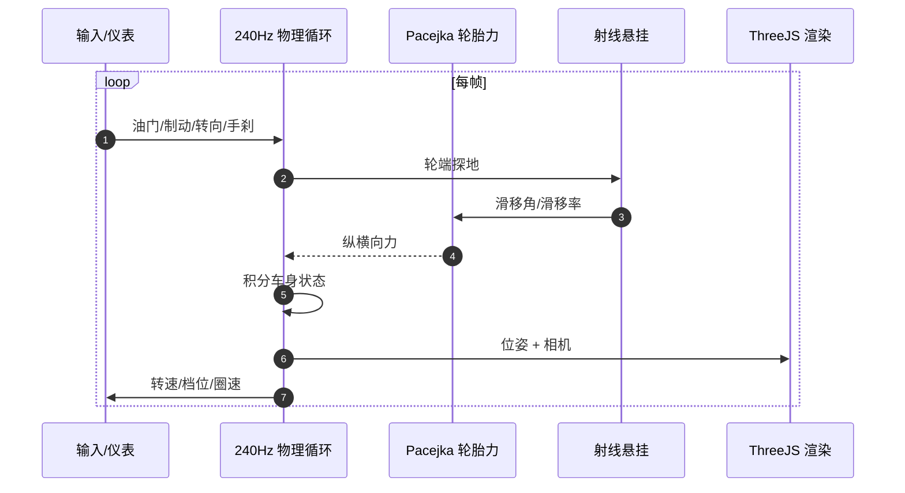

# drive-game（Nürburgring Drive）

**drive-game** 是面向 **纽博格林** 等真实赛道的 **浏览器/Android 第一人称驾驶模拟器**：**Three.js** 渲染叠在自研 **240 Hz** 车辆物理之上，赛道几何来自 **OpenStreetMap + DEM 高程**。

## 一句话定义

> 若研究目标是「**可读源码的 Pacejka + 射线悬挂**」而非 RL 训练环境，drive-game 提供 **可本地 `npm run dev` 跑通** 的完整纽北体验，并公开 [系统说明页](https://drive-game.pages.dev/data/game_logic.html)。

## 英文缩写速查

| 缩写 | 英文全称 | 简要说明 |
|------|----------|----------|
| OSM | OpenStreetMap | 纽北/Spa 赛道中心线几何来源 |
| DEM | Digital Elevation Model | 数字高程，铺真实纵坡 |
| Pacejka | Pacejka tire model | 联合滑移轮胎力模型 |
| Three.js | — | WebGL 3D 渲染库 |
| Capacitor | — | Web 代码打包 Android 的桥接层 |

## 为什么重要

1. **真实赛道数据管线**：20.7 km 纽北 + Spa，区别于纯程序化或缩放赛道。
2. **高频率物理**：240 Hz 积分 + 天气/路面 grip，适合对照 [MPC](../methods/model-predictive-control.md) 论文中的轮胎饱和区直觉。
3. **全栈可 fork**：MIT 开源，含幽灵圈、走线、AudioWorklet 引擎声与 Android 构建脚本。

## 核心结构/机制

- **在线：** [drive-game.pages.dev](https://drive-game.pages.dev)
- **本地：** `npm install && npm run dev` → `localhost:8741`
- **物理：** 射线悬挂、Pacejka 联合滑移、离合弹射、气动、分路面 grip
- **开源状态（2026-08-23）：** 项目页与 GitHub 一致，**MIT 已开源**，可完整本地构建

## 源码运行时序图

## 常见误区或局限

- **误区：这是 RL 训练 Gym** — 面向 **人类可玩模拟器**；要训策略见 [f1tenth-gym](./f1tenth-gym.md) 或 [xcar-rlgpu](./xcar-rlgpu.md)。
- **局限：** 非科研基准环境，无标准 RL API；与 [nordschleife-racer](./nordschleife-racer.md) 相比更偏 **仿真器手感** 而非 arcade 多人。

## 关联页面

- [nordschleife-racer](./nordschleife-racer.md) — 另一纽北浏览器引擎（多人/排行榜）
- [starter-kit-racing](./starter-kit-racing.md) — Kenney 街机 GridMap 样板（非纽北）
- [赛车漂移 RL 开源景观](../overview/racing-drift-rl-open-source-landscape.md)

## 参考来源

- [sources/repos/drive_game.md](../../sources/repos/drive_game.md)
- [sources/sites/drive_game_pages_dev.md](../../sources/sites/drive_game_pages_dev.md)

## 推荐继续阅读

- [系统逻辑说明（线上）](https://drive-game.pages.dev/data/game_logic.html)
- [构建日志 making](https://drive-game.pages.dev/making)
