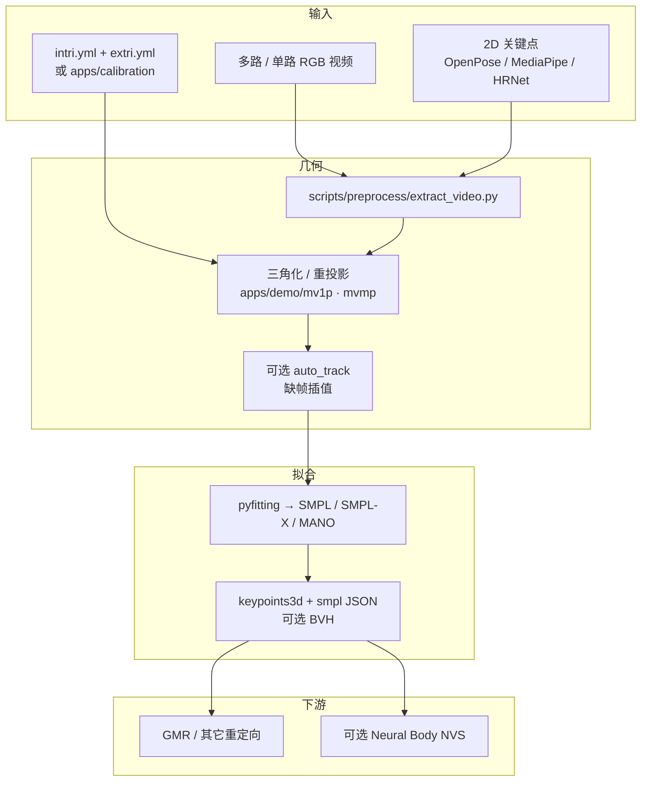

# EasyMocap（无标记人体动捕工具箱）

**EasyMocap**（仓库自称 *Easy Human Motion Capture Toolbox*，[zju3dv/EasyMocap](https://github.com/zju3dv/EasyMocap)，[文档站](https://chingswy.github.io/easymocap-public-doc/)）是 **浙江大学（ZJU）** CAD&CG 三维视觉组维护的 **无标记人体动捕** 工具箱：从 **RGB 视频**（标定多相机、互联网单目、镜面视频）恢复 **SMPL / SMPL+H / SMPL-X / MANO**，并可选接到 **Neural Body** 做稀疏视角新视角合成。它输出的是 **人体运动学参数**，不是机器人关节指令。

## 英文缩写速查

| 缩写 | 英文全称 | 简要说明 |
|------|----------|----------|
| MoCap | Motion Capture | 动作捕捉；本工具箱走无标记 RGB 路线 |
| SMPL | Skinned Multi-Person Linear Model | 参数化人体；本仓拟合目标，也是重定向上游 |
| SMPL-X | SMPL with eXpressions | 带手 / 脸的扩展人体模型 |
| MANO | hand Model with Articulated and Non-rigid defOrmations | 本仓多视角手部拟合目标 |
| HMR | Human Mesh Recovery | 从图像恢复人体网格；本仓以多视角优化为主、单目用 SPIN 初始化 |
| NVS | Novel View Synthesis | 稀疏视角新视角合成；本仓经 Neural Body / MultiNeuralBody |

## 为什么重要

- **把「标定多相机 + 2D 关键点」收成可跑工具箱：** 相对只发论文、不发管线的 HMR 工作，EasyMocap 把抽帧、标定、标注、三角化、SMPL 拟合、可视化做成同一套 `apps/` + `emc` CLI，是 2021 年后学术 / 实验室 **无标记棚拍** 的常见入口。
- **ZJU-MoCap 的工程母体：** LightStage（示例 23 路同步相机）与 Mirrored-Human 都经本方法产出；后续 [HumanNeRF](https://grail.cs.washington.edu/projects/humannerf/) 等大量动态人 NeRF 工作以该数据集为基准。申请须签协议，不是随仓下载。
- **和同组 [GVHMR](./gvhmr.md) 构成「多视角工具箱 vs 单目世界坐标 HMR」：** EasyMocap 吃 **已标定相机** 或镜面几何；GVHMR 吃 **野外单目** 并输出重力对齐世界轨迹。选型时先问有没有外参，而不是比谁更新。
- **机器人栈里它只做上游：** 输出 SMPL JSON / 可选 BVH，须再经 [Motion Retargeting](../concepts/motion-retargeting.md) 与 [GMR](../methods/motion-retargeting-gmr.md) 才能进跟踪或模仿学习。

## 核心原理

主干不是端到端网络，而是 **2D 检测 → 多视角几何 → 参数化人体优化**（思路接近 SMPLify-X 的 3D 关键点损失 + TotalCapture 的多视角拟合，但不依赖点云）。

| 输入 | 机制 | 输出 |
|------|------|------|
| 同步多视角视频 + `intri.yml` / `extri.yml` | 2D 关键点（OpenPose / MediaPipe / HRNet）→ 三角化 / 重投影优化 → `easymocap/pyfitting` 拟合 | `keypoints3d` + `smpl` JSON |
| 互联网单目 | 2D 关键点 + SPIN 等 CNN 初始化再拟合 SMPL | 相机系局部姿态（无 GVHMR 式世界轨迹） |
| 含镜子的视频 | 把镜面当作额外虚拟视角（Mirrored-Human） | 缓解单目深度歧义 |
| 多视角多人 | mvpose 关联 + `auto_track` 时序跟踪再拟合 | 带 `id` 的多人序列 |
| 稀疏多视角 RGB + 人体先验 | Neural Body / MultiNeuralBody 隐式场 | 新视角图像（不是控制参考） |

SMPL 参数约定与官方层不同：**`poses` 前 3 维置零，全局朝向单独存 `Rh`**，顶点 \(V = R\,X(\theta,\beta) + T\)。换坐标系时可直接写 \(R'(RX+T)+T'\)，新的全局旋转 / 平移为 \(R'R\) 与 \(R'T+T'\)。接到 [GMR](../methods/motion-retargeting-gmr.md) 或其它官方 SMPL loader 前必须先做这次转换，否则根朝向会错。

## 流程总览

## 工程实践

| 项 | 做法 |
|----|------|
| 安装 | 文档站钉 **Python 3.9 + 指定 CUDA/PyTorch wheel**，再 `pip install -r requirements.txt` 与 `python setup.py develop`；入口命令 `emc` |
| 人体模型 | 从 SMPL / MANO / FLAME 官方站点申请，放到 `data/bodymodels/`；仓内不带权重 |
| 多视角单人 demo | 下载官方 23 相机示例后：`extract_video.py` → `apps/demo/mv1p.py --vis_smpl`（`--model smplx` / `manol` 切换身体模型） |
| 多视角多人 | `apps/demo/mvmp.py` → `auto_track.py --track3d` → 再拟合 SMPL |
| 自有数据 | `<seq>/videos/*.mp4` + 标定 YAML；标定与标注见 `apps/calibration/`、`apps/annotation/` |
| 开源状态 | **已开源（科研许可）**。代码与文档站公开；ZJU-MoCap 全量数据 **协议申请**；iMocap 多视频特定动作 README 仍标 Coming soon |
| 调试信号 | `--vis_det` / `--vis_repro` 看 2D 与重投影；`Rh` 跳变常见于轴角 ±π 绕回（2026-03 提交用旋转矩阵空间平滑修复） |

## 局限与风险

- **许可不是 MIT/Apache：** LICENSE 仅允许教育 / 研究 / 非营利；衍生修改须开源且禁止商用。产品或闭源管线接入前必须先走 `xwzhou@zju.edu.cn` 商业授权，不要和 [FreeMoCap](./freemocap.md) 的 AGPL 或后续 GVHMR 仓混为一谈。
- **依赖标定质量：** 多视角路径假设相机同步且外参可靠。户外手机阵列能跑，但外参误差会直接变成骨骼尺度与脚滑，而不是「网络再训一下就好」。
- **单目路径不是 world-grounded HMR：** 互联网视频分支用 2D + SPIN 初始化，输出相机系局部姿态。要重力对齐世界轨迹应改 [GVHMR](./gvhmr.md)，而不是把 EasyMocap 单目结果直接当 GMR 输入。
- **依赖栈偏旧：** 官方快捷安装仍写 CUDA 11.x 与 PyTorch 1.9 / 1.12、`setuptools==59.5.0`。2026 年新环境需要对齐文档钉死的组合，而不是默认最新 wheel。
- **数据集不是随下随用：** ZJU-MoCap 要协议 + 邮件；demo zip 只够跑通管线，不够当大规模训练语料。
- **输出不能驱动机器人：** SMPL 是人体模型。上 G1 / H1 必须经过 [Motion Retargeting Pipeline](../concepts/motion-retargeting-pipeline.md) 的拓扑映射、IK 与物理筛选。

## 关联页面

- [GVHMR](./gvhmr.md) — 同组后续单目 world-grounded HMR，互补而非替代
- [FreeMoCap](./freemocap.md) — 低成本多相机 GUI；许可与研究向拟合深度不同
- [MAMMA](./paper-mamma-markerless-motion-capture.md) — 研究级多视角 SMPL-X + 双人交互，精度对标 Vicon
- [SMPL-X](../concepts/smpl-x.md) — 本仓可拟合的带手 / 脸人体表示
- [Motion Retargeting](../concepts/motion-retargeting.md) — 人体参数到机器人关节的映射
- [Motion Retargeting Pipeline](../concepts/motion-retargeting-pipeline.md) — EasyMocap 作为「干净多视角 SMPL」上游源
- [GMR](../methods/motion-retargeting-gmr.md) — 常见几何重定向落点
- [4DAnyone](./paper-4danyone.md) — 无外参单目 → 多视角外观；有标定时仍优先本页做运动拟合

## 参考来源

- [EasyMocap 仓库归档](../../sources/repos/easymocap.md)
- [EasyMocap 文档站归档](../../sources/sites/easymocap-public-doc.md)

## 推荐继续阅读

- 仓库：<https://github.com/zju3dv/EasyMocap>
- 文档站：<https://chingswy.github.io/easymocap-public-doc/>
- Neural Body 分仓：<https://github.com/zju3dv/neuralbody>
- iMocap 论文：<https://arxiv.org/abs/2008.07931>
- Mirrored-Human 论文：<https://arxiv.org/abs/2104.00340>
- Neural Body 论文：<https://arxiv.org/abs/2012.15838>
