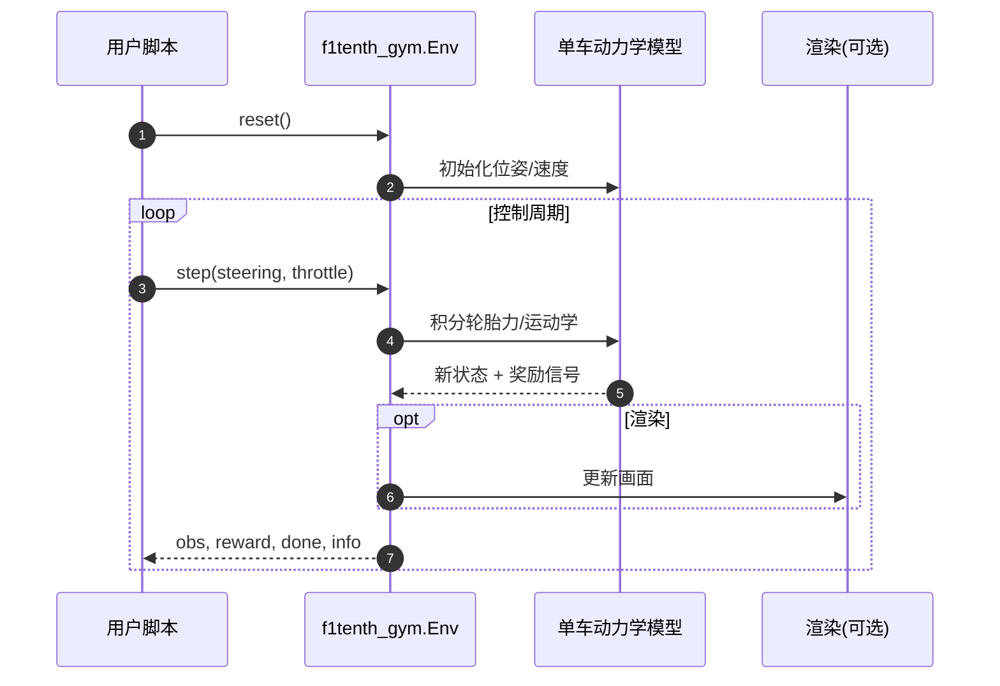

# F1TENTH Gym

**F1TENTH Gym** 是 [F1TENTH](https://f1tenth.org/) 自主竞速社区维护的 **Python Gymnasium 环境**，用简化但可调的单车动力学在 CPU 上快速迭代竞速与漂移策略。

## 一句话定义

> 若要把「1/10 赛车 RL」从 ROS/Gazebo 重栈里剥离出来快速试错，**f1tenth_gym** 是最常用的轻量仿真入口：`pip install -e .` 即可跑 waypoint follow，再交给 Gym-Khana 等封装做 SB3 训练。

## 英文缩写速查

| 缩写 | 英文全称 | 简要说明 |
|------|----------|----------|
| F1TENTH | — | 1/10 尺度自主竞速国际标准与赛事生态 |
| Gym | Gymnasium | Python RL 环境 API（原 OpenAI Gym 继任） |
| RL | Reinforcement Learning | 策略学习范式 |
| Ackermann | Ackermann steering geometry | 前轮转向几何，F1TENTH 底盘类型 |

## 为什么重要

1. **社区标准仿真器**：比完整 Gazebo/ROS 栈轻一个数量级，适合课程与算法迭代。
2. **下游生态多**：[Gym-Khana](https://github.com/TeoIlie/Gym-Khana)（SB3 漂移）、[LearningMPC](https://github.com/mlab-upenn/LearningMPC)（ROS 侧对照）都默认引用同一车辆族。
3. **与真机对齐路径清晰**：F1TENTH 硬件、NVIDIA 教程与奥克兰 CARES 栈（[autonomous_f1tenth](https://github.com/UoA-CARES/autonomous_f1tenth)）共享车型语义。

## 核心结构/机制

- **安装：** `pip install -e .`（推荐 virtualenv）
- **示例：** `examples/waypoint_follow.py`
- **可选：** Docker + nvidia-docker GUI
- **文档：** https://f1tenth-gym.readthedocs.io

## 源码运行时序图

典型复现路径：`pip install -e .` → `examples/waypoint_follow.py`；RL 训练见下游 Gym-Khana。

## 常见误区或局限

- **误区：f1tenth_gym = 完整 F1TENTH 软件栈** — 真机部署还需 ROS 驱动、感知与 [autonomous_f1tenth](https://github.com/UoA-CARES/autonomous_f1tenth) 或厂商栈。
- **局限：** README 记载 Windows Python 版本与 macOS OpenGL 渲染问题；高保真视觉漂移见 [CARLA](./carla.md) 系。

## 关联页面

- [赛车漂移 RL 开源景观](../overview/racing-drift-rl-open-source-landscape.md)
- [BARC](./barc.md) — 另一 1/10 硬件研究平台
- [xcar-rlgpu](./xcar-rlgpu.md) — GPU 向量化漂移 RL 对照

## 参考来源

- [sources/repos/f1tenth_gym.md](../../sources/repos/f1tenth_gym.md)
- [赛车漂移 RL 开源景观](../../sources/papers/racing_drift_rl_open_source_landscape.md)

## 推荐继续阅读

- [F1TENTH 官网](https://f1tenth.org/)
- [Gym-Khana 文档](https://gym-khana.readthedocs.io)
