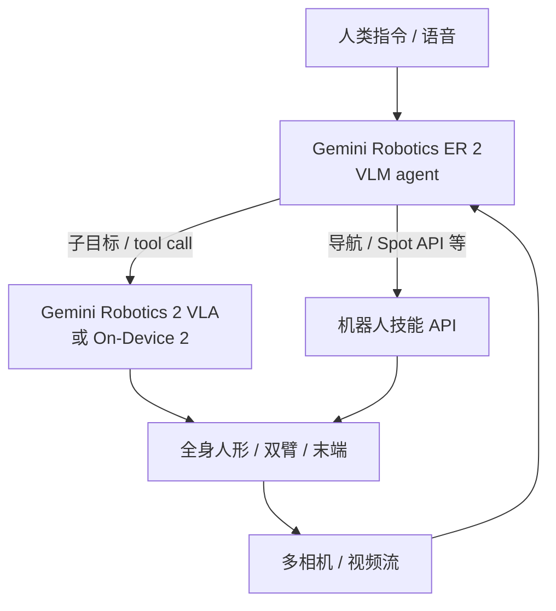
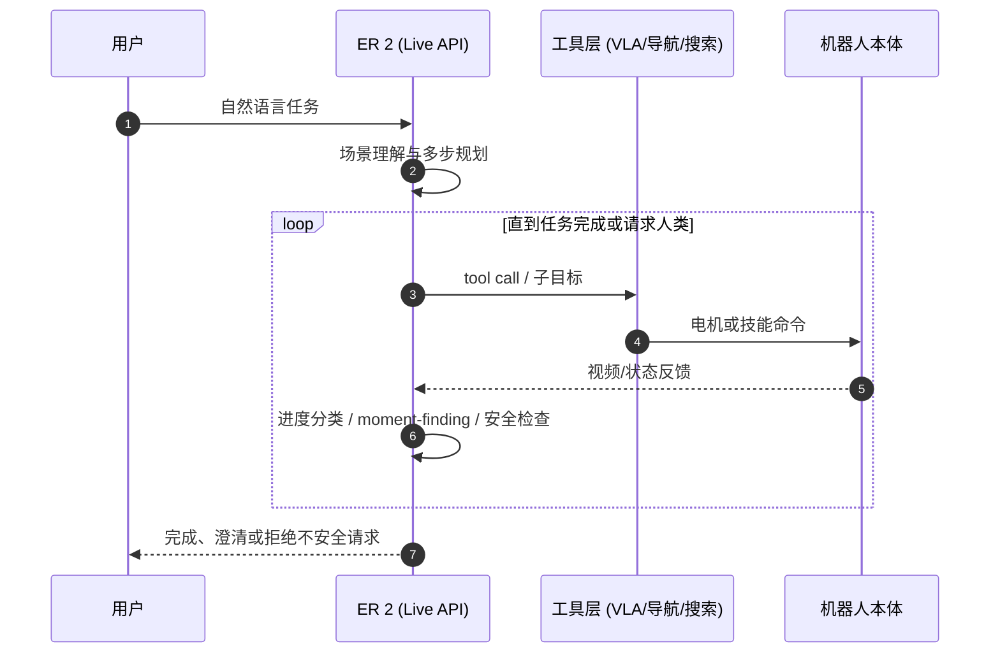
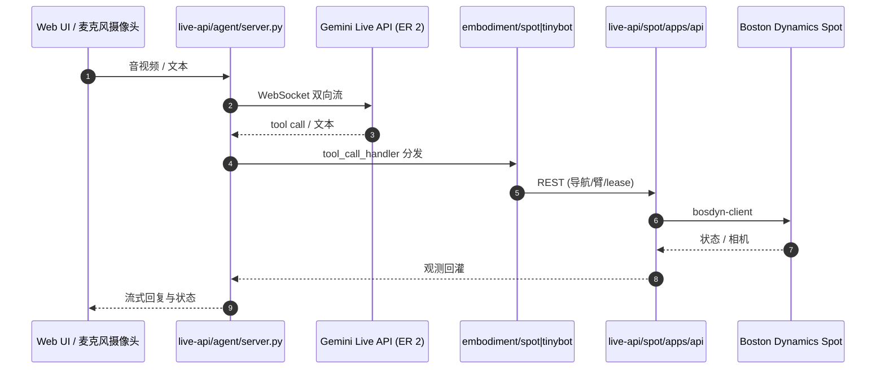

# Gemini Robotics

**Gemini Robotics** 是 Google DeepMind 面向物理交互的 Gemini 系列机器人模型族。HMI 论文/报告总索引将其收录为 **P061**（世界模型、VLA 与 Agent）。当前主版本叙事为 **Gemini Robotics 2**（2026-07-30）。

## 一句话定义

**Gemini Robotics**：面向物理交互的 Gemini 系列机器人模型族，由 **VLA 策略骨干**、强调空间/任务编排的 **Embodied Reasoning（ER）** agent，以及可本地运行的 **On-Device VLA** 组成；**Gemini Robotics 2** 把可控范围从桌面上身扩展到人形 **feet-to-fingertips** 全身，并引入多机协作与数小时级跨本体适配。

## 英文缩写速查

| 缩写 | 英文全称 | 简要说明 |
|------|----------|----------|
| VLA | Vision-Language-Action | 视觉–语言 → 电机控制的策略模型 |
| ER | Embodied Reasoning | 具身推理 / 高层 agent（VLM），编排 VLA 与工具 |
| VLM | Vision-Language Model | Gemini 多模态语言主干；ER 变体属此类 |
| DoF | Degrees of Freedom | 如 SharpaWave 手 22 DoF |
| Live API | Gemini Live API | 双向流式端点，供 ER 低延迟编排 |

## 为什么重要

- 代表闭源多模态大模型接入机器人控制的产品化叙事，常与开源 [Octo](../methods/octo-model.md) / [OpenVLA](./openvla.md) / [π 系列](../methods/pi07-policy.md) 对照阅读。
- **GR2** 明确把「全身 loco-manipulation + 多指灵巧 + 多机协作」写进同一产品线，是产业侧对 [loco-manipulation](../tasks/loco-manipulation.md) 与学习式 [WBC](../concepts/whole-body-control.md) 的强信号。
- ER 变体把「会做动作」与「会分解长程任务」拆开；ER 2 另提供 **可调用的 API + 样例仓**，而 VLA 权重仍 gated。
- 在自动标注与评测生态中常被用作强教师/对照（见 [Perceptron Egocentric](./perceptron-egocentric.md) 对 ER-1.6 的用法）。

## 核心原理

公开材料通常强调分层：

1. **ER（高层）**：理解指令与场景 → 多步计划 → 调用 VLA / 导航 / 搜索等工具 → 用视频进度分类与 moment-finding 判断何时与完成。
2. **VLA（低层动作）**：视觉 + 语言 → 全身或双臂电机命令；同一 checkpoint 可覆盖不同手/夹爪本体（官方演示）。
3. **On-Device VLA**：本地推理 + 「motion transfer」式快速适配新双臂本体（博客：数小时、<200 例量级）。

与早期 [PaLM-E](./paper-palm-e-embodied-language-model.md) 一脉相承的是「传感器与语言共享推理上下文」，但 Gemini Robotics 更明确地把输出接到机器人执行接口。

### Gemini Robotics 2 能力轴（官方博客归纳）

| 轴 | 要点 | 可信度读法 |
|----|------|------------|
| 全身控制 | Apollo 2 走取放、蹲伸、清理杂乱房间叙事 | 演示；速度自承仍不足 |
| 灵巧 | SharpaWave 打结/封袋；Robotiq 紧凑装箱 | 多指成功率方差大，博客点名仍难 |
| 多机协作 | 异构机器人分工完成单机难做的 workflow | ER 2 编排；样例偏 Spot API |
| 跨本体 | 同 checkpoint 跨 Apollo 手型与 Franka；On-Device 适配 SO101 等 | 适配数据量自报 |
| 安全 | ASIMOV-Agentic；人靠近急停；安全报告 PDF | 自报基准 + 公开 PDF |

## 流程总览

## 源码运行时序图

**VLA / On-Device 训练与权重：不适用**（early-access，无公开训练仓）。

**ER 2 编排样例（可运行，对齐 [`robotics-samples`](../../sources/repos/google-gemini-robotics-samples.md)）：**

关键复现路径：`live-api/agent` 用 `uv` 启动 Physical Agent Server，配置 `GEMINI_API_KEY`；Spot 侧另起 `live-api/spot` REST，再把 `--robot_url` 指过去。入门 notebook：`Getting Started/gemini_robotics_er.ipynb`。

## 工程实践

1. **能力边界与数值以官方博客 + 安全 PDF + Model Card 为准**，不要只引用二手摘要；读取日期写进笔记。
2. **开源状态（2026-07-31 项目页核查）**

| 组件 | 状态 | 入口 |
|------|------|------|
| ER 2 | API public preview | [AI Studio / `gemini-robotics-er-2-preview`](https://ai.dev/prompts/new_chat?model=gemini-robotics-er-2-preview)、[Robotics docs](https://ai.google.dev/gemini-api/docs/robotics-overview) |
| 编排样例 | **已开源** Apache-2.0 | [robotics-samples](https://github.com/google-gemini/robotics-samples) |
| VLA 2 / On-Device 2 | **未开源权重** | Trusted Tester / partners |
| 安全报告 | 公开 PDF | [Gemini-Robotics-2-Safety.pdf](https://storage.googleapis.com/deepmind-media/gemini-robotics/Gemini-Robotics-2-Safety.pdf) |

3. 与开源通用策略对比时，对齐任务定义、数据可见性与是否允许专用微调。
4. **自动标注对照：** Macrodata **WGO-Bench** 以 **Gemini 3.5 Flash + Gemini Robotics ER-1.6** 构建机器人子任务分段管线——见 [Perceptron Egocentric](./perceptron-egocentric.md)；ER 2 的 progress/moment 能力可作为后续对照候选，但勿直接替换旧数字。
5. 人形部署仍应假设需要低层跟踪 / 安全层；博客「全身 VLA」不等于取消 [WBC](../concepts/whole-body-control.md) 与接触约束栈。

## 结论

**Gemini Robotics 2 适合作为「闭源全身 VLA + 可调用 ER agent」对照节点：ER 侧可跟 API/样例仓动手，VLA 权重仍不可当作本地开源基线。**

- 读 GR2 时分开三层：ER 编排、云端 VLA、On-Device 适配——访问权限不同。
- 全身与多指是宣传主轴，但官方自承 **速度与多指灵巧仍弱**；引用成功率必须回图并标「自报」。
- 跨本体叙事（同 checkpoint / 数小时适配）与 [hub-cross-embodiment](../overview/hub-cross-embodiment.md) 对照读，勿与 OXE 开源迁移混为一谈。
- 安全侧优先读 Safety PDF 与 ASIMOV-Agentic，而不是演示视频。
- 与 PaLM-E / RT / 开源 VLA 对照时分开「推理 API」与「可部署动作接口」。

## 局限与风险

- VLA / On-Device **权重与完整训练数据不可复现**；仅 ER API + 样例可工程试用。
- 产品迭代快，博客数字需标注读取日期；勿把营销演示写成学术 SOTA。
- 「同一 checkpoint 跨本体」的泛化边界（传感器、DoF、接触模态）未在公开材料中完整披露。
- HF 上 ASIMOV-Agentic 可能有访问限制；写入评测前先核对该数据集实际可见性。

## 关联页面

- [VLA](../methods/vla.md)
- [Foundation Policy](../concepts/foundation-policy.md)
- [Whole-Body Control](../concepts/whole-body-control.md)
- [Loco-Manipulation](../tasks/loco-manipulation.md)
- [DPC](./paper-dpc.md) — 把 GR2 这类分层全身 VLA 写成 System 1→冻结 System 0 的三条瓶颈例（Symbiosis 2026-08）
- [跨具身迁移（知识链）](../overview/hub-cross-embodiment.md)
- [PaLM-E](./paper-palm-e-embodied-language-model.md)
- [Perceptron Egocentric](./perceptron-egocentric.md)
- [HMI 论文导读](../queries/hmi-papers-coverage.md)
- [六条路线的窟窿](../queries/embodied-six-routes-holes.md) — ER 作为高层编排、VLA 作为手的产业坐标
- [CLIFT](./paper-clift-closed-loop-iterative-finetuning.md) — 通过托管 SFT API 把 Gemini Robotics On-Device 适配成人形专才（arXiv:2607.29172）

## 参考来源

- [gemini_robotics_2_whole_body.md](../../sources/blogs/gemini_robotics_2_whole_body.md) — GR2 主发布博客归档
- [gemini-robotics.md（产品页）](../../sources/sites/gemini-robotics.md)
- [google-gemini-robotics-samples.md](../../sources/repos/google-gemini-robotics-samples.md)
- [ted_xiao_embodied_three_eras_primary_refs.md](../../sources/blogs/ted_xiao_embodied_three_eras_primary_refs.md)
- [humanoid-motion-intelligence.md](../../sources/repos/humanoid-motion-intelligence.md)

## 推荐继续阅读

- [Gemini Robotics 2 发布博客](https://deepmind.google/blog/gemini-robotics-2-brings-whole-body-intelligence-to-robots/)
- [Introducing Gemini Robotics ER 2（开发者博文）](https://blog.google/innovation-and-ai/models-and-research/google-deepmind/gemini-robotics-er-2/)
- [Gemini Robotics 产品页](https://deepmind.google/models/gemini-robotics/)
- [ER 2 Model Card](https://deepmind.google/models/model-cards/gemini-robotics-er-2/)
- [Safety Technical Report (PDF)](https://storage.googleapis.com/deepmind-media/gemini-robotics/Gemini-Robotics-2-Safety.pdf)
- [robotics-samples（GitHub）](https://github.com/google-gemini/robotics-samples)
- [Gemini Robotics 1.5 博客（前代）](https://deepmind.google/blog/gemini-robotics-15-brings-ai-agents-into-the-physical-world/)
