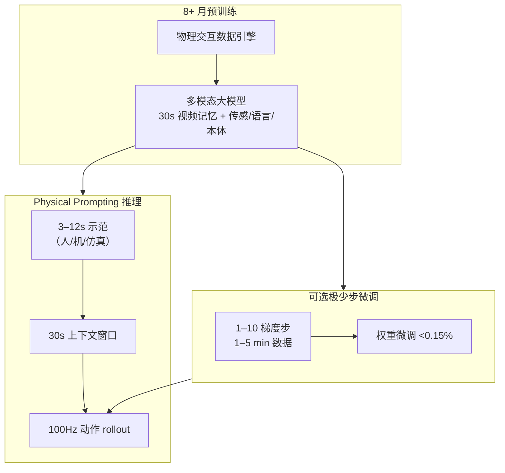

# GEN-1.5 一次示范学习（Physical Prompting）

| 字段 | 内容 |
|------|------|
| **机构** | 通用人工智能（Generalist AI） |
| **类型** | 产业官方博客（非 peer-reviewed 论文） |
| **模型** | GEN-1.5（前序 GEN-1 / GEN-0） |
| **发布** | 2026-08 |
| **开源** | **确认未开源**（无公开代码 / 权重 / 数据集；2026-09-04 再核公司 GitHub / 博客仍无仓） |

## 一句话定义

**GEN-1.5** 将语言模型的 **in-context learning** 类比搬到具身侧：把 **3–12 秒 sensorimotor 示范** 插入 **30 秒上下文** 作 **physical prompt**，预训练基座即可 **无梯度** 执行新短程灵巧任务，并可用 **1–10 步** 微调在分钟级数据上逼近更高成功率。

## 英文缩写速查

| 缩写 | 英文全称 | 简要说明 |
|------|----------|----------|
| GEN-1.5 | GEN-1.5（Generalist AI） | 公司 2026-08 发布的具身基础模型代际 |
| ICL | In-Context Learning | 上下文学习；本篇称 physical prompting |
| EFM | Embodied Foundation Model | 具身基础模型 |
| Sim2Real | Simulation to Real | 本篇特指 **仿真示范作 prompt** 驱动真机，非传统 sim 训练策略直部署 |
| TTT | Test-Time Training | 测试时训练；本篇 1–10 步微调与之同族但极低数据 |

## 为什么重要

- **适应成本叙事拐点：** 作者主张超过某预训练阈值后，新任务适应从「重训」变为 **几秒示范或个位数梯度步**——若成立，将改变数据 flywheel 与部署工作流（对照 [Foundation Policy](../concepts/foundation-policy.md)）。
- **涌现而非工程 ICL：** 未改架构、未做 MAML/元学习环、未加 ICL 辅助损失；能力归因于 **大规模物理交互预训练**（与 [Embodied Scaling Laws](../concepts/embodied-scaling-laws.md) 同向）。
- **「Physical prompt engineering」：** 可 **组合** 多个短示范链成长程行为，类比语言 prompt chaining——对长程操作编程有启发。
- **跨域提示：** **仿真 rollout 提示真机**（预训练无仿真数据）与 **人用手示范→机器人手** 提供 sim2real / 人→机的新读法（与 [跨具身知识链](../overview/hub-cross-embodiment.md) 相关但机制不同）。

## 流程总览

## 核心原理

### 1. Physical prompting = 具身 in-context learning

- **Prompt 形态：** sensorimotor 序列（相机等传感 + 动作轨迹），非纯语言。
- **接口：** 30 秒上下文；示范后接滚动观测；模型输出 **100 Hz** 轨迹。
- **性能（博客自报，10 任务）：** one-shot **59%（±10%）**；10 步 + ~5 分钟数据 **83%（±9%）**。
- **与语言 ICL 类比：** 作者对照 GPT-3 one/few-shot 曲线，强调 **广度**（多类灵巧短任务）而非绝对分数。

### 2. 组合示范与 prompt engineering

- 两个 **独立录制** 的任务示范可同时放入上下文 → 模型 **自行桥接** 中间运动（重抓、纠错、双手协调）。
- 工程读法：可用 **短技能库** 拼装长程任务，而不必每次采集完整长演示。

### 3. 零样本 sim2real（in-context 语义）

- **预训练不含仿真数据**；但可用 **仿真内** 策略/遥操作/脚本 rollout 作 prompt，在真机上执行。
- 与传统 sim2real 区别：任务在 sim/real **均未专门训练**；迁移发生在 **提示分布** 而非策略权重。
- 子集任务上可用仿真收集示范，降低真机示教成本。

### 4. 极少步微调 ≈ 低数据 test-time training

- **1–10 梯度步**、**1–5 分钟**（约 10–50 示范）即可拉高成功率。
- 10 步权重 L2 变化 **<0.15%**；MDS 可视化显示每任务微调方向不同 → 更像 **重配置已有知识**。
- **1 步 + 1 分钟** held-out 约 **66.5%**（未调适应超参，作者称 out-of-the-box）。

### 5. 物理即兴与先验强度

- 微调步数 **越少**，越依赖预训练先验 → **即兴**更频（未见工具、清障、双手策略、自发分类）。
- 与 [GEN-1 千手](./generalist-gen1-thousand-hands.md) 中「涌现行为可能有害」同一风险族；部署需任务级约束。

## 工程实践

| 项 | 实践要点 |
|----|----------|
| **示范协议** | 记录 3–12 s 高质量 sensorimotor；明确 prompt 在 30 s 窗中的位置 |
| **组合任务** | 优先库化 **原子技能示范**，再 physical prompt 拼接，减少长轨迹采集 |
| **仿真示教** | 对支持子集，用 sim rollout 作 prompt 省真机示教；须测 **新手/位姿/尺寸** 泛化 |
| **适应策略** | one-shot 作 **秒级底座**，再用 1–10 步微调冲 mastery；注意 one-shot 更脆 |
| **对照开源栈** | 可复现实验看 [RoboTTT](../entities/paper-robottt-test-time-training-vla-context.md)、[MINT](../entities/paper-mint-vla.md) 等；本页为 **闭源产业上界叙事** |
| **开源状态** | **不适用源码运行时序图**——确认未开源 |

## 与其他工作对比

| 维度 | GEN-1.5（本页） | S1（Skild） | RoboTTT / context VLA |
|------|----------------|-------------|----------------------|
| 证据 | 公司博客 + 10 任务视频 | 公司博客 + 长程视频 | 论文 + 开源/部分开源 |
| Prompt | 3–12 s sensorimotor | 一条任务视频（可跨场景） | 多模态 context + fast weights |
| 训练目标 | 声称 **无** 显式 ICL 目标 | **显式** ICL 预训练 | 显式 context / TTT |
| 公开地平线 | 短程原子为主 | 宣称未见最长约 **10 min** | 视任务而定 |
| Sim2Real | **仿真示范提示真机** | 未作为主叙事 | 视任务而定 |

开源、可核对的短程对照见 [HOST](./paper-host-one-shot-human-video.md)（单视频 29 s / 八任务 62%；真机数据包未随仓发布）。

## 局限与风险

- **任务简单、短程：** 作者自认任务与成功率仍有限；勿外推至长程 household / 人形全身。长程未见轴见闭源对照 [S1](./skild-s1.md)，同样不可复现。
- **闭源不可复现：** 59%/83% 等数字无法独立验证；「首次」「涌现」为作者立场。
- **ICL 脆弱性：** one-shot 成功率低于少步微调；扰动与失败分布未公开。
- **安全与对齐：** 即兴工具使用、自发「整理」行为展示 **物理常识** 双刃剑。
- **勿与 peer-reviewed one-shot 论文混排座次：** 应分栏引用 **产业博客** vs **可复现研究**。

## 关联页面

- [Generalist AI（公司入口）](./generalist-ai-robotics.md)
- [GEN-1 千手：跨末端执行器泛化](./generalist-gen1-thousand-hands.md)
- [Foundation Policy](../concepts/foundation-policy.md)
- [Embodied Scaling Laws](../concepts/embodied-scaling-laws.md)
- [Manipulation](../tasks/manipulation.md)
- [Imitation Learning](../methods/imitation-learning.md)
- [RoboTTT（context / test-time VLA）](../entities/paper-robottt-test-time-training-vla-context.md)
- [机器人 In-Context Learning（概念 taxonomy）](../concepts/robot-in-context-learning.md) — 三类不确定性拆解与 26 篇相关工作索引
- [S1（Skild）](./skild-s1.md) — 显式 ICL 预训练；公开地平线更长、同样闭源
- [HOST](./paper-host-one-shot-human-video.md) — 开源单视频 one-shot；进度对齐 + 自接地，不是规模涌现

## 参考来源

- [GEN-1.5: Embodied Foundation Models are One-Shot Learners（来源归档）](../../sources/blogs/generalist_gen15_one_shot.md)
- [万字长文：机器人上下文学习到底在学什么（具身智能之心，2026-08-25）](../../sources/blogs/wechat_embodied_heart_robot_icl_gen15_survey_2026-08-25.md)
- 原文：<https://generalistai.com/blog/gen-1.5>

## 推荐继续阅读

- [GEN-1: Scaling Embodied Foundation Models to Mastery](https://generalistai.com/blog/gen-1) — 前代 mastery 与数据引擎叙事
- [Towards Machines with a Thousand Hands](https://generalistai.com/blog/towards-machines-with-a-thousand-hands) — 多末端扩展（姊妹能力轴）
- Brown, T., et al. (2020). *Language Models are Few-Shot Learners* — 本篇类比的 NLP 参照
- Fu, T., et al. (2024). *In-Context Imitation Learning via Next-Token Prediction* — 开源 ICL 模仿学习对照
