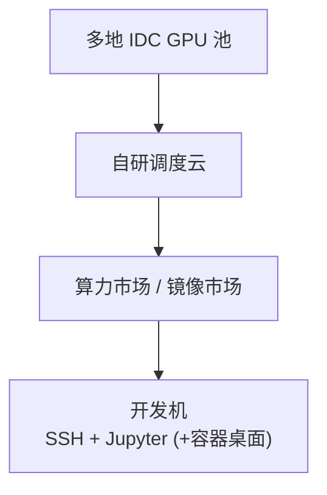

# 算力自由（GPUFree）

**算力自由**（[gpufree.cn](https://www.gpufree.cn/)，北京算力自由科技有限公司）是国内 **GPU 云平台**：整合多地 IDC 资源，用**容器化**方式把物理 GPU 切成可租用的远程开发机，支持 **按需（运行中按秒计费）** 与 **包时长预付费**。

> **定位更正（2026-09-03）**：本页早期版本把它当作「通用 GPU 调度云、顺带支持仿真」来写。据平台开发者在 [issue #1767](https://github.com/ImChong/Robotics_Notebooks/issues/1767) 的说明，平台早期确以 [AutoDL](./autodl.md) 等为参考，但**产品重心已完全放在机器人仿真上**，是本站收录的国内 GPU 云中唯一以机器人为中心的一家。官网首页与文档亦以具身仿真选型、仿真镜像和「合作赛事」为主要入口。

## 一句话定义

面向**机器人仿真**的容器化 GPU 云：从算力市场或镜像市场创建带 SSH/Jupyter 的 Linux 开发机，按显存需求选 **L40/L40S、4090** 等卡型，并配套自研的 **GPU 加速容器桌面**跑 Isaac Sim 一类图形仿真。

## 英文缩写速查

| 缩写 | 英文全称 | 简要说明 |
|------|----------|----------|
| GPU | Graphics Processing Unit | 平台调度与计费的核心资源 |
| RT | Ray Tracing | NVIDIA 光线追踪核心；图形仿真/Omniverse 显示依赖 |
| Vulkan | Vulkan Graphics API | 桌面镜像用于 GPU 图形栈远程显示 |
| SSH | Secure Shell | 远程登录、scp、VSCode 远程开发 |
| IDC | Internet Data Center | 平台整合的机房与运营商资源 |
| RL | Reinforcement Learning | 高算力租用的主要训练场景 |
| VNC | Virtual Network Computing | 通用远程桌面协议；官方镜像名沿用 noVNC，实际桌面链路非 VNC |
| CUDA | Compute Unified Device Architecture | 基础镜像 tag 常按 CUDA 版本区分 |

## 为什么重要

- **产品重心就是机器人仿真**：不是「通用算力云顺带能跑仿真」，而是把仿真当主线做卡型选型、镜像与桌面（见上方定位更正）。
- **GPU 加速容器桌面**：据开发者说明，这是平台最核心的差异点——**容器化**平台里做出可用的云端 GPU 图形桌面（详见下文「容器桌面」）。
- **48GB 级企业卡**：主推 **L40 / L40S-48G**，适合大 batch 并行环境、VLA 微调等 **显存瓶颈**实验。
- **镜像市场双入口**：既可从卡型出发，也可从 **机器人仿真 / [ComfyUI](./comfyui.md)** 等成品镜像一键创建，降低环境拼装时间。
- **选型提示写在文档里**：官方快速开始明确提醒 **A100/H100 无 RT 核心**、不适合图形仿真显示——注意这是 **NVIDIA 卡型本身的属性**，不是某家平台独有的能力（见「常见误区」）。

## 核心结构 / 机制

### 平台架构（简化）

### 实例与计费

| 维度 | 要点 |
|------|------|
| **计算计费** | **仅运行中**；按需为后付费，包时长为预占 |
| **存储计费** | 系统盘/数据盘/公共存储扩展按天计费；**关机仍收** |
| **释放策略** | 按需关机 **15 天**、包月到期 **15 天**后自动释放数据 |
| **资源配比** | 每 GPU 绑定固定 CPU/内存（随卡数倍增） |

### 存储路径

| 路径 | 说明 |
|------|------|
| `/` | 系统盘 30GB（镜像变更计入） |
| `/root/gpufree-data` | 数据盘 100GB 起 |
| `/root/gpufree-data/share` | 跨机公共存储（内网，较慢） |

### 容器桌面（平台自述的核心差异）

图形仿真要在云上「看得见」，通常靠远程桌面。据平台开发者在 [issue #1767](https://github.com/ImChong/Robotics_Notebooks/issues/1767) 的说明：

- 算力自由的容器桌面**不是基于 VNC** 的方案，而是「一整套开源组件魔改 + 底层自研加速 + 中转服务器分发」。
- **2026-09-03 发布 3.0**：支持 **GPU 加速** 与 **手柄输入**，流畅度已可跑游戏级交互。
- 平台自称是目前几乎唯一的「**容器化**云端 GPU 仿真加速桌面」；部分虚拟机形态的平台也能做到 GPU 加速桌面，但容器化平台普遍不具备。
- 后续规划的容器特有能力：**镜像保存、镜像分发、并发推理**。

> 待核实：截至 2026-09-03，公开文档（`docs/guide/quick_start.html`）仍以 **noVNC-vulkan 镜像** 描述仿真桌面入口，未见 3.0 容器桌面的专门章节。上述条目按**开发者自述**记录，等官方文档更新后再回填。

### 机器人 / 仿真选型（官方指引）

1. **显存**：并行仿真环境数、相机分辨率、策略网络规模决定最低显存；48GB L40 系列适合「-env 数拉满」实验。
2. **GPU 架构**：图形仿真须 **RT 核心**；勿把纯计算卡当仿真工作站。
3. **镜像**：基础镜像按 **CUDA 版本**选 `开发` tag；仿真 GUI 用平台的桌面镜像（文档现写作 **noVNC-vulkan**，实际桌面实现见上节）。
4. **数据盘**：默认免费 50GB（快速开始文档）；大资产（USD、数据集）提前扩容。

### 价格与生态（开发者说明，2026-09）

据 [issue #1767](https://github.com/ImChong/Robotics_Notebooks/issues/1767) 的开发者说明（本站未独立比价，**属厂商自述**）：

| 维度 | 说明 |
|------|------|
| **价格** | 自述同规格卡时比同类平台低 **30%–60%**；硬件涨价压力下不保证长期不变 |
| **赛事** | 官网设「合作赛事」入口；自述已是十余个赛事的指定平台 |
| **机构合作** | 自述与大量 985/211 高校及头部机器人厂商有合作，线下赛与交流较多 |
| **公共模型存储** | 有意不做：不同卡型所需的二次量化模型不同，公共模型往往只能特定场景用；成本更愿意压到**卡时价格**上 |

## 常见误区或局限

- **RT 核心不是平台差异点**：一张卡有没有 RT Core 由 **NVIDIA 的卡型**决定，各平台只要上同款卡就都有；真正的差别在于**能不能把图形栈用起来**（驱动、Vulkan、桌面链路）。本页早期把「RT 提示」写成算力自由的差异化优势，是不准确的。
- **关机不等于停止一切费用**：存储持续计费；不用须 **释放实例**。
- **公共存储性能**：跨机共享适合代码与中小文件，不适合高频 checkpoint IO。
- **平台较新**：生态与社区镜像数量可能少于老牌平台；需自行验证 Isaac/Omniverse 版本组合。
- **「算力算法交易市场」**：官网愿景包含模型/算法交易，当前主线仍是 **租卡开发**。
- **不要把平台技术叫「Docker」**：Docker 只是一种容器运行时/工具链，规模化 GPU 云用的是自研的**容器化平台**（调度、切分、镜像分发），本页与对比页统一改用「容器化 / 容器实例」表述。

## 与其他页面的关系

- [AutoDL](./autodl.md) — 同类国内 GPU 云；面向通用训练、社区镜像多，与本页「以机器人仿真为中心」定位不同
- [国内 GPU 云平台选型](../comparisons/china-gpu-cloud-platforms.md) — 六平台并列对比
- [Isaac Lab](./isaac-lab.md) — 常见高算力 + 图形仿真栈
- [StackForce](./stackforce.md) — 工作台第三步列出的云训练入口之一（SimReady→Isaac 工程）
- [Isaac Gym / Isaac Lab 总览](./isaac-gym-isaac-lab.md) — GPU 并行仿真背景
- [仿真选型指南](../queries/simulator-selection-guide.md) — 框架与算力协同决策
- [ComfyUI](./comfyui.md) — 镜像市场常见的节点式生成引擎；与仿真 GUI 镜像是不同产品面

## 推荐继续阅读

- [算力自由快速开始](https://www.gpufree.cn/docs/guide/quick_start.html)
- [开发机实例说明](https://www.gpufree.cn/docs/guide/instance/)
- [计费规则](https://www.gpufree.cn/docs/guide/finance/billing_policy.html)

## 参考来源

- [算力自由官方文档](../../sources/sites/gpufree.md)（含 2026-09-03 开发者勘误归档）
- [Robotics_Notebooks issue #1767](https://github.com/ImChong/Robotics_Notebooks/issues/1767) — 平台开发者对本页的勘误
