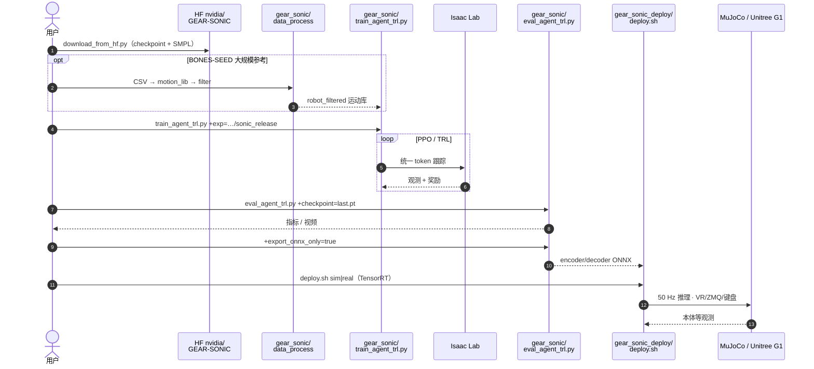

# GR00T-WholeBodyControl（人形全身控制统一平台）

**GR00T-WholeBodyControl** 把 NVIDIA **GR00T 全身控制（WBC）** 相关资产收敛到同一 Git 单仓：**解耦 WBC**（下肢 RL + 上肢 IK，用于 [GR00T N1.5 / N1.6](https://research.nvidia.com/labs/gear/gr00t-n1_5/) 等）、**GEAR-SONIC**（[SONIC](../methods/sonic-motion-tracking.md) 规模化运动跟踪通用策略）与 **MotionBricks**（[`motionbricks/`](https://github.com/NVlabs/GR00T-WholeBodyControl/tree/main/motionbricks) 预览代码）的训练脚本、权重托管说明与部署栈并列维护。

## 英文缩写速查

| 缩写 | 英文全称 | 简要说明 |
|------|----------|----------|
| Sim2Real | Simulation to Real | 把仿真中学到的策略迁移落地真机的工程主线 |
| WBC | Whole-Body Control | 协调全身关节满足多任务/约束的控制基础设施 |
| Isaac Lab | NVIDIA Isaac Lab | 基于 Omniverse 的机器人学习训练框架 |
| VLA | Vision-Language-Action | 视觉-语言-动作多模态基础策略方向 |
| RL | Reinforcement Learning | 通过与环境交互最大化长期回报来学习策略的范式 |
| IK | Inverse Kinematics | 满足末端/姿态约束求解关节角的运动学逆解 |
| PPO | Proximal Policy Optimization | 人形/足式 locomotion 中最常用的 on-policy 策略梯度算法 |
| ONNX | Open Neural Network Exchange | 跨框架神经网络模型交换格式 |
| QP | Quadratic Programming | 将 WBC/控制问题写成二次规划的标准求解形式 |

## 为什么重要？

- **从论文到实机的纵向切片**：覆盖 Isaac Lab 侧大规模 PPO 训练、ONNX / C++ 推理、ZMQ 协议与 VR 遥操作采集，适合作为「人形低层策略工程」的对照样本。
- **与高层 VLA 文档同仓**：站点教程包含 **VLA 工作流、数据采集与推理**，便于和 [Foundation Policy](../concepts/foundation-policy.md) 中 GR00T 叙事交叉阅读。
- **资源与许可边界清晰**：README 强调 **Git LFS**、按用途拆分的 **独立 Python 环境**，以及 **代码 Apache-2.0 + 权重 NVIDIA Open Model License** 的双许可结构。

## 仓库内三大块（概念分工）

| 方向 | 角色 |
|------|------|
| Decoupled WBC | GR00T N1.5 / N1.6 等产品化人形栈中的经典「下盘 RL + 上盘 IK」分解控制器 |
| GEAR-SONIC | 以运动跟踪为统一预训练目标的通用人形行为模型；含 `gear_sonic` 训练与 `gear_sonic_deploy` C++ 部署 |
| MotionBricks | 实时潜空间生成式运动控制（与 [MotionBricks 方法页](../methods/motionbricks.md) 及项目页一致） |

## 源码运行时序图

节点对齐 [`sources/repos/gr00t_wholebodycontrol.md`](../../sources/repos/gr00t_wholebodycontrol.md)。本仓三条线并存；下图以 **GEAR-SONIC** 主复现路径为主（Decoupled WBC / MotionBricks 见文档站对应章节）。更细的 FSQ token 数据流见 [SONIC 方法页](../methods/sonic-motion-tracking.md)。

关键复现路径：独立 venv 装训练栈 → HF 权重 → `train_agent_trl.py` / `eval_agent_trl.py` → ONNX 导出 → `gear_sonic_deploy/deploy.sh`；VLA 采集见文档站 Data Collection / VLA Workflow。

## 关联页面

- [GR00T N1（论文实体）](./paper-hrl-stack-34-gr00t_n1.md) — N1 论文机制与 42 篇栈坐标；本页聚焦 N1.5+ 工程栈与 WBC 部署
- [MotionBricks](../methods/motionbricks.md) — 生成式运动子项目与论文级方法归纳
- [SONIC（规模化运动跟踪）](../methods/sonic-motion-tracking.md) — GEAR-SONIC 的方法与接口总览；**读源码导航**以方法页为准
- [Foundation Policy](../concepts/foundation-policy.md) — GR00T 系基础策略与分层控制叙事
- [Whole-Body Control](../concepts/whole-body-control.md) — WBC 概念层与 QP / 分层控制主线
- [Isaac GR00T](./isaac-gr00t.md) — N1.7 VLA 主仓；G1 全身路径经 `UNITREE_G1_SONIC` 调用本仓 SONIC
- [Isaac Teleop](./isaac-teleop.md) — README 把「跟踪全身 loco-manip + GR00T-WBC (SONIC)」列为已支持用例；XR 流经 Teleop 再进本仓，不是本仓自带头显栈
- [GR00T-VisualSim2Real](./gr00t-visual-sim2real.md) — 同品牌视觉 Sim2Real 仓库，任务侧重不同
- [Kimodo](./kimodo.md) — 文生人体/人形运动学轨迹的上游；GEAR-SONIC 在线 Demo 集成
- [OpenHLM](./paper-loco-manip-161-154-openhlm.md) — 基于本仓改写的全身 VLA 采集/部署配方
- [HumanoidArena](./paper-humanoidarena.md) — 以 SONIC 为 GMT 后端之一的分层基准
- [HTD 解耦 WBC](./htd-decoupled-wbc.md) — CMU/Bosch 开源的另一条「下肢 RL + 上肢默认/外部命令」解耦栈，勿与本仓 N1.5 解耦 WBC 混权重

## 参考来源

- [sources/repos/gr00t_wholebodycontrol.md](../../sources/repos/gr00t_wholebodycontrol.md)
- [sources/sites/gr00t-wholebodycontrol-docs.md](../../sources/sites/gr00t-wholebodycontrol-docs.md)

## 推荐继续阅读

- [GR00T-WholeBodyControl 文档（GitHub Pages）](https://nvlabs.github.io/GR00T-WholeBodyControl/)
- [GEAR-SONIC 项目页](https://nvlabs.github.io/GEAR-SONIC/)
- [MotionBricks 项目页](https://nvlabs.github.io/motionbricks/)
- [GitHub 仓库](https://github.com/NVlabs/GR00T-WholeBodyControl)