# Gymnasium（RL 环境 API 标准）

**Gymnasium** 是 [Farama Foundation](https://farama.org/) 维护的 **单智能体强化学习环境接口** 与参考环境集合，官方文档见 [gymnasium.farama.org](https://gymnasium.farama.org/)。它是 OpenAI Gym 的社区延续 fork；新研究与工程应使用 `import gymnasium as gym`，而非已停更的 `gym` 包。

| 字段 | 内容 |
|------|------|
| 机构 | Farama Foundation |
| 许可证 | MIT（以仓库为准） |
| 定位 | 单智能体 RL 环境 API 标准 + 参考环境注册表 |
| 代码 | [Farama-Foundation/Gymnasium](https://github.com/Farama-Foundation/Gymnasium) |

## 一句话定义

Gymnasium 不替代 MuJoCo / Isaac Gym 等物理引擎，而是规定 **智能体与环境交互的 Python 契约**（观测、动作、奖励、终止信号），使 PPO、SAC 等训练代码能在不同仿真后端之间切换。

## 英文缩写速查

| 缩写 | 英文全称 | 简要说明 |
|------|----------|----------|
| Gymnasium | Gymnasium | Farama 维护的 Gym 继任项目与环境 API |
| RL | Reinforcement Learning | 通过与环境交互最大化长期回报的学习范式 |
| MDP | Markov Decision Process | `Env` 所抽象的状态–动作–奖励序贯决策过程 |
| API | Application Programming Interface | `reset` / `step` / `spaces` 等标准方法集合 |
| Env | Environment | 实现 MDP 交互的 Python 类；核心是 `reset` 与 `step` |
| VecEnv | Vector Environment | `make_vec()` 创建的批量环境；API 层并行，不是 GPU 物理并行 |
| GPU | Graphics Processing Unit | Isaac Gym 类栈的并行仿真依赖；与 Gymnasium API 层正交 |
| SB3 | Stable-Baselines3 | 默认假设 `gymnasium.Env` 的常用算法库 |

## 为什么重要

- **训练栈的「插座标准」**：算法库（[Stable-Baselines3](./stable-baselines3.md)、[CleanRL](./cleanrl.md) 等）默认假设环境实现 `gymnasium.Env`；机器人仓库（如 [gym-pybullet-drones](./gym-pybullet-drones.md)）对齐该接口后，换算法不必重写环境循环。
- **基准可比性**：[CartPole](../concepts/cartpole.md)、MuJoCo Ant/Humanoid 等任务长期作为 PPO、SAC 的横向对比靶场；与 [dm_control](./dm-control.md) 的 Control Suite 形成「Gym 注册表 vs DeepMind 约定」两条并行基准线。`CartPole-v1` 的动作、终止与奖励契约见独立节点，勿与 [Isaac-Cartpole-v0](../concepts/cartpole.md) 混用。
- **语义升级影响 bootstrap**：v0.26 起 `step()` 返回 `terminated`（任务内终止）与 `truncated`（时间限制等 MDP 外截断），替代旧 Gym 的单一 `done`；误用会导致价值函数 bootstrap 与课程设计出错。
- **与 GPU 并行仿真区分**：`gymnasium.make_vec()` 做的是 **API 层向量化**；[Isaac Gym](./isaac-gym.md) / [legged_gym](./legged-gym.md) 的万环境并行是 **物理仿真并行**，二者互补而非替代。

下图是本页的选型入口：先判断你要的是「接口/基准」还是「大规模物理并行」，再决定是否该停在 Gymnasium。

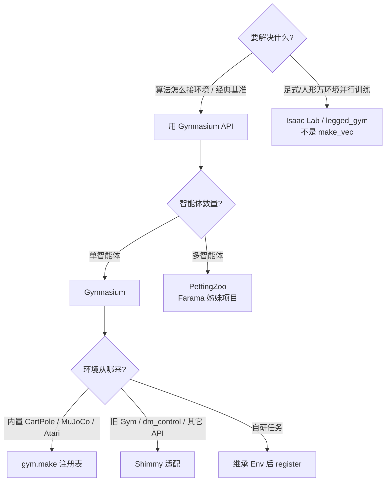

## 核心结构（读者心智模型）

### 从 MDP 到 Env：接口映射

[MDP](../formalizations/mdp.md) 的五元组并不原样出现在 Python 里。Gymnasium 把「能给算法用的部分」收成 `Env`，把折扣因子 \(\gamma\) 留给算法实现。

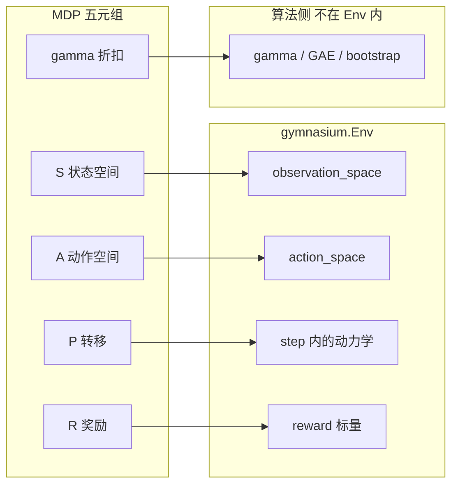

官方也提醒：`Env` **不是** MDP 的完整重建（缺转移核的显式形式、缺 \(\gamma\)）。把它当成「可逐步交互的黑盒仿真器」即可。

### 智能体–环境循环

一次时间步只交换两样东西：智能体给出动作 \(a\)，环境返回观测、奖励和是否结束。

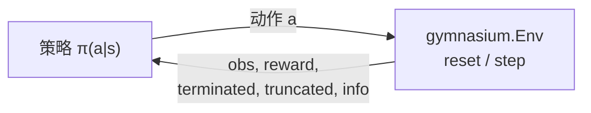

最小可运行循环（随机策略，只用来记住返回值个数）：

```python
import gymnasium as gym

env = gym.make("CartPole-v1")
obs, info = env.reset(seed=0)
terminated = truncated = False
while not (terminated or truncated):
    action = env.action_space.sample()
    obs, reward, terminated, truncated, info = env.step(action)
env.close()
```

| 组件 | 作用 |
|------|------|
| `gymnasium.make(id)` | 按注册表实例化环境，并默认叠加 `TimeLimit`、`OrderEnforcing`、`PassiveEnvChecker` 等 Wrapper |
| `reset(seed=…)` | 开始新回合；返回 `(observation, info)` |
| `step(action)` | 推进一步；返回 `(obs, reward, terminated, truncated, info)` |
| `action_space` / `observation_space` | 声明合法动作与观测；基于 `spaces.Box`、`Discrete`、`Dict` 等 |
| `gymnasium.Wrapper` | 不改底层代码即可改观测、奖励、动作缩放或记录视频 |
| `make_vec()` | 同步/异步向量化环境，便于批量采样（CPU 侧常见） |

### 单回合运行时序

节点名对齐官方文档的四个入口：`make` / `reset` / `step` / `render`。训练时通常把 `render_mode` 设为 `None` 以加速；评测或录视频再单独 `make(..., render_mode="human"|"rgb_array")`。

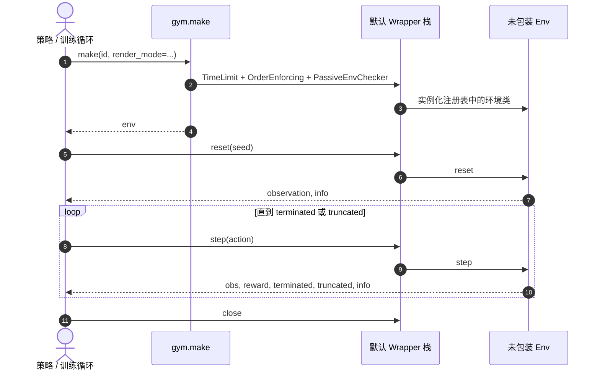

**复现入口**：`pip install gymnasium` 后按 [Basic Usage](https://gymnasium.farama.org/introduction/basic_usage/) 跑通 CartPole；MuJoCo 域需 extra（`gymnasium[mujoco]`）并安装 [MuJoCo](./mujoco.md)。

### 回合何时结束：terminated vs truncated

这是从旧 Gym 迁过来时最容易写错、也最影响算法正确性的一点。`terminated` 是 **任务内** 结束（成功、失败、进入吸收态）；`truncated` 是 **MDP 外** 截断（`TimeLimit`、人工步数上限）。循环条件用 `terminated or truncated`，**价值 bootstrap 只用 `terminated`**。

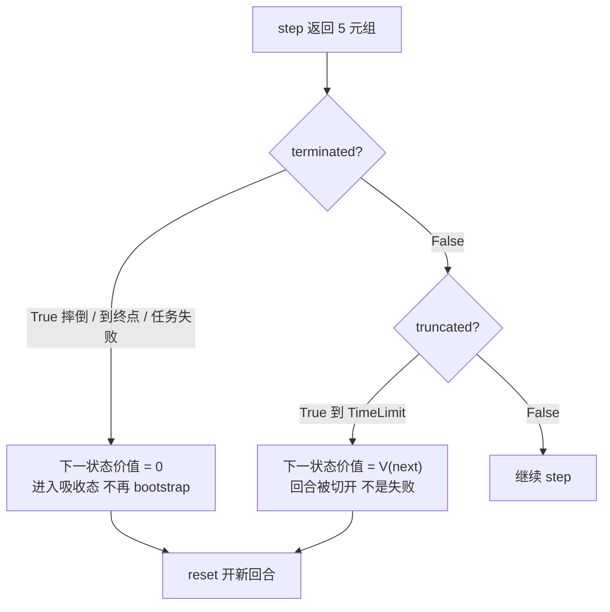

对应的 bootstrap 写法：

```python
# 错误：把 truncated 当成任务结束，会把「还没失败、只是到点了」当成价值 0
# target = reward + (1.0 - float(terminated or truncated)) * gamma * next_value

# 正确：只有 terminated 才切断后续价值
target = reward + (1.0 - float(terminated)) * gamma * next_value
```

旧代码 `obs, reward, done, info = env.step(a)` 必须按 [迁移指南](https://gymnasium.farama.org/introduction/migration_guide/) 拆成五元组；不能把 `done` 直接当成 `terminated`。

### 默认 Wrapper 洋葱栈

`make()` 很少返回「裸环境」。外层 Wrapper 负责时间限制、调用顺序检查和被动校验；用户再叠自己的观测/动作/奖励变换。需要动底层物理时走 `env.unwrapped`。

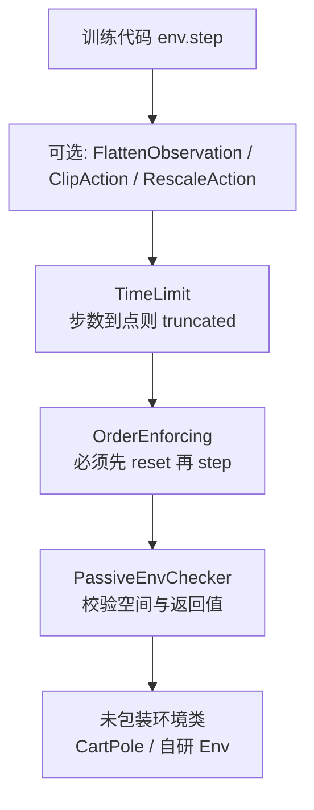

`make("CarRacing-v3")` 再套 `FlattenObservation` 后，官方打印形态类似：

`FlattenObservation < TimeLimit < OrderEnforcing < PassiveEnvChecker < CarRacing >`

### 观测与动作空间

`Env.observation_space` / `action_space` 都是 `Space` 子类，提供 `sample()` 与 `contains()`。选空间等于在声明「神经网络输入输出长什么样」。

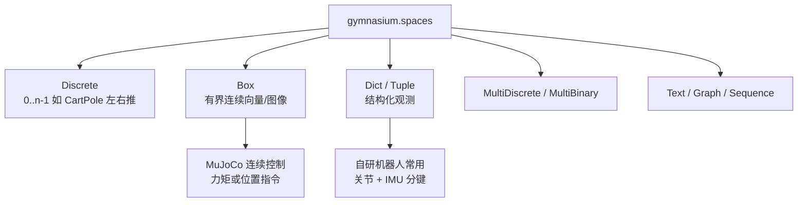

机器人自研环境优先 `Dict`（可读、易 debug），接到只吃一维向量的算法时再用 `FlattenObservation`，而不是一上来把观测拍扁导致无法查错。

### 核心类型关系

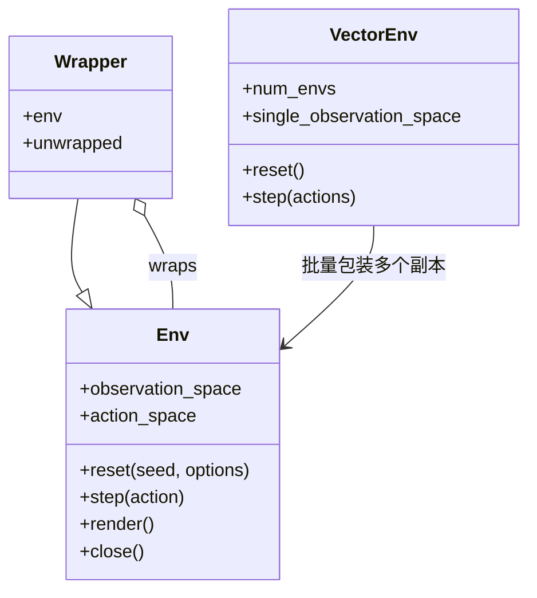

`VectorEnv.step(actions)` 吃的是 **一批** 动作，返回的 `terminations` / `truncations` 是长度为 `num_envs` 的数组。子环境结束后默认在 **下一步** autoreset（next-step autoreset），不要按「所有子环境一起结束再 reset」来写 on-policy 采样。

### 与 Farama 生态

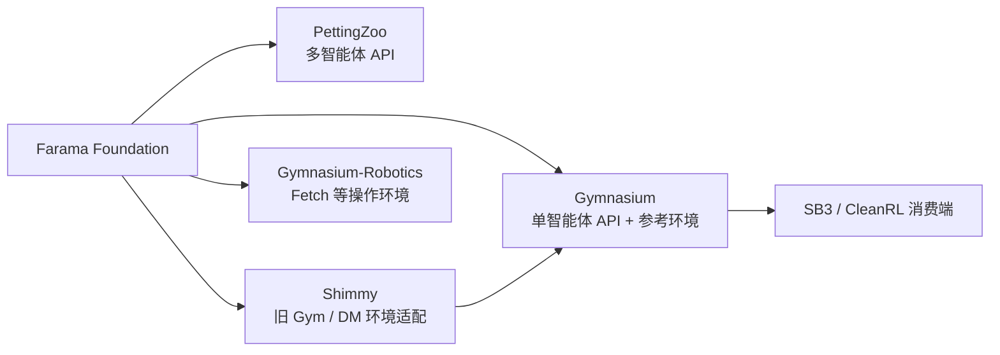

| 项目 | 分工 |
|------|------|
| **Gymnasium** | 单智能体环境 API + 内置参考环境 |
| **PettingZoo** | 多智能体环境 API（文档明确指向，非 Gymnasium 子模块） |
| **Shimmy** | 将其他 API（如旧 Gym、DeepMind 环境）适配到 Gymnasium |
| **Gymnasium-Robotics** | 原 Gym 中已拆出的 Fetch 等操作环境，需单独注册 |

### 机器人研究中的典型落点

Gymnasium 落在「算法怎么接环境」这一层；物理保真和万环境吞吐在它下面。把两层画在一起，是为了避免把 `make_vec(num_envs=16)` 误当成 Isaac 的 4096 环境 GPU 仿真。

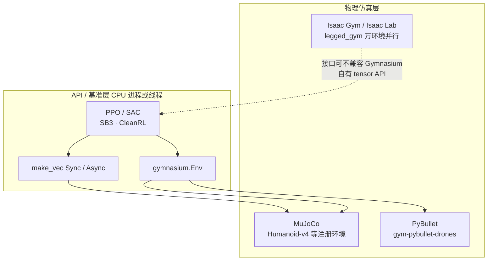

| 层级 | 例子 |
|------|------|
| **API / 基准** | Gymnasium 本体：经典控制教学、MuJoCo 注册环境 |
| **另一套 MuJoCo 基准** | [dm_control](./dm-control.md) Control Suite（自有 `TimeStep` API，常与 Gym 结果并列报告） |
| **物理 + 任务框架** | [legged_gym](./legged-gym.md)（Isaac Gym 上足式 RL，非 Gymnasium 内置） |
| **轻量机体 RL** | [gym-pybullet-drones](./gym-pybullet-drones.md)（PyBullet + Gymnasium 四旋翼） |
| **流控 CFD 基准** | [HydroGym](./paper-hydrogym.md)（*Nature* 2026；61+ 流场环境，Gymnasium `FlowEnv`） |
| **新实验默认并行栈** | [Isaac Lab](./isaac-lab.md)（Isaac Gym 已 deprecated） |

## 工程实践

### 自定义环境：从设计到 `make`

自研任务不要先写神经网络。先把「学什么 / 看见什么 / 能做什么 / 何时结束」定下来，再落到 `Env` 的四个必须实现。

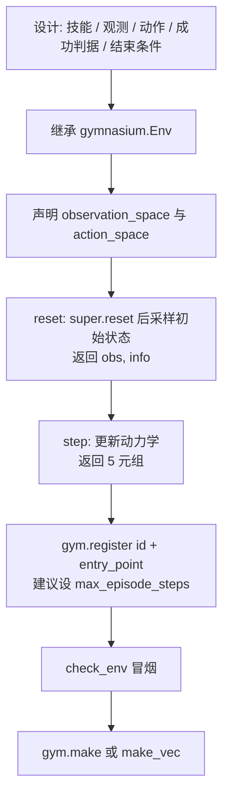

注册示例（官方 GridWorld 教程的形态）：`gym.register(id="my_ns/GridWorld-v0", entry_point=GridWorldEnv, max_episode_steps=300)`。`max_episode_steps` 会触发外层 `TimeLimit`，从而产生 `truncated=True`，不必在 `step` 里手写步数截断——除非截断语义属于任务本身。

调试时用 `gymnasium.utils.env_checker.check_env(env)`；它会抓住「忘了 `super().reset(seed=seed)`」「返回元组个数不对」「观测落在 space 外」这类问题。

### 向量化时注意 autoreset

`make_vec(..., num_envs=N, vectorization_mode="sync"|"async")` 适合 CartPole / 小 MuJoCo 的 CPU 批量采样。子环境 `terminated|truncated` 为真后，**默认在下一次 `step` 才 reset**（next-step autoreset）。采样缓冲要按「结束标志与新回合观测可能出现在同一次返回里」来解析 `info`，不要假设一个 batch 里所有环境处于同一回合相位。

大规模足式/人形训练不要指望把 `num_envs` 加到几千：那是 [Isaac Lab](./isaac-lab.md) / [Isaac Gym](./isaac-gym.md) 的物理并行，不是 Gymnasium 这一层的职责。

## 常见误区或局限

- **误区：Gymnasium = 仿真器** — 它是 **接口与参考环境注册表**；Humanoid-v4 等任务的物理仍由 MuJoCo 等后端承担。
- **误区：`truncated` 与 `terminated` 可混用** — `truncated=True` 表示时间限制等 **MDP 外** 截断，bootstrap 时不应等同任务失败；旧 Gym 的 `done` 需按 [官方迁移指南](https://gymnasium.farama.org/introduction/migration_guide/) 拆分。
- **误区：`make_vec` 可以替代 Isaac 系并行** — 前者是 API 层复制环境；后者是 GPU 上的物理步进。吞吐差几个数量级，接口也不相同。
- **误区：先 `step` 再 `reset`** — `OrderEnforcing` 会直接报错；每个新 `Env` 必须先 `reset`。
- **局限：不解决机器人 sim2real** — 接口统一不保证动力学保真；大规模 loco 量产训练仍常选 Isaac 系并行栈。
- **局限：内置环境偏学术基准** — 真机人形/四足的工程化任务、域随机化与 privileged obs 多在专用框架（legged_gym、Isaac Lab 等）而非 Gymnasium 自带注册表。

## 关联页面

- [Reinforcement Learning（方法总览）](../methods/reinforcement-learning.md) — RL 算法与训练 loop 上下文
- [MDP（形式化）](../formalizations/mdp.md) — `Env` 所抽象的数学对象
- [MuJoCo](./mujoco.md) — Gymnasium MuJoCo 域的物理后端
- [dm_control](./dm-control.md) — 并行存在的 MuJoCo 连续控制基准栈
- [gym-pybullet-drones](./gym-pybullet-drones.md) — Gymnasium 接口的四旋翼实例
- [HydroGym（论文实体）](./paper-hydrogym.md) — *Nature* 2026 主动流控 RL 平台；Gymnasium 兼容 `FlowEnv` 与 6 类 CFD 后端
- [legged_gym](./legged-gym.md) — 足式 RL 工程框架（底层多为 Isaac Gym，非 Gymnasium 内置）
- [Isaac Gym](./isaac-gym.md) — GPU 并行物理；与 API 标准分层理解
- [Isaac Lab](./isaac-lab.md) — 当前推荐的 GPU 并行训练入口
- [Cartpole 问题](../concepts/cartpole.md) — `CartPole-v1` 与 Isaac-Cartpole-v0 的 MDP 对照
- [Stable-Baselines3](./stable-baselines3.md) — 默认消费 Gymnasium API 的算法库
- [CleanRL](./cleanrl.md) — 单文件算法实现，便于核对本 API 的采样循环
- [十年仿真平台技术地图](../overview/sim-platforms-decade-technology-map.md) — MuJoCo + Gym 基准的历史位置
- [仿真器选型指南](../queries/simulator-selection-guide.md) — 物理引擎选型；Gymnasium 解决「算法怎么接环境」
- [具身大模型评测基准选型闭环](../queries/embodied-eval-benchmark-selection-loop.md) — 本页是其 ③ 策略任务成功率评测层的底层 API 标准：把算法与物理仿真解耦以复现 RL 基准

## 推荐继续阅读

- 官方文档：[Basic Usage](https://gymnasium.farama.org/introduction/basic_usage/)
- 自定义环境：[Create a Custom Environment](https://gymnasium.farama.org/introduction/create_custom_env/)
- 从旧 Gym 迁移：[Migration Guide](https://gymnasium.farama.org/introduction/migration_guide/)
- 向量化环境：[Vectorize API](https://gymnasium.farama.org/api/vector/)
- 向量化 autoreset 模式：[Farama：Vector Autoreset Mode](https://farama.org/Vector-Autoreset-Mode)
- 代码仓库：[Farama-Foundation/Gymnasium](https://github.com/Farama-Foundation/Gymnasium)

## 参考来源

- [Gymnasium 官方文档与仓库归档](../../sources/repos/gymnasium.md)
