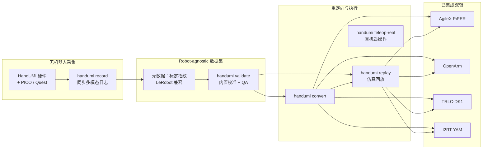

# HandUMI

**HandUMI** 是一套面向 **固定基座双臂 + 平行夹爪（parallel-jaw gripper）** 的 **无机器人示教（robot-free demonstration）** 接口与开源软件栈（硬件 [handumi-hw](https://github.com/robonet-ai/handumi-hw)、软件 [handumi-sw](https://github.com/robonet-ai/handumi-sw)，均 Apache-2.0）。操作者佩戴 HandUMI **一次采集** 同步多模态示范后，同一批 **robot-agnostic** 数据可经内置 **校准、转换前 QA、仿真回放与真机遥操作**，重定向到 **AgileX PiPER、OpenArm、TRLC-DK1、I2RT YAM** 等不同双臂平台——**无需机器人参与采集，也无需为每台目标臂重做 leader–follower 遥操作**。

## 英文缩写速查

| 缩写 | 英文全称 | 简要说明 |
|------|----------|----------|
| UMI | Universal Manipulation Interface | 手持夹爪+腕部相机的便携无机器人示教范式（HandUMI 谱系源头） |
| QA | Quality Assurance | 转换到目标机器人前的自动数据质量检查（`handumi validate`） |
| TCP | Tool Center Point | 工具中心点；控制器→夹爪 TCP 标定影响重定向精度 |
| IL | Imitation Learning | 示教数据常用于 BC / ACT / Diffusion Policy 等模仿学习 |
| LeRobot | LeRobot (Hugging Face) | 具身数据与训练框架；HandUMI 钉 `lerobot==0.5.1` 并导出兼容格式 |

## 核心信息

| 字段 | 内容 |
|------|------|
| 机构 | 机器人网络（RoboNet AI） |
| 许可 | Apache-2.0（软件 + 硬件仓）；头显应用 / 数据集 / 商标另计 |
| 硬件成本 | 单套零件约 **$110**（另加 PICO 4 Ultra / Meta Quest 3） |
| 追踪 | PICO（XRoboToolkit）；Meta Quest（[handumi-quest-app](https://github.com/robonet-ai/handumi-quest-app)） |
| 数据格式 | LeRobot v3 兼容同步捕获 |
| CLI | 统一入口 `handumi`（短别名 `hu`） |

## 为什么重要

在 [bimanual-manipulation](../tasks/bimanual-manipulation.md) 与桌面/工位 **双臂操作** 落地中，**平行夹爪双臂** 往往是初创公司与实验室 **最先在现实世界创造价值** 的具身形态：任务足够丰富（递接、装配、打包），硬件成本低于全身人形，又比单臂更能表达双手协同。瓶颈常在 **数据采集**——传统 [ALOHA](./aloha.md) 式 leader–follower 需要 **每台目标臂一套遥操作硬件**（双臂场景常是 4 条臂），且 follower 必须物理运到采集现场，规模化慢、设备绑定强。

HandUMI 把问题切成两步：

1. **采集阶段**：用可穿戴 HandUMI + PICO / Quest 追踪，**脱离目标机器人** 记录同步示范；
2. **部署阶段**：对选定 embodiment 做 **标定指纹 + 重定向 + QA**，再仿真预览或真机回放/遥操作。

文档站明确其产品叙事：帮助 **初创公司加速部署**、帮助 **研究人员做更多实验**。这与 [BifrostUMI](./paper-bifrost-umi.md)、[HALOMI](./paper-halomi-humanoid-loco-manipulation.md) 等 **无机器人示范** 路线同族，但 HandUMI **明确收敛到平行夹爪双臂工位**，而非全身人形 loco-manipulation；工程上更贴近 **LeRobot 生态的数据飞轮**（见 [LeRobot](./lerobot.md)）。相对 [mimic U1](./mimic-wearable-u1.md) 的「与特定灵巧手 1:1 运动学」路线，HandUMI 走 **跨臂可重定向**，用 tip 模块化换夹爪几何；相对商业 [DEUX / Glove X](./xyz-deux.md) 与 [TwinDEX](./twindex.md) 的 **专有三指 1:1 绑定**，HandUMI 优先 **开源可迁移数据集** 而非一体机锁定。

## 流程总览

## 核心机制

### 1）模块化硬件：换 tip 即可开录

[handumi-hw](https://github.com/robonet-ai/handumi-hw) 安装在拇指与食/中指，**自然 pinch** 开合。机身、腕相机座、Feetech 舵机与控制器支架不变；**仅更换可拆卸夹爪 tip** 即可对齐不同平行夹爪。当前 tip 目标包括 AgileX PiPER、ARX X5 2023、Dream Gripper（TRLC）、Trossen WidowX AI 与原版 UMI 夹爪——可比几何可自设计 tip。

### 2）直测夹爪宽度 + VR 位姿 + 腕相机

每条示范记录三类核心信号：

| 通道 | 机制 |
|------|------|
| SE(3) 腕部位姿 | 头显世界系 + 双手柄；腕部 3D 打印 `controller_support` 固定手柄，避免离线相机 SLAM |
| 夹爪开合 | **Feetech 编码器直测宽度**（多数 UMI 式装置用 fiducial/分割间接估开合） |
| 腕部视觉 | 机载鱼眼 USB（UVC）相机，供训练/部署观测 |

### 3）标定指纹与可复现转换

物理 **控制器→TCP** 标定与桌面/会话坐标系写入数据集 **metadata**（含 hash）。后续把同一份示范转换到 PiPER、OpenArm 等臂时，可追踪「用了哪套标定、哪版机器人配置」，避免 silently wrong retargeting——这是 **多机器人复用单批数据** 的前提。

### 4）LeRobot 兼容导出与转换前 QA

- 依赖钉 **`lerobot[feetech]==0.5.1`**，导出 **LeRobot-compatible synchronized captures**，便于进入 `lerobot-train`、Hub 上传或 ACT / Diffusion / VLA 后训练。
- `handumi validate … --strict` 写出 `meta/handumi_quality.json`；拒收跟踪丢失、同步错误、冻结位姿、过短 episode 等，并在 convert 时自动排除。
- `handumi convert --robot <id>` 生成目标臂数据集；`--retarget-mode` 默认 `auto`（有桌面标定则走与 replay 一致的 `absolute-table`）。

### 5）仿真回放 + 真机遥操作双通道

| 能力 | 状态（2026-07-27 文档） |
|------|-------------------------|
| 仿真 live teleop / replay | PiPER、OpenArm、TRLC-DK1、Axol 等（以 `--robot` 与 YAML 为准） |
| 真机 `teleop-real` | **PiPER、OpenArm**（可选 extras / backend） |
| 真机离线回放录制集 | 文档称 **尚未暴露**；`teleop-real` 消费的是 **live** HandUMI 运动 |

追踪侧：**PICO** 经 XRoboToolkit；**Meta Quest** 经 [handumi-quest-app](https://github.com/robonet-ai/handumi-quest-app) Releases APK。

## 工程实践

| 步骤 | 建议 |
|------|------|
| 环境 | Python **3.12+**，[uv](https://docs.astral.sh/uv/)，`bash install.sh`（Quest-only 可 `--skip-xrt`）；可选 `--sim` / `--robot openarmv1` 等 profile |
| 就绪检查 | `handumi doctor` / `handumi setup --check`；编辑本机 `configs/rig.yaml`（相机、Feetech、追踪设备） |
| 标定 | 舵机 mid-travel home → 开合宽度；ChArUco 相机内参与 controller–camera；controller–TCP；**每会话**核对 table/session 坐标系 |
| 采集 | `handumi record`（**不要**接目标臂）；`--dry-run` 先解析计划；`--resume` 追加 episode |
| 质检 | `handumi validate --strict` → 看 `meta/handumi_quality.json`；Viser/`handumi replay` 目视几何与 IK 误差 |
| 重定向 | `handumi convert --robot piper\|openarmv1\|trlc_dk1\|yam…` → 仿真预览 → 真机 |
| 训练 | 导出 LeRobot 数据集 → [imitation-learning](../methods/imitation-learning.md) / [LeRobot](./lerobot.md) |

**安全（上游强调）：** 研究软件；真机前务必预览轨迹、备急停，并遵守关节/速度/工作空间/碰撞限制。replay 若遇 JAX CUPTI 警告，可用 `JAX_PLATFORMS=cpu`。

## 局限与风险

- **具身范围**：优化 **固定基座 + 平行夹爪双臂**；**非** 灵巧手、非移动人形全身——与 [BifrostUMI](./paper-bifrost-umi.md) / [HALOMI](./paper-halomi-humanoid-loco-manipulation.md) 的全身路线互补而非替代。
- **重定向误差**：跨臂 DoF、基座高度、夹爪行程差异仍会引入 embodiment gap；QA 与仿真预览是必要步骤，不能假设「采一次处处零调」。
- **真机遥操作覆盖不均**：截至刷新日，**PiPER / OpenArm** 有可选遥操作 backend；TRLC-DK1、YAM、Axol 等以 **仿真回放/重定向** 为主。
- **录制集真机离线回放**：文档明确当前不通过同一命令暴露；部署路径以 convert + 自有执行栈，或 live teleop-real 为准。
- **分仓许可**：软件与硬件均为 Apache-2.0；Quest 应用仓截至核查日 **未标 SPDX**，以 Releases/仓内 LICENSE 为准；数据集与商标另计。

## 开源状态（项目页核查，2026-07-27）

| 组件 | 状态 |
|------|------|
| **handumi-sw** | **已开源** — [GitHub](https://github.com/robonet-ai/handumi-sw)，Apache-2.0 |
| **HandUMI 硬件** | **已开源** — [robonet-ai/handumi-hw](https://github.com/robonet-ai/handumi-hw)，Apache-2.0（旧链 BrikHMP18/HandUMI 301） |
| **Quest 应用** | 公开仓 + APK：[handumi-quest-app](https://github.com/robonet-ai/handumi-quest-app) |
| **预训练策略/公开大数据集** | 文档未列官方权重；定位是 **工具链 + 自采数据** |

## 关联页面

- [Teleoperation（遥操作）](../tasks/teleoperation.md) — 无机器人示范在遥操作谱系中的位置
- [Bimanual Manipulation（双臂协调操作）](../tasks/bimanual-manipulation.md) — 双手协同任务与数据需求
- [LeRobot (Hugging Face)](./lerobot.md) — 兼容的数据与训练入口
- [ALOHA (双臂遥操作硬件)](./aloha.md) — 传统 leader–follower 双臂采集对照
- [mimic wearable U1](./mimic-wearable-u1.md) — 固定运动学外骨骼 / 无 retargeting 对照
- [BifrostUMI](./paper-bifrost-umi.md) — 无机器人示范 → 人形全身对照
- [HiFi-UMI / HiFi-UMI-2K](./paper-hifi-umi.md) — 高保真双臂 UMI 2000 h；zero-robot 后训练（数据已开）
- [DEUX / Glove X（XYZ）](./xyz-deux.md) — 商业 1:1 手套绑定对照（闭源、不可跨臂迁移）
- [TwinDEX](./twindex.md) — 三指外骨骼–同构手共设计对照（闭源、无软件 retarget）

## 参考来源

- [HandUMI Software 仓库归档](../../sources/repos/handumi-sw.md)
- [HandUMI Hardware 仓库归档](../../sources/repos/handumi-hw.md)
- [HandUMI Quest App 归档](../../sources/repos/handumi-quest-app.md)
- [HandUMI 文档站归档](../../sources/sites/handumi-sw.md)

## 推荐继续阅读

- [HandUMI 官方文档](https://robonet-ai.github.io/handumi-sw/)
- [handumi-sw GitHub README](https://github.com/robonet-ai/handumi-sw)
- [handumi-hw 硬件 README](https://github.com/robonet-ai/handumi-hw)
- [Add a new robot embodiment](https://robonet-ai.github.io/handumi-sw/development/new_embodiment.html) — 贡献新双臂集成
