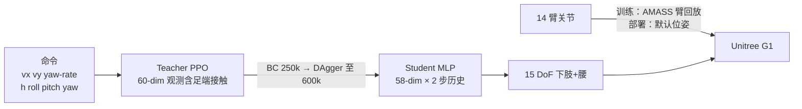
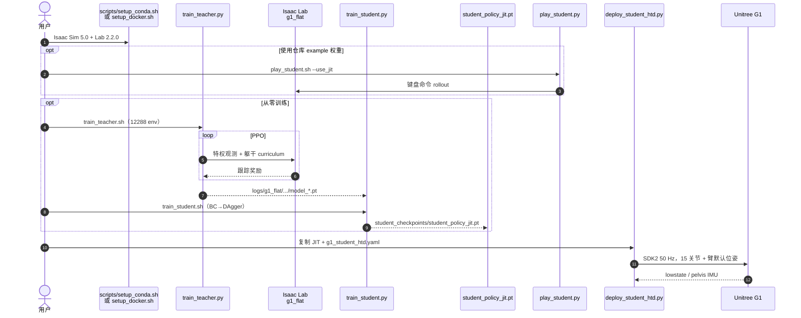

# HTD 解耦全身控制器（IsaacLab-Decoupled-WBC）

**HTD Decoupled WBC** 是 [Humanoid Touch Dream](./paper-humanoid-touch-dream.md)（[方法页](../methods/humanoid-transformer-touch-dreaming.md)）的稳定执行层：在 [Isaac Lab](./isaac-lab.md) 上训练解耦全身/下肢控制器，student 只控下肢与腰，上肢留给遥操作或操作策略。官方实现是 [chrisyrniu/IsaacLab-Decoupled-WBC](https://github.com/chrisyrniu/IsaacLab-Decoupled-WBC)，由论文仓 [humanoid-touch-dream](https://github.com/chrisyrniu/humanoid-touch-dream) 以 submodule 挂入。

## 一句话定义

用移动操作风格把人形控制拆开：RL 负责「走得稳、躯干跟得上」，上肢默认位姿或外部命令；单 GPU 可训完，Isaac Sim/Lab 训练后零样本部署到 Unitree G1。

## 英文缩写速查

| 缩写 | 英文全称 | 简要说明 |
|------|----------|----------|
| HTD | Humanoid Transformer with Touch Dreaming | 上层接触感知模仿策略；本页只覆盖其 WBC 底座 |
| WBC | Whole-Body Control | 此处指学习型解耦全身控制，不是 QP/HQP |
| LBC | Lower-Body Controller | 论文用语：控下肢+腰、跟踪速度与躯干姿态 |
| PPO | Proximal Policy Optimization | Teacher 阶段 on-policy 算法 |
| BC | Behavior Cloning | Student 第一阶段：模仿 teacher 动作 |
| DAgger | Dataset Aggregation | Student 第二阶段：在自身状态下向 teacher 补标 |
| JIT | Just-In-Time compilation | 部署用 `student_policy_jit.pt` 导出格式 |
| G1 | Unitree G1 Humanoid | 官方真机验证平台 |

## 为什么重要

人形接触丰富 loco-manipulation 先要有一个**命令接口干净、姿势覆盖广**的低层。HTD 不把平衡和灵巧操作塞进同一个 Transformer：WBC 跟踪底盘速度与躯干 6D 姿态，策略/遥操作只下命令。

相对同谱系解耦栈，本发布的工程价值是：

1. **轻量可复现。** 全管线声称单 GPU 可完成；仓库带 teacher/student example checkpoint，`play_*` 不用先训练。
2. **极端躯干姿态是一等公民。** 高度可到约 0.35 m，pitch 训练上界约 \(1.57\) rad（近乎直立到大幅前倾），服务蹲下铲猫砂、端茶行走这类任务。
3. **零样本真机路径完整。** Isaac Lab 训练 → JIT student → Unitree SDK2，50 Hz；项目页提供浏览器 [MuJoCo Demo](https://humanoid-touch-dream.github.io/wbc_mujoco/dist/index.html)。

## 开源状态（2026-08-26 项目页 + README 核查）

| 组件 | 状态 | 入口 |
|------|------|------|
| Teacher PPO 训练 / 仿真 play | **已开源** | `scripts/train_teacher.sh`、`play_teacher.sh` |
| Student BC→DAgger / JIT | **已开源** | `scripts/train_student.sh`、`play_student.sh` |
| Example checkpoints | **已开源** | `example/`、`deploy/policy/g1_student/` |
| G1 真机部署 | **已开源** | `deploy/deploy_student_htd.py` |
| 浏览器 MuJoCo Demo | **已公开** | 项目页 `wbc_mujoco/dist` |
| 全身 VR 遥操作与采数 | **待发布** | AVP / PICO，README 标 on-going |
| HTD 策略训练与部署 | **待发布** | 论文仓 checklist 仍 on-going |

代码开放程度：**部分开源**（WBC 全链路可跑；采数与 HTD 策略尚未放出）。

## 流程总览

## 核心原理

### 1. 解耦接口（mobile-manipulation 风格）

维护部署路径里 **student 输出 15 维动作**（双腿 12 + 腰 yaw/roll/pitch），目标关节：

`q_target = default_pos + action × 0.25`

未控的 14 个臂关节在真机保持 `arm_default_joint_pos`。训练/仿真 play 则从 [AMASS Retargeted for G1](https://huggingface.co/datasets/ember-lab-berkeley/AMASS_Retargeted_for_G1) 的 CMU 子集回放臂运动，让下肢在上肢扰动下仍跟命令——这是「解耦」而不是「忽略上肢动力学」。

### 2. 命令空间与极端姿势 curriculum

`g1_flat` 训练范围（`legged_lab/envs/g1/g1_config.py`）：

| 命令 | 训练范围 | 说明 |
|------|----------|------|
| \(v_x, v_y\) | \(\pm 0.5\) m/s | 部署 yaml 略放宽到 \(\pm 0.55\) |
| \(\omega_z\) | \(\pm 1.57\) rad/s | 原地转向 |
| 身高 | \(0.35\)–\(0.8\) m | 默认站立约 \(0.72\) m |
| roll | \(\pm 0.7\) rad | curriculum 从 \(\pm 0.4\) 扩到满范围 |
| pitch | \(-0.52\)–\(1.57\) rad | 大幅前倾/后仰 |
| yaw | \(\pm 1.57\) rad | 相对命令坐标系 |

Per-axis curriculum 在 20k–60k iteration 把躯干范围从保守区间扩到上表；`rel_standing_envs = 0.4` 保留大量站立样本，服务操作时「站住跟姿态」。

### 3. Teacher–Student 观测差

| | Teacher | Student |
|--|---------|---------|
| 观测 | 60 维：角速度 3 + 投影重力 3 + 命令 7 + \(q\) 15 + \(\dot q\) 15 + 上一步动作 15 + **足端接触 2** | **58 维**（去掉足端接触）× **2 步历史** = 116 维 |
| 网络 | PPO actor-critic（flat 任务） | MLP `[512, 256, 128]` |
| 特权 | 足端接触仅仿真可得 | 真机可观测本体 |

蒸馏是标准 [特权训练](../concepts/privileged-training.md) + [BC→DAgger](../methods/teacher-student-dagger-training.md)：先 250k BC，再 DAgger 到 600k steps（4096 env）。Teacher 默认 12288 并行环境、250k iteration。

### 4. 奖励偏跟踪，不偏技能库

主正奖励是速度跟踪、身高/roll/pitch/yaw 指数跟踪、站立足端稳定与膝间距；重负项包括终止、腰/踝/髋 pitch **软力矩限**（weight \(-100\)）、飞脚与非期望接触。目标是 **命令跟踪器**，不是 motion-tracking 技能库（对照 [SONIC](../methods/sonic-motion-tracking.md) / [GR00T-WholeBodyControl](./gr00t-wholebodycontrol.md)）。

## 工程实践

| 项 | 取值 / 入口 |
|----|-------------|
| 仿真栈 | Isaac Sim 5.0 + Isaac Lab 2.2.0（Python 3.11）；可选 Sim 4.5 + Lab 2.1.0 |
| 安装 | `scripts/setup_conda.sh` 或 Docker `chrisyrniu/htd-wbc:isaaclab-2.2.0` |
| 控制频率 | 部署 `control_dt: 0.02`（50 Hz） |
| 真机协议 | Unitree SDK2，`msg_type: hg`，IMU `pelvis` |
| 安全夹紧 | 部署 yaml 收紧 roll/pitch/yaw；`waist_pitch_limits: ±0.768` rad |
| 手柄 | L2+R2 进 debug → Start 站立 → A 开策略；Select 软件停机（不能替代硬件急停） |
| 上游框架 | 基于 [LeggedLab](https://github.com/Hellod035/LeggedLab) |

键盘 play：`W/A/S/D` 速度，`Q/E` 偏航，`H/J` 身高，`Z/X/C/V/B/N` 躯干姿态，`R` 复位。

## 源码运行时序图

节点对齐 [`sources/repos/isaaclab_decoupled_wbc.md`](../../sources/repos/isaaclab_decoupled_wbc.md) 与 README 脚本。无可运行 HTD 策略入口，故本图只覆盖 **已发布的 WBC 路径**。

最短复现：装环境后直接 `bash scripts/play_student.sh`，再按 [Deployment Guide](https://github.com/chrisyrniu/IsaacLab-Decoupled-WBC/blob/main/docs/deployment.md) 上真机。

## 评测与对照

项目页给出与 [AMO](./paper-loco-manip-161-135-amo.md)、[FALCON](./paper-loco-manip-161-109-falcon.md) 的跟踪误差（均值±标准差；粗体为该行最优，转写自主页表）：

| 指标 | HTD WBC | AMO | FALCON |
|------|---------|-----|--------|
| \(E_v\) (m/s) | **0.1420 ± 0.0568** | 0.1779 ± 0.0642 | 0.1641 ± 0.0309 |
| \(E_\omega\) (rad/s) | 0.1806 ± 0.0534 | **0.1540 ± 0.0316** | 0.1874 ± 0.0263 |
| \(E_h\) (m) | **0.0280 ± 0.0438** | 0.0568 ± 0.0814 | 0.1299 ± 0.0082 |
| \(E_y\) (rad) | **0.0126 ± 0.0051** | 0.1540 ± 0.0534 | 0.1215 ± 0.0111 |
| \(E_p\) (rad) | **0.0487 ± 0.1796** | 0.1519 ± 0.1254 | 未跟踪 |
| \(E_r\) (rad) | **0.0157 ± 0.0065** | 0.0735 ± 0.0447 | 未跟踪 |

读法：该控制器在 **高度与躯干朝向** 上明显更紧，角速度跟踪不是最强；FALCON 本就不跟踪 pitch/roll。数字来自作者项目页，对照协议（命令分布、是否含上肢扰动）未在 README 逐项复现，选型时当作 **同文对照** 而非独立第三方基准。

## 局限与风险

- **不是通用 motion tracker。** 接口是 7 维 locomotion+torso 命令，不能当 SONIC/GMT 那种全身参考跟踪器。
- **上肢在真机是开环默认位姿。** 操作时的臂/手必须由遥操作、IK 或 HTD 策略另接；本仓不包含那一层（仍 on-going）。
- **平地主路径。** 仓库有 `g1_rough` 配置（LSTM actor-critic），README 维护路径与 example 权重走 `g1_flat`。
- **动捕子集许可独立。** `dataset/g1/CMU/` 不在 BSD-3-Clause 覆盖内，再分发需遵守 AMASS / HF 数据集条款。
- **与 NVIDIA「Decoupled WBC」同名不同仓。** [GR00T-WholeBodyControl](./gr00t-wholebodycontrol.md) 的解耦 WBC 服务 N1.5/N1.6 VLA；本页是 HTD/G1 接触操作底座，不要混权重。

## 关联页面

- [Humanoid Transformer with Touch Dreaming](../methods/humanoid-transformer-touch-dreaming.md) — 本控制器之上的触觉模仿策略
- [Whole-Body Control](../concepts/whole-body-control.md) — 学习型解耦 WBC 在概念谱系中的位置
- [Loco-Manipulation](../tasks/loco-manipulation.md) — 稳定下肢 + 上肢操作的任务设定
- [Teleoperation](../tasks/teleoperation.md) — HTD 采数仍待开源；WBC 已可作遥操作低层
- [Isaac Lab](./isaac-lab.md) — 训练底座（Lab 2.2.0）
- [Unitree G1](./unitree-g1.md) — 官方部署本体
- [Privileged Training](../concepts/privileged-training.md) — teacher 足端接触 → student 本体历史
- [Teacher-Student 与 DAgger](../methods/teacher-student-dagger-training.md) — 蒸馏日程的方法页
- [GR00T-WholeBodyControl](./gr00t-wholebodycontrol.md) — NVIDIA 同名「解耦 WBC」对照
- [AGILE](./paper-agile-humanoid-loco-manipulation.md) — 另一条 Isaac Lab 人形 RL 工作流
- [AMO](./paper-loco-manip-161-135-amo.md) / [FALCON](./paper-loco-manip-161-109-falcon.md) — 项目页跟踪误差对照
- [HOMIE](./paper-loco-manip-161-040-homie.md) — 分层 loco-manip 接口对照
- [Sim2Real](../concepts/sim2real.md)

## 参考来源

- [sources/repos/isaaclab_decoupled_wbc.md](../../sources/repos/isaaclab_decoupled_wbc.md)
- [sources/repos/humanoid_touch_dream.md](../../sources/repos/humanoid_touch_dream.md)
- [sources/sites/humanoid-touch-dream.md](../../sources/sites/humanoid-touch-dream.md)
- [sources/papers/humanoid_touch_dream.md](../../sources/papers/humanoid_touch_dream.md)

## 推荐继续阅读

- [IsaacLab-Decoupled-WBC](https://github.com/chrisyrniu/IsaacLab-Decoupled-WBC) — 训练与部署主仓
- [浏览器内驱动 HTD 控制器](https://humanoid-touch-dream.github.io/wbc_mujoco/dist/index.html)
- [HTD 项目主页](https://humanoid-touch-dream.github.io/)
- [arXiv:2604.13015](https://arxiv.org/abs/2604.13015)
- [LeggedLab](https://github.com/Hellod035/LeggedLab) — 本仓派生的 Isaac Lab 足式训练框架
