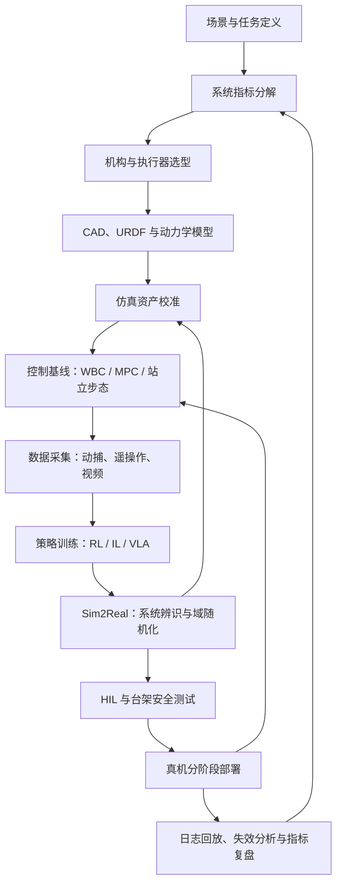

# 人形机器人（Humanoid Robot）

## 一句话定义

人形机器人是具有双足步行能力和类人形态（躯干 + 双臂 + 双腿）的机器人平台，兼顾移动能力与操作能力，是当前具身智能研究的核心载体。

## 英文缩写速查

| 缩写 | 英文全称 | 简要说明 |
|------|----------|----------|
| DoF | Degrees of Freedom | 人形通常 20–50+ 关节自由度 |
| MoCap | Motion Capture | 人体演示数据来源，支撑 IL/重定向 |
| IL | Imitation Learning | 从专家演示/动捕学习策略 |
| VLA | Vision-Language-Action | 类人形态便于接入多模态基础策略 |
| WBC | Whole-Body Control | 协调多肢满足平衡与操作任务 |
| Sim2Real | Simulation to Real | 仿真策略迁移真机的核心工程议题 |
| CAD | Computer-Aided Design | 机构建模与硬件设计 |
| URDF | Unified Robot Description Format | 机器人动力学模型与仿真导入 |
| MPC | Model Predictive Control | 滚动优化质心/接触的站立步态基线 |
| RL | Reinforcement Learning | 仿真中训练行走与全身策略 |
| HIL | Hardware-in-the-Loop | 真机联仿/台架测试，上保护绳前的安全验证（非 Hybrid Imitation Learning） |
| QDD | Quasi-Direct Drive | 低减速比准直驱，Unitree 等平台常见 |
| SEA | Series Elastic Actuator | 串联弹性执行器，Digit 等平台采用 |
| PRS | Planetary Roller Screw | 行星滚柱丝杠直线腿驱动（如 Optimus） |
| EtherCAT | Ethernet for Control Automation Technology | 工业实时总线，OpenLoong 等全尺寸人形采用 |
| ROS 2 | Robot Operating System 2 | 人形高频控制的通信与中间件栈 |
| FastDDS | Fast Data Distribution Service | ROS 2 默认 DDS 实现，影响控制延迟 |
| HAL | Hardware Abstraction Layer | 屏蔽不同机型的底层驱动差异 |
| MuJoCo | Multi-Joint dynamics with Contact | 接触丰富动力学仿真与分析 |

## 核心特征

人形机器人之所以成为机器人研究的“明珠”，是因为它具备以下核心特征：

1. **多自由度（High DOFs）**：通常具有 20 到 50 个以上的自由度，涵盖颈部、躯干、手臂（含手掌）和腿部。这使得它能够模拟人类的复杂动作，并在人类设计的环境中（如楼梯、狭窄通道）灵活穿梭。
2. **非稳定平衡（Unstable Equilibrium）**：与轮式或四足机器人不同，双足支撑面较小且重心较高。这要求控制器必须实时处理动态平衡，防止倾跌。
3. **接触丰富性（Contact Richness）**：人形机器人的任务通常涉及频繁的接触切换（足端接地、手部操作、身体靠墙等），这在物理建模和控制算法上提出了极高要求。
4. **具身智能载体**：它的类人形态使其能够直接复用大量人类演示数据（MoCap, Video），是端到端具身智能（VLA, Foundation Models）训练的最佳平台。

## 整体开发流程

人形机器人开发通常不是“先做算法再上机”的线性流程，而是硬件指标、仿真资产、控制基线、数据采集与实机验证持续闭环：

关键检查点包括：机械限位和热约束是否进入仿真模型、低层力矩/位置接口是否稳定、策略是否先通过 HIL 与保护绳测试、实机日志是否能反哺系统辨识和奖励/数据分布设计。

## 主流平台速览

| 平台 | 组织 | DOF | 执行器类型 | 当前状态 | 备注 |
|------|------|-----|-----------|---------|------|
| **Atlas** | Boston Dynamics | 28 | 液压/全电 | 研究平台 | 动态平衡的行业标杆，全电版近期发布 |
| **Unitree H1/G1** | Unitree | 19-23 | 准直接驱动(QDD) | 商业化 | 性价比极高，是当前 RL 研究的首选硬件 |
| **KUAVO（夸父）** | 乐聚 | 全尺寸 | 轮臂双形态可选 | 商业化/科研 | 国产全尺寸人形 + [OpenLET](./openlet.md) 真机数据生态 |
| **Digit** | Agility Robotics | 20 | 串联弹性执行器(SEA) | 商业部署 | 数字化物流场景的先驱，独特的腿部结构 |
| **Tesla Optimus** | Tesla | ~40 | 线性/旋转执行器 | 内部迭代 | 追求量产效率与全栈 AI；腿部 **PRS 直线驱动** 公开讨论与权衡见 [行星滚柱丝杠人形腿](../concepts/planetary-roller-screw-humanoid-leg-actuation.md) |
| **Apollo** | Apptronik | 28 | 电力驱动 | 商业化 | 针对工业协同设计，强调安全与交互 |
| **Fourier GR-1** | Fourier Intelligence | 44 | 力控电机 | 商业化 | 全身力控能力较强，自由度极高 |
| **Figure 02** | Figure AI | ~50（量级） | 电力驱动 | 商业试点 | 全栈人形 + 自研 Helix VLA，见 [Figure AI](./figure-ai.md) |
| **NEO / EVE** | 1X Technologies | 依型号 | 双足 / 轮式人形 | 产品迭代中 | 家庭与工业场景分叉布局，见 [1X](./1x-technologies.md) |
| **OpenLoong 青龙** | 人形机器人（上海）/ 开放原子 | **43** | EtherCAT 全尺寸公版 | 全栈开源 | MPC/WBC + ROS-free Framework；见 [OpenLoong](./openloong.md) |

详细对比见：[主流人形机器人硬件对比](../queries/hardware-comparison.md)

## 与四足机器人的区别

四足平台的定义、典型硬件与任务侧重见 [四足机器人](./quadruped-robot.md)。虽然两者都属于腿足机器人（Legged Robots），但人形机器人面临的挑战更为严苛：

- **重心高度**：人形机器人重心更高，支撑区域更窄，扰动容忍度极低。四足机器人天然具备静态稳定性，而人形机器人必须通过主动控制维持动态平衡。
- **操作能力**：四足机器人主要侧重于移动（Locomotion），而人形机器人必须兼顾操作（Manipulation）。这种“动中稳”的操作（Loco-manipulation）是目前最前沿的挑战。
- **自由度冗余**：人形机器人的双臂和躯干提供了极高的运动冗余度，如何有效地协调全身（Whole-body Coordination）以完成多任务，是传统控制与 RL 算法的核心差异点。

## 核心挑战

1. **动态平衡与回收**：在剧烈扰动或复杂地形下不倒地，或在倒地后自主站起。
2. **Sim2Real Gap**：复杂的传动链、执行器非线性、接触动力学误差，导致仿真策略难以直接在实机运行。
3. **高频控制与延迟**：人形机器人通常需要 500Hz-1000Hz 的控制频率，对算力和中间件（ROS2/FastDDS）提出了极高要求。
4. **能源与续航**：在高自由度高功率输出下，如何维持超过 2 小时的有效工作时间是制约商业化的瓶颈。

## 相关工具链

- **设计与分析**：[URDF-Studio](./urdf-studio.md) (专业设计工作站)、[Robot Explorer](./robot-explorer.md) (动力学分析)、[Tnkr](./tnkr.md) (开源整机：CAD/线束/代码/部署一体协作)
- **仿真平台**：[isaac-gym-isaac-lab](isaac-gym-isaac-lab.md) (NVIDIA)、[mujoco](mujoco.md) (DeepMind)、[Motrix](./motrix.md) (Motphys)
- **模型预览**：[Robot Viewer](./robot-viewer.md)
- **数据集**：Open X-Embodied, Droid；互联网级人中心视频语料见 [HumanNet](./humannet.md)；产业侧人体运动数据供应商例见 [MotionCode](./motioncode.md)（官网宣称对接仿真与 DCC 管线，需单独核实授权与格式）

## 关联页面
- [主流人形机器人硬件对比](../queries/hardware-comparison.md)
- [Locomotion 任务](../tasks/locomotion.md)
- [Loco-Manipulation](../tasks/loco-manipulation.md)
- [全身运动控制](../concepts/whole-body-control.md)
- [WBC vs RL 对比](../comparisons/wbc-vs-rl.md)
- [Unitree](./unitree.md)
- [乐聚机器人 / KUAVO](./leju-robotics.md)
- [高擎机电（HighTorque Robotics）](./hightorque-robotics.md)
- [四足机器人](./quadruped-robot.md)
- [ANYmal](./anymal.md)（高性能四足机器人，足式 RL 研究标杆）
- [Boston Dynamics](./boston-dynamics.md)（足式机器人技术巅峰，Atlas 与 Spot 开发商）
- [Figure AI](./figure-ai.md)（Figure 02 与 Helix VLA）
- [1X Technologies](./1x-technologies.md)（EVE / NEO 产品线）
- [开源人形机器人“大脑”选型](./open-source-humanoid-brains.md) — 算力平衡与硬件底座
- [Asimov v1](./asimov-v1.md) — 单仓 CAD/电气/MuJoCo/板载软件与双板架构参考
- [人形机器人并联关节解算](../concepts/humanoid-parallel-joint-kinematics.md) — 闭链踝等机构层与仿真控制接口分层
- [Robot in a crib（iCub mobile paradigm）](./paper-robot-in-crib-sensorimotor-contingency.md) — 发展机器人视角下的早期动作–世界因果学习
- [人形腿部行星滚柱丝杠直线驱动](../concepts/planetary-roller-screw-humanoid-leg-actuation.md) — PRS + 连杆的量产叙事与动态权衡（Optimus 相关公开讨论）
- [机器人硬件抽象层 (HAL) 设计指南](../queries/hardware-abstraction-layer.md) — 屏蔽硬件差异的工程实践
- [人形机器人电池与热管理指南](../queries/humanoid-battery-thermal-management.md) — 硬件部署中的动力与散热闭坑
- [Query：人形机器人硬件怎么选](../queries/humanoid-hardware-selection.md)
- [市面知名机器人平台纵览](../overview/notable-commercial-robot-platforms.md) — 人形 / 四足高频品牌索引
- [机器人开源宝库（微信策展第01期）](../overview/robot-open-source-wechat-issue01-curator.md) — 10 个开源整机/平台实体索引（傅利叶 N1、智元 X1、天工、ODRI、BHL、Orca、TurtleBot3、ROBOTIS 等）
- [机器人开源宝库（微信策展第02期）](../overview/robot-open-source-wechat-issue02-curator.md) — Reachy2、Poppy、InMoov、Doggo/Pupper、myCobot 320、myAGV、TidyBot2、Kinova Gen3、Franka R3、PAROL6
- [舞肌科技](./wuji-robotics.md) — 关节级高扭矩电机 OEM 叙事（F 系列 / Pan Motor，见原始资料溯源）
- [MotionCode](./motioncode.md) — 人体运动采集与 Mind 线人形/具身训练叙事（产业数据侧参照）
- [HumanNet](./humannet.md) — 互联网级人中心视频语料与具身预训练管线参照
- [Project Instinct](./project-instinct.md) — 清华 IIIS / 期智人形「本能级全身控制」公开研究站群（接触丰富 Shadowing、深度跑酷、野外徒步）
- [ergoCub Shared Embodied Intelligence](./paper-ergocub-shared-embodied-intelligence.md) — IIT×INAIL 人因导向硬件–控制联合优化人形（*Nat Mach Intell* 2026）
- [执行器驱动链选型闭环知识链](../queries/actuator-drive-chain-selection-loop.md) — 人形本体的执行器子系统即本驱动链选型闭环的物理载体

## 参考来源
- [wechat_zanezhang_tesla_optimus_leg_planetary_roller_screw.md](../../sources/blogs/wechat_zanezhang_tesla_optimus_leg_planetary_roller_screw.md) — Optimus 腿部 PRS 路线的第三方解读（与平台表交叉引用）
- [humanoid_hardware.md](../../sources/papers/humanoid_hardware.md)
- [humannet.md](../../sources/papers/humannet.md) — 大规模人中心视频语料（与人形数据飞轮对照）
- [humanoid_motion_control_know_how.md](../../sources/papers/humanoid_motion_control_know_how.md)
- [notable-commercial-robot-platforms](../../sources/repos/notable-commercial-robot-platforms.md) — 市面知名平台官网索引（2026-05）
