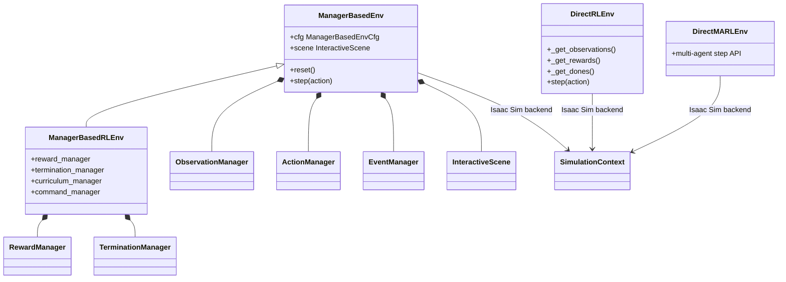
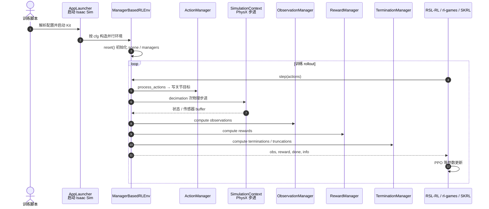
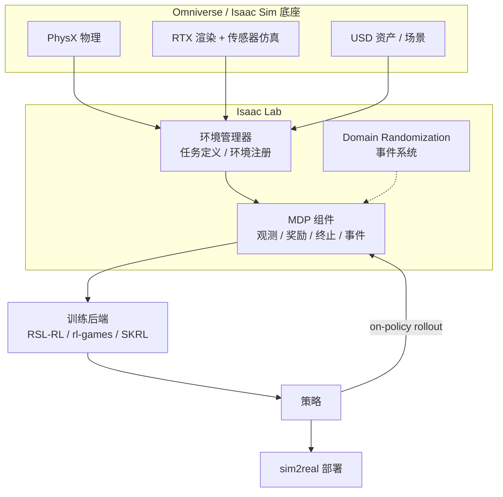
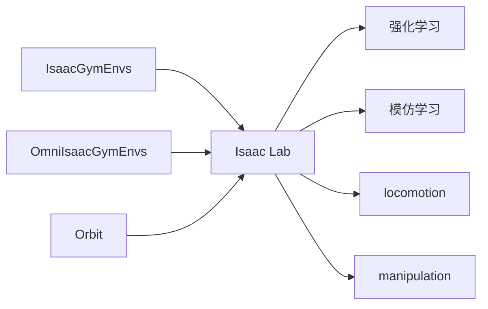

---

type: entity
tags: [entity, simulator, isaac, isaac-sim, gpu-simulation, reinforcement-learning, sim2real, nvidia]
status: stable
updated: 2026-09-05
related:
  - ./nvidia-isaac-lab-spot-locomotion-sim2real.md
  - ./nvidia-isaac-lab-ur10e-industrial-assembly-sim2real.md
  - ./isaac-lab-default-environments.md
  - ./isaac-gym-isaac-lab.md
  - ./isaac-sim.md
  - ./isaac-gym.md
  - ../concepts/implicit-explicit-actuator-modeling.md
  - ./robotic-world-model-eth-rsl.md
  - ./newton-physics.md
  - ./mujoco-warp.md
  - ./nvidia-warp.md
  - ./mujoco-playground.md
  - ./mjlab.md
  - ../overview/robot-training-stack-layers-technology-map.md
  - ./legged-gym.md
  - ../methods/reinforcement-learning.md
  - ../concepts/cartpole.md
  - ../tasks/locomotion.md
  - ../entities/paper-chord-contact-wrench-dexterous-manipulation.md
  - ../concepts/sim2real.md
  - ./paper-agile-humanoid-loco-manipulation.md
  - ./htd-decoupled-wbc.md
  - ./paper-rl-vs-gc.md
  - ../comparisons/rl-vs-geometric-control.md
  - ./paper-p3.md
  - ./lw-benchhub-tour.md
  - ./dexbench.md
  - ./nvidia-getting-started-isaac-lab.md
  - ./perceptron-isaac-05.md
  - ./rsl-rl.md
  - ./autodl.md
  - ./gpufree.md
  - ./stackforce.md
  - ./isaac-rl-two-wheel-legged-bot.md
  - ./matpool.md
  - ./featurize.md
  - ./gpushare.md
  - ./ai-galaxy.md
  - ../comparisons/china-gpu-cloud-platforms.md
  - ../comparisons/international-gpu-cloud-platforms.md
sources:
  - ../../sources/repos/isaac_lab.md
  - ../../sources/repos/isaac_lab_environments.md
  - ../../sources/repos/isaac_sim.md
  - ../../sources/courses/nvidia_sim_to_real_so101_isaac.md
  - ../../sources/courses/nvidia_getting_started_isaac_lab.md
  - ../../sources/papers/simulation_tools.md
  - ../../sources/papers/policy_optimization.md
  - ../../sources/blogs/wechat_embodied_ai_lab_robot_training_stack_layers_2026.md
  - ../../sources/blogs/nvidia_isaac_lab_spot_locomotion_sim2real.md
  - ../../sources/blogs/nvidia_isaac_lab_ur10e_industrial_assembly_sim2real.md
  - ../../sources/courses/isaac_lab_implicit_explicit_actuators.md
  - ../../sources/papers/agile_arxiv_2603_20147.md
  - ../../sources/papers/p3_arxiv_2607_25541.md
  - ../../sources/repos/wbc_agile.md
  - ../../sources/papers/leveling_playing_field_rl_vs_gc_arxiv_2506_17832.md
  - ../../sources/repos/rl-vs-gc.md
summary: "NVIDIA 当前官方主推的 robot learning 框架，建立在 Isaac Sim 之上，承接 IsaacGymEnvs/Orbit 用户；locomotion、manipulation 与 sim2real 新实验的首选仿真栈。"
---

# Isaac Lab

**Isaac Lab** 是 NVIDIA 当前官方主推的机器人学习框架，建立在 **Isaac Sim** 之上，用于 robot learning、locomotion、manipulation 和 sim2real 研究。

> **名称消歧：** 本页是 NVIDIA **仿真训练框架**。Perceptron 的开源通才模型也叫 Isaac，见 [Perceptron Isaac 0.5](./perceptron-isaac-05.md)。

## 一句话定义

> Isaac Lab 不是 [Isaac Gym](./isaac-gym.md) 的 API 换皮，而是 NVIDIA 当前 robot learning 的官方主线框架：它接住了 IsaacGymEnvs / OmniIsaacGymEnvs / Orbit 用户，跑在更完整的 [Isaac Sim](./isaac-sim.md) 生态上。

## 英文缩写速查

| 缩写 | 英文全称 | 简要说明 |
|------|----------|----------|
| Sim2Real | Simulation to Real | 把仿真中学到的策略迁移落地真机的工程主线 |
| Isaac Lab | NVIDIA Isaac Lab | 基于 Omniverse 的机器人学习训练框架 |
| Isaac Gym | NVIDIA Isaac Gym | GPU 并行刚体仿真训练环境 |
| API | Application Programming Interface | 应用程序编程接口 |
| GPU | Graphics Processing Unit | 图形处理器，大规模并行仿真训练的算力基础 |
| RL | Reinforcement Learning | 通过与环境交互最大化长期回报来学习策略的范式 |
| IL | Imitation Learning | 从专家演示学习策略，奖励难定义时的主路线 |
| DR | Domain Randomization | 训练时随机化仿真参数以提升跨域鲁棒迁移 |
| Locomotion | Robot Locomotion | 足式/人形等无轮移动能力的总称 |
| PPO | Proximal Policy Optimization | 人形/足式 locomotion 中最常用的 on-policy 策略梯度算法 |
| Teleop | Teleoperation | 人遥操作机器人采集演示数据 |
| legged_gym | Legged Gym | 足式机器人 RL 训练的常用开源框架 |

## 先说结论

- 如果你要搭**现在的新实验栈**，应该优先看 Isaac Lab。
- 它是 [Isaac Gym](./isaac-gym.md) 这条线的后继者，但**不是简单的版本号升级**。
- 它官方持续维护、文档更系统、迁移路径更明确。

三代产品的整体定位与迁移路径，见综述页：[Isaac Gym / Isaac Sim / Isaac Lab](./isaac-gym-isaac-lab.md)。仿真底座细节见独立实体页：[Isaac Sim](./isaac-sim.md)。

## 为什么它重要

Isaac Lab 之所以是当前主线：

- 它接住了 [Isaac Gym](./isaac-gym.md) 这条 GPU 并行 RL 的能力路线
- 建立在更完整的 [Isaac Sim](./isaac-sim.md) 生态之上（渲染、传感器、USD 资产）
- 官方持续维护、文档更系统、迁移路径更明确
- 对 robot learning / manipulation / locomotion 的支持更现代
- **算法兼容性**：新一代算法如 **BRRL / BPO (2026)** 优先在 Isaac Lab 环境下完成了人形机器人行走等任务的验证，显示了它对现代 RL 研究的良好支撑

## 它解决什么问题

Isaac Lab 的目标是提供一套现代化、可维护的 robot learning workflow：

- 提供从旧框架（IsaacGymEnvs / OmniIsaacGymEnvs / Orbit）迁移的官方路径
- 支持训练、迁移、任务定义、环境注册、仿真管理
- 在同一套生态里覆盖 RL、IL、locomotion、manipulation
- Quickstart 默认教学任务是 [Cartpole](../concepts/cartpole.md) 的 `Isaac-Cartpole-v0` / `Isaac-Cartpole-Direct-v0`：同一倒立摆直觉，连续力矩 + GPU 并行，数字不能从 Gymnasium `CartPole-v1` 照搬。官方自学路径见 [Getting Started With Isaac Lab](./nvidia-getting-started-isaac-lab.md)（external template 注册 `Template-Cartpole-v0`，再做 UR10 reach）
- 自带一整套开箱即跑的默认任务（v3.0.0 共 **197** 个注册 ID，覆盖经典控制、操作、装配、足式、移动操作、导航、多旋翼与多智能体）：全量清单与命名法见 [Isaac Lab 默认环境](./isaac-lab-default-environments.md)
- 第三方空中对照：[RL vs GC](./paper-rl-vs-gc.md) 用 Lab **DirectRLEnv** 注册四旋翼 / 固定臂跟踪与接球，在同一奖励与前馈下比较 PPO 与 \(SE(3)\) 几何控制（Isaac Sim 4.2 / Lab 1.4.1；[仓库](https://github.com/PratikKunapuli/rl-vs-gc)）

## 核心类图

对齐官方 Task Design Workflows：`ManagerBased*`（模块化 MDP）与 `Direct*`（单类实现，接近旧 IsaacGymEnvs 心智）：

## 源码运行时序图

官方仓 [isaac-sim/IsaacLab](https://github.com/isaac-sim/IsaacLab)；典型入口为 `scripts/reinforcement_learning/.../train.py`（或文档中的 AppLauncher + env 注册）。manager-based RL 一步交互如下：

- **复现路径：** 安装匹配版本的 Isaac Sim → clone Isaac Lab → 按文档选 RSL-RL/rl-games/SKRL 后端跑官方任务；从 Gym 迁移见官方 Migration 指南。
- **开源状态：** 训练框架已开源；运行依赖 Isaac Sim（见 [isaac-sim source](../../sources/repos/isaac_sim.md)）。

## 架构与工作流

Isaac Lab 的关键区别在于它**站在 [Isaac Sim](./isaac-sim.md) / Omniverse 之上**，因此除了物理还能给到高保真渲染与传感器仿真：

## 它的典型特征

- 建立在 **Isaac Sim** 上
- 支持强化学习、模仿学习、locomotion、manipulation
- 提供从旧框架迁移的官方文档
- 有更清晰的任务组织与环境注册方式（manager-based / direct workflow）
- 是 NVIDIA 现在推荐的主线
- 通过事件系统组织 domain randomization

## 从 Isaac Gym 迁移过来

Isaac Lab 收敛了之前几条分叉的 NVIDIA robot learning 栈：

迁移时**不会全部作废**：训练逻辑、任务构造、reward 设计、DR 思路很多是从 Isaac Gym 时代继承下来的，主要变化在环境注册方式和 API 组织。

## 什么时候优先用 Isaac Lab

如果你：

- 正在搭建新的人形 / 足式 RL 项目
- 想用 NVIDIA 官方当前支持的方案
- 想减少以后迁移成本

那就直接优先 Isaac Lab。

## 它和当前项目主线的关系

### 和 Reinforcement Learning 的关系

Isaac Lab 是 RL 训练的现代「基础设施层」，把环境、观测、奖励、随机化都组织成可注册的组件。

见：[Reinforcement Learning](../methods/reinforcement-learning.md)

### 和 Locomotion 的关系

在人形和足式 locomotion 研究里，它是当前主流的训练环境和 benchmark 平台。

见：[Locomotion](../tasks/locomotion.md)

### 和 Manipulation 的关系

灵巧操作与大规模式仿 benchmark 亦在 Isaac Lab 上落地；NVIDIA [CHORD](./paper-chord-contact-wrench-dexterous-manipulation.md) 在 Lab 上发布 **4,739** 项双手任务库并用 **接触力旋量（CWS）** RL 奖励做 Robotic Grounding，是 [Video to Data](https://nvidia-isaac.github.io/video_to_data/) 管线的训练后端实例。[DexVerse](./paper-dexverse.md)（UNC/HKU/Berkeley，arXiv:2607.08751）则在同一栈上提供 **100** 项模块化 dexterous 任务、**3** 臂 × **6** 手多具身与 **3,180** 条 VR 遥操作多模态示范，用于 IL/VLA 跨任务与视觉泛化评测。RLWRLD × NVIDIA 的 [DexBench](./dexbench.md) 是另一条线：官网给出 **18** 项工业原子任务规格，Isaac Lab-Arena README 将其列为 **coming soon**，截至 2026-08-29 **还不能**当已上架的 Arena 环境用。[LW BENCHHUB TOUR](./lw-benchhub-tour.md) 则展示 Arena EnvHub 如何把 Lab 2.3.x 厨房任务接到 `lerobot-eval` 做双臂 SmolVLA 闭环（钉 Sim 5.1，补丁不可随意升级）。

见：[Manipulation](../tasks/manipulation.md)

### 和 Sim2Real 的关系

它提供仿真训练和 domain randomization 的主要工作台，但 sim2real 成功与否还取决于状态估计、系统辨识、执行器建模、观测延迟等。执行器层需区分 **implicit**（引擎内 PD，好训但偏理想）与 **explicit**（用户侧算力矩，更贴近真机）；见 [Implicit / Explicit 执行器建模](../concepts/implicit-explicit-actuator-modeling.md)。

见：[Sim2Real](../concepts/sim2real.md)

### 和云 GPU 算力的关系

本地工作站缺多卡或大显存时，可用 GPU 云租开发机跑 Lab 训练；须区分 **headless 训练** 与 **带 GUI 的 Omniverse 仿真**（后者需要带 **RT 核心** 的 GPU 与桌面/Vulkan 镜像）。国内选型见 [国内 GPU 云平台对比](../comparisons/china-gpu-cloud-platforms.md)，国外见 [国外 GPU 云平台对比](../comparisons/international-gpu-cloud-platforms.md)。教育与小整机场景下，[StackForce 工作台](./stackforce.md) 从 URDF/STEP 资产 **导出 SimReady Isaac 训练工程**，并内链 [GPUFree](./gpufree.md) 作为云训练入口之一。

## 常见误区

### 1. 以为 Isaac Lab = Isaac Gym 2.0

不对。它们不是「Isaac Gym 2.0 = Isaac Lab」的版本号关系；Isaac Lab 是基于 [Isaac Sim](./isaac-sim.md) 的新主线框架，架构与生态都不同。详见 [Isaac Gym](./isaac-gym.md)。

### 2. 以为换成 Isaac Lab，旧经验都作废

也不对。训练逻辑、任务构造、reward 设计、DR 思路很多是继承下来的。

### 3. 以为仿真器选对了，sim2real 就稳了

远远不够。状态估计、系统辨识、执行器建模、观测延迟同样关键。

## 推荐继续阅读

- Isaac Lab 文档首页：<https://isaac-sim.github.io/IsaacLab/v2.1.0/>
- Isaac Lab 迁移指南：<https://isaac-sim.github.io/IsaacLab/v1.0.0/source/migration/index.html>

## 参考来源

- **ingest 档案：** [sources/repos/isaac_lab.md](../../sources/repos/isaac_lab.md)
- **ingest 档案：** [sources/repos/isaac_sim.md](../../sources/repos/isaac_sim.md)
- 官方文档：<https://isaac-sim.github.io/IsaacLab/v2.1.0/>
- Task Design Workflows：<https://isaac-sim.github.io/IsaacLab/main/source/overview/core-concepts/task_workflows.html>
- Ao et al., *Bounded Ratio Reinforcement Learning* (2026) — 在 Isaac Lab 中验证新算法
- **ingest 档案：** [sources/papers/policy_optimization.md](../../sources/papers/policy_optimization.md) — PPO/BRRL 与 Isaac Lab 的结合应用
- **ingest 档案：** [P³ 论文摘录（arXiv:2607.25541）](../../sources/papers/p3_arxiv_2607_25541.md) — Lab + 定制 rsl_rl 的 VAE-PPO 矩匹配训练
- **ingest 档案：** [sources/courses/nvidia_getting_started_isaac_lab.md](../../sources/courses/nvidia_getting_started_isaac_lab.md) — 官方四模块入门：Cartpole / UR10 reach / 三类 sim-to-real 桥接
- **ingest 档案：** [sources/courses/nvidia_sim_to_real_so101_isaac.md](../../sources/courses/nvidia_sim_to_real_so101_isaac.md) — SO-101 课：仿真 DR 遥操作采数、策略评测与 sim2real 对照实验
- **ingest 档案：** [sources/courses/isaac_lab_implicit_explicit_actuators.md](../../sources/courses/isaac_lab_implicit_explicit_actuators.md) — Implicit / Explicit 执行器官方文档索引
- **ingest 档案：** [具身智能研究室训练栈分层解读](../../sources/blogs/wechat_embodied_ai_lab_robot_training_stack_layers_2026.md) — OpenUSD / PhysX / Lab Views 统一场景–物理–学习接口的策展归纳
- **ingest 档案：** [RL vs GC 论文摘录（arXiv:2506.17832）](../../sources/papers/leveling_playing_field_rl_vs_gc_arxiv_2506_17832.md) — DirectRLEnv 四旋翼跟踪 + Optuna 几何控制

## 关联页面

- [DexBench](./dexbench.md) — RLWRLD × NVIDIA 工业灵巧规格；Arena README 仍标 coming soon，勿当成已注册环境
- [Getting Started With Isaac Lab](./nvidia-getting-started-isaac-lab.md) — 官方入门课：manager 任务设计与 sim-to-real 分类
- [Spot locomotion Sim2Real（官方博客）](./nvidia-isaac-lab-spot-locomotion-sim2real.md) — Researcher Kit + `Isaac-Velocity-Flat-Spot-v0` + Orin 部署
- [UR10e 工业装配 Sim2Real（官方博客）](./nvidia-isaac-lab-ur10e-industrial-assembly-sim2real.md) — IndustReal + Isaac ROS + UR 力矩阻抗
- [Isaac Lab 默认环境](./isaac-lab-default-environments.md) — v3.0.0 全部 197 个注册任务的分族清单与命名法
- [Isaac Sim](./isaac-sim.md) — 仿真底座（USD / PhysX / 传感器）
- [Isaac Gym / Isaac Sim / Isaac Lab 总览](./isaac-gym-isaac-lab.md) — 三代产品定位与迁移路径
- [Isaac Teleop](./isaac-teleop.md) — Lab 3.x XR 主线（取代 `openxr` 设备栈）；Televiz + LeRobot + 无标记手重建
- [Isaac Gym](./isaac-gym.md) — 旧一代独立 GPU RL 前身
- [RSL-RL](./rsl-rl.md) — 默认 PPO / 蒸馏后端；可选 BF16 `update()`
- [Robotic World Model（ETH RSL，RWM / RWM-U）](./robotic-world-model-eth-rsl.md) — Isaac Lab 扩展的神经动力学与想象训练参考实现
- [Newton Physics](./newton-physics.md) — Isaac Lab 存在 `feature/newton` 与 `newton_kamino` 等物理后端
- [MuJoCo Warp](./mujoco-warp.md) — `newton_mjwarp` preset 的刚体后端
- [NVIDIA Warp](./nvidia-warp.md) — Newton / MJWarp 的 JIT 计算层
- [NVIDIA Cosmos](./nvidia-cosmos.md) — 学习式世界模型；与 Lab/Newton 解析仿真互补
- [训练栈分层地图](../overview/robot-training-stack-layers-technology-map.md) — 大平台层定位；与 Playground/mjlab 非同一竞争平面
- [MuJoCo Playground](./mujoco-playground.md) — 轻量 time-to-robot 入口，复杂任务可再迁移至 Lab
- [mjlab](./mjlab.md) — 借用 Lab manager-based API 的 MuJoCo Warp 折中栈
- [REFINE-DP（论文实体）](./paper-loco-manip-161-157-refine-dp.md) — Isaac Lab 上 DP 规划器与 RL loco-manip 联合微调（arXiv:2603.13707）
- [AGILE（论文实体）](./paper-agile-humanoid-loco-manipulation.md) — Lab 之上的人形 RL 全生命周期工作流（Prepare→Deploy；arXiv:2603.20147，WBC-AGILE）
- [HTD 解耦 WBC](./htd-decoupled-wbc.md) — HTD 开源下肢+腰控制器（Lab 2.2.0，单 GPU，G1 零样本）
- [RL vs GC](./paper-rl-vs-gc.md) — Lab DirectRLEnv 上对称比较 PPO 与几何控制（RSS 2025）
- [P³](./paper-p3.md) — Lab + 定制 rsl_rl：VAE-PPO 矩匹配主训与 LSFT（G1 感知地形）
- [legged_gym](./legged-gym.md) — 旧一代足式 RL 训练栈，工程经验可迁移
- [Reinforcement Learning](../methods/reinforcement-learning.md)
- [Cartpole 问题](../concepts/cartpole.md) — Lab 教学任务 `Isaac-Cartpole-v0` 与 Gym CartPole 对照
- [Locomotion](../tasks/locomotion.md)
- [Implicit / Explicit 执行器建模](../concepts/implicit-explicit-actuator-modeling.md)
- [Sim2Real](../concepts/sim2real.md)
- [StackForce](./stackforce.md) — CAD/URDF→SimReady Isaac 工程导出与训练向导
- [Isaac-RL-Two-wheel-Legged-Bot](./isaac-rl-two-wheel-legged-bot.md) — Flamingo 双轮足 Lab 扩展（Sim 4.5 / Lab 2.0 + CaT）
- [LW BENCHHUB TOUR](./lw-benchhub-tour.md) — Lab-Arena EnvHub + 光轮厨房 + SmolVLA 双臂闭环与数据飞轮

## 一句话记忆

> Isaac Lab 是 NVIDIA 当前官方主推、建立在 Isaac Sim 之上的 robot learning 框架，是 Isaac Gym 这条线的现代后继者：做新项目优先选它。
