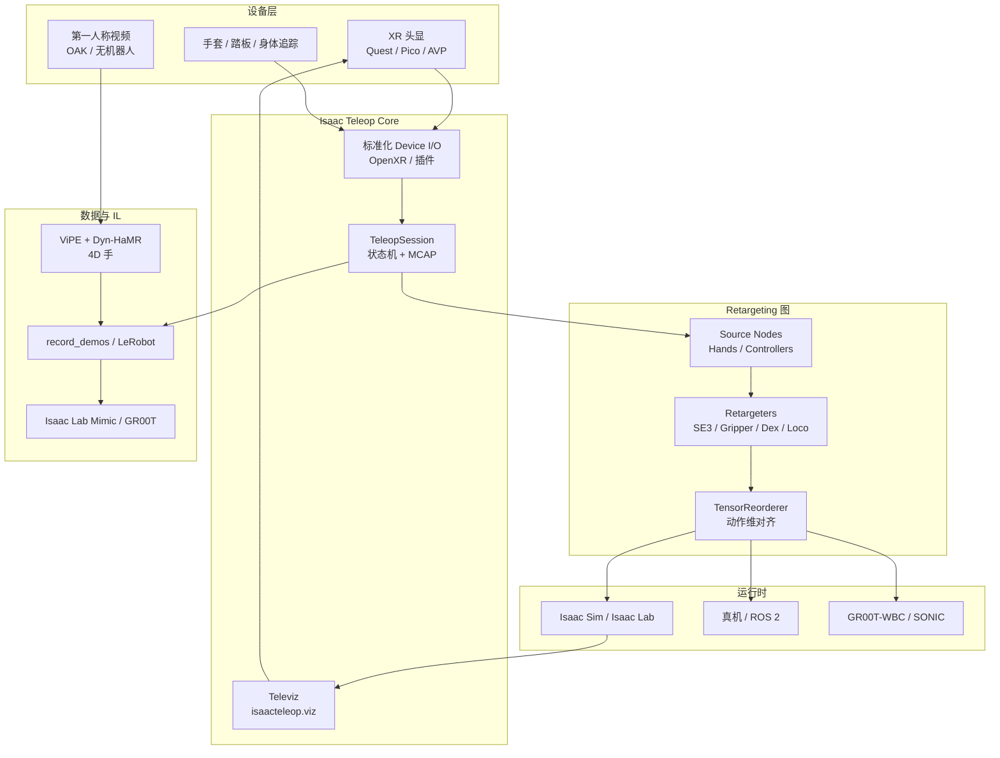

# Isaac Teleop

**Isaac Teleop** 是 NVIDIA 推出的**统一遥操作与数据采集框架**，面向 egocentric 视角下的高保真人机示范：同一套设备抽象与 retargeting 图既可用于 **Isaac Sim / Isaac Lab 仿真**，也可对接 **真机与 ROS2**，并衔接模仿学习示范导出。

## 一句话定义

> 把 XR 头显、手套与外设的跟踪数据，经可组合的 **Source → Retargeter → 动作张量** 管线映射到不同机器人 embodiment，并在 Isaac Lab 里通过 `IsaacTeleopDevice` 与示范录制脚本闭环到 IL 数据飞轮；1.5.x 另提供 **Televiz** 合成器与第一人称 **无标记手重建**。

## 英文缩写速查

| 缩写 | 英文全称 | 简要说明 |
|------|----------|----------|
| Teleop | Teleoperation | 人遥操作机器人采集演示数据 |
| Isaac Lab | NVIDIA Isaac Lab | 基于 Omniverse 的机器人学习训练框架 |
| ROS 2 | Robot Operating System 2 | 机器人系统集成与通信的常用中间件 |
| IL | Imitation Learning | 从专家演示学习策略，奖励难定义时的主路线 |
| G1 | Unitree G1 Humanoid | 宇树入门级教育科研人形平台 |
| Retargeting | Motion Retargeting | 将人体/动物动作映射到目标机器人骨架 |
| CloudXR | NVIDIA CloudXR | 把头显当瘦客户端接到工作站 OpenXR 运行时 |
| Televiz | Isaac Teleop Visualization | `isaacteleop.viz`：相机/重建帧合成到 XR 或桌面 |
| MCAP | Modular Container Bag | 会话录放容器，对接 ROS / LeRobot 工作流 |
| ViPE | Video Pose Estimation | 第一人称视频相机位姿估计（手重建前级） |
| Dyn-HaMR | Dynamic Hand Mesh Recovery | 从视频恢复 4D 手网格与位姿 |
| VLA | Vision-Language-Action | 视觉-语言-动作多模态基础策略方向 |

## 为什么重要

- **栈收敛**：Isaac Lab 侧 **取代** 旧 `isaaclab.devices.openxr` XR 路径，减少「仿真遥操作一套、Lab 集成又一套」的分叉（迁移见 Isaac Lab 3.0 文档）。
- **跨 embodiment**：Franka 单臂 8 维、G1 上身 28 维、全身 loco-manipulation 32 维、GR1T2 灵巧手 36+ 维等，靠 **换 pipeline_builder** 而非重写设备驱动。
- **数据飞轮入口**：MCAP / HDF5 / **LeRobot** 互操作，对接 `record_demos.py` 与 [Isaac Lab Mimic](https://isaac-sim.github.io/IsaacLab/main/source/overview/imitation-learning/index.html)，直接服务「遥操作 → 示范 → 策略」主线（见 [Teleoperation](../tasks/teleoperation.md)、[Imitation Learning](../methods/imitation-learning.md)、[LeRobot](./lerobot.md)）。
- **人数据也能进栈**：官方把 **no-robot 第一人称采数** 与无标记 4D 手重建写成一等公民，不只服务「人坐在仿真里开机器人」。

## 开源状态

| 层 | 状态（2026-09-05） |
|----|-------------------|
| 核心仓 + PyPI | **已开源** Apache-2.0；[`NVIDIA/IsaacTeleop`](https://github.com/NVIDIA/IsaacTeleop)（376★ / 85 forks）；`pip install isaacteleop`（Linux x86_64 / aarch64，CPython 3.11–3.13） |
| CloudXR Web Client | 示例可后台拉起；**首次运行须接受 SDK EULA** |
| Televiz | 随 wheel 发布，无需源码构建；源码构建才要 Vulkan / CUDA / `glslangValidator` |
| 手重建 | 脚本在仓内；**MANO 学术许可 + BMC + 第三方 Docker 权重** 另走各自条款 |
| Upcoming | 纯非 XR 主设备、云仿真遥操作、向桌面/头显远程推相机流 — **文档标明未交付** |

## 流程总览



## 核心原理

### 核心模块

| 模块 | 作用 |
|------|------|
| **设备接口与插件** | Quest/Pico 经 **CloudXR** Web Client；AVP 经原生客户端（Sample Client ≥ v3.0.0）；手套/踏板/OAK 走插件进程，厂商 SDK 可留在自有仓 |
| **Retargeting Engine** | 图式组合 `HandsSource` / `ControllersSource` 与 `Se3Abs`、`Gripper`、`DexBiManual`、`LocomotionRootCmd` 等 |
| **控制状态机** | 头显 JSON 命令（start/stop/reset）经 opaque channel；`poll_control_events()` 驱动环境 reset 与采数启停 |
| **Data Interface** | FlatBuffers schema；**MCAP** 录放；与 [LeRobot](./lerobot.md) 数据集互操作 |
| **Televiz** | `isaacteleop.viz`：CUDA 零拷贝提交 → XR / 窗口 / offscreen 合成 |
| **Isaac Lab 绑定** | `IsaacTeleopCfg` + `XrAnchorManager`；延迟创建 session 直至用户点击「Start XR」 |

### Televiz（合成器，不是采集层）

相机采集、解码与网络传输在应用侧（见官方 Camera Streaming）；Televiz 只吃 **已在 GPU 上的帧** 并合成。C++ `namespace viz`（Vulkan + OpenXR + CUDA），Python API 一一对应。

| 层 | 用途 |
|----|------|
| `QuadLayer` | 普通 FOV 相机平面；唯一可选「runtime 合成 vs 内建合成」 |
| `CylinderLayer` | 宽 FOV 柱面，保持边到边视距；**仅 XR** |
| `EquirectLayer` | 360°/180° 全景；**仅 XR** |
| `ProjectionLayer` | 外部渲染器（**gsplat / nvblox / 神经重建**）的 per-view `(color, depth)` |

一场 `VizSession` **要么** 一个 `ProjectionLayer`，**要么** 若干纹理层，二者不同时存在。与 Teleop 追踪 **共用一条 CloudXR 连接**。默认 XR 路径把纹理层交给 runtime：无深度测试、插入序即前后；开 `alpha_blend` 会让 CloudXR 改推整帧立体画面（带宽↑、延迟↑）。`submit()` 是 latest-wins mailbox，每层单生产者。

这是 XR **显示**路径，不是 [NuRec](./nvidia-nurec.md) 的训练/重建产品：NuRec 出 USDZ，Televiz 只把已有 RGBD 贴进头显。

### 无标记手重建

`src/postprocessing/egocentric_hand_reconstruction`：第一人称视频 → **ViPE**（相机）→ **Dyn-HaMR**（4D 手）。单目已支持，双目在路线图。`./scripts/run_reconstruction.sh` 吃本地路径或 `s3://` / `swift://`；批量走 **OSMO**。参考 30 s：约 100 GB RAM / 12 GB VRAM，ViPE ~7 min + Dyn-HaMR ~30 min。质量直接受采集视频约束。

### README 已支持用例

| 用例 | 读法 |
|------|------|
| XR 夹爪 / 三指手 | 手柄优先（握姿 + 扳机） |
| XR + 手套灵巧手 | 26 关节流或 Manus |
| Homie 坐姿全身 loco-manip | 坐姿全身，不是站立行走遥操作的同义词 |
| 跟踪全身 + [GR00T-WBC / SONIC](./gr00t-wholebodycontrol.md) | 跟踪流进全身控制器，不是只出 EE 增量 |
| no-robot 第一人称采数 | 可以没有机器人本体，先采人数据再重建/重定向 |

## 工程实践

### 独立冒烟（不必先装 Lab）

```bash
git clone https://github.com/NVIDIA/IsaacTeleop.git
cd IsaacTeleop
pip install 'isaacteleop[cloudxr,retargeters]~=1.5.0'
python examples/teleop/python/gripper_retargeting_example_simple.py
```

无头显时打开 [Isaac Teleop Web Client](https://nvidia.github.io/IsaacTeleop/client)，桌面浏览器的 **IWER** 会仿真 Quest 3。AVP 须把 CloudXR `NV_DEVICE_PROFILE` 改成 `auto-native`（默认 `Quest3` 覆盖 Quest / Pico / IWER，**不会**按已接头显自动切换）。可选 **Brev** 云 GPU：云端跑 CloudXR + retargeting + Isaac Lab，头显只连实例 IP。

防火墙最低：Quest/Pico 放行 UDP 47998、TCP 49100/48322；AVP 端口集不同，见 Quick Start。

### 与 Isaac Lab 的集成要点

- 环境配置注册 `IsaacTeleopCfg(pipeline_builder=...)`；`pipeline_builder` **必须是函数**，返回带 `"action"` 键的 `OutputCombiner`。
- `TensorReorderer.output_order` 必须与环境 **action space 完全一致**，否则易出现静默控制错误。
- **键盘 / SpaceMouse** 遥操作仍用 `isaaclab.devices`，与 Isaac Teleop **并行存在**；文档里 3Dconnexion SpaceMouse 仍是 Planned（issue #276）。
- XR 性能：仿真步长宜匹配头显刷新；`remove_camera_configs()` 降低 GPU 负载。Web 客户端默认 Quest **72 FPS / 25 Mbps**、Pico 4 Ultra **90 FPS / 100 Mbps**——再拉高码率常在 5 GHz Wi-Fi 上数分钟后 judder。

### 设备与输入模式（摘要）

| 设备 | 典型输入 | 连接 |
|------|----------|------|
| Meta Quest 2 / 3 / 3S | 手柄 / 26 关节手追踪 | CloudXR.js（浏览器） |
| Pico 4 Ultra | 同上 | CloudXR.js（HTTPS，PICO OS 15.4.4U+） |
| Apple Vision Pro | 手追踪 + 空间控制器 | 自建 visionOS Sample Client ≥ v3.0.0 |
| PICO Motion Tracker | 全身 | Web Client；需 Enterprise 功能 |
| Manus / Haptikos / OGLO | 手指 / 触觉 | Teleop 插件；OGLO 默认关 |
| OAK | 第一人称视频 | USB 3 插件 → 手重建 |

**选手柄还是手追踪？** 文档建议：pick-and-place 等操作优先 **手柄**（握姿 + 扳机夹爪）；复杂多指灵巧手优先 **手追踪或 Manus**（需完整 26 关节流）。

### 内置环境示例（XR）

| 场景 | 代表 Task ID | 输入 |
|------|----------------|------|
| Franka 堆叠 | `Isaac-Stack-Cube-Franka-IK-Abs-v0` | 右手柄 |
| GR1T2 灵巧放置 | `Isaac-PickPlace-GR1T2-Abs-v0` | 双手追踪 + Dex retarget |
| G1 固定基座上身 | `Isaac-PickPlace-FixedBaseUpperBodyIK-G1-Abs-v0` | 双手柄 + TriHand |
| G1 全身 loco-manip | `Isaac-PickPlace-Locomanipulation-G1-Abs-v0` | 双手柄 + 摇杆 locomotion |

## 局限与风险

1. **以为 Isaac Teleop = 所有 Isaac Lab 遥操作** — 仅覆盖 **XR 管线**；键盘/SpaceMouse 仍是遗留设备 API。
2. **预构建 pipeline 对象放进 config** — `@configclass` 深拷贝会破坏图引用，应传 **callable**。
3. **忽略 anchor 与坐标系** — `world_T_anchor` 与 `target_offset_roll/pitch/yaw` 决定人体跟踪到机器人 EE 的映射，换设备模式常需重调。
4. **把 Televiz 当成采集或 NuRec** — 它不抓相机、不训练体积；`ProjectionLayer` 只显示已有 RGBD。开 `alpha_blend` 会毁掉 CloudXR 分层编码的省带宽路径。
5. **把仓标成「完全可复现手重建」** — 脚本开源，MANO / BMC / 第三方权重另有门禁；30 s 参考就要约 100 GB RAM。
6. **Upcoming 当已交付** — gamepad / Gello / haply、云仿真遥操作、远程相机流到桌面/头显，README 仍写 upcoming。
7. **与「跨形态实时 I/O 框架」混淆** — [RIO](./robot-io-rio.md) 侧重真机 Node/中间件与 VLA 异步推理；Isaac Teleop 侧重 **NVIDIA 仿真生态 + XR retargeting**，二者可对照阅读而非互替。
8. **与通用 XR 中间层混淆** — [XRoboToolkit](./paper-xrobotoolkit.md) 是 OpenXR 跨臂/跨仿真的头显侧套件（PICO/Quest，非 Isaac 绑定）；选型时按「是否已在 Isaac Lab 内」分流。

## 关联页面

- [Isaac Lab](./isaac-lab.md) — XR 遥操作集成与示范录制的宿主框架
- [Isaac Sim](./isaac-sim.md) — Kit / CloudXR 仿真底座
- [Isaac Gym / Isaac Lab 平台总览](./isaac-gym-isaac-lab.md) — 仿真与学习栈上下文
- [Isaac GR00T](./isaac-gr00t.md) — Teleop 采数 → LeRobot → N1.7 后训练
- [GR00T-WholeBodyControl](./gr00t-wholebodycontrol.md) — README 中「跟踪全身 + SONIC」用例的 WBC 仓
- [LeRobot](./lerobot.md) — Data Interface 声明的数据集互操作层
- [Teleoperation（遥操作）](../tasks/teleoperation.md) — 任务视角与多系统对照表
- [XRoboToolkit（论文实体）](./paper-xrobotoolkit.md) — OpenXR 跨平台 XR 遥操作中间层（对照）
- [Imitation Learning](../methods/imitation-learning.md) — 示范数据下游学习
- [Unitree G1](./unitree-g1.md) — 文档中 G1 TriHand / loco-manip 遥操作范例平台
- [RIO（Robot I/O）](./robot-io-rio.md) — 另一套跨形态真机 I/O 抽象（对照）
- [NVIDIA Omniverse NuRec](./nvidia-nurec.md) — 神经体积 / USDZ；Televiz `ProjectionLayer` 可显示其 RGBD，不是同一产品

## 参考来源

- [Isaac Teleop 仓库归档](../../sources/repos/nvidia_isaac_teleop.md)
- [Isaac Teleop 官方文档归档](../../sources/sites/nvidia-isaac-teleop-docs.md)
- [NVIDIA/IsaacTeleop（GitHub）](https://github.com/NVIDIA/IsaacTeleop)
- [Isaac Teleop 官方文档](https://nvidia.github.io/IsaacTeleop/main/index.html)
- [Isaac Lab — Isaac Teleop 功能说明](https://isaac-sim.github.io/IsaacLab/main/source/features/isaac_teleop.html)
- [XRoboToolkit 论文归档](../../sources/papers/xrobotoolkit_arxiv_2508_00097.md) — 非 Isaac 绑定的 OpenXR 遥操作对照

## 推荐继续阅读

- [Quick Start](https://nvidia.github.io/IsaacTeleop/main/getting_started/quick_start.html) — `pip` + CloudXR + gripper 冒烟
- [Televiz](https://nvidia.github.io/IsaacTeleop/main/getting_started/televiz.html) — 层类型、合成模型与带宽陷阱
- [Egocentric Hand Reconstruction](https://nvidia.github.io/IsaacTeleop/main/references/egocentric_hand_reconstruction.html) — ViPE + Dyn-HaMR
- [Isaac Lab Mimic 与合成数据](https://isaac-sim.github.io/IsaacLab/main/source/overview/imitation-learning/index.html) — 示范录制之后的 IL 管线
- [Setting up Isaac Teleop with CloudXR](https://isaac-sim.github.io/IsaacLab/main/source/how-to/cloudxr_teleoperation.html) — 首次跑通 XR 环境
- [Isaac Teleop + GR00T 1.7 LeRobot 集成（HF Blog）](https://huggingface.co/blog/nvidia/nvidia-isaac-teleop-and-gr00t17-in-lerobot)
- [XRoboToolkit 项目页](https://xr-robotics.github.io/) — PICO/Quest 跨平台遥操作套件
