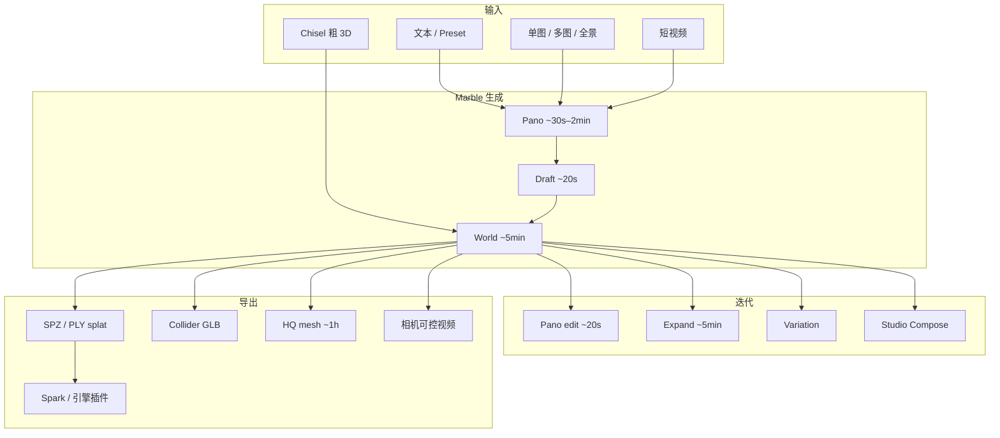

# Marble（World Labs 多模态世界模型）

**Marble** 是 [World Labs](./world-labs.md) 的首款产品：用多模态世界模型从文本、图像、视频或粗 3D 布局生成 **可编辑、可扩展、可组合** 的持久 3D 世界，再导出高斯 splat / mesh / 视频。2025-11-12 [GA 博客](https://www.worldlabs.ai/blog/marble-world-model) 起对全员开放；创作者走 [marble.worldlabs.ai](https://marble.worldlabs.ai/)，说明走 [docs.worldlabs.ai](https://docs.worldlabs.ai/)。

## 英文缩写速查

| 缩写 | 英文全称 | 简要说明 |
|------|----------|----------|
| Marble | Marble world model | 本文产品：多模态生成持久 3D 世界 |
| 3DGS | 3D Gaussian Splatting | 最高保真导出；约 2M 或 500k splat |
| SPZ | Splat compressed format | Marble 原生压缩 splat，体积小于 PLY |
| PLY | Polygon File Format | 更通用的 3DGS 交换格式 |
| GLB | GL Transmission Format Binary | collider / HQ mesh 导出容器 |
| API | Application Programming Interface | World API：`marble-1.1` 等付费生成 |
| DCC | Digital Content Creation | Blender / Maya / UE / Unity 等内容软件 |
| OpenCV | Open Source Computer Vision | 默认世界坐标：+x 左、+y 下、+z 前 |

## 为什么重要

- **把「世界模型」钉在 3D 资产管线：** 相对仓库里大量 **像素视频 WM**，Marble 交付的是可漫游 splat 与可选碰撞网，评测轴是创作者控制与导出互通，不是闭环策略成功率。Fei-Fei [功能分类](../concepts/functional-taxonomy-world-models.md) 把它写成 Renderer↔Simulator 的第一章（splat + collider）；[定义文](./paper-sa-2607-06401-a-definition-and-roadmap-for-world-models.md) 放在 3D/structured 格，并提醒 collider ≠ 完整学习动力学。
- **控制梯度清楚：** 文/单图发明细节 → 多图/视频约束多视角 → Chisel **结构与风格解耦**。选型时先问「要发明还是要对齐已有空间」。
- **机器人只消费外观：** collider + Spark/Rapier 示例能做第一人称逛场景；**接触可信、可训练物理** 仍要 [NuRec](./nvidia-nurec.md) / [SimFoundry](./paper-simfoundry-real2sim-scene-generation.md) / 解析仿真。
- **开源边界可核对：** 生成闭源；[Spark](./spark-3dgs-renderer.md) 与 Interactive World Examples 开源。勿写成「Marble 已开源」。

## 流程总览

## 核心原理

### 多模态 lift，不是日志重建

GA 博客把 Marble 写成：把手头模态 **抬成完整 3D 世界**，并随新编辑迭代。未观测区域靠生成补全——与 [Instant NuRec](./paper-instant-nurec.md)「忠实重建驾驶日志」相反。多图可指定 Front/Back/Left/Right；也可用真实现场几张照片得到「像那个地方」的世界，不是测绘级孪生。

### Chisel：布局先于外观

用盒、面或导入资产铺粗结构，再加文本定风格。同一布局可换成博物馆 / 北欧客房等完全不同外观。这是文档里最接近「程序化关卡 + 生成贴面」的控制旋钮。

### 表征分层

| 层 | 用途 | 文档口径 |
|----|------|----------|
| 高斯 splat | 视觉最高保真 | SPZ 原生；PLY 兼容；约 2M / 500k |
| Collider mesh | 粗物理 | 100–200k 三角；**不要当渲染 mesh** |
| HQ mesh | DCC / 打印 / 精细几何 | ~600k 贴图或 ~1M 顶点色；伪影常见 |
| Enhanced video | 传播 | 去伪影 + 加动态，仍跟 3D 相机 |

坐标系默认 **OpenCV**；进 OpenGL 工具链先把 Y、Z 乘 −1。

### 与 Atlas 的关系

[Atlas](./atlas-world-model.md)（2026-09）是后续 **omni** 底座叙事，早期访问；Marble 仍是当前可注册使用的产品。博客写 Atlas 将驱动 Marble 等产品，**不要**把 Atlas 权重当成 Marble 本地推理入口。

## 工程实践

| 项 | 内容 |
|------|------|
| 创作者入口 | [marble.worldlabs.ai](https://marble.worldlabs.ai/)（桌面完整） |
| 文档 | [docs.worldlabs.ai](https://docs.worldlabs.ai/) |
| 入门模型 | 文档推荐 **Marble 1.1**（1500 credits）；试 prompt 用 **1.0 Draft**（150） |
| 最大世界 | **1.1 Plus** 自动扩覆盖，1500 + 0–1500 |
| API | [World API](https://docs.worldlabs.ai/api/index.md)；`marble-1.1` / `marble-1.1-plus` / `marble-1.0` / `marble-1.0-draft`；未写 model 时仍默认 `marble-1.0` |
| 导出门禁 | Free 不能导出；Standard = splat + collider；Pro = HQ GLB + 商用 |
| Web 集成 | 导出 SPZ → [Spark](./spark-3dgs-renderer.md)（站点自身也用它） |
| 引擎 | 文档列 UE / Unity / Blender / Houdini 的 splat 插件路径 |
| 交互示例 | Spark Physics、Collider Builder、第一/第三人称控制器（Rapier） |

**开源状态（2026-09-05，文档 + 产品站 + GA 博客）：**

| 组件 | 状态 |
|------|------|
| Marble 权重 / 训练 | **未开源**（SaaS + 付费 API） |
| Spark | **已开源** |
| Interactive World Examples | **示例开源**（不是生成模型） |

## 局限与风险

- **生成 ≠ 孪生：** 真实现场多图仍会发明未拍到的角落；要日志级几何走 [NuRec](./nvidia-nurec.md) / 专用重建。
- **collider ≠ sim-ready：** 文档自己说粗网只适合简单物理；细结构、透明、天空容易烂。不能当 [SimFoundry](./paper-simfoundry-real2sim-scene-generation.md) 那种物性+关节资产。
- **HQ mesh 贵且慢：** 约 1 小时、约 4 次/小时；伪影要用 splat 对照，不要假设「有 GLB 就能训练接触」。
- **积分与套餐会变：** 上表是文档快照；以官网定价页为准。
- **移动端功能子集：** 高级编辑 / Chisel / pano 查看以桌面为准。

## 关联页面

- [世界模型功能分类](../concepts/functional-taxonomy-world-models.md) — Marble 被写成仿真方向的第一章
- [世界模型定义与路线图](./paper-sa-2607-06401-a-definition-and-roadmap-for-world-models.md) — 3D/structured 格；collider ≠ 学习动力学
- [World Labs](./world-labs.md) — 公司与 Atlas / Spark 总览
- [Atlas](./atlas-world-model.md) — 后续 omni 底座（早期访问）
- [Spark](./spark-3dgs-renderer.md) — 官方推荐的 Web 3DGS 运行时
- [Aholo Viewer](./aholo-viewer.md) — 另一路 Web 大场景 3DGS
- [生成式世界模型](../methods/generative-world-models.md)
- [Video-as-Simulation](../concepts/video-as-simulation.md)
- [Sim2Real](../concepts/sim2real.md)
- [GS-Playground](./gs-playground.md) — 批量 3DGS **训练渲染**，不是创作者 SaaS
- [NVIDIA Omniverse NuRec](./nvidia-nurec.md) — 真实传感器 → USDZ，对照「生成世界」
- [Instant NuRec](./paper-instant-nurec.md) — 驾驶日志前向重建
- [SimFoundry](./paper-simfoundry-real2sim-scene-generation.md) — 操作场景 sim-ready 孪生

## 参考来源

- [worldlabs_marble_world_model.md](../../sources/blogs/worldlabs_marble_world_model.md)
- [worldlabs_functional_taxonomy_world_models.md](../../sources/blogs/worldlabs_functional_taxonomy_world_models.md)
- [worldlabs-docs.md](../../sources/sites/worldlabs-docs.md)
- [marble-worldlabs-ai.md](../../sources/sites/marble-worldlabs-ai.md)
- [worldlabs-ai.md](../../sources/sites/worldlabs-ai.md)
- GA 博客：<https://www.worldlabs.ai/blog/marble-world-model>
- 文档：<https://docs.worldlabs.ai/>
- 产品：<https://marble.worldlabs.ai/>

## 推荐继续阅读

- World API Quickstart：<https://docs.worldlabs.ai/api/index.md>
- 导出规格：<https://docs.worldlabs.ai/marble/export/specs.md>
- Interactive World Examples：<https://docs.worldlabs.ai/api/interactive-world-examples.md>
- Spark：<https://sparkjs.dev/>
- Atlas 博客：<https://www.worldlabs.ai/blog/atlas>
