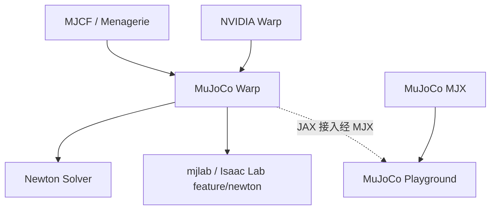

# MuJoCo Warp（MJWarp）

**MuJoCo Warp**（常写作 **MJWarp**）是 Google DeepMind 与 NVIDIA **作为 [Newton](./newton-physics.md) 的一部分** 共同维护的 **GPU 高吞吐 MuJoCo 实现**：计算写在 [NVIDIA Warp](./nvidia-warp.md) 上，资产与 API 尽量对齐经典 [MuJoCo](./mujoco.md)。包名 **`mujoco-warp`**。代码 Apache-2.0。

## 一句话定义

**把 MuJoCo 刚体步进搬到 NVIDIA GPU 上的执行后端**——快仿真要 GPU；CPU 只适合开发与调试。它不是 JAX 的 [MJX](./mujoco-mjx.md)，也不是 RL 环境框架。

## 英文缩写速查

| 缩写 | 英文全称 | 简要说明 |
|------|----------|----------|
| MJWarp | MuJoCo Warp | 本页：Warp/CUDA 上的 MuJoCo 实现 |
| MJX | MuJoCo JAX | JAX/XLA 重实现；可微与批量路径不同 |
| MJCF | MuJoCo XML Format | 模型与场景描述；MJWarp 尽量 drop-in |
| PGS | Projected Gauss–Seidel | CPU MuJoCo 求解器之一；MJWarp **尚未支持** |
| AD | Automatic Differentiation | Warp 核可微，但 MJWarp 步进 **尚未接通** |
| RL | Reinforcement Learning | 上层经 Playground / mjlab / Isaac Lab 使用本后端 |

## 为什么重要

- **MuJoCo 资产的 GPU 批量入口**：已有 MJCF / Menagerie 模型时，不必先迁 PhysX 或重写 JAX，就能走 NVIDIA GPU 吞吐。
- **Newton 的默认刚体后端**：Newton 的 `MuJoCo` 求解器就是本实现；Isaac Lab `feature/newton` 的 `newton_mjwarp` preset 也落在这里。
- **两条上层栈已经接好**：JAX 走 [MJX](./mujoco-mjx.md) + [MuJoCo Playground](./mujoco-playground.md)；PyTorch 走 [mjlab](./mjlab.md) 或 Isaac Lab `feature/newton`。

## 核心原理

| 概念 | 说明 |
|------|------|
| **定位** | 多数情况可当 CPU MuJoCo 的 **drop-in**；缺口见下表，不要假设 1:1 |
| **计算** | [Warp](./nvidia-warp.md) kernel；目标硬件是 **NVIDIA GPU** |
| **引擎层** | 被 [Newton](./newton-physics.md) 收成可插拔 `Solver`；也可单独 `pip install mujoco-warp` |
| **渲染** | 批量 GPU 光线追踪：多世界多相机；网格 / 纹理 / heightfield / Flex / 高斯溅射 / 光照阴影 |
| **可微** | **尚未可用**（[issue #500](https://github.com/google-deepmind/mujoco_warp/issues/500)）。要 JAX 反传先评估 [MJX](./mujoco-mjx.md) |

相对 CPU MuJoCo 的官方缺口（README，2026-09-05）：

| 类别 | 缺口 |
|------|------|
| Integrator | `IMPLICITFAST` midpoint **不支持** |
| Solver | `PGS`、`noslip` **尚未支持** |
| Actuator / Sensors | `PLUGIN` **尚未支持** |
| Flex | 实验性，未全实现 / 未优化 |

## 工程实践

| 步骤 | 做法 |
|------|------|
| 安装 | `pip install mujoco-warp`；开发用 `uv sync --all-extras` |
| 冒烟 | `python benchmarks/run.py -f unitree_g1_flat --view` |
| 教程 | [Colab tutorial](https://colab.research.google.com/github/google-deepmind/mujoco_warp/blob/main/notebooks/tutorial.ipynb) |
| 场景 | `unitree_g1_flat` / `g1_hfield`、`myoarm`、`aloha_*`、`three_humanoids`、`cloth` |
| 剖析 | `mjwarp-testspeed ... --event_trace` |
| 夜间基准 | <https://google-deepmind.github.io/mujoco_warp/nightly/> |
| JAX 训练 | [MJX](./mujoco-mjx.md) + [Playground](./mujoco-playground.md)（官方推荐入口，不是直接 `import mujoco_warp` 写 JAX） |
| PyTorch 训练 | [mjlab](./mjlab.md) 直接铺 manager API；或 [Isaac Lab](./isaac-lab.md) `feature/newton` 经 Newton |

## 局限与风险

- **误区：「GPU MuJoCo = 可微 MuJoCo」。** Warp 框架可微，**本仓库的步进还没有接到 AD**。Newton 页上的 `diffsim_*` 示例走的是 **其他 Warp 求解器**，不要默认 MJWarp 路径可反传。
- **误区：「换成 MJWarp 就能保留全部 CPU 特性」。** 先核对 PGS / noslip / PLUGIN / IMPLICITFAST midpoint / Flex。需要这些特性时留在 CPU [MuJoCo](./mujoco.md) 或改模型。
- **误区：「MJWarp 和 MJX 可以混用当同一个后端」。** [MJX](./mujoco-mjx.md) 是 JAX/XLA；本页是 Warp/CUDA。Playground 的 JAX 路径经 MJX，不是把 MJWarp 内核嵌进 `jax.grad`。
- **硬件**：有意义的速度依赖 NVIDIA GPU；CPU 仅调试。macOS 受 [Warp](./nvidia-warp.md) 限制（无 Metal）。
- **不是 RL 框架**：没有 observation / reward manager。缺 API 时选 [mjlab](./mjlab.md) 或 Playground，而不是在本库上自搭训练循环。

## 关联页面

- [NVIDIA Warp](./nvidia-warp.md) — 计算底座；`warp.sim` 已弃用
- [Newton Physics](./newton-physics.md) — 以本实现为主要刚体后端的多求解器引擎
- [MuJoCo](./mujoco.md) — CPU 参考实现与接触建模标杆
- [MuJoCo MJX](./mujoco-mjx.md) — JAX 兄弟后端（可微 / 批量）
- [MuJoCo Playground](./mujoco-playground.md) — JAX 任务入口（经 MJX）
- [mjlab](./mjlab.md) — Isaac Lab API 直接铺在本后端上
- [Brax](./brax.md) — README 把新物理导向 MJX / 本页
- [Isaac Lab](./isaac-lab.md) — `feature/newton` / `newton_mjwarp`
- [仿真器选型指南](../queries/simulator-selection-guide.md)
- [训练栈分层地图](../overview/robot-training-stack-layers-technology-map.md)
- [Reinforcement Learning](../methods/reinforcement-learning.md)

## 参考来源

- [mujoco_warp 仓库归档](../../sources/repos/mujoco-warp.md)
- [NVIDIA/warp 仓库归档](../../sources/repos/nvidia-warp.md)
- [newton-physics 仓库归档](../../sources/repos/newton-physics.md)
- [mjlab 仓库归档](../../sources/repos/mjlab.md)

## 推荐继续阅读

- [google-deepmind/mujoco_warp](https://github.com/google-deepmind/mujoco_warp)
- [MuJoCo 文档：MJWarp](https://mujoco.readthedocs.io/en/latest/mjwarp/index.html)
- [Nightly 基准](https://google-deepmind.github.io/mujoco_warp/nightly/)
- [Colab tutorial](https://colab.research.google.com/github/google-deepmind/mujoco_warp/blob/main/notebooks/tutorial.ipynb)
