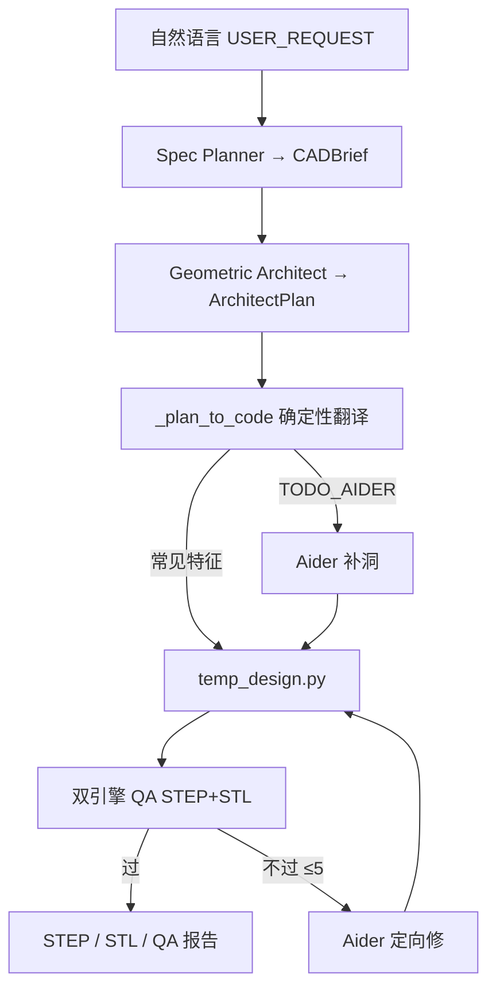
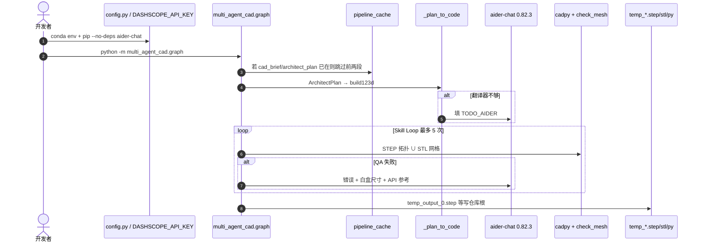

# Multi-Agent CAD（MAC）

**MAC**（[Pan-Chera/Multi-Agent-CAD](https://github.com/Pan-Chera/Multi-Agent-CAD)）是清华 [IEI Lab](https://maureenzou.github.io/lab.html) 的开源 **文字→STEP** 编排：四个 LangGraph 节点只交接紧凑 JSON，而不是把 build123d 文档和整段对话重塞进下一轮。它用 [CAD Skills](./cad-skills.md) 的 **P1–P10 / 141 特征** 当对照基线，并 vendored 了其 `cadpy` STEP/GLB 运行时。

## 一句话定义

**把「自然语言写 CAD」拆成规划 / 几何方案 / 确定性代码 / 双引擎 QA+Aider 修复四段，用结构化状态代替上下文重放，在同一套机械 prompt 上把测试时 token 压低两个数量级，输出仍是可打印的 build123d STEP。**

## 英文缩写速查

| 缩写 | 英文全称 | 简要说明 |
|------|----------|----------|
| MAC | Multi-Agent CAD | 本仓框架名 |
| CAD | Computer-Aided Design | 计算机辅助设计 |
| STEP | Standard for the Exchange of Product model data | 工业 B-rep 交换格式 |
| LLM | Large Language Model | 大语言模型；本仓默认可换 OpenAI 兼容端点 |
| QA | Quality Assurance | 双引擎：STEP 拓扑 + STL 网格 |
| OCP | Open CASCADE Technology (Python bindings) | build123d 几何内核 |
| IEI | Interactive Embodied Intelligence Lab | 清华实验室 |
| MIT | Massachusetts Institute of Technology License | 本仓与 vendored cadpy 的许可 |

## 为什么重要

- **对照已有 CAD Skills，而不是另起炉灶：** 同一 10 条机械 prompt。CAD Skills 是 **单 agent + skill CLI + URDF/打印链**；MAC 是 **状态机编排 + 少 token**。机器人夹具草稿若已用 build123d，这两条可以叠：Skills 管技能安装与下游描述，MAC 管「反复修代码别把文档再读一百遍」。
- **瓶颈判断可复用：** README 写明单 agent 在该基准烧掉 **103.9M token / 1,307 次 API**。省钱的关键不是再换一个更强模型，而是 **阶段边界切断幻觉叙事**——下一节点只读 JSON，不读上一节点的长篇推理。
- **确定性翻译器是极端混合路由：** `_plan_to_code` 把 extrude / revolve / hole / boolean / 阵列 / fillet 等常见步写成代码，**零 token**；LLM 只填 `draft` / `rib` / 无控制点多边形等 `# TODO_AIDER`。这比「全程让模型写 Python」更接近工业脚本 CAD。
- **白盒可拦：** `CADBrief`、`ArchitectPlan`、`temp_design_*.py`、`temp_measurements_*.json`、`temp_missed_*.json` 落盘。终端每轮 QA 有 10 秒检查点，可注入改动或停。

## 核心信息

| 项 | 内容 |
|----|------|
| **机构** | 清华大学（Tsinghua）· IEI Lab |
| **代码** | <https://github.com/Pan-Chera/Multi-Agent-CAD>（930★ / 84 fork，2026-09-05） |
| **开源** | **已开源**（MIT；无训练权重；需自备 LLM API） |
| **入口** | `python -m multi_agent_cad.graph`；Web：`python -m multi_agent_cad.web` |
| **默认模型** | DashScope `qwen3.7-max`（OpenAI 兼容；可换 OpenAI / DeepSeek / Gemini / Ollama） |
| **论文** | 无 arXiv；`@misc{mac2026}` |

## 核心原理

### 方法栈

| 层 | 做什么 |
|----|--------|
| Spec Planner | 用户句 → `CADBrief`（只留三类验证目标：外形尺寸 / 单实体 / 水密） |
| Geometric Architect | `CADBrief` → `ArchitectPlan`（草图、步骤、`selector_map`、关键尺寸；Architect 默认关 thinking 保 JSON） |
| Python Coder | `ArchitectPlan` → build123d；翻译器崩溃才全量 LLM |
| Skill Loop | Engine A（cadpy STEP）∪ Engine B（STL 网格 / Union-Find）；失败则 Aider 读 QA + 白盒测量 + `build123d_reference.md`，最多 5 轮 |
| 工程补丁 | `_safe_fillet` 半径降级；`_infer_edge_filter` 用边长语义选边，避免硬编码坐标 |

### 流程总览

相对 [CAD Skills](./cad-skills.md) 的单 agent「brief 散文 → 手写源码 → inspect/snapshot」：MAC **不提供** URDF / SRDF / SDF / DXF / 切片 / 标准件检索。产物停在 **可打印 STEP**；进仿真仍要走 [step2urdf](./step2urdf.md) 或 Skills 的 `gen_urdf()`。

### 源码运行时序图

- **复现入口：** README Quick Start；数字复现看 `docs/quantified_quality.md` 与 `docs/qwen3.7_token.md`。
- **换模型：** 只改 `DS_BASE_URL` 与各段 `*_MODEL`；非 Qwen 把 `*_KWARGS` 置 `{}`。

### 与 CAD Skills / 桌面 MCP 对照

| 维度 | MAC | [CAD Skills](./cad-skills.md) | [FreeCAD MCP](./freecad-mcp.md) |
|------|-----|------------------------------|--------------------------------|
| 形态 | LangGraph 四段 + 本机/Web | 可安装 Agent Skills + CLI | 遥控已开 FreeCAD |
| 中间件 | 结构化 JSON | 散文 brief + Python 真值 | FreeCAD 文档对象 |
| 代码谁写 | 翻译器为主 | LLM 直接写 `gen_step()` | `execute_code` / 特征 API |
| 下游 | STEP/STL | STEP + URDF/打印/标准件 | Part Design / FEM / STEP 导出 |
| 自报成本 | 同基准 116× 少 token | 对照基线（103.9M token） | 无该基准 |

## 工程实践

| 项 | 建议 |
|----|------|
| 最短路径 | `conda env create -f environment.yml` → `--no-deps` 装 aider 0.82.3 → 设 `DASHSCOPE_API_KEY` → `python -m multi_agent_cad.graph` |
| numpy | `aider-chat` 钉 `numpy==1.26.4`，`build123d>=0.8` 要 numpy 2；按 README 拆开装 |
| 换 prompt | **先删** `pipeline_cache/*.json`。缓存只看文件在不在，不看 `USER_REQUEST` 是否变了 |
| Web UI | 单用户、受信网络。生成的 `.py` 在 **服务器进程里执行**；公网必须 SSH 隧道 |
| 中途改需求 | 终端 10 s checkpoint：`2` 把改动预置进 Aider 修复 prompt；Web 只会自动迭代 |
| 打印一体件 | 仓内展示球笼 / 陀螺：多实体 + 0.4–1 mm 间隙写进同一 STEP。比单实体难，清空间要进 brief |
| 进机器人仿真 | 先当制造草稿；坐标系 / 碰撞 / 惯量另走 URDF 工具，勿把 STEP 当 MJCF |

## 局限与风险

- **不是全栈硬件代理：** 没有 URDF、标准件库、切片、外协检查。对照数字只覆盖「特征通过」，不是公差链或 DFM。
- **基准自报、同源 prompt：** 费用按 DashScope 人民币；墙钟 10× 未正式计时。换模型后 116× 不会原样成立。
- **缓存会静默复用旧方案：** 换需求不清缓存会生成上一件。
- **Web 执行任意生成代码：** 与 FreeCAD MCP 的 `execute_code` 同类风险。
- **无论文评测协议：** 只有 GitHub `@misc`；复现应以仓内 `eval`/`docs` 脚本为准，不要当同行评审结论引用。
- **实验室页未挂下载：** 代码以 GitHub 仓为准（2026-09-05）。

## 关联页面

- [文字生成 CAD（Text-to-CAD）](../concepts/text-to-cad.md) — 制造向 text-to-CAD 谱系；本页是 **解耦多智能体 + 测试时压缩** 一支
- [CAD Skills](./cad-skills.md) — 对照基线与 vendored `cadpy` 来源；skill/URDF/打印链在那边
- [FreeCAD MCP](./freecad-mcp.md) — 桌面 GUI 真值；无头 build123d 编排在本页
- [GenCAD](./gencad.md) — 图像→CAD program 的学习式对照，不是 LLM 写脚本
- [URDF-Studio](./urdf-studio.md) / [step2urdf](./step2urdf.md) — STEP 之后的机器人描述
- [Sim2Real](../concepts/sim2real.md) — 加工件与仿真网格不一致会漂接触

## 参考来源

- [multi-agent-cad.md](../../sources/repos/multi-agent-cad.md) — GitHub 仓库归档（2026-09-05 核查）
- [earthtojake-text-to-cad.md](../../sources/repos/earthtojake-text-to-cad.md) — 对照基线与 cadpy 出处
- [Pan-Chera/Multi-Agent-CAD](https://github.com/Pan-Chera/Multi-Agent-CAD)
- [WORKFLOW.md](https://github.com/Pan-Chera/Multi-Agent-CAD/blob/main/multi_agent_cad/WORKFLOW.md)

## 推荐继续阅读

- [quantified_quality.md](https://github.com/Pan-Chera/Multi-Agent-CAD/blob/main/docs/quantified_quality.md) — 基准方法与失败模式
- [build123d 文档](https://build123d.readthedocs.io/)
- [LangGraph](https://langchain-ai.github.io/langgraph/)
- [CAD Skills](https://www.cadskills.xyz)
