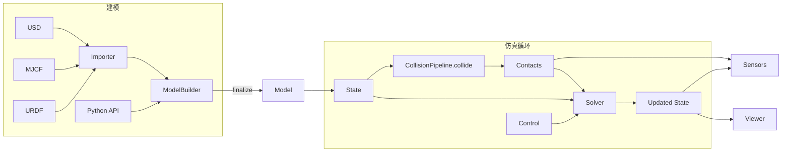

# Newton Physics（物理引擎）

**Newton** 是面向机器人学与仿真研究的 **GPU 加速、可扩展、可微** 物理引擎：在 [NVIDIA Warp](./nvidia-warp.md) 上实现核心计算，集成 [MuJoCo Warp](./mujoco-warp.md) 作为**主要刚体后端**，并强调 [OpenUSD](https://openusd.org/) 场景组合与现代 Python API。项目由 **Disney Research、Google DeepMind、NVIDIA** 发起，现由 **Linux Foundation** 社区维护（代码 Apache-2.0）。

## 英文缩写速查

| 缩写 | 英文全称 | 简要说明 |
|------|----------|----------|
| GPU | Graphics Processing Unit | 大规模并行仿真训练的算力基础 |
| MuJoCo | Multi-Joint dynamics with Contact | 接触丰富的刚体物理；Newton 经 MuJoCo Warp 承接 |
| XPBD | Extended Position-Based Dynamics | 位置基约束求解器之一 |
| VBD | Vertex Block Descent | 布料 / 可变形求解器 |
| MPM | Material Point Method | ImplicitMPM 后端：颗粒、雪、流体等连续介质 |
| USD | Universal Scene Description | OpenUSD 场景组合与资产交换 |
| URDF | Unified Robot Description Format | 统一机器人描述格式 |
| MJCF | MuJoCo XML Format | MuJoCo 的模型与场景描述格式 |
| RL | Reinforcement Learning | 通过与环境交互最大化长期回报来学习策略 |
| WFM | World Foundation Model | [NVIDIA Cosmos](./nvidia-cosmos.md) 的学习式世界模型；与本引擎解析物理互补 |

## 为什么重要？

- **机器人学习的主干正在 GPU 化**：大规模并行 rollout、可微仿真与系统辨识越来越依赖「Python 友好 + GPU 吞吐 + 可插拔求解器」的引擎，而不仅是单机 CPU 步进。
- **MuJoCo 生态的 GPU 延伸**：Newton 把 **MuJoCo Warp** 纳入统一框架，同时保留 XPBD / VBD / Featherstone / Kamino / ImplicitMPM / Style3D 等后端，便于在同一套 `Model` / `State` / `Solver` 抽象下做对比与扩展。
- **与 NVIDIA 机器人栈对齐**：官方叙事与 **Isaac Sim / Isaac Lab**、**MuJoCo Playground** 兼容；Isaac Lab 侧已有 `feature/newton` 与 `newton_kamino` 等 preset。厂商 FAQ 把本引擎（及 Omniverse）放在 **解析仿真** 一侧，把 [Cosmos](./nvidia-cosmos.md) Transfer 放在「仿真视频 → 照片级合成数据」一侧。

## 核心能力

| 维度 | 要点 |
|------|------|
| **计算** | Warp 驱动 GPU 仿真；目标是把日级仿真压到分钟级（厂商页叙事） |
| **可微** | Warp 核可微；`diffsim_*` 示例走 **非 MJWarp** 求解器。 [MuJoCo Warp](./mujoco-warp.md) 步进的 AD **尚未接通**（issue #500） |
| **可扩展** | 模块化求解器与组件；可插拔自定义求解器，支持多物理扩展 |
| **资产** | `ModelBuilder` 导入 **URDF、MJCF、USD**；OpenUSD 聚合机器人与环境 |
| **求解器** | **XPBD、VBD、MuJoCo（Warp）、Featherstone、SemiImplicit、Kamino、ImplicitMPM、Style3D** |
| **接触** | `CollisionPipeline.collide` 填充 `Contacts`（2026-09 文档；不再写 `Model.collide`） |
| **传感器** | 基于 `State` / `Contacts` 与 extended attributes 的观测管线 |

官方示例已覆盖 **G1 / H1 / ANYmal / Panda / Allegro**、布料与缆索、颗粒–机器人双向耦合、螺母螺栓 / RJ45 接触装配，以及 Kamino 四连杆与异构机构。

## 流程总览

典型步进：`ModelBuilder` 构建 → `Model` → 创建 Sensors 与 `CollisionPipeline`，分配 `State` / `Control` / `Contacts` → `collide` → `Solver.step` → 传感器与可视化。

## 工程实践

| 步骤 | 做法 |
|------|------|
| 安装 | `pip install "newton[examples]"`；源码 + uv 见官方 installation guide |
| 冒烟 | `python -m newton.examples` 或 `--list`；`--viewer gl\|usd\|rtx\|rerun\|viser\|null` |
| 机器人资产 | `robot_g1` / `robot_h1` / `robot_anymal_d`；策略回放 `robot_policy` |
| 多物理 | 布料走 Style3D / VBD（`cloth_*`）；颗粒 / 雪 / 水走 ImplicitMPM（`mpm_*`） |
| 约束机构 | Kamino 示例：`kamino_basic_fourbar`、`kamino_robot_anymal_d` |
| Isaac Lab | 官方 CTA 指向 `IsaacLab` 的 `feature/newton`；Lab 环境 preset 含 `newton_mjwarp` / `newton_kamino` |
| 硬件 | NVIDIA Maxwell+、驱动 545+（CUDA 12）；无需本机 CUDA Toolkit；macOS 仅 CPU |

## 与相近工具的分工

| 工具 | 关系 |
|------|------|
| **[NVIDIA Warp](./nvidia-warp.md)** | 计算底座（`warp-lang`）；`warp.sim` 已弃用，由 Newton 接替 |
| **[MuJoCo Warp](./mujoco-warp.md)** | 主要刚体后端（`mujoco-warp`）；drop-in MuJoCo，PGS/PLUGIN 等有缺口，AD 未通 |
| **[MuJoCo](./mujoco.md)** | 学术接触建模标杆；Newton 通过 **MJWarp** 承接 MJCF 资产与 GPU 批量路径 |
| **[mjlab](./mjlab.md)** | **RL 训练框架**（Isaac Lab 风格 API + MJWarp）；Newton 是更底层的**通用物理引擎**，不限于 manager-based RL |
| **[Isaac Lab](./isaac-gym-isaac-lab.md)** | Omniverse/PhysX 主线；Newton 作为可选/并行物理后端探索（官方教程与 `feature/newton` 分支） |
| **[OmniSim](./omnisim.md)** | Webots fork 把 Newton **当成唯一后端并删除 ODE**；默认 MuJoCo Warp + VBD，面向编码代理 HTTP/MCP |
| **[MuJoCo MJX](./mujoco-mjx.md)** | JAX 上 MJCF 对齐实现；Newton 侧强调 Warp + 多求解器 + USD |
| **[NVIDIA Cosmos](./nvidia-cosmos.md)** | **学习式**世界基础模型（视频 / 动作 / 推理）；不替代接触求解。官方说法：Omniverse/Newton 出仿真，Cosmos Transfer 再做照片级翻译 |

## 局限与风险

- 生态仍新：相对 MuJoCo 经典 CPU 栈与 Isaac Lab 工业管线，第三方任务库、基准与 Sim2Real 案例积累更少。
- **硬件**：有意义的 GPU 路径依赖 NVIDIA GPU（macOS 仅 CPU）。
- 与 [mjlab](./mjlab.md) 等「已包装好的 RL 环境」相比，Newton 更偏**引擎层**，上手需理解 `ModelBuilder` / `CollisionPipeline` / `Solver` 抽象。
- 多求解器并存意味着 **feature parity 不自动成立**：选 ImplicitMPM / Style3D / Kamino 前先对任务所需接触与可微路径做核对。

## 关联页面

- [NVIDIA Warp](./nvidia-warp.md) — JIT 计算层；本引擎站在其上
- [MuJoCo Warp](./mujoco-warp.md) — 主要刚体后端
- [MuJoCo（物理引擎）](./mujoco.md)
- [mjlab](./mjlab.md) — Isaac Lab API + MJWarp 的 RL 框架
- [MuJoCo MJX](./mujoco-mjx.md)
- [Isaac Gym / Isaac Lab](./isaac-gym-isaac-lab.md)
- [NVIDIA Omniverse](./nvidia-omniverse.md)
- [NVIDIA Cosmos](./nvidia-cosmos.md) — 学习式 WFM；与本引擎组成 Physical AI 仿真两侧
- [MuJoCo vs Isaac Sim](../comparisons/mujoco-vs-isaac-sim.md)
- [仿真器选型指南（Query）](../queries/simulator-selection-guide.md)
- [Reinforcement Learning](../methods/reinforcement-learning.md)
- [Sim2Real](../concepts/sim2real.md)
- [OmniSim](./omnisim.md) — Newton 唯一后端的代理原生仿真器

## 参考来源

- [newton-physics 仓库归档](../../sources/repos/newton-physics.md)
- [NVIDIA/warp 仓库归档](../../sources/repos/nvidia-warp.md)
- [mujoco_warp 仓库归档](../../sources/repos/mujoco-warp.md)
- [NVIDIA Developer：Newton Physics](../../sources/sites/nvidia-newton-physics.md)
- [Newton 官方文档 Overview](../../sources/sites/newton-physics-docs-overview.md)
- [具身智能研究室：训练栈分层解读](../../sources/blogs/wechat_embodied_ai_lab_robot_training_stack_layers_2026.md)
- [OmniSim 仓库归档](../../sources/repos/omnisim.md) — Newton 作为唯一后端的仿真器案例

## 推荐继续阅读

- [Newton 官方文档 Overview](https://newton-physics.github.io/newton/stable/guide/overview.html)
- [Newton GitHub](https://github.com/newton-physics/newton)
- [NVIDIA：Newton Physics 产品页](https://developer.nvidia.com/newton-physics)
- [Introduction tutorial](https://newton-physics.github.io/newton/stable/tutorials/00_introduction.html)
- [MuJoCo Warp](./mujoco-warp.md)
- [NVIDIA Warp 文档](https://nvidia.github.io/warp/stable/)
