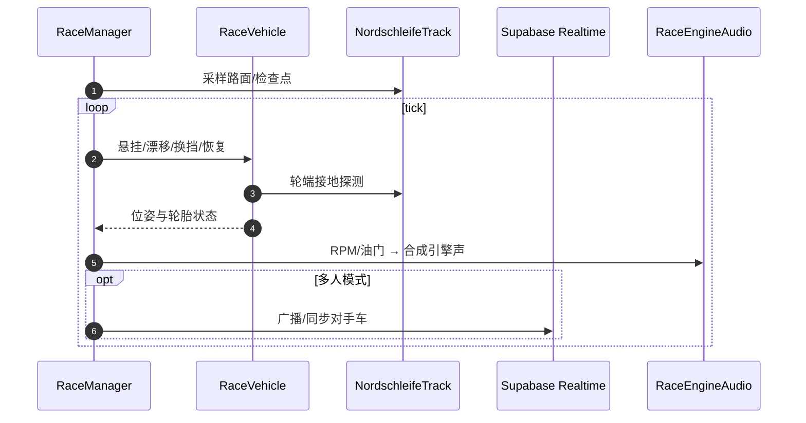

# nordschleife-racer

**nordschleife-racer** 是 **yassin.app** 背后的 **浏览器竞速引擎**：**TypeScript + Three.js** 实现程序化 **纽北** 单圈、**~4900 行** 车辆物理核心、**9 款** 真车参数化调校，以及 **Supabase** 驱动的多人 Lobby 与全球排行榜。

## 一句话定义

> 读代码在本仓，**玩完整功能在 [yassin.app](https://yassin.app)**：引擎 MIT 开源，但车体 mesh 与 Supabase 后端属于 **部分开源** 边界。

## 英文缩写速查

| 缩写 | 英文全称 | 简要说明 |
|------|----------|----------|
| TS | TypeScript | 引擎实现语言 |
| RWD | Rear-Wheel Drive | 后驱（如 M3）与 AWD 调校差异 |
| AWD | All-Wheel Drive | 四驱（如 AMG One） |
| GLB | GL Transmission Format Binary | 运行时加载的车体 3D 格式 |

## 为什么重要

1. **模块化引擎范例**：`RaceManager` 编排物理、赛道、输入、圈速、音频、漂移烟雾。
2. **漂移作为一等公民**：速度相关漂移模型 + `DriftSmoke` 特效，与 RL 漂移研究可读性互补。
3. **工程化测试**：Playwright 回归验证线上物理行为。

## 核心结构/机制

| 能力 | 实现 |
|------|------|
| 单人计时 | 本地 `RaceManager` + `LapTimer` |
| 多人 | Supabase Realtime presence/broadcast |
| 幽灵 | 回放录制与对比 |
| 排行榜 | Postgres RLS；离线回退 solo |
| 赛道 | `NordschleifeTrack.ts` 程序化生成 |

## 开源状态（2026-08-23 项目页核查）

| 项 | 结论 |
|----|------|
| 引擎 TypeScript | **已开源** MIT |
| 本地独立构建 | **不完整** — 缺宿主 `Application`/`Resources`/`EventBus` |
| 车体 3D | **未入库**（第三方 mesh，线上加载） |
| 多人/榜 | 需作者 **Supabase** 部署 |

## 源码运行时序图

## 常见误区或局限

- **误区：`git clone` 即可复现 yassin.app 全功能** — 仓为 **引擎切片**；完整游玩用线上站。
- **局限：** 非 Gym API；程序化纽北与 drive-game 的 OSM 真几何路线不同，圈速**不可横比**。

## 关联页面

- [drive-game](./drive-game.md) — OSM 真几何 + 240 Hz 模拟器路线
- [starter-kit-racing](./starter-kit-racing.md) — Kenney 街机 GridMap 样板
- [赛车漂移 RL 开源景观](../overview/racing-drift-rl-open-source-landscape.md)

## 参考来源

- [sources/repos/nordschleife_racer.md](../../sources/repos/nordschleife_racer.md)
- [sources/sites/yassin_app_nordschleife.md](../../sources/sites/yassin_app_nordschleife.md)

## 推荐继续阅读

- [yassin.app 在线游玩](https://yassin.app)
- 仓内 `Racing/Vehicle/RaceVehicle.ts` — 物理核心
