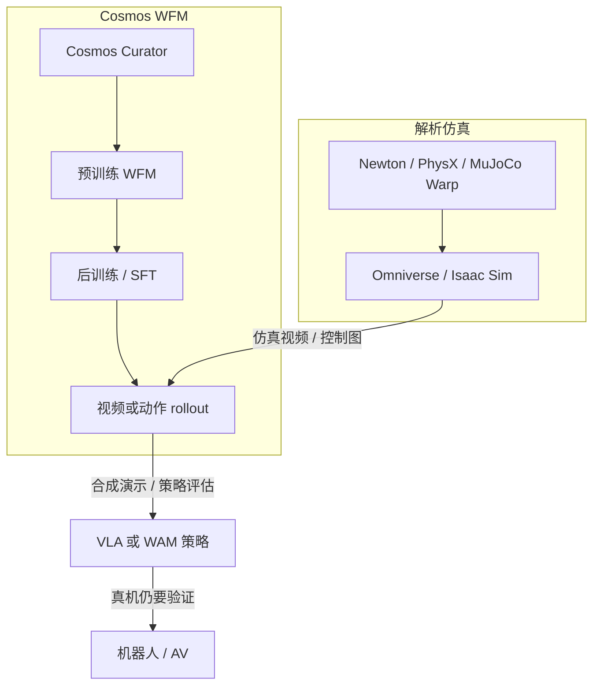

# NVIDIA Cosmos（世界基础模型平台）

**NVIDIA Cosmos** 是面向机器人、自动驾驶与智慧基础设施的 **Physical AI 世界基础模型（WFM）开放平台**：同时发布模型权重、视频策展 / 评测工具与训练–推理框架。当前产品主线是 [Cosmos 3](./cosmos-3.md)（全模态 Mixture-of-Transformers）；前代 [Predict / Transfer / Reason](./paper-sa-2511-00062-world-simulation-with-video-foundation-models-fo.md) 仍可跑，但官方已引导迁移。

## 一句话定义

**用开源 WFM 把「看视频想象世界」做成可后训练的平台：解析仿真（Newton / Omniverse）负责几何与接触，Cosmos 负责视频级世界预测、合成数据、推理与策略。**

## 英文缩写速查

| 缩写 | 英文全称 | 简要说明 |
|------|----------|----------|
| WFM | World Foundation Model | 可后训练到具体 Physical AI 任务的通用世界模型 |
| MoT | Mixture-of-Transformers | Cosmos 3 统一骨干：Reasoner AR + Generator 扩散 |
| T2W | Text-to-World | 文本条件世界 / 视频生成 |
| I2W | Image-to-World | 图像条件世界续写 |
| V2W | Video-to-World | 视频条件未来预测 |
| WAM | World Action Model | 联合世界预测与动作生成；Cosmos 3 Generator 的政策面 |
| SFT | Supervised Fine-Tuning | cosmos-framework 当前公开的后训练主路径 |
| NIM | NVIDIA Inference Microservices | 预构建推理容器 |

## 为什么重要

- **官方把 Physical AI 拆成两半数字孪生**：策略模型 + 世界模型（[Cosmos 1.0 论文](./paper-sa-2501-03575-cosmos-world-foundation-model-platform-for-physi.md)）。没有 WFM，探索动作只能在真机上试，贵且危险。
- **三代交接清晰**：1.0 定义平台与分模型；2.5 用 flow matching 把 T2W/I2W/V2W 收成单网并加上 Transfer ControlNet；3.0 再把语言 / 图像 / 视频 / 音频 / 动作收进同一 MoT，并补齐 serving 与 SFT cookbook。
- **和解析仿真不是替代关系**：产品 FAQ 写明 [Omniverse](./nvidia-omniverse.md)（及 [Newton](./newton-physics.md)）提供 3D / 接触仿真，Cosmos Transfer 把仿真视频译成可控照片级数据。选型时先问「要守恒律求解还是要像素世界模型」。

## 核心原理

### 三代模型族（一手入口）

| 代 | 一手论文 / 仓 | 架构要点 | 工程入口 |
|----|---------------|----------|----------|
| **1.0（2025-01）** | [arXiv:2501.03575](./paper-sa-2501-03575-cosmos-world-foundation-model-platform-for-physi.md) | 扩散 WFM + 自回归 WFM；连续 / 离散 tokenizer；pre-Guard / post-Guard | 历史 Cosmos-Predict1；NVIDIA Open Model License |
| **2.5（2025-10）** | [arXiv:2511.00062](./paper-sa-2511-00062-world-simulation-with-video-foundation-models-fo.md) | Flow matching 单网 T2W/I2W/V2W；Reason1 作文本编码；Transfer2.5 ControlNet | [cosmos-predict2.5](https://github.com/nvidia-cosmos/cosmos-predict2.5) 等；**有限维护** |
| **3（2026-05）** | [arXiv:2606.02800](./cosmos-3.md) | MoT：Reasoner（因果 AR）+ Generator（扩散）；原生动作 / 音频 | [NVIDIA/cosmos](https://github.com/NVIDIA/cosmos) + [cosmos-framework](https://github.com/NVIDIA/cosmos-framework) |

### 流程总览（与 Newton 的分工）

**读法：** Newton 保证质量 / 动量 / 接触约束；Cosmos 学习「看起来像真世界」的观测与动作条件未来。把 Cosmos 输出当守恒律仿真会误判。

## 工程实践

| 目标 | 从哪进 | 备注 |
|------|--------|------|
| 新产品 / 全模态 | [NVIDIA/cosmos](https://github.com/NVIDIA/cosmos) cookbook | Diffusers、vLLM-Omni、SGLang、NIM；微调走 cosmos-framework |
| 训练 / 导出 | [cosmos-framework](https://github.com/NVIDIA/cosmos-framework) | `scripts.train` / `inference`；8×H100 recipe；DCP→safetensors→Diffusers |
| 旧视频 WFM / Transfer | [Cosmos Transfer](./cosmos-transfer.md) 1 / 2.5 仓 | README 已写迁移 Cosmos 3；V2V 配方见 [Cookbook](./cosmos-cookbook.md) |
| 产品试用 | [nvidia.com/ai/cosmos](https://www.nvidia.com/en-us/ai/cosmos/) | Download Models / hosted catalog / Cookbook |
| 解析仿真对照 | [Newton](./newton-physics.md)、Isaac Lab `feature/newton` | 接触、可微、USD 资产 |

开源结论（2026-09-05 项目页核查）：**平台代码与多代权重已开源**；HF 仓多为门控，Generator 仍可能要求 Cosmos-1.0-Guardrail 访问。许可口径：Cosmos 3 摘要写 **OpenMDW-1.1**，2.5 代权重写 **NVIDIA Open Model License**——以具体卡为准。

## 局限与风险

- **像素世界 ≠ 物理引擎**：Cosmos 3 README 自列长视频时序漂移、声画错位、动作–状态不一致、morphing 与不合理动力学。
- **代际许可与入口分裂**：1.0/2.5 走 NVIDIA Open Model License，3.0 对外讲 OpenMDW-1.1；clone 错仓会拿到停更的 Predict2.5。
- **算力门槛**：3.0 Super 64B 面向数据中心；Edge 4B 才是边缘叙事。framework SFT 默认 8×H100。
- **不要与 Cosmos Policy / mimic-video 混名**：那些是 **Predict2 系微调实例**，不是平台本身。

## 关联页面

- [Cosmos 3](./cosmos-3.md) — 当前全模态母栈
- [Cosmos 1.0 WFM 平台论文](./paper-sa-2501-03575-cosmos-world-foundation-model-platform-for-physi.md)
- [Cosmos-Predict2.5 / Transfer2.5 论文](./paper-sa-2511-00062-world-simulation-with-video-foundation-models-fo.md)
- [Newton Physics](./newton-physics.md) — GPU 解析物理引擎
- [NVIDIA Omniverse](./nvidia-omniverse.md)
- [Generative World Models](../methods/generative-world-models.md)
- [World Action Models](../concepts/world-action-models.md)
- [Video-as-Simulation](../concepts/video-as-simulation.md)
- [mimic-video](../methods/mimic-video.md) — 冻结 Predict2 骨干的 VAM
- [Cosmos Policy](./paper-shenlan-wm-11-cosmos-policy.md)
- [NVIDIA SO-101 Sim2Real 动手课](./nvidia-so101-sim2real-lab-workflow.md)
- [Cosmos Transfer](./cosmos-transfer.md) — world-to-world 多控翻译
- [Cosmos-Transfer1 论文](./paper-cosmos-transfer1.md)
- [Cosmos Cookbook](./cosmos-cookbook.md) — 2.x 可运行配方

## 参考来源

- [NVIDIA Cosmos 产品页](../../sources/sites/nvidia-cosmos.md)
- [NVIDIA/cosmos 仓库](../../sources/repos/nvidia_cosmos.md)
- [cosmos-framework 仓库](../../sources/repos/nvidia_cosmos_framework.md)
- [cosmos-predict2.5 仓库](../../sources/repos/nvidia_cosmos_predict25.md)
- [Cosmos 1.0 论文摘录](../../sources/papers/cosmos_wfm_arxiv_2501_03575.md)
- [Predict2.5 论文摘录](../../sources/papers/cosmos_predict25_arxiv_2511_00062.md)
- [Cosmos 3 论文摘录](../../sources/papers/cosmos3_arxiv_2606_02800.md)
- [Cosmos Cookbook 站点](../../sources/sites/cosmos-cookbook.md)
- [cosmos-transfer1 仓库](../../sources/repos/nvidia_cosmos_transfer1.md)
- [cosmos-transfer2.5 仓库](../../sources/repos/nvidia_cosmos_transfer25.md)

## 推荐继续阅读

- [NVIDIA Cosmos 产品页](https://www.nvidia.com/en-us/ai/cosmos/)
- [GitHub: NVIDIA/cosmos](https://github.com/NVIDIA/cosmos)
- [Cosmos 3 项目页](https://research.nvidia.com/labs/cosmos-lab/cosmos3/)
- [arXiv:2501.03575](https://arxiv.org/abs/2501.03575) — 平台定义
- [arXiv:2511.00062](https://arxiv.org/abs/2511.00062) — Predict2.5 / Transfer2.5
- [arXiv:2606.02800](https://arxiv.org/abs/2606.02800) — Cosmos 3
- [Cosmos Cookbook](https://nvidia-cosmos.github.io/cosmos-cookbook/index.html)
