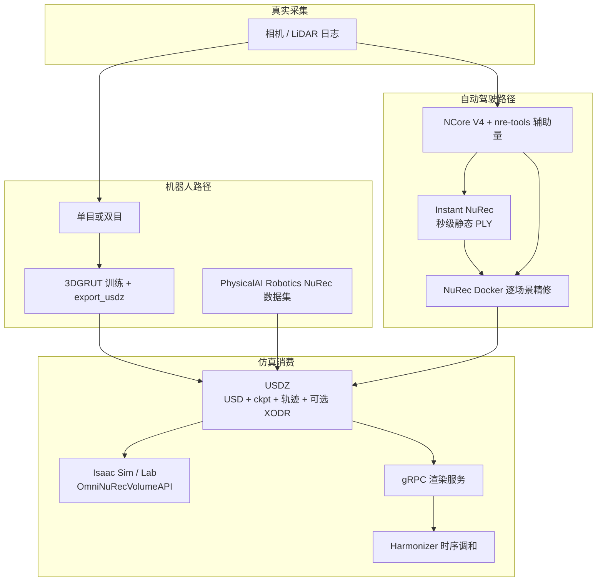

# NVIDIA Omniverse NuRec

**NVIDIA Omniverse NuRec** 是面向 Physical AI 的 **神经重建与渲染栈**：把真实相机 / LiDAR 吃成可在仿真里重放、改视角的 3D 环境，主交付是带高斯 checkpoint 与轨迹元数据的 **USDZ**，而不是一张孤立 splat 图。

## 英文缩写速查

| 缩写 | 英文全称 | 简要说明 |
|------|----------|----------|
| NuRec | NVIDIA Neural Reconstruction | Omniverse 神经重建体积 + 渲染服务；导出 USDZ |
| Instant NuRec | Instant Neural Reconstruction | 驾驶日志的前向 3DGS 初始化，约 1.5 s/片段 |
| USDZ | Universal Scene Description Zip | 场景 USD + checkpoint + 轨迹 JSON 的打包格式 |
| 3DGS | 3D Gaussian Splatting | 可实时渲染的显式高斯原语 |
| 3DGUT | 3D Gaussian Unscented Transform | 支持畸变/非针孔相机的高斯渲染器 |
| 3DGRUT | 3D Gaussian Ray Tracing / Unscented | 机器人文档里的稠密重建 + USDZ 导出路径 |
| NCore | NVIDIA Core clip format | AV 重建输入的 clip / 序列清单格式 |
| ISP | Image Signal Processor | Instant 预测的每相机颜色仿射，吸收曝光差 |

## 为什么重要

- **Real2Sim 的 NVIDIA 官方体积规范：** 人形现场孪生（[Flexion × Niantic](./flexion-niantic-nvidia-rgb-sim2real-pipeline.md)）与 AV 闭环仿真都把「能进 Isaac / AlpaSim 的东西」写成 **NuRec volume**，而不是私有 splat 文件。
- **重建与渲染拆开：** 容器负责把日志打成 USDZ；Kit 应用用 `OmniNuRecVolumeAPI` + gRPC 取像素。仿真平台集成只接渲染 API，不必重写训练循环。
- **秒级预览 vs 小时级精修：** [Instant NuRec](./paper-instant-nurec.md) 把 10–20 s 多相机打成静态 PLY（约 **1.5 s**）；文档推荐把它当逐场景 NuRec 的初始化，而不是替代最终 USDZ。
- **机器人与 AV 不要混成一条命令：** 机器人 Quickstart 是单目/双目 → **3DGRUT / 预重建 HF 场景** → Isaac Sim；AV Quickstart 是 **NCore + Docker `nre-ga:26.04`**，可选 Instant 种子。

## 流程总览

## 核心原理

### 重建写什么

文档把一次重建写成：**场景 USD + AI checkpoint（高斯与辅助量）+ 序列 / 车体轨迹 JSON**；AV 包还可带 **XODR**。Isaac 里看到的「彩色点云」是高斯体积，**默认没有碰撞**——要让机器人站得住，必须另加 Ground Plane 或对齐 mesh（Flexion 管线把碰撞 mesh 与 splat 一起打进 USDZ）。

### 渲染怎么接仿真

NuRec 渲染嵌在 Omniverse Kit。Isaac Sim 加载兼容 USDZ 后，用 **`OmniNuRecVolumeAPI`** 控体积属性；需要把像素送给外部仿真运行时时走 **gRPC**。Harmonizer 修时序闪烁与外观不一致；多 GPU 训练期不能开它，放到推理服务。

### Instant 在产品里的位置

[AV 重建指南](https://docs.nvidia.com/nurec/nurec/reconstruct-av-scene.html) 把 Instant 标成 **Recommended**：本机 `run_inference.py --merge` 出与 NuRec 默认初始化点数对齐的 PLY（2M），再 `initialization=nrm_ply` 进容器。两边吃同一份 NCore，但运行时不同：Instant 是原生 Python 预览；NuRec 是 Docker 精修。

## 工程实践

| 项 | 内容 |
|------|------|
| 文档入口 | <https://docs.nvidia.com/nurec/>（核查版本 **26.04**） |
| AV 容器 | `docker pull nvcr.io/nvidia/nre/nre-ga:26.04`；需要 `NGC_API_KEY` |
| Instant 初始化 | [NVIDIA/instant-nurec](https://github.com/NVIDIA/instant-nurec) `./setup.sh` → `run_inference.py --merge` |
| 预重建场景 | Hugging Face Physical AI：AV 用 NCore 数据集；机器人用 Robotics NuRec 数据集 |
| Isaac 加载 | File/Import 或拖入 USDZ；体积走 `OmniNuRecVolumeAPI`；物理另挂地面或 mesh |
| 机器人重建栈 | Isaac ROS + cuSFM + FoundationStereo + nvblox + 3DGRUT（`export_usdz.enabled=true`） |
| 硬件 | Instant 继承 [NuRec Hardware](https://docs.nvidia.com/nurec/basics/hardware.html) 下限 |

**开源状态（2026-09-05 项目页 + 文档 + 仓）：**

| 组件 | 状态 |
|------|------|
| Instant 推理 CLI + HF 权重 | **部分开源**（Apache-2.0）— 静态 PLY/天空可跑；动态层/训练不在仓内 |
| NuRec 训练 / gRPC 容器 | **产品镜像**（NGC），文档公开，源码不按 GitHub 仓发布 |
| 预重建 USDZ / NCore clip | **开放获取**（部分数据集门控） |
| 3DGRUT 机器人路径 | 文档指向可导出 USDZ 的开源重建；与 Instant AV 路径分开 |

## 局限与风险

- **体积 ≠ 可碰撞世界：** 只导入 USDZ 而不补物理，机器人会「看着真、脚踩空」。
- **两条路径不要抄错命令：** 把 Instant/`nre-ga` 套到办公室单目扫描上，或把 3DGRUT 手机流程当成 AlpaSim 闭环入口，都会对不上输入格式。
- **Instant 不是最终仿真资产：** 官方叙事是 **秒级种子 → 小时级精修**；闭环策略排序 Instant 已够用（见论文页），外观仍落后逐场景 NuRec 数 dB。
- **门禁：** NGC key、HF 门控条款、硬件下限少一条就会卡在拉镜像或首次权重下载。

## 关联页面

- [Instant NuRec（论文）](./paper-instant-nurec.md) — 前向模型、Waymo / 闭环数字与开源边界
- [Isaac Gym / Isaac Lab](./isaac-gym-isaac-lab.md) — Lab 训练与 NuRec volume 导入
- [Isaac Sim](./isaac-sim.md) — Kit 底座与 `OmniNuRecVolumeAPI`
- [Isaac Teleop](./isaac-teleop.md) — Televiz `ProjectionLayer` 可把头显接到 gsplat / nvblox / 神经重建的 RGBD；这是 **XR 显示**，不是本页的 USDZ 训练/精修产品
- [NVIDIA Omniverse](./nvidia-omniverse.md) — USD / Kit 底座
- [Flexion × Niantic × NVIDIA RGB 管线](./flexion-niantic-nvidia-rgb-sim2real-pipeline.md) — 现场 3DGS+mesh → NuRec USDZ → 纯 RGB 导航
- [SimFoundry](./paper-simfoundry-real2sim-scene-generation.md) — 操作场景视频孪生（mesh+cousins），不是驾驶日志体积
- [GS-Playground](./gs-playground.md) — 仿真侧批量 3DGS 渲染吞吐，不是日志重建产品
- [Marble](./marble-world-model.md) — 生成式 3D 世界（发明未观测区）；本页是传感器日志重建
- [Sim2Real](../concepts/sim2real.md)
- [仿真评测基础设施](../concepts/simulation-evaluation-infrastructure.md)

## 参考来源

- [nvidia-nurec-docs.md](../../sources/sites/nvidia-nurec-docs.md)
- [nvidia-research-instant-nurec.md](../../sources/sites/nvidia-research-instant-nurec.md)
- [nvidia-instant-nurec.md](../../sources/repos/nvidia-instant-nurec.md)
- [instant_nurec_arxiv_2607_14203.md](../../sources/papers/instant_nurec_arxiv_2607_14203.md)
- 文档：<https://docs.nvidia.com/nurec/>
- AV 重建（含 Instant 初始化）：<https://docs.nvidia.com/nurec/nurec/reconstruct-av-scene.html>
- 机器人 Quickstart：<https://docs.nvidia.com/nurec/archives/26.04/robotics/index.html>

## 推荐继续阅读

- Instant NuRec 项目页：<https://research.nvidia.com/labs/sil/projects/instant-nurec/>
- 官方仓 README：<https://github.com/NVIDIA/instant-nurec>
- 手机扫描 → 3DGUT → Isaac Sim：<https://developer.nvidia.com/blog/reconstruct-a-scene-in-nvidia-isaac-sim-using-only-a-smartphone/>
- Flexion 联合文：<https://flexion.ai/news/niantic-spatial-flexion-and-nvidia-closing-the-sim2real-gap-for-humanoids>
