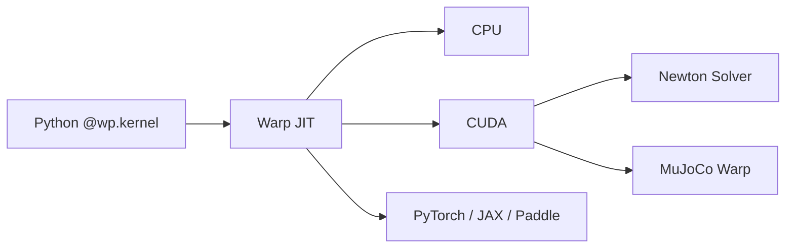

# NVIDIA Warp（可微 GPU 计算框架）

**NVIDIA Warp** 是面向仿真、机器人与机器学习的 **Python JIT 框架**：用 `@wp.kernel` 写普通函数，经 `wp.launch` 编译到 **CPU 或 CUDA**。包名是 **`warp-lang`**（不是 `warp`）。代码 Apache-2.0；文档当前快照 **1.17.0**。

## 一句话定义

**把 Python 核函数编成可微 CPU/GPU kernel 的计算层**——[Newton](./newton-physics.md) 与 [MuJoCo Warp](./mujoco-warp.md) 站在它上面；它本身不是刚体物理引擎。

## 英文缩写速查

| 缩写 | 英文全称 | 简要说明 |
|------|----------|----------|
| JIT | Just-In-Time compilation | 运行时把 `@wp.kernel` 编成 CPU/CUDA 机器码 |
| CUDA | Compute Unified Device Architecture | NVIDIA GPU 并行计算平台；Warp 的加速路径 |
| FEM | Finite Element Method | 文档示例分区之一（`fem`） |
| AD | Automatic Differentiation | 核可微；可接入 PyTorch / JAX / Paddle |
| MJWarp | MuJoCo Warp | 站在 Warp 上的 GPU MuJoCo 实现 |
| USD | Universal Scene Description | Newton / Omniverse 场景组合格式，不由本库求解 |

## 为什么重要

- **机器人 GPU 栈的公共底座**：[Newton](./newton-physics.md) 的求解器循环、[MuJoCo Warp](./mujoco-warp.md) 的刚体步进、以及 Omniverse Kit 扩展 `omni.warp.core`，都依赖同一套 kernel 语言，而不是各自写 CUDA。
- **可微计算与 ML 桥**：核函数可进入 PyTorch / JAX / Paddle 管线，适合系统辨识、设计优化、可微仿真实验——**前提是下游求解器真的接通了 AD**。MJWarp 目前尚未接通（见该页）。
- **安装面比 Isaac Sim 轻**：`pip install warp-lang` 即可在 Win/Linux 上拿到 CPU + CUDA runtime；不必先装 Omniverse。

## 核心原理

| 概念 | 说明 |
|------|------|
| **语言** | `@wp.kernel` 标记核函数；`wp.launch` 指定 grid 与设备 |
| **设备** | Windows / Linux：CPU + CUDA；macOS Apple Silicon：**仅 CPU，无 Metal** |
| **可微** | 核可反向；官方专页 [Differentiability](https://nvidia.github.io/warp/user_guide/differentiability.html) |
| **领域模块** | 几何、物理原语、FEM、tile / MathDx；示例分 `core` / `fem` / `optim` / `tile` |
| **与物理的边界** | 历史模块 `warp.sim` **已弃用**；刚体 / 多物理引擎职责交给 [Newton](./newton-physics.md) |

## 工程实践

| 步骤 | 做法 |
|------|------|
| 安装 | `pip install warp-lang`；跑官方例子再加 `[examples]` |
| 冒烟 | `python -m warp.examples.<subdir>.<example>`（文档 Quickstart） |
| Python | **3.10+** |
| CUDA 12 驱动 | **525+**（PyPI 默认 CUDA 12.9 runtime） |
| CUDA 13 | GitHub Releases 的 cu13 wheel；驱动 **580+** |
| Nightly | `pip install -U --pre warp-lang --extra-index-url=https://pypi.nvidia.com/`（CUDA 12，无 macOS） |
| Tile / MathDx | 完整支持建议 CUDA **12.6.3+** |
| 驱动不够 | 初始化警告，CUDA 设备不可用，**CPU 仍可跑** |
| Omniverse | Kit 扩展注册表 `omni.warp.core` |
| 机器人物理 | **不要**新建 `warp.sim` 代码；改 [Newton](./newton-physics.md) / [MJWarp](./mujoco-warp.md) |

## 局限与风险

- **不是仿真器**：没有 MJCF 导入、接触求解或 RL 环境 API。要刚体批量步进走 [MuJoCo Warp](./mujoco-warp.md)；要多求解器 + USD 走 [Newton](./newton-physics.md)；要 manager-based RL 走 [mjlab](./mjlab.md) 或 Isaac Lab `feature/newton`。
- **macOS 不能当 GPU 训练机**：Apple Silicon wheel 仅 CPU。
- **驱动与 CUDA 主版本绑定**：CUDA 13 必须 580+ 驱动；混装 toolkit 与 PyPI runtime 时先看文档安装页，不要假设本机 `nvcc` 版本等于 `warp-lang` 捆绑 runtime。
- **源码构建会再拉 libmathdx**（NVIDIA SLA），与仓库 Apache-2.0 不是同一条款。
- **可微 ≠ 整条物理可微**：Warp 核能反传，不代表 [MuJoCo Warp](./mujoco-warp.md) 已经把 MuJoCo 步进接到 AD（官方 issue #500：尚未可用）。

## 关联页面

- [Newton Physics](./newton-physics.md) — 接替 `warp.sim` 的 GPU 多求解器引擎
- [MuJoCo Warp](./mujoco-warp.md) — 站在本框架上的 GPU MuJoCo
- [mjlab](./mjlab.md) — Isaac Lab API + MJWarp 的轻量 RL 框架
- [MuJoCo MJX](./mujoco-mjx.md) — JAX/XLA 兄弟路径，不是 Warp
- [Isaac Lab](./isaac-lab.md) — `feature/newton` 经 Newton 用到本计算层
- [NVIDIA Omniverse](./nvidia-omniverse.md) — Kit 扩展 `omni.warp.core`
- [NVIDIA Cosmos](./nvidia-cosmos.md) — 学习式 WFM；与解析仿真互补
- [仿真器选型指南](../queries/simulator-selection-guide.md)
- [训练栈分层地图](../overview/robot-training-stack-layers-technology-map.md)
- [Reinforcement Learning](../methods/reinforcement-learning.md)

## 参考来源

- [NVIDIA/warp 仓库归档](../../sources/repos/nvidia-warp.md)
- [Warp 官方文档 stable 归档](../../sources/sites/nvidia-warp-docs.md)
- [newton-physics 仓库归档](../../sources/repos/newton-physics.md)
- [mujoco_warp 仓库归档](../../sources/repos/mujoco-warp.md)

## 推荐继续阅读

- [Warp 文档 1.17.0](https://nvidia.github.io/warp/stable/)
- [NVIDIA/warp](https://github.com/NVIDIA/warp)
- [产品页 warp-python](https://developer.nvidia.com/warp-python)
- [Differentiability](https://nvidia.github.io/warp/user_guide/differentiability.html)
